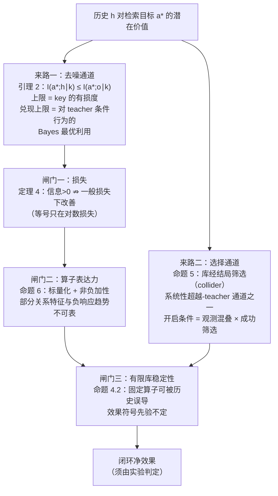
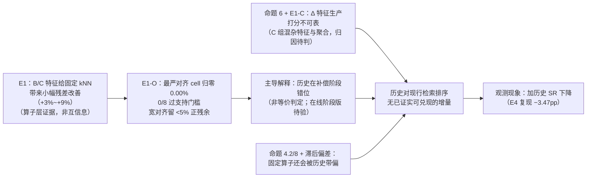

# 历史帧的价值判决：继承定律在本系统的实证定位

> **状态**：解释性文档，与 [`markov_inheritance.md`](markov_inheritance.md)（纯抽象数学：定义、命题、证明）配对。抽象命题（引理 1 至命题 6）的证明在配对文档，本文引用不重复；**针对本方法具体公式的实例化命题（命题 7 至命题 11，及推论 8.1、9.1、10.1）在本文 §3 给出陈述与证明，编号接续配对文档**。
> **数据来源**：`exp/markov_sufficiency/`（五项判别实验，12,400 配对 episode，详见 [`analysis/synthesis.md`](../../exp/markov_sufficiency/analysis/synthesis.md)）+ trajectory 线历史数据（约 14 万 episode，`exp/weighted_sum/analysis/`）+ gate 线（`exp/gate_research/`）。
> **读者约定**：只读本文与配对数学文档，即可完整理解本项目关于"历史帧该不该进检索"的问题、理论、证据与结论。

---

## 1. 系统、机制与现象

**系统**。一个 training-free 的检索式 action cache：把无记忆 VLA policy（π0.5，输入只有当前帧图像 + 本体状态 + 语言指令）的 rollout 存成 `(key, action chunk)` 库；运行时对当前观测构建 key（视觉 token 池化 + 本体状态），检索最近邻，命中即直接回放缓存动作、跳过昂贵的模型前向。评测在 LIBERO 两个 suite（libero_spatial / libero_10）上以任务成功率 SR 计。

**机制**。trajectory search 把历史帧纳入检索：query 侧保留最近 $d$ 帧的 key，library 侧沿候选的祖先链回走，逐层算边际相似度 $s_l$，再按非负权重加权求和：$\mathrm{TrajScore} = \sum_l v_l s_l$（即数学文档 §7 的函数类 $\mathcal{F}_d$）。$d{=}1$ 表示只用当前帧。历史粒度为推理步（每步 5 个环境步，$d{=}5$ 即回看 25 个环境步）。

**现象**：在强检索配置上，加历史几乎总是变差。

| 证据 | 结果 |
|---|---|
| spatial，18 组配置 × 深度 {3,4,5,6} | 最强 10 组均值 d1 = 73.0%，任何深度的最优 Δ = **−6.4pp，10/10 全负**；最弱 4 组 **+10pp**（libero_10 上最弱组 +21pp） |
| spatial，每个深度独立重搜模态权重 | d1 = 74%，d3 = d4 = d5 = 72%，重调追不回 |
| 171 种逐步权重形状筛选（两 suite 各 17,100 ep） | {Δ>0 且 McNemar p<0.05} = **空集** |
| libero_10 全替换 | max SR：d1 0.52 > d3 0.51 > d5 0.49 > d4 0.46 > d6 0.42 |
| 阈值-帕累托（spatial） | mean SR 随深度严格单调降：93.8% → 89.9% |

延迟已被排除为原因（跨步分数缓存使深度几乎不增加检索耗时），这是纯粹的检索质量问题。

---

## 2. 理论框架：历史价值的完整地图

数学文档证明了：在"teacher 无记忆（A1）+ key 只依赖当前观测（A2）"下，历史对检索目标的**全部**潜在信息只有两条来路，且信息存在不等于能兑现，兑现还要过三道闸门。

两个关键的理论事实决定了本文的方法论：

- **命题 2.2（双向非蕴含）**：仅凭 A1、A2，既推不出"历史无用"也推不出"历史有用"。同一 teacher、同一 key，环境时序耦合不同，历史增量可以是 0 也可以打满上界。**所以历史的实际价值只能靠实验定价，这正是下面五项实验存在的理由。**
- **命题 3（阶段分解）**：历史增量中可由"阶段变量"（episode 进行到哪一步）解释的部分可以被精确剥离出来单独测量。

已明确构造的超越-teacher 机制至少有二（数学文档命题 5 与备注 6.2）：选择条件化（需混叠 × 筛选）与对随机 teacher 的聚合去随机化（需 top-k 聚合类算子）；现行 top-1 不具备后者，且本文不排除非最优 teacher 下的偶然回报改善。

---

## 3. 实例化：本方法公式上的"单帧足够优质 ⇒ 历史无增量"

§2 的地图在抽象层工作。本节把它落到我们**实际使用的打分公式**上：key 由 spatial / mean / max 等池化降维而来，逐模态相似度经该模态的 zscore + tanh 归一化，再按模态权重加权相加得单帧分数，最后按历史权重把各历史帧的分数加权相加。命题编号接续配对数学文档（其止于命题 6）。

### 3.1 管线定义与阶段对应

模态 $f \in \{1,\dots,m\}$（本系统：vision_0、vision_1、robot_state）。打分链条为

$$o_t \;\xrightarrow{\ \rho_f\ }\; k^{(f)}_t \;\xrightarrow{\ \mathrm{sim}_f\ }\; r_{f,l}(x) \;\xrightarrow{\ N_f\ }\; \hat s_{f,l}(x) \;\xrightarrow{\ \sum_f w_f\ }\; s_l(x) \;\xrightarrow{\ \sum_l v_l\ }\; \mathrm{TrajScore}(x)$$

- **池化**：$\rho_f$ 为确定性降维（视觉 token 的空间/均值/最大池化；本体状态恒等）；key 为 $k_t = (\rho_1(o_t), \dots, \rho_m(o_t))$，故假设 A2 成立，引理 2 逐字适用。
- **逐模态相似度**：$r_{f,l}(x) = \mathrm{sim}_f\big(\rho_f(o_{t-l}),\, \rho_f(\mathrm{anc}_l(x))\big)$；视觉用余弦、状态用负 L2（定向为越大越相似），$\mathrm{anc}_l$ 为候选的第 $l$ 级祖先。
- **归一化**：$N_f(r) = \tfrac12\big(\tanh((r-\mu_f)/\sigma_f)+1\big)$，$(\mu_f,\sigma_f)$ 离线标定、$\sigma_f>0$：实数算术模型下为 $\mathbb{R}\to(0,1)$ 的严格递增双射（float32 中 `tanh` 会数值饱和，严格双射只属于实数模型）。
- **模态融合**：$s_l(x) = \sum_f w_f\, N_f(r_{f,l}(x))$，$w_f \ge 0$；记 $W := \sum_f w_f$，则 $0 < s_l(x) < W$。
- **历史融合**：$\mathrm{TrajScore}(x) = S_v(x) = \sum_{l=0}^{d-1} v_l\, s_l(x)$，**配置校验强制 $v_l \ge 0$**；检索取 top-1。$d{=}1$（或 $v=(1,0,\dots,0)$）即单帧检索。

| 管线阶段 | 数学性质 | 决定什么 | 对应命题 |
|---|---|---|---|
| 池化 $\rho_f$ | key 为观测的确定性函数 | 历史信息的总上界 $I(a^*;o\mid k)$ 在此定 | 引理 2、推论 2.1、引理 2.3 |
| 相似度 $\mathrm{sim}_f$ | (query, candidate) 对 → 标量 | 某些标量化前关系不可恢复 | 命题 6(i) |
| 归一化 $N_f$ | 严格递增双射 | 零信息增删；但影响跨模态与跨时刻的融合排序 | 命题 7 |
| 模态融合 $\sum_f w_f$ | 非负加性 | 单帧分数；需负响应的全局阈值不可表 | 命题 6(ii) 的单调性论证 |
| 历史融合 $\sum_l v_l$ | 非负加性 | 修复与受损的代数条件 | 命题 8–11、推论 8.1/10.1 |

### 3.2 归一化层（命题 7）

**命题 7（zscore-tanh 归一化层的信息中性）.** (i) $N_f$ 为严格递增双射，故 $\sigma(\hat s_{f,l}) = \sigma(r_{f,l})$：归一化不增删任何信息；且对固定模态，候选按 $\hat s_f$ 与按 $r_f$ 的排序逐点相同。(ii) 但**融合排序不是**归一化不变的：存在候选配置，使不同的 $(\mu_f, \sigma_f)$ 给出不同的融合 top-1。

**证明.** (i) 严格递增双射生成相同 σ-代数并保序。(ii) 两模态等权、两候选，归一化后分数 $A=(0.9,\,0.1)$、$B=(0.5,\,0.55)$：融合 $0.500 < 0.525$，$B$ 胜。把模态 1 的归一化换成更陡的一支：取 $\mu'_1 = N_1^{-1}(0.7)$（介于两候选的原始分之间）、$\sigma'_1 \to 0$，则 $0.9 \mapsto \approx 1$、$0.5 \mapsto \approx 0$，融合变为 $\approx 0.55 > \approx 0.275$，$A$ 胜。$\blacksquare$

**读法.** 单模态信息层面归一化是中性的：$I(a^*;h\mid k)$ 由联合分布与 key 决定，标量化决定其中哪些关系仍能被当前打分访问，二者均不因 $(\mu,\sigma)$ 改变。但 (ii) 表明归一化**参与排序的实现**，不能从"信息中性"推出"调归一化与历史的成败无关"。

### 3.3 决策充分、regret 预算与零/小增量定理

固定有限库 $\mathcal{L}$、损失 $\ell$ 与查询分布。令 $Q$ 包含候选选择器可使用的全部查询信息（包括历史），但不含目标标签 $a^*$ 的新鲜 teacher 噪声；若库随机，也将其并入 $Q$。定义候选 $x$ 的条件风险与库内最优：

$$L_q(x) := \mathbb{E}\big[\ell(a_x,\, a^*)\ \big|\ Q=q\big], \qquad L^*_q := \min_{x\in\mathcal{L}} L_q(x), \qquad \Omega^\star_q := \arg\min_{x\in\mathcal{L}} L_q(x).$$

**定义（决策充分与 regret）.** 单帧赢家 $x_0(q) \in \arg\max_x s_0(x;q)$ 的**候选决策 regret** 为
$$\varepsilon_0(q) := L_q(x_0(q)) - L^*_q \;\ge\; 0.$$
若 $\varepsilon_0(Q) = 0$ 几乎处处（即单帧 top-1 几乎必然落在 $\Omega^\star$ 内），称单帧比较器**决策充分**。这是"单帧 similarity 对比足够优质"的精确形式：它相对同一库、同一损失、同一查询分布定义明确，并可用保守上界估计，而不是模糊的"SR 高"或"相似度高"。

**命题 8（决策充分 ⇒ 加权历史无增量，且有严格受损的实现）.** 若单帧比较器决策充分，则对任意历史权重 $v \in \mathbb{R}^d_{\ge 0}$：

1. $\mathbb{E}\big[\ell(a_{X_v}, a^*)\big] \;\ge\; \mathbb{E}\big[\ell(a_{X_0}, a^*)\big]$，其中 $X_0$、$X_v$ 分别为单帧与 $S_v$ 的 top-1：**历史加权的期望增量非正**；
2. 等号成立当且仅当 $X_v(q)\in\Omega_q^\star$ 几乎处处，即发生翻转时仍落在最优集内；
3. 存在与 A1、A2 一致、且**完全经由本管线实现**（池化 key、余弦相似度、zscore-tanh 归一化、非负融合）的模型与库，使 1 中不等号严格：历史加权严格有害。

**证明.** 1、2：决策充分下 $X_0$ 逐查询达到候选集内的最小条件期望损失，任何其它赢家的条件损失不小于它；对查询取期望即得，等号情形显然。3：单模态（$m{=}1$、$w_1{=}1$）即可。取 $\mu_1 = 0,\ \sigma_1 = 0.2$，则 $N_1$ 在余弦值域 $[-1,1]$ 上的像 $\approx (10^{-4},\, 1-10^{-4})$，故可选取原始余弦使归一化分数达到任意指定内点。令库含两候选 $G$（动作正确）、$B$（动作错误），指定
$$s_0(G)=0.99,\quad s_0(B)=0.90,\quad s_1(G)=0.01,\quad s_1(B)=0.99;$$
teacher 取确定性无记忆映射（A1 成立），查询分布退化为单点。单帧 top-1 为 $G \in \Omega^\star$（决策充分成立）；取 $v=(1,\,0.2)$，则
$$S_v(G) = 0.992 \;<\; 1.098 = S_v(B),$$
赢家翻转到 $B$，期望损失严格增加 $\ell(a_B, a^*) > 0$。$\blacksquare$

命题 8 是**条件定理**：前提"决策充分"是本系统的经验性质，高 SR 或历史全负都不构成对它的验证（"d1 实测 SR 最高"是经验饱和，不是 $\varepsilon_0=0$ 的证明）；它的预算化可测形式由下一命题给出。

**命题 9（$\varepsilon$-决策充分的增量预算）.** 对**任何** $\sigma(Q)$-可测的候选选择器 $X(q) \in \mathcal{L}$（特别地包括任意 $v$ 下的 $x_v(q)$，也包括不限于相似度加权、甚至允许负权重的任意重排序方法），逐查询恒有
$$L_q(x_0(q)) - L_q(X(q)) \;\le\; \varepsilon_0(q),$$
从而
$$\boxed{\;\mathbb{E}\,L_Q(x_0) - \mathbb{E}\,L_Q(X) \;\le\; \mathbb{E}\,\varepsilon_0(Q)\;}$$

特别地：(a) $\varepsilon_0 = 0$ a.s. 时任何历史重排序都无正增量（即命题 8 的第 1 条，且更一般）；(b) $\mathbb{E}\varepsilon_0 \le \varepsilon$ 时任何历史方法的期望改善至多 $\varepsilon$。

**证明.** $L_q(X(q)) \ge L^*_q$ 对一切 $X(q)\in\mathcal{L}$ 成立，故 $L_q(x_0) - L_q(X) \le L_q(x_0) - L^*_q = \varepsilon_0(q)$；取期望即得。$\blacksquare$

**范围注记.** 命题 9 针对 top-1 回放：输出限于 $\{a_x : x \in \mathcal{L}\}$。若算子允许 top-k 动作平均或动作合成，$L^*_q$ 的最小化域须相应扩大到该算子的完整可达动作集，否则候选-oracle 上界会漏掉组合动作的改善空间（这正是备注 6.2 聚合机制生效的地方）。该命题约束同库同损失下的候选动作风险，不自动约束闭环 SR。

**推论 9.1（"单帧足够优质"的排序表述）.** 若对几乎所有查询，单帧分数满足决策顺序一致性：$s_0(x;q) > s_0(y;q) \Rightarrow L_q(x) \le L_q(y)$ 对一切 $x,y\in\mathcal{L}$，且 tie-breaking 只在最小风险候选间选择，则 $\varepsilon_0(q)=0$，历史重排序无正增量。近似地，$L_q(x_0) \le \min_x L_q(x) + \varepsilon(q)$ 即给出预算 $\mathbb{E}\varepsilon(Q)$。**这是把"similarity 对比优质"接到零/小增量结论的必要桥梁：池化的普通性与归一化的单调性本身不提供这种决策顺序一致性。**

### 3.4 margin 证书与修复的必要条件

设单帧赢家唯一且 $v_0 > 0$。对每个竞争候选 $y \ne x_0$ 定义单帧 margin 与历史扰动：
$$\delta_y(q) := s_0(x_0;q) - s_0(y;q) > 0, \qquad H_v(y;q) := \sum_{l\ge 1} v_l\,\big[s_l(y;q) - s_l(x_0;q)\big].$$

**命题 10（精确 no-flip 证书）.** 若对所有 $y \ne x_0$ 均有 $H_v(y;q) < v_0\,\delta_y(q)$，则 $x_v(q) = x_0(q)$：历史不改变该查询的 top-1。

**证明.** $S_v(y) - S_v(x_0) = -v_0\delta_y + H_v(y) < 0$ 对一切 $y$ 成立。$\blacksquare$

由 $0 < s_l < W$ 可得不看具体历史分数的保守统一证书：令 $\delta_0(q) := \min_{y\ne x_0}\delta_y(q)$、$V_H := \sum_{l\ge1} v_l$，则
$$v_0\,\delta_0(q) > W\,V_H \;\Longrightarrow\; x_v(q) = x_0(q).$$
注意在 $W=1$ 与生产权重（如 $v=(0.5,0.3,0.2)$：$v_0=0.5$、$V_H=0.5$）下，该保守条件要求 $\delta_0 > 1$，而分数落在 $(0,1)$ 内，**保守证书恒不触发**；实际分析必须使用逐候选证书 $H_v(y) < v_0\delta_y$。zscore-tanh 在此的作用只是提供有界值域，其单调性本身不产生任何零增量结论。

**推论 8.1（修复的排序必要条件）.** 设单帧严格赢家 $x_0 \notin \Omega^\star$（单帧犯错）。若某 $v \in \mathbb{R}^d_{\ge 0}$ 使 $S_v$ 的赢家变为 $y \ne x_0$，则必有
$$\sum_{l\ge 1} v_l\,\big[s_l(y) - s_l(x_0)\big] \;\ge\; v_0\,\big[s_0(x_0) - s_0(y)\big] \;\ge\; 0,$$
特别地当 $v_0 > 0$ 时必存在某滞后 $l \ge 1$ 使 $s_l(y) > s_l(x_0)$：在本管线内，修复只能经由"替代候选在**滞后边际相似度**上反超当前赢家"实现；命题 6 仅排除了其中某些标量化前关系与需负响应的全局趋势判别。正向的滞后相似度序列仍可区分轨迹或隐藏分支；该机制能修复多少查询是经验量，E3 的 ADR 不是该占比的测量。

**证明.** $S_v(y) \ge S_v(x_0)$ 移项即得；$x_0$ 为单帧严格赢家给出右端非负，$v_0>0$ 时严格正。$\blacksquare$

**推论 10.1（发生有益修复的两个必要条件）.** 历史把 $x_0$ 换成风险更低的 $y$，须同时满足**排序可翻转性** $H_v(y;q) \ge v_0\delta_y(q)$ 与**决策有益性** $L_q(y) < L_q(x_0)$。二者的交集才是"可修复查询"；任何只测其一的量（例如动作分歧率）都不构成对该交集的测量。

### 3.5 反定理：模糊的"准确率已经很高"推不出零增量

**命题 11（任意接近完美仍可有严格正增量）.** 对任意 $0<\eta<1$，存在完全由本管线实现且满足 A1、A2 的查询分布，使单帧 top-1 的 0-1 风险为 $\eta$，而某非负历史权重下风险为 $0$。因此**不存在任何低于 100% 的平均准确率阈值能单独推出"历史严格无增量"**。

**证明（构造）.** 单模态、$v=(1,0.2)$，库含正确候选 $G$ 与错误候选 $B$；以下分数均在 $(0,1)$ 内，可由 zscore-tanh 逆映射与单位向量余弦实现。以概率 $1-\eta$ 出现普通查询：$s_0(G)=0.99,\ s_0(B)=0.90,\ s_1(G)=0.99,\ s_1(B)=0.01$，单帧与历史均选 $G$。以概率 $\eta$ 出现稀有查询：$s_0(G)=0.90,\ s_0(B)=0.99,\ s_1(G)=0.99,\ s_1(B)=0.01$，单帧选 $B$；加历史后 $S_v(G)=1.098 > 0.992=S_v(B)$，改选 $G$。teacher 取确定性无记忆映射即满足 A1。单帧风险 $\eta$，历史风险 $0$。$\blacksquare$

命题 8(iii) 与命题 11 合起来，是命题 4.2 的符号不定性在本管线内的双向实现：同一算子类既能被历史严格损害，也能被历史严格拯救；分界不在准确率的高低，而在 regret 的有无与 margin 的几何。

### 3.6 小结：原问题的精确答案

> **在同库同候选损失下，若"单帧 similarity 足够优质"指其候选决策 regret 为零（决策充分），则加权历史帧不可能产生正增量（命题 8、命题 9）；若 regret 至多为 $\varepsilon$，则任何历史方法的最大期望增量至多为 $\varepsilon$（命题 9）。对现行 zscore-tanh + 非负加权管线，当单帧 margin 满足逐候选证书 $H_v(y) < v_0\delta_y$ 时，历史甚至无法改变 top-1（命题 10）。反之，仅凭 pooling 普通、归一化单调、权重非负、或很高但非完美的平均准确率，都不能证明零增量：命题 11 给出任意接近完美仍有严格正增量的反例。**

理论上，历史改善空间由 $\mathbb{E}\varepsilon_0$ 封顶；现实中其总体真值只能用 realized-oracle gap 保守上界，连续权重也只能在固定离线查询集上穷尽。§7 第 1、2 项用于量化和加强结论，不改变已有闭环判决：在已测任务、库与现行算子下，d1 已经验饱和，历史无可复现的 SR 增量且净效应通常为负。

---

## 4. 实验定价：六条证据线

五项判别实验（E1–E5）+ gate 线旁证，逐条给 §2 的通道与闸门定价。

| 实验 | 问题 | 结果 | 判决 |
|---|---|---|---|
| **E1** 离线残差（LOEO kNN） | 给定 key，加历史/差分特征的 kNN 能否降低动作预测残差？ | 4 个预注册 cell 中 3 个 Holm 后区间下界 > 0：spatial 原始历史 +5.35%、差分特征 +8.80%，libero_10 原始历史 +2.86%（报告判定均为估计性） | **B/C 算子的经验残差低于 A**（算子层证据）。不能识别为互信息、也不能据此证明 $I(a^*;h\mid k)>0$：两个固定算法的差值可以仅因基线欠优而为正（识别互信息需另证估计器一致性）；结果落在引理 2 允许范围内 |
| **E1-O** 阶段对齐 | 把候选池按 episode 进度对齐后，历史增益还剩多少？ | **0/8 cell 过预注册支持门槛（Δ% ≥ 5% 且下界 > 0）**；最严 cell（spatial ε=0.05，两个 depth）增益精确 = 0.00%；两个 ε=0.10、d3 cell 下界为正（+4.17% / +3.44%，判 `positive_but_below_floor`）；TOST 均不成立；候选池未退化（中位 8–40，最小 3） | **与"历史主要在补偿阶段错位"一致**：对齐最严时增益归零，放宽对齐残余回升。但两点不可跳跃：所用进度含 episode 最终总长（离线 oracle 量，数学文档备注 4.2），且非等价判定，故不能升级为"历史信息 = 阶段信息"或"同一坐标在线免费" |
| **E1-C** 差分特征 × 聚合 | 特征层差分 Δk（绕开标量化）能否取到更多？ | spatial：k=1 即 +8.80%~+9.31%（CI 排除 0），k=5 增至 +12.32%~+12.42%；libero_10：k=1 无效（−1.74%~−0.20%），k=5 才 +9.25%~+10.24% | **方向与命题 6 一致**。spatial 的 k=1 已有正向估计；libero_10 的正效应只在 k=5 出现。因尚未做阶段对齐，非阶段成分及 feature × k 交互仍待分解 |
| **E3** 混叠率 | key 空间里相似的状态，动作会分歧吗（选择通道的开启前提）？ | top 1% 相似同任务对的动作分歧率：spatial 0.24%、libero_10 2.79%（随机对 47–48%）；6 个 key builder × 2 suite **12/12 判几乎无混叠** | **选择通道（命题 5）在 LIBERO 上近似关闭**。注意：ADR 只测高相似 pair，不覆盖库稀疏区域，它是混叠率的测量，**不是**"可修复查询占比"（推论 10.1 的交集）的测量 |
| **E4** 生产旋钮消融（rollout，8,600 ep） | 生产可配置的时间维度旋钮（index 过滤 × 深度）里有能让历史变好的吗？ | 两 suite primary 均无改善；交互项 CI 均含 0；复现 spatial 深度退化 −3.47pp（CI 排除 0）；step 过滤的"收益"实为 20–26% 的步回退到 teacher 推理（teacher anchor 0.83） | **在已试的旋钮内没有能兑现历史的**；闭环净效果为负 |
| **E5** 确认性重跑（3,800 ep） | 唯一的正向松动（libero_10 d3 偏旧帧权重形状 +6pp）是真的吗？ | 筛选期 top-3 在独立重跑中落到 −0.11 / −0.11 / +2.42pp，CI 均含 0 | **winner's curse，未复现**；不构成反例 |

**Gate 线旁证**（历史的另一个岗位）：上一步检索分数预测下一步 MISS 的 AUC = **0.973–0.986**；据此构建的混合门 N4 在 live 评测胜出（L=6，4/6 及格线通过）。历史对"检索可靠性"这类认知量信息量很大，与它在动作检索侧的乏善可陈形成干净分界。

---

## 5. 判决

**逐通道定价表**：

| 通道 / 岗位 | 理论定位 | 实测 | 状态 |
|---|---|---|---|
| 去噪通道（ranking） | ≤ key 有损度；兑现上限 = 对 teacher 条件行为的 Bayes 最优利用 | 算子层增益小且主导成分与阶段错位补偿一致；生产算子对 Δ 特征不可表；闭环净负 | **未见可兑现增量**（对现行系统） |
| 差分/动力学特征 | 命题 6：部分关系须换算子才可能触及 | spatial 特征层 k=1 已 +9%，k=5 至 +12%；是否为非阶段成分**未测**，feature × k 交互**未分解** | **半开**：两个离线对照可裁决 |
| 选择通道（超越 teacher） | 命题 5：需混叠 × 成功筛选；非唯一超越机制（备注 6.2 之聚合去随机化需 top-k 算子） | LIBERO 近似无混叠（E3），通道近似关闭；在需要记忆的任务族上按理论应开启 | **异地开启**：待构造混叠任务的正对照 |
| gating（何时信任缓存） | 认知量对历史真依赖 | AUC 0.973–0.986；N4 live 胜出 | **已兑现**（历史的正确岗位） |

**闭环判读（配对分解）**：对配对 episode，记 $Y_0, Y_v \in \{0,1\}$ 分别为 d1 与历史配置的成功指示，则
$$\Delta\mathrm{SR} \;=\; P(Y_0{=}0,\, Y_v{=}1) \;-\; P(Y_0{=}1,\, Y_v{=}0),$$
即 SR 变化恒等于**修复率减破坏率**（这也正是本项目配对检验使用 McNemar 的原因）。历史配置的 ΔSR 为负，直接含义就是破坏率系统性地压过修复率：翻转机制（命题 4.2、命题 8(iii)）在实测中占优于修复交集（推论 10.1）。

**一段话判决**：历史特征在本系统中确有小幅的算子层增益（E1），但它未被识别为超出阶段错位补偿的信息：对齐最严格时增益精确归零、放宽对齐才有低于门槛的残余（E1-O），最贴合全部数据的读法仍是"其有效成分是一块系统本来就戴着的表"，只是该读法目前是主导解释而非已证等式。生产的"逐帧算相似度再非负加权求和"算子取不到标量化之前的特定差分特征（命题 6；E1-C 给出方向一致的签名），固定算子还可能被历史主动带偏（命题 4.2、命题 8(iii)），闭环上表现为随深度的成功率退化（E4）。在同库同离线损失下，命题 9 用 $\mathbb{E}\varepsilon_0$ 封顶任何历史重排序的改善；命题 11 则说明高准确率本身不是零增量证明。**通俗地说：历史在检索排序岗位上未见兴奋剂效果，现有证据与"拐杖 + 手表"的解释一致；历史确定有产出的岗位在 gating（已兑现），可能有产出的岗位在需要记忆的任务族（待验证）。** 任务难度会经 regret 预算影响可兑现空间；观测混叠 × 库筛选只是选择通道的开关，去噪通道仍由 key 有损度、时序耦合与算子共同决定。

---

## 6. 对任何"历史有用"主张的审计清单

命题 9 给出总闸：**任何**历史方法在同库同损失下的期望增量不超过单帧 regret 预算 $\mathbb{E}\varepsilon_0$。据此审计声称"在本类系统上用历史提升了检索"的方法：

0. **增益是否超过实测预算？** 先测 $\mathbb{E}\widehat\varepsilon_0$（§7 第 1 项）。声称的增益若超过预算上界，测量或设定必有错（命题 9）。
1. **是不是在挖阶段坐标？** 把阶段变量（步序号）显式加入 key 或候选过滤后，增益是否消失。若消失，其贡献可被一行配置替代。
2. **是不是滞后边际相似度修复？** 这是本管线内合法且唯一的修复机制（推论 8.1），但须同时满足排序可翻转性与决策有益性（推论 10.1）；要求出示两条件交集非空的证据，而非只出示动作分歧率之类的单侧代理。
3. **是不是换了算子？** 特征层访问、可负权重、跨帧交互项、top-k 聚合（后者还打开备注 6.2 的去随机化通道）都改变了算子类；此时命题 6 的不可表性不再适用，主张应按新算子重新定价。
4. **是不是 winner's curse？** 效应是否来自大网格筛选的顶端；要求同批次独立重跑与预注册判据（E5 的教训：171 选 3 的 +6pp 在重跑中归于 0）。

若以上均排除，则该方法要么在混叠任务上启用了选择通道（命题 5，合法且有趣），要么破坏了 A1/A2 前提（teacher 带记忆、key 吃历史），届时本框架的结论按 §9 声明自动失效。

---

## 7. 遗留开口（按证明力与成本排序）

1. **regret 预算测量**（纯离线）：对每个 LOEO 查询用同一候选池与动作损失计算 realized-oracle gap $\widehat\varepsilon_0(q) = \ell(a_{x_0(q)}, a^*_q) - \min_{x} \ell(a_x, a^*_q)$，按 episode bootstrap 估计 $\mathbb{E}\widehat\varepsilon_0$ 的上置信界。注意 $\widehat\varepsilon_0$ 用单次实现标签先选 oracle，其条件期望 $\ge \varepsilon_0(q)$，故该上界是命题 9 预算的**保守上界**而非无偏估计。它封顶同库同离线损失下**一切**重排序方法的改善空间；接近零即可严谨地写"单帧已接近候选决策充分"。它不自动封顶闭环 SR。
2. **连续权重域的穷尽**（纯离线）：对固定评测集，top-1 只在超平面 $v\cdot[s(x;q)-s(y;q)]=0$ 处变化；经验风险在各开 cell 内为常数，固定 tie-breaking 时还须检查低维边界。对非负 simplex 或带界多面体的允许域，可求连续域上的全局最优经验风险。171 个离散形状只是采样，不是穷尽。
3. **E1-C 的两个对照**（纯离线）：C × 阶段对齐（判残余是否仍为阶段成分）与 feature × k 交互分解。
4. **在线阶段版 E1-O**（纯离线）：以在线可得的步序号（而非含未来信息的归一化进度）重做对齐，消除 oracle 疑虑（数学文档备注 4.2），并使命题 3(i) 的精确分解直接适用。
5. **记忆假肢实验**（需新任务族 rollout）：在构造性观测混叠任务（或现成记忆 benchmark）上验证命题 5 的正对照：无记忆 teacher ≈ 分支机会水平，成功筛选库 + 历史检索显著超越 teacher。这是把负结果升级为"历史何时有用"完整刻画的分水岭。

工程决策不受任何开口影响：生产检索用 d1，历史用于 gating，此结论由 rollout 数据直接支撑。

---

## 8. 主张与依据对照表

| 主张 | 数学依据 | 实验依据 |
|---|---|---|
| 检索目标继承 teacher 的无记忆（给定完整观测） | 引理 1（按构造） | 不可直接检验（完整观测未存储）；无结果与之冲突 |
| 历史的检索信息被 key 有损度封顶 | 引理 2 | E1 的算子层改善落在界内（不构成对界内数值的估计） |
| "历史可能有用"先验不可否证，须实验定价 | 命题 2.2 | 本文全部实验的方法论前提 |
| 历史增益与阶段错位补偿一致 | 命题 3（分解的可测性） | E1-O：0/8 过门槛；最严对齐 0.00%；宽对齐残余 <5%；等价性未判定 |
| 信息为正 ≠ 该算子变好 | 定理 4 + 备注 5.1 + 命题 4.2 | E1 算子层正增益与 E4 SR 退化（−3.47pp）并存 |
| 现行算子不能恢复特定帧间关系或实现需负响应的全局趋势阈值 | 命题 6(i)(ii) | E1-C：特征层可取到、生产打分不可表（限定见 §4） |
| 171 形状筛选无果；连续域未穷尽 | 命题 6 限定可表范围；穷尽方法见 §7-2 | {Δ>0 ∧ p<0.05} = 空集；E5 重跑归零 |
| zscore-tanh 归一化零信息增删、但参与融合排序 | 命题 7 | 结构性质，无需实验 |
| 单帧决策充分 ⇒ 加权历史增量非正（条件定理） | 命题 8 | 前提未验证；强配置 rollout 10/10 全负与之一致 |
| 任何历史方法的增量 ≤ 单帧 regret 预算 | 命题 9 + 推论 9.1 | 预算测量属 §7-1（待做） |
| margin 满足逐候选证书时 top-1 不变 | 命题 10 | 保守统一证书在生产权重下恒不触发，须用逐候选式 |
| 本管线修复须滞后边际反超 ∧ 决策有益 | 推论 8.1 + 推论 10.1 | 交集占比未测量（E3 的 ADR 非其测量） |
| 高准确率本身推不出零增量 | 命题 11 | 判决措辞因此采用预算式而非绝对零 |
| 选择条件化 = 系统性超越-teacher 通道之一 | 命题 5 + 备注 6.1/6.2 | E3：LIBERO 近似无混叠 ⇒ 本地近似关闭；正对照待做 |
| 历史对认知量（检索可靠性）真有信息 | （框架外旁证） | gate 线 AUC 0.973–0.986；N4 live 胜出 |

---

## 9. 边界与诚实声明

- **离线残差 ≠ 闭环成功率**：E1/E1-O/E1-C 是离线量，与 SR 之间没有本项目能建立的因果链；rollout 证据独立来自 E4/E5。命题 9 的预算同样只封顶离线动作损失。
- **固定算法的残差差不识别互信息**：两个固定算法中，用历史者可以仅因基线欠优而胜出（即使条件独立成立）。E1 的正结果是算子层证据；把它读成 $I>0$ 需要另证估计器的 Bayes 一致性或函数类最优性，本项目未做。
- **E1-O 非等价判定**：`positive_but_below_floor` 的两个 cell 下界为正；TOST 不成立；所用进度含 episode 最终总长（离线 oracle）。"历史信息 = 阶段信息"是主导解释，不是已证结论。
- **E1-C 仍需分解**：spatial 在 k=1 已有正向估计，libero_10 只在 k=5 转正；尚未做阶段对齐及 feature × k 交互分析。
- **数值模型**：命题 7 的严格双射属于实数算术；float32 中 `tanh` 会饱和，极端标定参数下排序性质可能退化。
- **剂量-反应未检验**：6 个 key builder 的质量代理跨度仅 2.6%~7.5%，自变量无动态范围；"key 越弱历史越有用"停留在经验假说（数学文档备注 2.4 表明它本就不是定理）。
- **库的筛选来源**：artifact 条目 `outcome=None` 仅说明字段缺失；构建管线默认按成功筛选，选择通道在数据分布层面不能被排除，只是在 LIBERO 上因近似无混叠而预期效应 ≈ 0。
- **任务难度**：难度不开新信息通道，但经由 regret 预算 $\mathbb{E}\varepsilon_0$ 影响历史的可兑现空间；"换更难任务结论不变"仅在预算同样小时成立。
- **迁移性**：全部实证来自 π0.5 + LIBERO 两个 suite；换带记忆的 backbone 或吃历史的 key builder，A1/A2 失效，全部结论须重新推导。
- **样本上限**：rollout 侧 950 ep/臂已用尽 held-out 容量，多处判决预先降级为估计性而非事后论证功效。
