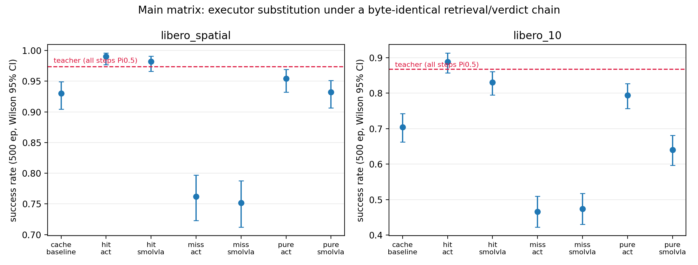
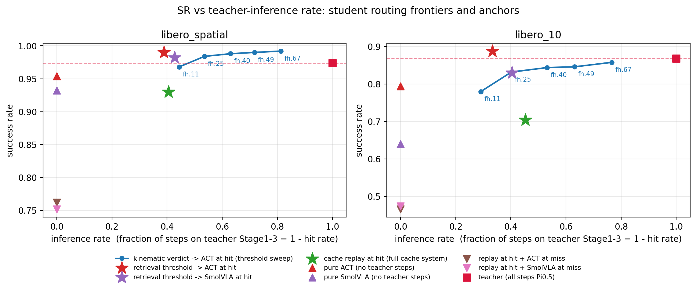

# Cache-Effectiveness Ablation — Phase 5 Analysis

> Status: **COMPLETE — main matrix (7000 ep) + Pareto 4b (5000 ep) + dedicated latency pass (140 ep), 2026-08-14.**
> Plan: `logs/ablation_study_plan.log.md` (G1/G2 APPROVED, Execution Notes EN-1..EN-5).
> Raw: `exp/ablation_study/data/runs/` (journals + per_step + preflight artifacts, sha-verified local copies).
> Paired statistics: `analysis_<suite>.json` via `analysis/analyze_ablation.py` (exact McNemar, paired RD with bootstrap CI, TOST at pre-registered delta=3pp, Holm over the primary family).

## 1. Headline

Across both suites, **replacing cache-HIT execution with a distilled small model beats the full cache system** (paired RD: spatial +6.0pp, libero_10 +18.4pp for ACT; Holm-significant), while **replacing cache-MISS execution with the small model severely degrades both the cache system and the plain small model** (paired RD −19 to −33pp). The retrieval/verdict signal is valuable — it reliably identifies states where a 80M-param student matches the 3B teacher — but the cache's *action replay* is the weak link, not the small model. On the SR-vs-inference-rate plane, **hit_act reaches teacher-level SR with only ~1/3 of steps on the teacher** (0.990 @ 0.39 spatial, 0.888 @ 0.33 l10), dominating the kinematic-verdict sweep (4b) at comparable usage; the kinematic frontier itself stays at/above teacher down to ~0.54 inference rate on spatial, and reaches teacher-equivalence at 0.77 on libero_10.

## 2. Design (summary)

- Teacher: pi0.5 (`pi05_libero`); students distilled per EN-1 pipeline (`train_student.py`), **frozen at suite-uniform step 020000** (EN-3: standard-recipe endpoint, zero selection bias; SmolVLA official finetune budget 20k, ACT SR plateau 16-20k).
- Eval: official LIBERO init states, 50 ep/task x 10 tasks = 500 ep per arm; byte-identical retrieval/gate/verdict chain across paired arms (threshold verdict: spatial 0.983416, l10 0.997349; pure arms `gate: always_skip`); only the `routing` block differs (EN-4 executor routing, post-verdict override).
- Arms (per suite): `cache_baseline`, `hit_{act,smolvla}` (HIT→student, MISS→teacher), `miss_{act,smolvla}` (HIT→cache replay, MISS→student), `pure_{act,smolvla}` (all steps student).
- 4b (EN-4): composite kinematic verdict (jerk+dispersion, kinematic_phase5 G5 recipe, percentile_rolling(50), per-suite d1 calibration), FULL_HIT→ACT, threshold grid {0.67, 0.49, 0.40, 0.25, 0.11}, 500 ep/point.
- Anchors (same protocol, official inits): teacher spatial **0.974**, l10 **0.868**; students standalone: ACT 0.966/0.766, SmolVLA 0.954/0.630.

## 3. Main matrix (SR, Wilson 95% CI, n=500 per cell; hit rate from per_step)



| arm | spatial SR | spatial hit-rate | l10 SR | l10 hit-rate |
|---|---|---|---|---|
| cache_baseline | 0.930 [0.904, 0.949] | 0.594 | 0.704 [0.663, 0.742] | 0.548 |
| hit_act | **0.990** [0.977, 0.996] | 0.612 | **0.888** [0.857, 0.913] | 0.666 |
| hit_smolvla | 0.982 [0.966, 0.991] | 0.573 | 0.830 [0.795, 0.860] | 0.596 |
| miss_act | 0.762 [0.723, 0.797] | 0.531 | 0.466 [0.423, 0.510] | 0.428 |
| miss_smolvla | 0.752 [0.712, 0.788] | 0.526 | 0.474 [0.431, 0.518] | 0.444 |
| pure_act | 0.954 [0.932, 0.969] | 0 (always_skip) | 0.794 [0.756, 0.827] | 0 |
| pure_smolvla | 0.932 [0.906, 0.951] | 0 | 0.640 [0.597, 0.681] | 0 |
| (teacher anchor) | 0.974 | — | 0.868 | — |

Hit-rate = FULL_HIT fraction of inference calls (per_step; inference rate = 1 − hit-rate is the fraction of steps paying the teacher's Stage1-3). Hit rates are endogenous to the closed loop, so they differ mildly across arms (0.53-0.67) — the executor changes the visited states. Notably, hit_act *raises* the hit rate vs baseline (l10 0.666 vs 0.548): student execution keeps the rollout closer to the retrieval pool's distribution. Sanity: `pure_X` matches the standalone student baselines within CI (ACT 0.954/0.794 vs 0.966/0.766; SmolVLA 0.932/0.640 vs 0.954/0.630) — the routing harness adds no measurable distortion.

## 4. Primary paired comparisons (pre-registered family, Holm-corrected)

Episode-identity pairing (task_id, init_idx), n_pairs=500 per comparison. `rd = SR(first) − SR(second)`.

| comparison | spatial rd [CI95] | l10 rd [CI95] | McNemar (Holm) |
|---|---|---|---|
| hit_act vs cache_baseline | **+0.060** [+0.036, +0.084] | **+0.184** [+0.140, +0.228] | sig. both suites (p_holm ≤ 2.8e-6 / ~0) |
| hit_smolvla vs cache_baseline | **+0.052** [+0.028, +0.076] | **+0.126** [+0.080, +0.172] | sig. both |
| miss_act vs pure_act | **−0.192** [−0.234, −0.150] | **−0.328** [−0.378, −0.278] | sig. both |
| miss_smolvla vs pure_smolvla | **−0.180** [−0.222, −0.136] | **−0.166** [−0.218, −0.114] | sig. both |

Discordant-pair detail (illustrative): spatial cache_baseline|hit_act = 35:5 (hit_act rescues 35 episodes the baseline fails, loses 5); l10 = 120:28.

**Verdicts.**
- *Direction 1 (student-at-HIT)*: not merely non-inferior — **superior** to the full cache system in all four cells. In the HIT slot, "student re-computes" beats "replay the cached teacher action". hit_act even sits at/above the teacher anchor (0.990 vs 0.974 spatial; 0.888 vs 0.868 l10 — teacher-level, unpaired vs anchor so no formal test).
- *Direction 2 (student-at-MISS, the "hybrid benefit" hypothesis)*: **negative result**. SR(miss_X) is significantly *below* SR(pure_X) in all four cells — cache replay on HIT steps drives the closed-loop state off the student's own distribution, so the hybrid underperforms even the plain student. Combined with cache_baseline < pure_act on l10 (0.704 vs 0.794), the replay mechanism itself is implicated.
- Attribution boundary (pre-registered): without the O6 random-routing control arm, "the verdict signal *selects* the right steps" cannot be separated from "any partial substitution by a stronger executor helps"; we therefore claim mixture effects + the replay-vs-recompute contrast only.

## 5. SR vs inference rate: routing frontiers (4b sweep + main-matrix anchors)



Axis (owner-ruled): **inference rate = 1 − hit rate** = fraction of steps executed by the teacher's full Stage1-3 pipeline. (The historical cache Pareto's warmup-cost axis is intentionally not used; historical frontiers are therefore not overlaid.)

Kinematic-verdict sweep (FULL_HIT→ACT, MISS→teacher), measured per point:

| suite | metric | fh67 | fh49 | fh40 | fh25 | fh11 |
|---|---|---|---|---|---|---|
| libero_spatial | inference rate | 0.813 | 0.717 | 0.630 | 0.536 | 0.444 |
| libero_spatial | SR | 0.992 | 0.990 | 0.988 | 0.984 | 0.968 |
| libero_10 | inference rate | 0.766 | 0.631 | 0.532 | 0.402 | 0.291 |
| libero_10 | SR | 0.858 | 0.846 | 0.844 | 0.832 | 0.780 |

Readings (teacher = 0.974 / 0.868 at inference rate 1.0):

- **Spatial**: the kinematic frontier stays at/above teacher down to inference rate ~0.54 (fh25, SR 0.984), and even fh11 (44% teacher steps) loses only 0.6pp vs teacher. High student usage is nearly free.
- **libero_10**: monotone decline; fh67 (77% teacher steps) is statistically equivalent to teacher (z≈−0.5); cutting teacher steps to 29% (fh11) costs 8.8pp.
- **The retrieval-threshold points dominate the kinematic frontier on both suites**: hit_act reaches SR 0.990 at inference rate 0.388 (spatial) and 0.888 at 0.334 (l10) — above teacher with only ~1/3 of steps on the teacher, and strictly better than any kinematic point at comparable usage. The retrieval-similarity signal routes better than the kinematic signal.
- The cache system (green star) sits far below every student-routing point at the same inference rate (spatial 0.930 @ 0.406; l10 0.704 @ 0.452): with the *same* verdict and the same teacher-step budget, replaying cached actions loses 5-18pp vs recomputing with a student.

## 6. Latency (dedicated pass: `--workers 1`, single-replica, `OPENPI_MONITOR_LEVEL=BASIC`)

70 ep/suite (7 arms x 10 tasks x 1 trial), all medians from single-concurrency records (sidecar `queue_ms` median = 0.00 confirms no contention; warmup requests excluded). Spatial served on RTX 4090, libero_10 on H200 — absolute numbers are per-hardware, ratios are the portable quantity.

| component (median per inference call) | spatial / RTX 4090 | libero_10 / H200 |
|---|---|---|
| Stage1 (vision encoder + key path; **every step, all arms**) | 114.6 ms (p90 121) | 17.7 ms (p90 20) |
| Stage2+Stage3 (teacher action gen; teacher-executed steps only) | 575.4 ms | 96.3 ms |
| teacher full-inference step (S1+S2+S3) | ~690 ms | ~114 ms |
| ACT sidecar pure forward | 39.3 ms (p90 42) | 5.9 ms (p90 7) |
| SmolVLA sidecar pure forward | 412.2 ms (p90 437) | 137.3 ms (p90 143) |

Derived per-step compute at the server (hit-routed step = Stage1 + student forward):

- **hit→ACT**: 154 ms vs 690 ms (4090, **−78%**); 24 ms vs 114 ms (H200, **−79%**) — large, hardware-consistent savings on every routed step.
- **hit→SmolVLA**: 527 ms vs 690 ms (4090, −24%); **155 ms vs 114 ms (H200, +36% — a latency LOSS)**. The lerobot SmolVLA forward does not scale down with faster hardware the way the pi0.5 pipeline does; on H200 replacing a teacher step with SmolVLA is slower.
- Cache replay step (baseline HIT): Stage1 + retrieval only, i.e. ~115 ms / ~18 ms — replay remains the latency floor; hit→ACT costs ~40 ms (4090) / ~6 ms (H200) above that floor while buying the SR gains of §4.
- Deployment-anchor note (pre-registered boundary): routed-arm latency includes Stage1 + retrieval by construction (the vision encoder must run to build keys); the sidecar forward columns are the student-only deployment anchors.

System-level takeaway: with ACT, student-at-HIT simultaneously beats the cache system on SR (§4) and cuts routed-step compute by ~4.5x (both GPUs); with SmolVLA the SR gain persists but the latency benefit is hardware-dependent and can invert.

## 7. Discussion — what this does NOT show (caveats)

- **No random-routing control (O6 not run)**: selection value of the verdict signal is not isolated from generic partial-substitution effects.
- **Replay vs recompute confound in Direction 2**: miss_X arms change *two* things relative to pure_X (HIT-side replay appears, MISS-side executor changes); the negative hybrid result is attributable to the combination, with cache_baseline<pure_act (l10) implicating replay, but a "HIT→teacher-recompute" arm was not run.
- **Frozen-checkpoint band disclosures (EN-3)**: three of four student cells sit outside the ±5pp admission band vs teacher (all but l10 SmolVLA); anchors share the official test inits with evaluation (no init-level selection was performed; freeze step was pre-committed).
- **Preflight power**: paired TOST at delta=3pp is underpowered at observed discordance for equivalence claims; launches proceeded under the pre-approved `underpowered_ok` (O7). All significant results above are McNemar rejections, not equivalence claims.
- **Cross-hardware disclosure (EN-5)**: l10 main matrix episodes 1-1197 ran on H200, the rest on RTX 4090 (mid-run failover after a shared-pod OOM); l10 4b arms split across H200/4090 (deliberate dual-server acceleration). Spatial arms: single host each phase. bf16 numeric drift across GPUs is far below the effect sizes (≥5pp) reported.
- **4b on 2-replica server (l10)**: SR unaffected (per-episode single-connection routing); latency was never measured from that run (dedicated single-replica pass instead), consistent with the plan's replica restriction being latency-motivated.
- **Verdict-input isomorphism (EN-4)**: the kinematic verdict reads the cache/teacher-side action history (broadcast precedes executor override), matching the cache system's verdict input — not the student's executed actions.
- Historical anchors (0.95/0.83) and the historical cache Pareto were measured under earlier protocol variants; all quantitative claims here use the same-protocol re-measured anchors (0.974/0.868).

## 8. Per-task SR decomposition (50 ep/cell)

### libero_spatial

| arm | t0 | t1 | t2 | t3 | t4 | t5 | t6 | t7 | t8 | t9 |
|---|---|---|---|---|---|---|---|---|---|---|
| cache_baseline | 0.98 | 0.94 | 0.96 | 0.98 | 0.78 | 0.90 | 0.98 | 0.98 | 0.94 | 0.86 |
| hit_act | 1.00 | 1.00 | 0.98 | 0.96 | 0.98 | 0.98 | 1.00 | 1.00 | 1.00 | 1.00 |
| hit_smolvla | 1.00 | 1.00 | 1.00 | 0.98 | 0.94 | 0.98 | 0.98 | 1.00 | 0.96 | 0.98 |
| miss_act | 0.86 | 0.70 | 0.88 | 0.78 | 0.64 | 0.80 | 0.80 | 0.64 | 0.92 | 0.60 |
| miss_smolvla | 0.86 | 0.76 | 0.84 | 0.74 | 0.54 | 0.82 | 0.80 | 0.68 | 0.88 | 0.60 |
| pure_act | 0.94 | 0.94 | 0.98 | 1.00 | 0.98 | 0.98 | 0.92 | 0.90 | 0.98 | 0.92 |
| pure_smolvla | 0.98 | 0.98 | 0.98 | 0.96 | 0.92 | 0.94 | 0.90 | 0.88 | 0.84 | 0.94 |

### libero_10

| arm | t0 | t1 | t2 | t3 | t4 | t5 | t6 | t7 | t8 | t9 |
|---|---|---|---|---|---|---|---|---|---|---|
| cache_baseline | 0.80 | 0.94 | 0.78 | 0.86 | 0.24 | 0.92 | 0.48 | 0.84 | 0.38 | 0.80 |
| hit_act | 0.92 | 1.00 | 0.96 | 0.96 | 0.90 | 0.96 | 0.90 | 0.92 | 0.48 | 0.88 |
| hit_smolvla | 0.88 | 1.00 | 0.82 | 0.80 | 0.82 | 0.96 | 0.84 | 0.92 | 0.44 | 0.82 |
| miss_act | 0.38 | 0.38 | 0.56 | 0.74 | 0.32 | 0.86 | 0.20 | 0.44 | 0.16 | 0.62 |
| miss_smolvla | 0.28 | 0.46 | 0.58 | 0.82 | 0.26 | 0.90 | 0.26 | 0.40 | 0.14 | 0.64 |
| pure_act | 0.64 | 0.74 | 0.94 | 0.96 | 0.78 | 0.98 | 0.64 | 0.92 | 0.40 | 0.94 |
| pure_smolvla | 0.26 | 0.56 | 0.70 | 0.90 | 0.64 | 0.94 | 0.56 | 0.68 | 0.34 | 0.82 |

Highlights: on l10 **t4** the cache baseline collapses (0.24) while hit_act holds 0.90 — replay is brittle exactly where retrieval quality drops; **t8** (hardest, teacher 0.46) shows hit_act at 0.48 — the ceiling is the teacher itself, not the routing. On spatial, hit_act fixes the baseline's two weak tasks (t4 0.78→0.98, t9 0.86→1.00).

## 9. Artifact layout

```
exp/ablation_study/data/runs/            (gitignored; local + client copies, sha-verified)
├── p4_libero_{spatial,10}_journal.jsonl        # main matrix, 3500 rows each
├── p4_libero_{spatial,10}_per_step.jsonl       # 86k / 243k rows
├── p4_libero_{spatial,10}_per_step.jsonl.preflight.json
├── p4b_{sp,l10}_journal.jsonl                  # 4b, 2500 rows each
├── p4b_{sp,l10}_per_step.jsonl
├── p4lat_{sp,l10}_journal.jsonl                # latency pass, 70 rows each
├── lat_sidecar_sp/{act7012,sml7011}_lat_sidecar.jsonl   # sidecar forward/queue timing
├── analysis_libero_{spatial,10}.json           # paired-stats machine output
└── analysis_libero_{spatial,10}_fragment.md
exp/ablation_study/data/anchors/         (gitignored)
└── libero_{spatial,10}_teacher/results_tasks*.json   # Phase-3 teacher anchor
exp/ablation_study/analysis/             (tracked)
├── analysis.md                                  # this report
├── analyze_ablation.py                          # paired statistics
├── emit_plot_data.py                            # collects every plotted point
├── plot_data.json                               # the single file the figures read
├── plot_ablation.py                             # figures (reads plot_data.json only)
├── ablation_sr_matrix.{png,pdf}                 # fig1: main matrix + CIs
├── ablation_pareto_inference_rate.{png,pdf}     # fig2: SR vs inference rate
└── sr_ledger.md                                 # freeze/candidate ledger (EN-3)
```

Figure pipeline: the raw tree is gitignored and lives off this disk, so the
figures do not read it. `emit_plot_data.py` collects every plotted point into
`plot_data.json` (main-matrix SR/CI copied verbatim from the analyzer output and
cross-checked against the journal; 4b sweep SR, FULL_HIT rates and the teacher
anchor aggregated there, each point labelled with which of the two it is), and
`plot_ablation.py` renders from that file alone. Re-collect one suite:

```bash
uv run python exp/ablation_study/analysis/emit_plot_data.py \
  --out exp/ablation_study/analysis/plot_data.json --suite libero_spatial \
  --main-journal   exp/ablation_study/data/runs/p4_libero_spatial_journal.jsonl \
  --main-per-step  exp/ablation_study/data/runs/p4_libero_spatial_per_step.jsonl \
  --sweep-journal  exp/ablation_study/data/runs/p4b_sp_journal.jsonl \
  --sweep-per-step exp/ablation_study/data/runs/p4b_sp_per_step.jsonl \
  --anchor-dir     exp/ablation_study/data/anchors/libero_spatial_teacher \
  --paired-analysis exp/ablation_study/data/runs/analysis_libero_spatial.json
uv run python exp/ablation_study/analysis/plot_ablation.py
```

(`libero_10` uses the same call with `p4_libero_10_*` and `p4b_l10_*`.) Both
figures re-render byte-identical to the pre-refactor versions from this file.
