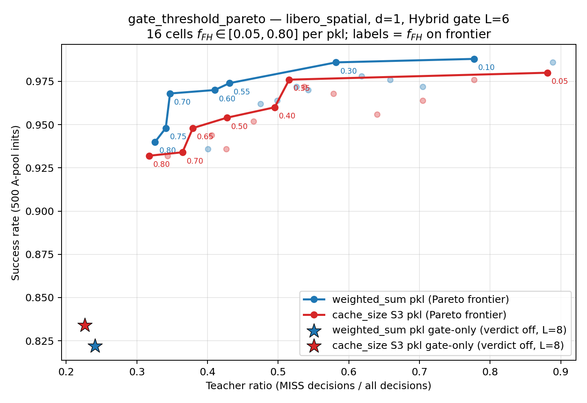
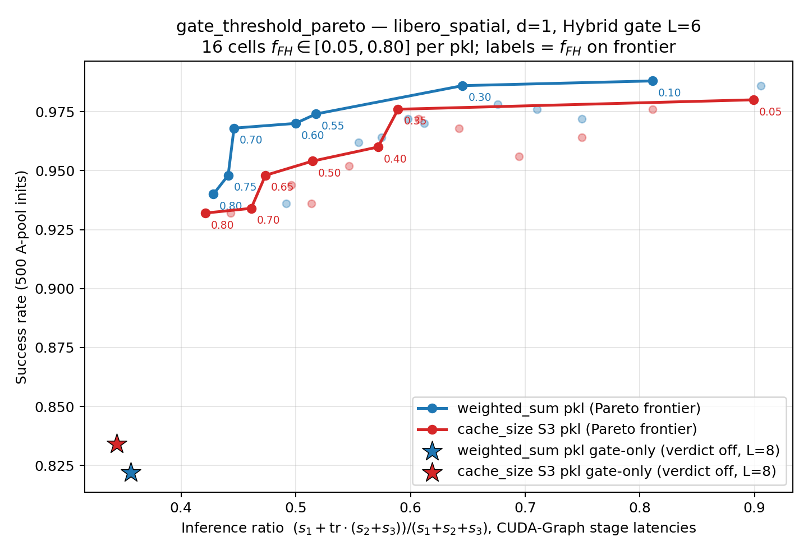
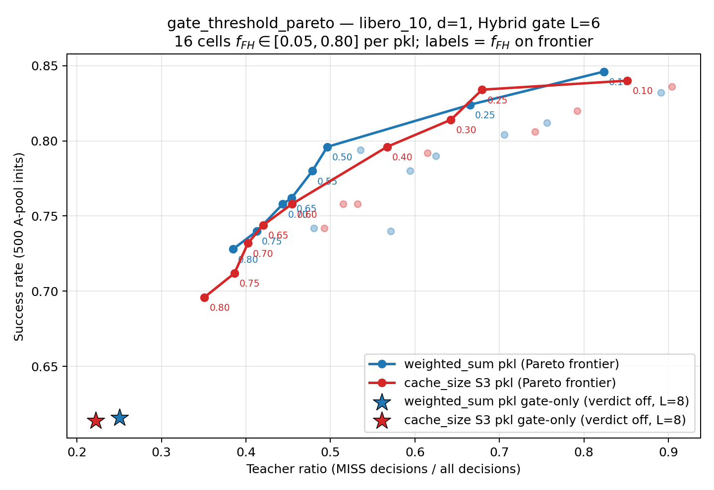
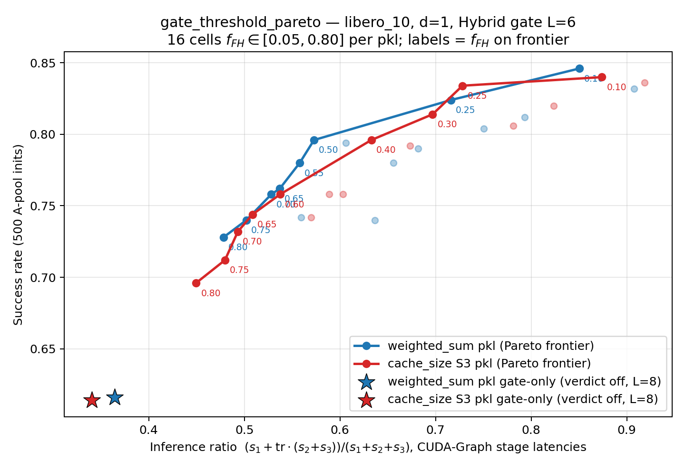

# gate_threshold_pareto — teacher ratio × 成功率 的帕累托前沿

> 状态：**complete**。主扫描两 suite 各 16,000 ep（2026-08-20 19:10 起跑、2026-08-21 06:56 收口），另补 gate-only 消融 2,000 ep（2026-08-21 10:02–11:04，§3.4）。
> `gtp_ws_sp_fh30` 一臂因跨越 GPU 崩溃窗口而污染，已于 07:05 用干净数据重跑替换（详见 §4）。
> 原始数据：timan107 `/scratch/zixuans8/openpi/exp/gate_threshold_pareto/data/eval/<suite>/`
> （`journal.jsonl` + `per_step.jsonl`）。逐臂数值见同目录 `plot_data.json`。

## 1. 实验设定

- 只 d=1；gate = **N4 混合门**（`score_hysteresis`，θ_low=θ_high=各库 warmup 分数的 0.85 分位，j=3，probe_interval=3，**L=6**）；**warm_start 全关**（verdict 二值）。
- 自由度：`f_FH ∈ {0.05, 0.10, …, 0.80}` 共 16 档 × 2 pkl × 2 suite = 64 臂。
- 两个 pkl：**ws** = weighted_sum 底座库，**cs** = cache_size S3 库。
- 评测集：官方 A-pool **500 pruned_init 全量**（与建库 init 的泄漏实测为 0/50）。

## 2. 口径

**inference_ratio（owner 正式定义，2026-08-21）**：

```
inference_ratio = (N_req·s1 + N_miss·(s2+s3)) / (N_req·(s1+s2+s3))
                = 0.15195 + 0.84805 · teacher_ratio
```

其中 s1/s2/s3 取权威延迟数据的 **CUDA-Graph 档**（`latency_bench/executor_costs` →
`pi05_stage_split_ms.cuda_graph`：s1=10.26，s2=27.69，s3=29.57 ms）。语义：每次请求
（=一次门决策）必付 Stage1 建 key，MISS 才额外付 Stage2+3——即**成本归一的推理占比**。
地板 0.152（全命中也要付 Stage1），上限 1.0。它是 teacher_ratio 的仿射映射，帕累托前沿
点集不变，仅横轴换算——两套横轴的图并存：`pareto_<suite>.png`（teacher ratio）与
`pareto_ir_<suite>.png`（inference ratio）。

基础量的直读口径：

- **teacher ratio** = MISS 决策数 / 总决策数。取自 `per_step.jsonl`——门每 5 个控制步决策一次，故这是**决策率**而非步率；只计 accepted episode，且 attempt 与 journal 中被接受的那次对齐（重试遗留行不计）。
- **success rate** = journal `status == "done"` ÷ (done + failed)，仅 accepted，每臂 500 ep。

两者都可用一条 grep 独立复核，例如
`grep -a '"yaml_id": "gtp_ws_sp_fh80"' per_step.jsonl | grep -aoE '"hit_type": "[A-Z_]+"' | sort | uniq -c`。

## 3. 结果

### 3.1 libero_spatial




- teacher ratio 从 0.89 压到 0.33（**教师调用省约 63%**），ws 成功率仅从 98.8% 降到 94.0%，cs 从 98.0% 降到 93.2%——Hybrid L=6 门在 spatial 上的退让相当温和。
- **ws 前沿全程支配 cs 前沿**。同 teacher ratio 下逐点插值比较，ws 高出 **+0.7 ~ +1.9 个百分点**（0.40 处 0.970 vs 0.951；0.50 处 0.979 vs 0.964；0.55 以上稳定在约 +0.9）。

### 3.2 libero_10




- 绝对水平显著低于 spatial（长程任务更难），且前沿更陡：teacher ratio 0.89→0.38 时 ws 成功率 84.6%→72.8%，cs 0.90→0.35 时 84.0%→69.6%。**省教师调用在 l10 上的代价明显更高**。
- **ws 在中段占优、右端反超互换**：teacher ratio 0.50 处 ws 领先最多（0.797 vs 0.773，+2.3 个百分点），0.65 处仅剩 +0.3，到 0.70 处 cs 反超（0.835 vs 0.829）。两条前沿在 ~0.67 附近交叉。
- 因此 pkl 的选择在 l10 上**取决于工作点**：想把教师调用压到一半以下选 ws，愿意维持高教师调用率换绝对成功率则 cs 略优。

### 3.3 跨 suite 的一致结论

两个 suite 都显示：**中低 teacher ratio 区间 ws 库更抗压**——即当门更多地依赖缓存、教师被调用得更少时，weighted_sum 底座库的检索质量优势才显现出来；教师调用充足时两库差异被掩盖。

### 3.4 补充消融：gate-only（verdict 关闭，门独自工作）

owner 加测的极端点：`judge.threshold = -1.0`（低于 [0,1] 分数域 ⇒ 检索必被接受，
verdict 名存实亡），gate 仍为 score_hysteresis（θ 同各库 0.85 分位解，j=3，probe_interval=3，
**L=8**——注意主扫描为 L=6，本组 L 按 owner 指定值单独取 8）。每臂 500 ep，图中星标。
原始数据：timan107 `data/eval_gate_only/<suite>/`。

| 臂 | 成功率 | teacher ratio | 对照（主扫描前沿最左端） |
|---|---:|---:|---|
| ws_sp | 0.822 | 0.241 | 0.940 @ tr 0.326 |
| cs_sp | 0.834 | 0.226 | 0.932 @ tr 0.317 |
| ws_l10 | 0.616 | 0.251 | 0.728 @ tr 0.385 |
| cs_l10 | 0.614 | 0.222 | 0.696 @ tr 0.351 |

三个结论：

1. **门的固有干预率约 22–25%（决策级），不是 0**。verdict 全关后 MISS 全部来自滞回
   触发 + L=8 锁定——这是把 teacher 调用压到最低时的天然地板（probe_interval=3 与 L=8
   本身限定了 MISS 占比的可达范围）。
2. **verdict 的边际价值清晰可读**：gate-only 相比主扫描前沿最左端，teacher ratio 再省
   9–13 个百分点，但成功率 spatial 掉 ~10–11 点、l10 掉 ~8–11 点。门管"什么时候该问缓存"，
   verdict 管"这条检索结果配不配执行"——后者砍掉的正是门放行但质量不够的那批命中。
3. **gate-only 点严格落在两条前沿的延长线下方**（图中星标远低于前沿左端斜率的外推），
   说明 verdict-off 不是前沿的自然延伸，而是掉档：该区间内每省 1 点 teacher ratio
   的成功率代价急剧变贵。两 pkl 在此极端点差异消失（l10 上 0.616 vs 0.614），
   检索库质量的优势需要 verdict 在场才能兑现——与 §3.3 的"中低 tr 区间 ws 占优"一致。

## 4. 关于 `gtp_ws_sp_fh30`（已修复，记录备查）

该臂首轮的 500 集横跨 2026-08-20 的 GPU 崩溃与重启窗口，成功率仅 0.760、teacher ratio 0.519（偏离单调序列）。按 15 分钟分桶的失败率给出了判据：

| 时间桶 | 失败/总数 | 失败率 |
|---|---|---|
| 15:00 | 4/209 | 1.9% |
| 15:15 | 4/132 | 3.0% |
| **15:45** | **48/51** | **94.1%** |
| 16:15 | 0/5 | 0% |
| **16:30** | **64/67** | **95.5%** |
| 19:15 | 0/36 | 0% |

干净窗口 382 集只失败 8 次（真实成功率约 97.9%），崩溃窗口 118 集失败 112 次；全部 attempt=1、无重试，说明失败集是在 server 退化状态下被直接接受的。**这是基础设施故障产物，与门控行为无关。**

2026-08-21 07:05 以同一配置重跑：**493/500 = 98.6%**，teacher ratio 0.582（回到单调序列），速率 65.9 ep/min（首轮受崩溃拖累仅 2.04 ep/min）。干净数据已顶替主文件中的错误数据；原污染行**未删除**，移入 `data/eval/libero_spatial/journal.jsonl.quarantine_gtp_ws_sp_fh30.jsonl` 与同名 per_step quarantine 文件（各 500 / 9,502 行），原文件另有时间戳备份。

## 5. 运行期事故（不影响结论，供复现参考）

- **GPU 侧**：该 4090（48G 改装 clamshell）有确定性硬件缺陷——冷态陡热爬坡 × 满带宽显存流量会静默算错。全程由保温脚本护航（≥44 °C 安全线，实测谷值 50–53 °C）；spatial→l10 切换与 05:00 崩溃后重启这两个空闲窗口，保温均主动介入并把起温维持在 54 °C。详见 devices.md weilandserver §保温协议。
- **客户端侧**：64 worker 连跑 8.5 小时后，驱动侧锁页内存累积吃光 timan107 的 220 GB（进程 PSS 仅占 120 GB，约 95 GB 不在任何标准计数器上），触发 OOM 连杀 worker，进而客户端 websocket 心跳超时（`1011 keepalive ping timeout`）导致 conductor 在 05:00 退出。以 **48 worker** 按 episode 级 resume 重启后内存回落且吞吐不变（GPU 早已 99% 饱和，瓶颈在服务端而非客户端并发）。resume 过滤正确跳过了 26/32 已完成臂，避免 bundle 切换风暴。

## 6. 复现

```bash
# gate-only 消融的 yaml 生成（θ 复用已解出的 0.85 分位）
uv run python -m exp.gate_threshold_pareto.emit_gtp_yamls --mode gate_only --gate-l 8
# 运行时校验放行非默认 L：run_gtp --gate-l 8

# 聚合（纯标准库，在数据所在节点跑）
python3 exp/gate_threshold_pareto/analyze_gtp.py aggregate <data/eval/SUITE> <out.json>

# 出图（本地，需 matplotlib）
uv run python -m exp.gate_threshold_pareto.analyze_gtp plot \
  --suite libero_spatial=<sp.json> --suite libero_10=<l10.json> \
  --out-dir exp/gate_threshold_pareto/analysis --status "..."
```
