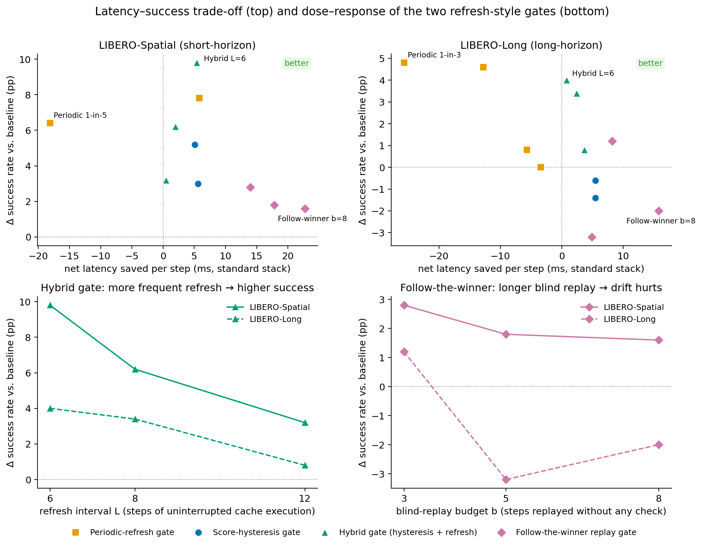

# 免训练的缓存门控：让机器人操作策略少算、更快、且更成功

**面向外部合作者的研究报告 · 2026-07-07**

---

## 摘要

视觉-语言-动作（VLA）操作策略每个控制步都要做一次昂贵的迭代去噪推理（GPU 上约 300 ms，闭环全程约 1.7 s）。**轨迹缓存**通过检索过去成功轨迹并直接复用其动作，替代一部分推理。但缓存引入一个新的调度问题——**门控（gating）**：每一步应该检索缓存、跳过检索直接推理、还是连推理都跳过直接复用？

我们在两个 LIBERO 任务集（短程 Spatial、长程 Long）上，先采集了 **18.3 万步无偏的真实检索决策记录**做信号研究，再对 **4 种免训练门控**做了 **22 组、每组 500 episode 的在线闭环实验**。三个主要结论：

1. **最优方案是"混合门"（分数滞回 + 定期刷新）**：在短程任务集上，成功率从 82.6% 提升到 **92.4%（+9.8 个百分点，配对检验 p≈1.2×10⁻⁷）**，而每步推理成本不变（0.289 vs 基线 0.287）；在长程任务集上 +4.0 个百分点，且是唯一同时保持延迟净收益为正的高成功率方案。
2. **一个意外的核心发现：定期强制重新推理本身就能大幅提升成功率**（最高 +7.8 个百分点）。缓存复用并不是"成功率中性"的——长时间连续回放缓存动作会让轨迹漂移；周期性注入一步新推理相当于给策略"纠错"的机会。由此，一行代码的周期刷新门是一个异常强的基线，任何缓存系统的评测都应把它列为对照。
3. **门控所需的信号是免费的**：上一步检索产生的相似度分数，几乎完美地预测下一步检索是否会失效（AUC ≈ 0.98，两个任务集一致）。利用这个信号的滞回门可以省去 13%–32% 的检索开销，成功率不受损失。

此外，"盲回放门"（锁定一条库轨迹后连检索带推理一起跳过）给出**最大的每步延迟节省（最高约 23 ms/步）**，但其成功率增益只在最保守的参数下成立，适合延迟是硬约束的部署。

---

## 1. 背景：轨迹缓存与门控问题

### 1.1 系统是什么

我们的基础系统是一个为 VLA 策略（本实验用 π0.5）服务的**轨迹缓存**：

- **缓存库**：由过去成功的示范轨迹组成（本实验每个任务 16 条，约 2600 个缓存条目）。
- **检索**：每个控制步（一个动作块，约 10 个仿真步）以机器人本体状态为键，做加权最近邻检索，得到一个相似度分数 $s\in[0,1]$。
- **三态判定**：给定两个标定好的阈值 $\tau_{\text{hit}} > \tau_{\text{warm}}$，

| 判定 | 条件 | 该步的执行方式 | 推理成本 |
|---|---|---|---|
| **完全命中** | $s \ge \tau_{\text{hit}}$ | 直接执行缓存里的动作 | 0 |
| **温启动** | $\tau_{\text{warm}} \le s < \tau_{\text{hit}}$ | 缓存动作作为迭代去噪的初值，做部分推理 | 0.5–1.0 |
| **未命中** | $s < \tau_{\text{warm}}$ | 完整推理 | 1 |

### 1.2 为什么需要门控

缓存把很多步的推理成本降到了 0，但两个问题随之出现：

1. **检索本身有开销**。每步的检索+判定在优化实现的小库上约 4 ms，在未优化的参考实现上约 34 ms，外推到 5 万条目的大库约 70 ms。在缓存失效的步上，这笔开销是纯浪费（反正要做全推理）；在命中的步上，如果我们能确定它会命中，这笔开销同样可以省。
2. **缓存复用可能不是无害的**。复用的动作来自过去的轨迹，与当前状态并不严格一致；连续复用是否会积累误差、伤害成功率，事先并不清楚（后文证明：会）。

**门控**就是每一步在三种操作之间做调度的决策器：

- **检索**（正常流程：查缓存，按判定执行）；
- **跳过检索，直接完整推理**（省一次检索，或主动"刷新"轨迹）;
- **跳过检索和推理，直接复用缓存**（两个都省，但没有任何监督信号）。

本轮探索的约束是**免训练**（training-free）：门控只能用在线免费可得的量（检索分数、判定历史、步计数），不引入任何学习模型。

### 1.3 评价坐标：一个三元组

一个关键的方法论教训（详见 §6 末的方法论推论）是：门控的效果必须同时在三根轴上报告，只看任何单轴都会误判：

- **成功率 SR**：任务成功的 episode 比例；
- **推理占比 $r$**：每步平均推理成本（按上表加权；全推理 = 1）。$r$ 直接对应 GPU 算力消耗；
- **每步净延迟收益**：
$$\text{net} = \text{skip\%} \times T_{\text{search}} - \Delta r \times T_{\text{infer}}$$
其中 skip% 是被跳过的检索比例，$\Delta r$ 是相对基线的推理占比增量，$T_{\text{infer}}\approx 300$ ms。$T_{\text{search}}$ 按部署档位取 {4, 34, 70} ms；正文统一报 34 ms 档（参考实现），其它两档见附录。

---

## 2. 信号研究：18 万步真实决策记录说明了什么

我们先在"每步都检索"的模式下（因此无选择偏置）采集了 7 个缓存工作点 × 500 episode 的完整决策记录：**182,899 个控制步**（短程 39,136 + 长程 143,763），每步含检索分数、三态判定、机器人状态与 episode 成败。三个决定后续设计的事实：

**(1) 门控信号是免费的、且几乎完美。** 上一步检索的相似度分数预测"下一步检索是否未命中"的 AUC 达 **0.982（短程）/ 0.981（长程）**（图 2）。这个分数是上一步检索的副产品，不需要任何额外计算——门控问题从"预测这一步难不难"简化成"读昨天的温度计"。

**(2) 失效是成段出现的，且大多会恢复。** P(未命中 | 上一步未命中) ≈ 0.89–0.93，而 P(未命中 | 上一步命中) 仅 0.03–0.05；命中段平均长 13–22 步，失效段平均 6–12 步；**61%–84% 的失效段之后会重新恢复命中**。含义：预测到失效后可以整段停掉检索，但必须周期性"探测"以免错过恢复。

**(3) 命中段是对单条库轨迹的锁步跟随。** 连续完全命中的相邻步中，93%–98% 命中同一条库轨迹、且其中绝大多数步序号恰好逐步 +1；完全命中几乎从不直接跌到未命中（概率 0–2%）。含义：命中段内，系统实际上在逐步回放同一条示范——这打开了"连检索都不做、直接盲回放"的可能。

---

## 3. 四种免训练门控

图 1 用一个 30 步的示意 episode 直观展示四种门控与基线的调度差异。

### 3.0 基线

- **每步检索（always-search）**：缓存系统的默认行为，也是所有比较的锚点。
- **无缓存（纯推理）**：每步完整推理（$r=1$）。长程任务集上实测 SR = 83.0%。

### 3.1 周期刷新门（Periodic）

> 每 $p$ 步中，固定 1 步跳过检索、强制做完整推理；其余步正常检索。

最简单的门（一个步计数器）。它跳过的步落在哪里与缓存状态无关——有些落在本来会命中的步上，把"免费复用"换成了"花钱推理"，因此它的推理占比 $r$ 总是升高。我们最初把它作为陪跑对照，结果它成了整个研究的意外主角（§5.2）。

### 3.2 分数滞回门（Score-hysteresis）

> 维护最近一次检索的分数 $s_{\text{last}}$。
> - **搜索态**：正常检索；若连续 $j$ 次检索都有 $s < \theta_{\text{low}}$，进入**跳过态**。
> - **跳过态**：跳过检索、直接完整推理；每 $M$ 步做一次探测检索，若 $s \ge \theta_{\text{high}}$ 则回到搜索态。
>
> 双阈值 $\theta_{\text{high}} > \theta_{\text{low}}$ 构成滞回带，防止在阈值附近抖动。

直觉：用 §2(1) 的免费信号，把整段"注定失效"的步的检索省掉。关键性质：**它跳过的步本来就要做全推理**，所以它不改变动作、也几乎不增加推理占比——省到的是纯粹的检索时间。参数经离线扫描选定（在离线数据上其行为可精确重放；上线后跳步率与离线预测偏差 ≤1.8 个百分点，验证了离线选点方法）。

### 3.3 混合门（Hybrid = 滞回 + 定期刷新）

> 在分数滞回门之上增加一条规则：**连续执行缓存动作满 $L$ 步，就强制插入 1 步"跳过检索、完整推理"**（刷新），然后重新计数。

直觉：滞回分支在失效段省检索（延迟收益），刷新分支在命中段防止连续复用漂移（成功率收益，机制见 §6）。两条规则都只需要计数器和一个分数寄存器。

### 3.4 追随赢家门（Follow-the-winner，盲回放）

> 若检索连续命中同一条库轨迹的连续片段（步序号逐步 +1），且锁步推进累计 $j_{\ell}$ 次（即 $j_{\ell}+1$ 步连续完全命中），则**锁定**该轨迹；随后至多 $b$ 步（预算）**既不检索也不推理**，直接按该轨迹播放后续动作；预算用尽、或回放中取不到后续动作时**解锁**，回到正常检索。
>
> 该门**不引入任何新的分数阈值**："完全命中"沿用系统既有的判定阈值 $\tau_{\text{hit}}$（§1.1，全部门控实验共用同一套冻结判定阈值），门本身只有两个整数参数（$j_\ell$，$b$）。任何温启动、未命中或赢家切换都会把锁步计数清零。

直觉：§2(3) 说明命中段本来就在锁步回放，那就把检索与判定也省掉。它是唯一能把推理占比降到**基线以下**的门（盲回放步成本记 0），因此延迟收益最大；代价是盲回放段没有任何监督信号，安全性完全靠小预算兜底。

---

## 4. 实验设置

| 项 | 值 |
|---|---|
| 策略模型 | π0.5（预训练 LIBERO checkpoint，流匹配动作头 / 迭代去噪推理） |
| 任务集 | LIBERO-Spatial（10 个短程空间重排任务）、LIBERO-Long（10 个长程组合任务） |
| 缓存工作点 | 每个任务集从其"缓存质量–算力"前沿的多个候选配置中**固定一个**做全部在线实验（阈值、归一化、库均冻结），选择标准 = 缓存未命中率最高、即门控可作用空间最大的点：短程基线 SR 82.6% / $r$=0.287；长程基线 SR 77.6% / $r$=0.636。基线数字即该工作点自身在"每步检索"模式下的 500 episode 成绩，与所有门控组同初始状态集合 |
| 每个操作点 | 500 episode = 10 任务 × 50 个初始状态，**同一初始状态集合配对比较**（配对 McNemar 检验） |
| 在线规模 | 22 组 × 500 episode（含全部门控点与周期门锚点）；服务器 H200 GPU × 3 推理副本，48 个并行仿真进程 |
| 门控参数网格 | 滞回门 2 个操作点（保守 A / 激进 B）；混合门 $L\in\{6,8,12\}$；盲回放门锁定 $j_\ell$=3、预算 $b\in\{3,5,8\}$；周期门 $p\in\{3,5,8,13,31\}$（按任务集选取） |

**公平比较的判据（三条件，全部满足才算"通过"）**：

1. 在**相同推理占比**下不输给周期门：取推理占比最接近（容差 ±0.03）的周期门锚点，要求 SR 不低于它；
2. SR ≥ 基线 − 1 个百分点（不倒退）；
3. net@34 ≥ 0（延迟不倒贴）。

> 为什么用"同推理占比"而不是"同跳步率"配对？因为**跳步率不是成本**：滞回门跳过的步本来就要全推理（跳过 = 免费），周期门跳过的步很多本可缓存命中（跳过 = 多花一次推理）。同跳步率比较会系统性偏袒省钱的一方。这是我们在第一轮实验中付出学费才确立的口径。

---

## 5. 结果

### 5.1 总览

**短程任务集（LIBERO-Spatial，基线 SR 82.6% / $r$=0.287）**

| 方案 | 跳检索 % | SR % | ΔSR (pp) | 推理占比 $r$ | net@34 (ms/步) |
|---|---|---|---|---|---|
| 每步检索（基线） | 0 | 82.6 | — | 0.287 | 0 |
| 滞回门 A | 12.8 | 85.6 | +3.0 | 0.283 | +5.6 |
| 滞回门 B | 20.1 | 87.8 | +5.2 | 0.293 | +5.1 |
| 周期门 1-in-8 | 10.9 | 90.4 | +7.8 | 0.280 | +5.8 |
| 周期门 1-in-5 | 18.3 | 89.0 | +6.4 | 0.369 | **−18.1** |
| **混合门 L=6** | 17.2 | **92.4** | **+9.8** | 0.289 | **+5.4** |
| 混合门 L=8 | 16.7 | 88.8 | +6.2 | 0.300 | +2.0 |
| 混合门 L=12 | 15.1 | 85.8 | +3.2 | 0.303 | +0.5 |
| 盲回放门 b=3 | 24.5 | 85.4 | +2.8 | 0.269 | +14.0 |
| 盲回放门 b=5 | 33.2 | 84.4 | +1.8 | 0.266 | +17.8 |
| 盲回放门 b=8 | 42.3 | 84.2 | +1.6 | 0.260 | **+22.7** |

**长程任务集（LIBERO-Long，基线 SR 77.6% / $r$=0.636；纯推理 83.0% @ $r$=1.0）**

| 方案 | 跳检索 % | SR % | ΔSR (pp) | 推理占比 $r$ | net@34 (ms/步) |
|---|---|---|---|---|---|
| 每步检索（基线） | 0 | 77.6 | — | 0.636 | 0 |
| 滞回门 A | 21.2 | 77.0 | −0.6 | 0.642 | +5.5 |
| 滞回门 B | 32.4 | 76.2 | −1.4 | 0.655 | +5.5 |
| 周期门 1-in-31 | 2.5 | 77.6 | +0.0 | 0.650 | −3.4 |
| 周期门 1-in-13 | 7.1 | 78.4 | +0.8 | 0.663 | −5.7 |
| 周期门 1-in-5 | 19.2 | 82.2 | +4.6 | 0.701 | −12.8 |
| 周期门 1-in-3 | 32.7 | 82.4 | +4.8 | 0.759 | **−25.7** |
| **混合门 L=6** | 21.8 | **81.6** | **+4.0** | 0.658 | **+0.8** |
| 混合门 L=8 | 21.6 | 81.0 | +3.4 | 0.652 | +2.4 |
| 混合门 L=12 | 21.2 | 78.4 | +0.8 | 0.648 | +3.7 |
| 盲回放门 b=3 | 10.9 | 78.8 | +1.2 | 0.621 | +8.2 |
| 盲回放门 b=5 | 14.0 | 74.4 | −3.2 | 0.636 | +4.9 |
| 盲回放门 b=8 | 19.5 | 75.6 | −2.0 | 0.606 | **+15.8** |

### 5.2 逐门判决

**分数滞回门：兑现了自己的设计目标，但不是成功率工具。** 省检索 13%–32%，SR 保真（短程甚至 +3.0/+5.2 pp；长程 −0.6/−1.4 pp，配对检验均不显著），净延迟全部为正。上线行为与离线预测一致（跳步率偏差 ≤1.8 pp）。但在同推理占比的比较里，它的 SR 全面低于周期门——**作为延迟优化器成立，作为成功率优化器不成立**。

**周期刷新门：意外的强基线。** 四个配置全部显著高于基线（+4.6 ~ +7.8 pp，配对 p = 0.0001–0.035）。但它的 SR 多数是"买来的"：跳步撞上本可命中的步 → 推理占比上升 0.06–0.12 → 除最稀疏档外净延迟全负（最差 −25.7 ms/步）。**在长程任务集上，所有周期门的净延迟都是负的**——这为混合门留出了明确的位置。

**混合门：总冠军。** 全部 6 个操作点 SR ≥ 基线且净延迟 ≥ 0（从不倒退）；三条件判据 4/6 通过。两个亮点：

- **短程 L=6**：SR 92.4%（+9.8 pp，配对翻转 19:68，McNemar 精确 p ≈ 1.2×10⁻⁷），推理占比与基线持平（0.289 vs 0.287），并在同推理占比下胜过最强周期门（90.4%）+2.0 pp。**这接近"免费的 10 个百分点"**。
- **长程全部 L**：SR 与净延迟**双赢**——同推理占比的周期门锚点 SR 更低且净延迟为负，混合门更高且为正。

**追随赢家门（盲回放）：延迟冠军，成功率工具箱里最窄的一件。** 它是唯一把推理占比压到基线之下的门（盲回放步零成本），净延迟全 6 点为正、最高 +22.7 ms/步（若按大库 70 ms 档算，可达 +37.9 ms/步）。但 SR 只在最低预算下安全：长程 b=3 通过三条件判据（+1.2 pp），b=5/b=8 跌破基线（−3.2/−2.0 pp）；短程虽然全部高于基线，但同推理占比下始终落后周期门 5–6 pp。机制上的教训见下节。

### 5.3 剂量响应：两种"复用-刷新"平衡的一致规律

图 4 下排把两个可调门的参数扫描并排：

- **混合门**：刷新间隔 $L$ 越小（刷新越频繁），SR 越高——短程 92.4 → 88.8 → 85.8，长程 81.6 → 81.0 → 78.4（$L$=6/8/12）。在测试范围内"更频繁一律更好"。
- **盲回放门**：预算 $b$ 越大（无监督回放越长），SR 越差（长程 b=3 之后直接跌破基线）。

两条曲线是同一枚硬币的两面：**连续复用缓存的时间越长，成功率越差**。混合门主动缩短它，盲回放门主动延长它。

---

## 6. 机制：为什么"定期强制重新推理"能提升成功率

这是本轮研究最重要的科学发现，证据链如下（前三条是观测证据，第四条是我们的解释性假说）：

**(1) 两类彼此独立的门都拿到了同样的增益。** 周期门与混合门的刷新分支机制完全不同（一个数步数，一个数连续缓存执行长度），但都稳定高于基线；而不打断复用的滞回门和延长复用的盲回放门都拿不到。增益与"打断连续缓存复用"共变。

**(2) 打断的直接证据：连续复用段被精确截断。** 基线上连续缓存执行段平均长 12.1 步（短程）/10.3 步（长程）；周期门按档位把它压到 3.5–5.3 步（短程）/1.8–3.2 步（长程）；SR 随之上升。

**(3) 剂量-响应单调且低剂量即饱和。** 混合门 SR 随刷新变频繁而单调上升（§5.3）；周期门在最稀疏的有效档（短程 1-in-8）就拿到全部增益（90.4 ≥ 更密档的 89.0）。"打断"便宜且见效快。

**(4) 解释性假说：缓存回放的漂移积累。** 复用的动作是对过去轨迹的重放，与当前状态存在小偏差；连续重放使偏差累积，且一旦偏离，检索会继续把轨迹"锁"在库轨迹上重复既往动作（失效步在失败 episode 中的占比 34%–59%，远高于成功 episode 的 5%–24%）。周期性插入一步全新推理，等于把控制权交还给策略本身，让轨迹回到策略自己的状态分布——一个廉价的"纠错阀"。我们强调这是与全部观测一致的假说，而非已被因果隔离实验证明的机制。

**方法论推论：跳步是干预，不是优化。** 门控决策会改变动作分布、自带成功率效应，因此任何缓存/门控系统的评测都不能假设"省算力的改动是成功率中性的"，必须同时报告（SR，推理占比，延迟）三元组——这也是 §4 三条件判据的由来。

---

## 7. 部署建议

| 部署场景 | 推荐 | 预期效果（相对每步检索基线） |
|---|---|---|
| 成功率优先，短程/重排型任务 | **混合门 L=6** | SR +9.8 pp，推理成本不变，延迟微省 |
| 成功率与延迟都要，长程任务 | **混合门 L=6** | SR +4.0 pp 且净延迟为正（周期门在此场景延迟全负） |
| 延迟是硬约束（大库 / 远程推理 / 未优化实现） | **滞回门**（保真省时）或 **盲回放门 b=3**（净省最大） | 滞回门：省 13–32% 检索、SR 保真；盲回放：每步净省 8–23 ms（34 ms 档），SR +1~+3 pp 但须保守预算 |
| 最简实现（一个计数器） | **周期门 1-in-8** | SR +7.8 pp；注意推理成本与延迟按你的档位核算，密档会倒贴 |

反过来的三条红线：

- 不要用大预算的盲回放（$b\ge 5$ 在长程直接跌破基线）；
- 不要在延迟敏感的部署里用密集周期门（net 最差 −25.7 ms/步）；
- 不要只看跳步率评估任何门（见 §4 的口径说明）。

---

## 8. 局限

- **单模型、单随机种子、每点 500 episode。** 配对设计 + McNemar 检验缓解但不消除采样噪声（约 ±2–3 pp）。大效应（混合门短程 +9.8、周期门 +7.8/+6.4）显著；小差距（如混合门短程对周期门的 +2.0、长程盲回放 b=3 的 +1.2）在噪声量级，应视为方向性证据。
- **两个任务集、一个缓存实现、冻结的库与阈值。** 结论对其他 benchmark / 更大的库 / 在线写入的库的外推未验证。
- **每个任务集只在一个缓存工作点上做了在线门控实验**（选未命中率最高的点，见 §4）。信号研究（§2）覆盖每个任务集全部 3–4 个前沿工作点且结论一致（AUC 0.973–0.986），但门控的在线结论对前沿上其他工作点（如阈值更严、推理占比更低的配置）的外推未实测。
- **"同推理占比"配对用最近锚点（±0.03），不是连续前沿**；短程任务集缺纯推理锚点。
- **机制解释（§6 第 (4) 条）是假说级**：截断证据与剂量响应一致支持它，但未做定向的因果隔离实验（例如可控偏差注入）。
- 评测初始状态全集中每任务含 5 个库内状态（约 10%），三方使用同一集合配对，不影响相对比较，但绝对 SR 略偏乐观。
- 免训练约束下的结论。鉴于免费信号已达 AUC 0.98，步级"要不要检索"的学习模型空间有限；学习型门控的机会更可能在"何时刷新"的状态感知调度上。

---

## 附录 A：延迟三档下的净收益

净收益公式 $\text{net}=\text{skip\%}\times T_{\text{search}}-\Delta r\times T_{\text{infer}}$，$T_{\text{infer}}=300$ ms。三档 $T_{\text{search}}$：优化实现+2.6k 库 ≈4 ms；参考实现 ≈34 ms（正文口径）；5 万条目大库外推 ≈70 ms。

代表点（ms/步，正=省）：

| 方案 | net@4 | net@34 | net@70 |
|---|---|---|---|
| 滞回门 A（短程） | +1.7 | +5.6 | +10.2 |
| 混合门 L=6（短程） | ≈+0.1\* | +5.4 | ≈+11\* |
| 周期门 1-in-5（短程） | −23.6 | −18.1 | −11.5 |
| 盲回放门 b=8（短程） | +10.0 | +22.7 | +37.9 |
| 周期门 1-in-3（长程） | −35.5 | −25.7 | −14.0 |
| 盲回放门 b=8（长程） | +9.9 | +15.8 | +22.8 |

（\* 混合门的 4/70 ms 档为按公式由实测 skip%=17.2、$\Delta r$=+0.002 推算，其余均为实测流水线输出。）

规律：**滞回门与盲回放门的收益随检索成本档位放大**（它们省的是检索/一切），**周期门的亏损随之缩小但仍为负**（它亏的是推理）。在优化实现+小库（4 ms 档）上，"省检索"型门的墙钟收益接近于零——此档位部署缓存门控的动机应当是成功率（混合门）而非延迟。

## 附录 B：口径细节

- **推理占比**：完全命中计 0；温启动按去噪起点 $t$ 计 $1-\tfrac{1}{2}(1-t)\in[0.5,1]$；未命中计 1。盲回放步计 0。
- **跳检索 %**：被门控跳过检索的控制步比例（滞回门的探测步计为"检索"）。
- **配对协议**：同任务、同初始状态集合，三方（被测门 / 周期门锚点 / 基线）episode 一一对应；显著性用 McNemar 精确二项检验。
- **步**：一次缓存决策 = 一个动作块 ≈ 10 个仿真步；文中所有"步"均指决策步。
- **基线推理占比**来自 §2 的无偏采集（同配置、同初始状态集合）。

## 附录 C：可复现性

所有原始数据（每步决策记录 + episode 日志 + 运行清单）、分析脚本与本报告图表脚本保存于项目仓库 `exp/gate_research/`（原始数据不入 git，按需索取）。图 2 由 18.3 万步原始记录直接计算；其余图表数字与仓库内各阶段分析报告逐表一致。
