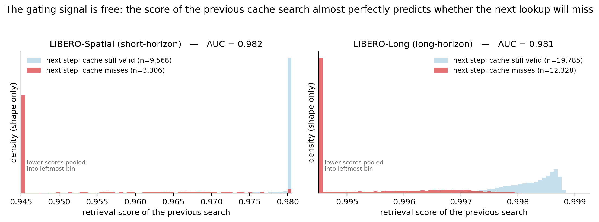
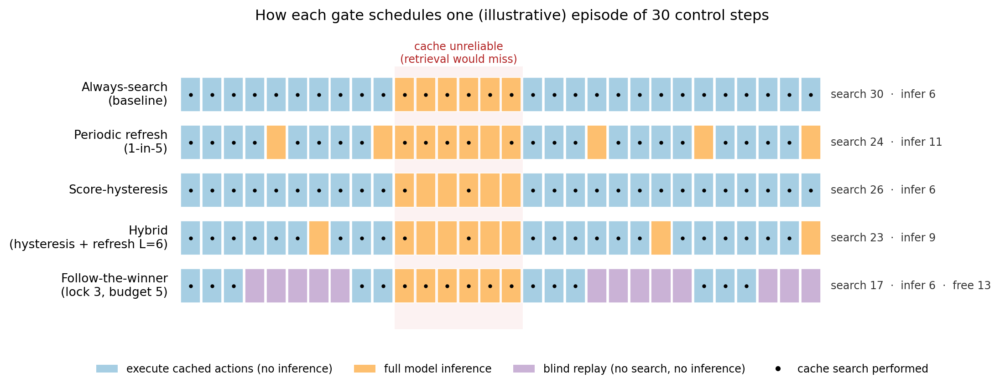
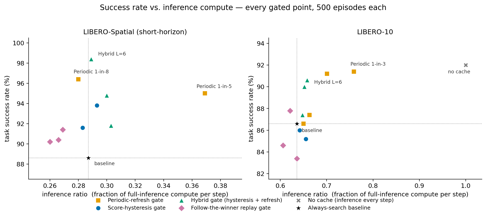

# Deck: Training-Free Cache Gating (3 slides, English)

> 用途：`gate_report_external.md` 的 §2（信号研究）、§3（四种门控）、§5.1（主结果总览）各压成 1 页。
> 图直接复用报告成图 `../figures/fig{2,1,3}_*.png`（已是英文论文级，无需重制）。
> 每页 = 一句话论点标题 + ≤4 短条 + 一张全宽图；Speaker notes 为讲稿要点，不上片。

---

## Slide 1 — 183k logged decisions: three facts that shape the gates

**On-slide text:**
- The gating signal is **free**: last search's score predicts the next cache miss — **AUC 0.98** on both suites
- Misses come in **streaks** and mostly recover: P(miss|miss) ≈ 0.9 vs P(miss|hit) ≈ 0.04; 61–84% of dead streaks come back
- Hit streaks = **lockstep replay** of one library trajectory (93–98% same trajectory, step +1)

**Figure:**（全宽）

**Speaker notes:** Before designing anything we logged 182,899 real control steps — every step searched, so no selection bias — across 7 cache operating points and 500 episodes per point. Three facts fall out. First, the previous search's similarity score separates "next lookup will still hit" from "next lookup will miss" almost perfectly (AUC 0.982 short / 0.981 long) — and it's a byproduct of the search we already did, so gating costs nothing. Second, failures are not isolated: once you miss you keep missing (~0.9), but most dead streaks recover, so a gate may stop searching during a streak yet must probe periodically. Third, during hit streaks the system is de-facto replaying one demonstration step by step — which suggests we could skip even the search itself. Each fact maps to one gate on the next slide.

---

## Slide 2 — Four training-free gates: counters and one score register

**On-slide text:**
- **Periodic**: every p-th step, skip search → force full inference (our accidental hero)
- **Score-hysteresis**: low-score streak → stop searching until a probe recovers; *these skips are free*
- **Hybrid**: hysteresis + a forced refresh after **L** consecutive cached steps
- **Follow-the-winner**: locked onto one trajectory → **blind replay** up to b steps — no search, no inference

**Figure:**（全宽）

**Speaker notes:** All four gates are training-free — integer counters plus one score register; no new thresholds are learned (blind replay reuses the system's frozen hit threshold). Periodic ignores cache state entirely and burns extra inference — we added it as a control and it became the surprise of the study. Hysteresis uses the free signal from slide 1: it only skips searches that were doomed anyway, so it changes no actions and saves pure search latency. Hybrid adds one rule — after L consecutive cached actions, force one full inference "refresh" — combining hysteresis's latency win with periodic's success-rate win. Follow-the-winner exploits the lockstep fact: once locked, it plays the demonstration directly, spending neither search nor inference — the only gate that pushes inference cost *below* baseline, guarded by a small budget b.

---

## Slide 3 — Results: +9.8 pp success at baseline compute — or 23 ms/step back

**On-slide text:**
- **Hybrid L=6**: SR **82.6 → 92.4** (short) / **77.6 → 81.6** (long) at baseline inference cost, latency ≥ 0
- **Blind replay**: biggest latency win — **+23 / +16 ms per step** — at ≈ baseline SR
- **Periodic** lifts SR too, but pays in inference: net **−18…−26 ms** per step
- Judge on all three axes — SR, inference ratio, net latency; any single axis misleads

**Figure:**（全宽）

**Speaker notes:** Every point is 500 paired episodes. Left, short-horizon: Hybrid L=6 is the headline — plus 9.8 points of success rate at the baseline's inference ratio, with net latency still positive; McNemar-significant. The pink diamonds (blind replay) sit slightly above baseline SR while cutting inference below baseline — that's where the +23 ms/step comes from. Right, long-horizon: same shape — Hybrid L=6 gains 4 points at cost parity; periodic gains more SR but drifts right, i.e. it buys success with GPU time (net −26 ms at 1-in-3, and it can never beat the no-cache point that way). The methodological takeaway we'd emphasize to anyone building on this: pair configurations by inference ratio, not by skip rate — skips are free for hysteresis but expensive for periodic — and always report the SR / inference-ratio / net-latency triple.

---

### 附：页面布局速记

| Slide | 标题一句话论点 | 图 | 词数(含标题) |
|---|---|---|---|
| 1 | 18 万步记录 → 三个设计事实（免费信号/成段失效/锁步跟随） | fig2 | ~50 |
| 2 | 四种免训练门控 = 计数器 + 一个分数寄存器 | fig1 | ~52 |
| 3 | Hybrid +9.8pp 零额外算力；盲回放 +23ms；周期门 SR 靠花钱买 | fig3 | ~55 |
