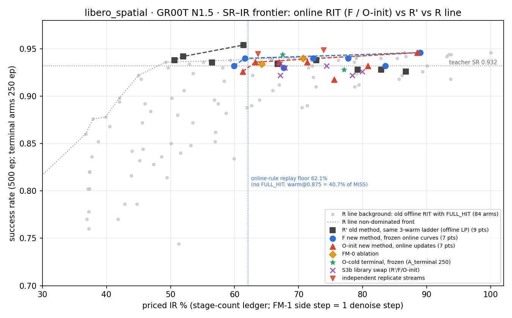

# online_rit — 结果报告（2026-09-15 12:30 CDT，含前沿补点）

> 计划：`logs/online_rit_groot_plan.log.md`（方法、门与判据在 §3/§4/§3.8；实跑期偏差与裁定在 §11 D19、§15）。
> 数值来源在括号中注明：**实测**（闭环 journal/per_step）、**回放**（M1 表上的 `ir_replay` / `replay_sim`）、**参考计价**（stage-count 台账，D19）。
> 原始产物：`exp/online_rit/data/<suite>/{offline,pools,runs}/`（gitignored）；臂 yaml 与矩阵：`exp/online_rit/config/libero_spatial/{smoke,formal}/`。
> 教师 GR00T N1.5、库 W13 S3、A 池 500 初态；LIBERO spatial 完整跑完，**libero_10 停在 M1（Q1 信号门 FAIL）**。

## 0. 一句话结论

- **libero_spatial**：d 是有信息的风险代理（Q1 三档 PASS）。闭环上，新方法（冻结 F、在线 O-init、空曲线 O-cold→终态冻结）与同阶梯旧方法 R′ 在两个共同工作点（IR 目标 70 / 80）上 **SR 均在 0.92–0.95、配对差在 ±2.2 pp 以内且 95% 区间几乎都跨 0**；执行违规率全部 ≤ α=5%。**F 本身已保守**（决策前尾率 3.5–3.9% < α），因此按 §3.8 判据**没有"在线适应改善该部署条件"的证据**：在线更新把风险推回名义水平（E ≈ 5.3–5.6%），IR 略降（目标 80 处 −2.3 pp），SR 无可分辨变化。空曲线启动 250 集后的终态冻结臂与 F 等价（IR 差 ≤ 0.7 pp，SR 差在区间内）。
- **libero_10**：Q1 门 FAIL（warm875/750 的分层 AUROC 0.549/0.557 < 0.65），按预注册规则不进 M2；负结果保留。
- 两条独立重复流（O-init@80、FM-0@70）之间的 SR 差达 −2.9 pp [−5.1, −0.6] 与 −1.2 pp，**臂间差异与流间重复差异同量级**。

## 1. M0 资产核验

| 项 | libero_spatial | libero_10 | 来源 |
|---|---|---|---|
| S3 库条目 / 7 快照完整 | 1,078 / ok | 2,598 / ok | `library_check.json` |
| 尺度（执行维 7，mask_D / mask_d_7/6/4 各 7 维有效） | `036df5f4…` | `69a09507…` | `update_scales.npz` meta |
| S3b 换库（排除 S3 后每任务 5 条，seed 1） | 1,067 条 / 50 轨迹，`2894817b…` | 生成 | `libraries_w13/<suite>/<suite>_w13_S3b_ort.pkl` |
| A_adapt / A_terminal（25+25 / 任务，seed 20260914，零交集） | manifest `6d1f85ad…` | `ae75697b…` | `pools/init_pools_manifest.json` |
| 真件门（h100 eager，64 条快照，batch1/2/3 × 串行 × capture） | PASS：d_noise/p10(d_signal) = 1.0% / 2.3% / 0.8% | PASS：1.4% / 1.1% / — | `offline/real_model_gate.json` |

真件门的判据在实跑期由"绝对 1e-3"改为"d 单位 ≤ 0.1 × p10 信号"（bf16 kernel 路径差 2⁻⁸ 绝对，与计划附带的 10% 地板规则同源），细节见 plan §15.1。

## 2. M1 离线信号检验（Q1，回放）

表：库外 450 集 calibration 查询 + 库内 50 集诊断行；整轨迹按 (task, success) 分层拆 fit/test（seed 20260914）。parity 门（200 行、每任务 20、四档 full/875/75/50）在采集机 4090 上 **parity_D 恒为 0**（两 suite 均 PASS）；在 h100 上同一重建 p90 = 0.013–0.017 > 0.1 × 地板，判为跨 GPU 数值差（plan §15.1）。

| suite | 行数（cal / 库内） | 档 | Spearman(d,D) | 偏相关 \| s | 分层 AUROC | d_self 地板 / 查询 d 中位 | 结论 |
|---|---|---|---|---|---|---|---|
| spatial | 10,760 / 1,078 | warm875 | 0.658 | 0.588 | 0.733 | 0 / 2.157 | PASS |
| | | warm750 | 0.584 | 0.524 | 0.738 | 0 / 1.188 | PASS |
| | | warm500 | 0.349 | 0.316 | 0.723 | 0 / 0.615 | PASS |
| libero_10 | 26,720 / 2,598 | warm875 | 0.417 | 0.320 | **0.549** | 0 / 1.826 | FAIL |
| | | warm750 | 0.389 | 0.297 | **0.557** | 0 / 1.001 | FAIL |
| | | warm500 | 0.332 | 0.256 | 0.686 | 0 / 0.547 | PASS |

- spatial 的分层 AUROC 在最低分数十分位（decile 0）只有 0.37–0.60（正例 15–35 个），其余分位 0.63–0.87；集级成功 AUROC（另报，不作门）max-d 0.87 / 0.92 / 0.92，mean-d 0.87 / 0.94 / 0.96（234 集，27 失败）。
- libero_10 每个十分位的 AUROC 都在 0.44–0.68，浅档尤其接近 0.5：d 与 D 有等级相关，但在 s 分层内对"超过该层 95% 分位"的判别力不足；分数域极窄（fit 半分位结点落在 0.995–0.999）。**不改阈值、不改标签、不调参重跑**；libero_10 的 replay / R′ 拟合只作诊断产物保留，`init` 被 `require_gates` 拒绝（符合设计）。

## 3. M1 估计器回放（spatial，回放）

fit 半 5,088 行按集序初始化窗口（window 128、n_min 20、α 0.05、结点 = fit 半 1/8…7/8 分位 ∪ {0,1}），冻结后评 test 半 5,672 行：

| 档 | finite-q 份额 | E（全部 finite） | E 分格（q0/q1/q2/q3 supported；q3 tail） | pinball | 单层 LP 参照 E |
|---|---|---|---|---|---|
| warm875 | 0.872 | 0.039 | 0.051 / 0.045 / 0.040 / 0.025；0.023 | 0.166 | 0.046 |
| warm750 | 0.872 | 0.039 | 0.049 / 0.047 / 0.033 / 0.031；0.032 | 0.118 | 0.046 |
| warm500 | 0.872 | 0.043 | 0.041 / 0.048 / 0.039 / 0.033；0.057 | 0.070 | 0.050 |

放行门（≥80% finite、E ≤ 0.10、每档 ≥200 finite 决策 / 20 集）PASS。支持类型：supported 4,260、tail_extrapolated 685、unavailable 727（低分区无结点）。真实 gate（θ=0.98463，j=3，p=3，L=6，include_ws）逐事件 walk：FM-0 学 3,711 批、FM-1 学 4,639 批（5,672 决策中 skip ≈ 1,050、无候选 0）；两种模式终态 warm875/750 的切点均无有限值（该 δ=2.16 下最深两档在 test 半不可达），warm500 切点 0.9868 / 0.9862。冷启动（10,760 决策）warm500 在 110 次更新后、warm750 在 197 次更新后首次出现有限切点，warm875 在整个 calibration 集内未出现。

## 4. 成本口径与 δ 寻址（参考计价 + 回放）

- **IR 口径（owner D19）**：沿用 R 线的阶段计数比 IR = Σ 决策计价 / (N_dec × MISS)，单价取认证过的 4090 CUDA-Graph 台账（s1 6.146、s2 7.192、单步 3.513 ms；MISS 41.44 ms；warm@t = s1+s2+剩余步×单步）。新方法唯一新增项——批量旁测——按 **1 个去噪步** 计价（batch 2/3 同价，launch-bound）；host/commit/快照开销不进 IR。不做新延迟基准。台账文件 `exp/online_rit/config/cost_groot_libero_stage_count.json`。
- **δ 阶梯（spatial，回放，真实 gate 逐集，513→4097 网格）**：

| 目标 IR | 在线 FM-1（δ，回放 IR） | R′（δ_D，回放 IR） | 共同 |
|---|---|---|---|
| 50 | 不可达（下限 62.1%） | 不可达（下限 52.6%） | |
| 60 | 不可达 | 0.7217，60.0 | |
| 70 | 3.5430，70.0 | 0.4437，69.3 | ✓ |
| 80 | 2.6144，79.99 | 0.2062，80.71 | ✓ |
| 90 | 1.6798，90.16 | 不可达（上限 88.1%） | |

共同工作点只有 {70, 80}，少于计划的 3 点：按 §3.5 本 suite 的前沿标为**诊断级**，三目标子实验退化为两点，未补造工作点。在线规则的 IR 下限 62.1% 来自 gate skip/锁定的 MISS 与旁测费。

## 5. M2 闭环（spatial，实测；计价按 §4）

图：`figures/sr_ir_libero_spatial.png`（点数据 `figures/sr_ir_libero_spatial.json`；灰点与灰点线为 R 线 84 臂历史与其非支配前沿，取自 `exp/rit_pareto/analysis/figures/groot_libero_spatial.json`）。前沿补点（run-tag `frontier`，2026-09-15 10:10–12:20 CDT，每臂 500 集）把三条线各自铺满可达区间：

| 线 | IR% / SR，按 IR 升序 |
|---|---|
| R′（9 点：目标 53/55/60/65/70/75/80/85/88） | 50.6 / 0.938 | 52.0 / 0.942 | 56.5 / 0.936 | 61.4 / 0.954 | 66.7 / 0.934 | 72.8 / 0.938 | 79.2 / 0.928 | 82.9 / 0.928 | 86.8 / 0.926 |
| F 冻结（7 点：63/65/70/75/80/85/90） | 59.9 / 0.932 | 61.6 / 0.940 | 67.7 / 0.930 | 72.3 / 0.940 | 77.8 / 0.940 | 83.6 / 0.932 | 89.0 / 0.946 |
| O-init 在线（7 点：同上；@80 用 r2 流） | 61.3 / 0.926 | 63.2 / 0.936 | 67.0 / 0.936 | 71.4 / 0.936 | 75.5 / 0.918 | 80.9 / 0.932 | 88.5 / 0.946 |

三条线在各自可达区间内 **SR 都是 0.926–0.954 的平线**，没有哪一条在同 IR 下系统性高于另一条（各点 500 集的 95% 区间约 ±2 pp）。区别只在可达区间：R′ 能到 IR 50.6%，新方法的两条线在 60% 附近止步（回放下限 62.1%，闭环实测最低 59.9% / 61.3%）——去掉 FULL_HIT 后最浅档 warm@0.875 已付 MISS 的 40.7%，加上 gate 跳过的 MISS 与旁测费，再放宽 δ 也降不下去；R′ 在同一阶梯上靠更激进的 warm500 派发把 IR 压到 51%。R 线历史前沿（含 FULL_HIT）在 IR 37–50% 段 SR 0.78–0.94，是新阶梯结构上到不了的区域。

拓扑：weilandserver 4090 单卡承载全部 server（在线臂每臂 1 进程，冻结/R′ 矩阵 2–4 进程分片，与别线并行占卡）；timan108 3×A5000 跑 LIBERO worker（每 driver 12–32 个）。在线臂 `--eval-concurrency 1 --max-episode-retries 0`；冻结臂默认重试。全部 22 个 run 的 journal 均 infra 错误 0、flow_invalid 0（除 §5.4 说明的一例续跑碰撞）。

### 5.1 主表（A 池 500 集；A_adapt / A_terminal 各 250）

主图用行：R′、F、O-init（@80 用 r2 流）、FM-0（@70 用 r2 流）、S3b 变体、O-cold、O-cold-frozen。`sp_formal_oinit_ir80`（488 集）、`sp_formal_oinit_fm0_ir70`（488 集）为不完整流（12 集因 worker 同时死亡未被服务），`sp_formal_f_s3b_ir70` 为续跑碰撞标 flow_invalid，三者只作诊断/重复流。

| 臂 | n_ep | SR | IR% 含 fb | IR% 不含 fb | warm875 / 750 / 500 / MISS | 执行违规 875 / 750 / 500 | 决策前尾率 E（executed，finite q） | warm 串≥6 份额 | 学习批次 |
|---|---|---|---|---|---|---|---|---|---|
| R′ @70 | 500 | 0.934 | 66.7 | 66.7 | 0 / 4386 / 4732 / 2413 | N/A | N/A | 0.73 | — |
| R′ @80 | 500 | 0.928 | 79.2 | 79.2 | 0 / 0 / 7055 / 4444 | N/A | N/A | 0.43 | — |
| F @70 | 500 | 0.930 | 67.7 | 60.7 | 0 / 8242 / 1039 / 2270 | — / 2.1% / 1.1% | 3.8% | 0.74 | 0 |
| F @80 | 500 | 0.940 | 77.8 | 70.6 | 0 / 1803 / 7181 / 2432 | — / 1.6% / 1.5% | 3.9% | 0.70 | 0 |
| O-init @70 | 500 | 0.936 | 67.0 | 59.9 | 2136 / 5358 / 1752 / 2189 | 3.8% / 1.9% / 0.5% | 5.2% | 0.74 | 9,526 |
| O-init @80 (r2) | 499 | 0.918 | 75.5 | 68.4 | 70 / 4667 / 3705 / 3186 | 4.3% (n=70) / 2.8% / 2.2% | 5.6% | 0.63 | 9,760 |
| O-init @80 (流 1，488 集，诊断) | 488 | 0.949 | 73.9 | 66.6 | 94 / 4687 / 3616 / 2590 | 5.3% (n=94) / 2.5% / 2.2% | 5.3% | 0.64 | 9,499 |
| FM-0 @70 (r2) | 500 | 0.934 | 64.2 | 64.2 | 0 / 7130 / 1447 / 2933 | — / 1.5% / 0.3% | 5.4% | 0.65 | 8,577 |
| FM-0 @70 (流 1，488 集，诊断) | 488 | 0.945 | 63.7 | 63.7 | 0 / 6916 / 1582 / 2659 | — / 1.3% / 0.3% | 5.3% | 0.66 | 8,539 |
| FM-0 @80 | 500 | 0.940 | 70.7 | 70.7 | 0 / 4080 / 3731 / 3596 | — / 2.2% / 1.5% | 5.5% | 0.55 | 7,811 |
| R′-S3b @70 | 500 | 0.934 | 67.1 | 67.1 | 0 / 4158 / 4893 / 2416 | N/A | N/A | 0.72 | — |
| R′-S3b @80 | 500 | 0.926 | 79.9 | 79.9 | 0 / 0 / 6808 / 4699 | N/A | N/A | 0.43 | — |
| F-S3b @70 (r2) | 500 | 0.930 | 67.9 | 60.9 | 0 / 8087 / 1096 / 2275 | — / 2.0% / 0.7% | 3.5% | 0.72 | 0 |
| F-S3b @80 | 500 | 0.922 | 78.4 | 71.3 | 0 / 1838 / 7009 / 2705 | — / 2.2% / 1.1% | 3.5% | 0.68 | 0 |
| O-init-S3b @70 | 500 | 0.922 | 67.1 | 60.2 | 2019 / 5740 / 1422 / 2365 | 3.6% / 2.2% / 0.6% | 5.4% | 0.72 | 9,504 |
| O-init-S3b @80 | 500 | 0.932 | 74.4 | 67.3 | 81 / 4491 / 4138 / 2709 | 4.9% (n=81) / 2.8% / 1.4% | 5.5% | 0.67 | 9,540 |
| O-cold @70（A_adapt） | 250 | 0.940 | 68.0 | 60.9 | 1141 / 2456 / 917 / 1207 | 3.5% / 2.2% / 0.5% | 5.0% | 0.75 | 4,799 |
| O-cold @80（A_adapt） | 250 | 0.924 | 76.3 | 69.2 | 19 / 2194 / 1955 / 1641 | 5.3% (n=19) / 2.6% / 2.3% | 5.7% | 0.61 | 4,900 |
| O-cold-frozen @70（A_terminal） | 250 | 0.944 | 67.5 | 60.4 | 0 / 3969 / 648 / 1039 | — / 1.9% / 1.1% | 4.3% | 0.74 | 0 |
| O-cold-frozen @80（A_terminal） | 250 | 0.928 | 77.1 | 70.0 | 0 / 1019 / 3541 / 1170 | — / 1.9% / 1.5% | 2.9% | 0.73 | 0 |

R′ 的 warm875 档在两个目标都被遮蔽删除（LP 嵌套下 warm875 阈值不小于 warm750），@80 只剩 warm500 一档；F/O 的 warm875 只在在线更新后才被派发（F 初始曲线里 warm875 的切点为 +∞）。所有臂 warm 连串最长 6（gate L 上限），无 FULL_HIT。

### 5.2 配对比较（任务分层整集 bootstrap 1,000 次，键 = 原池初态；ΔSR = 后者 − 前者；Δviol = 执行违规率差，所有档合并）

| 对比 | n 配对 | ΔSR（95%） | Δviol（95%） | 读法 |
|---|---|---|---|---|
| F → O-init @70 | 500 | +0.6 pp [−1.6, +2.8] | +0.07 pp [−0.23, +0.39] | 无差 |
| F → O-init @80 (r2) | 499 | −2.2 pp [−4.4, +0.0] | +1.02 pp [+0.72, +1.30] | O 风险回到名义、SR 略低（边界） |
| R′ → F @70 / @80 | 500 | −0.4 [−2.4, +1.6] / +1.2 [−1.0, +3.4] | N/A | 新旧方法冻结版等价 |
| R′ → O-init @70 / @80 | 500 / 499 | +0.2 [−2.0, +2.4] / −1.0 [−3.2, +1.2] | N/A | 无差 |
| O-init → FM-0 @70 (r2) / @80 | 500 / 499 | −0.2 [−2.2, +2.0] / +2.2 [−0.0, +4.6] | −0.80 [−1.09, −0.54] / −0.67 [−0.96, −0.40] | FM-0 更保守（违规低），SR 无稳定方向 |
| F-S3b → O-init-S3b @70 / @80 | 500 | −0.8 [−2.6, +1.2] / +1.0 [−1.2, +3.4] | +0.45 [+0.17, +0.75] / +0.78 [+0.51, +1.04] | 换库后同样：在线略增风险、SR 无差 |
| R′-S3b → F-S3b @70 / @80 | 500 | −0.4 [−2.4, +1.6] / −0.4 [−2.4, +1.6] | N/A | 等价 |
| F → O-cold-frozen @70 / @80（A_terminal） | 250 | +2.0 [+0.0, +4.0] / −0.8 [−3.2, +1.6] | −0.17 [−0.41, +0.07] / −0.03 [−0.28, +0.21] | 终态与 F 同风险；SR @70 边界偏高 |
| R′ → O-cold-frozen @70 / @80 | 250 | +0.0 [−2.0, +2.0] / +2.0 [−1.2, +5.2] | N/A | 无差 |
| O-init → O-cold-frozen @70 / @80 | 250 / 249 | +0.8 [−2.0, +3.2] / +0.8 [−2.4, +4.0] | −0.29 [−0.70, +0.11] / −0.91 [−1.27, −0.55] | 冻结终态比持续学习保守 |
| **独立重复** O-init@80 流 1 → r2 | 487 | **−2.9 pp [−5.1, −0.6]** | +0.12 [−0.14, +0.39] | 同配置两条流的 SR 差与臂间差同量级 |
| 独立重复 FM-0@70 流 1 → r2 | 488 | −1.2 pp [−3.3, +0.8] | +0.14 [−0.05, +0.33] | |

### 5.3 回放寻址 vs 闭环 IR

| 目标 | 在线回放 δ | F 闭环 | O-init 闭环 | R′ 回放 | R′ 闭环 |
|---|---|---|---|---|---|
| 70 | 70.0 | 67.7 | 67.0 | 69.3 | 66.7 |
| 80 | 79.99 | 77.8 | 75.5 (r2) / 73.9 | 80.71 | 79.2 |

闭环 IR 系统性低于回放目标 1–6 pp（闭环访问分布下 warm 更多、MISS 更少）；在线学习进一步把 @80 拉低 2–4 pp。IR 含反馈费与不含反馈费之差恒为 ≈7 pp（FM-1 每个付 backbone 的决策加 1 步）。

### 5.4 学习动态、异常与完整性

- O-init 500 集学习 9.4–9.8k 批；O-cold 250 集 4.8–4.9k 批。O-cold@70 的 warm875 档在冷启动后被派发 1,141 次（前 250 集），@80 只有 19 次（该 δ 下 warm875 几乎不可达）。终态冻结臂中 warm875 派发为 0（终态切点回到 +∞），说明在线学习期的 warm875 派发依赖持续更新维持的低分区结点。
- 服务端反馈日志与快照：每臂 `periodic`（每 200 批）+ `atexit` 快照；`on_task_end` 在 concurrent 服务路径的连接关闭时**不触发**（plan §15.2 已记），终态一律取 SIGINT 后的 atexit 快照，其 n_updates 与反馈日志学习批次数逐臂一致（4,799 / 4,900 / 8,539 / 8,577 / 9,499 / 9,526 / 9,504 / 9,540 / 9,760 / 7,811）；冻结臂 n_updates 恒 0（学习哈希不变）。
- 不完整流：2 条在线流各缺 12 集（driver 侧 12 个 worker 同时死亡，`retries=0` 下在途集不重派也不写 journal 行；per_step 与服务端均无这些集，学习流未受影响），按 §3.7 以新身份整流重跑（r2）；r2 的 O-init@80 仍缺 1 集（worker 端 MuJoCo XML 初始化异常，从未到达 server）。F-S3b@70 因分片扩容 resume 时的 decision-id 碰撞被标 flow_invalid，重跑 r2 干净。
- 全部臂 `success=false, error=None` 的合法失败结局 25–41 集/500，照常入统计。

## 6. 结论与负结果（按 plan §3.8 判据）

1. **Q1（信号）**：spatial PASS，libero_10 FAIL。d 作为代理信号在 spatial 上成立，在 libero_10 上分层判别力不足；两 suite 的 d_self 地板都是 0（4090 重建确定），parity 门全 0。
2. **Q2（在线更新）**：F 未见超标迹象（违规 1.1–2.2%，E 3.5–3.9% < α），因此**不满足**"在线适应改善该部署条件"的前提；O-init 相对 F：违规率 +0.07 / +1.02 pp（回到名义 α 附近），IR −0.7 / −2.3 pp，SR +0.6 / −2.2 pp（区间跨 0 或触 0）。失败判据（≥3 个可比点 SR 差 < −1 SE 且无收益）因只有 2 点不触发；@80 的 −2.2 pp 伴随 IR −2.3 pp 的预算收益。**结论：当前实现下在线更新既未改善也未明显损害 SR，把风险从保守推回名义，并小幅降低 IR；换库 S3b 轴同样。** R′（旧方法同阶梯）与 F 在两点上等价。
3. **Q3（空曲线启动）**：在已有离线尺度、结点、δ 下，O-cold 250 集适应后终态冻结臂与 F 在 A_terminal 上 SR / 违规 / IR 均无可分辨差异（ΔSR +2.0 [0, 4.0] / −0.8；IR 差 ≤ 0.7 pp）。不声称零离线或未见初态泛化。
4. **FM-0 消融**：只喂执行档的 FM-0 更保守（违规 −0.7 / −0.8 pp），不付旁测费但 MISS 更多，IR 与 FM-1 含费值接近（64.2 vs 67.0、70.7 vs 75.5）。
5. **独立重复**：O-init@80 两条独立流的 SR 差 −2.9 pp [−5.1, −0.6]，量级与所有臂间差相当；本报告中任何 ≤ 3 pp 的 SR 差都不应读作方法差异。
6. **完整前沿（补点后）**：R′ / F / O-init 在各自可达区间内 SR 均为 0.93–0.95 的平线，互不支配；新方法的可达 IR 下限约 60%，比 R′（51%）和含 FULL_HIT 的 R 线历史（37%）高，这是取消 FULL_HIT 的结构性代价，不是曲线估计问题。
7. **未做**：libero_10 闭环（M1 FAIL）；spatial 中位目标的第三组重复（本次只有 @80 与 FM-0@70 各一组额外流）；成本台账按 D19 不实测。

## 7. 复现入口

- 离线：`ops/run_table.sh`（parity → 表）→ `analysis/signal_check.py` → `fit_init_curves.py knots` → `replay_sim.py` → `fit_init_curves.py init/rprime` → `ir_replay.py`（online / `--rprime`）→ `emit_online_arms.py`；台账 `config/cost_groot_libero_stage_count.json`。
- 闭环：`ops/launch_server_online.sh`（每在线臂一进程）+ `ops/launch_clients.sh <matrix>`（cohort 绑池）；O-cold 结束后 SIGINT server → `pick_terminal_state.py` → terminal 矩阵；`aggregate_online.py --pair A,B`。
- 本次 live 编排脚本（job 临时目录 `ort_*.sh`，不入库）与运行细节见 plan §15。
