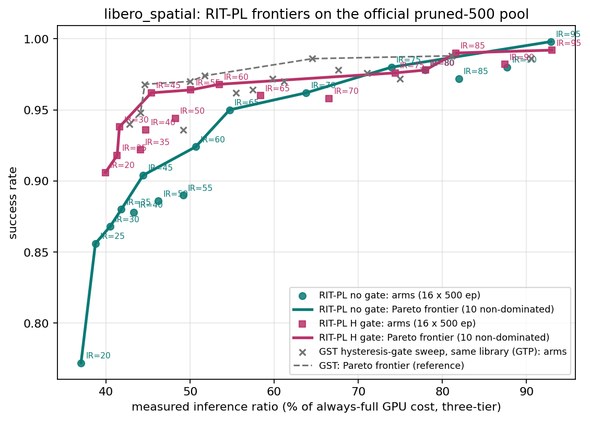
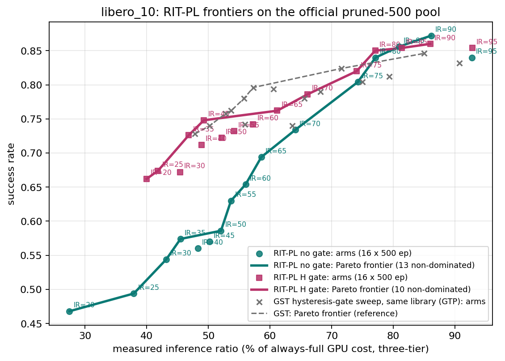

# RIT-Pareto — IR-addressed risk-indexed thresholds on the GTP libraries (2026-09-01)

> Status: **all four groups complete (2026-09-01 18:45 CDT)**, raw data pulled and sha-verified,
> integrity audit 0 anomalies on every group. Nothing here is committed; the owner rule (commit only
> on explicit instruction) is in force. Working tree: `exp/rit_pareto/` (new), additive flags in
> `exp/gate_threshold_pareto/run_gtp.py` and `exp/dispatch_surface/build_dispatch_table.py`,
> tests in `tests/rit_pareto/`.

## 1. Headline

Four Pareto frontiers of the RIT-PL rule (risk-indexed threshold, piecewise-linear risk curves,
inference-ratio addressing; `exp/dispatch_surface/rit_pl.py`) on the two GTP weighted-sum libraries,
evaluated on the official pruned-500 pool, 16 addressed IR targets (20 … 95, step 5) × 500 episodes
per arm, with and without the N4 hysteresis gate (θ solved on the shadow scores, j=3 / probe 3 / L=6).

libero_spatial (complete): the H-gate series lies on or slightly below the GST (GTP, same library)
frontier over the overlapping 40–60 % region and is indistinguishable from it above 70 %; the no-gate
series is 3–13 pt below at IR ≲ 55 % and converges above 65 %. Figure: `figures/pareto_rit_libero_spatial.png`.

libero_10 (complete): the H-gate series dominates the no-gate series by +8 … +20 pt over the whole
27–66 % region and coincides with it above 74 %; against the GST reference it is on par to −5 pt
over 47–62 % (the GST frontier's fh50/fh45 points sit above the H-gate arms) and ahead at 74–86 %
(+2 … +4 pt). The measured ceiling is ≈ 0.86–0.87 (no-gate IR90 0.872, H-gate IR90 0.860) at 86 %
of the always-full cost, level with the pure-teacher libero_10 reference 0.868. Figure:
`figures/pareto_rit_libero_10.png`.

## 2. Design

| item | value |
|---|---|
| library (per suite) | GTP weighted-sum pkl, byte-identical: `exp/common/data/cache_artifacts/<suite>/cp1_spatial_pool_16.pkl` (spatial 49 traj / 1018 entries, sha `36cd0f3b…` on weilandserver; l10 50 traj / 2640 entries, sha `f13517ad…`) |
| retrieval config | GTP server templates `exp/gate_research/config/<suite>/n4_server/*.yaml` (spatial weights v0 .0625 / v1 .5 / rs .4375; l10 .5625 / .25 / .1875; `weighted_score_sum_knn`, top_k 1) |
| shadow cohort | per task 15 official pruned inits sampled with seed 20260901 (5 fit + 10 cal labels, RIT-PL fits on all rows) → 150 pure-teacher rollouts per suite (`serve_policy --collect --non-concurrent`, sharded 5×/4× on weilandserver); owner waived the contamination concern (calibrate and evaluate on the same pool) |
| reference for Y | **tau1**: winner's stored `intermediates[0.9]` completed under the query observation (`build_dispatch_table --ref-mode tau1`); library untouched, no initial noise needed |
| shadow tables | spatial 3193 rows / 150 ep (s ∈ [0.836, 0.989], Spearman y10~s −0.10, y7~s −0.16); l10 9008 rows / 150 ep (s ∈ [0.660, 0.999], y10~s −0.21, y7~s −0.36) |
| RIT-PL fit | `KNOT_LADDER (24,12,6)` → 24 segments both suites, `EPS_TOTAL 0.02`, α 0.05, h_exec 5; all 16 targets attained with \|gap\| ≤ 0.04 pt; targets ≥ 75 have θ_full = +∞ (WARM/MISS-only rule) on both suites |
| gate θ (H-gate layer) | top-15 % of shadow scores (`solve_gtp` convention): spatial 0.977352, l10 0.992212; j=3, probe_interval=3, L=6 |
| eval | official pruned-500 pool (`apool_<suite>.yaml` rollups `0eeece46…` / `52457a37…`), 50 trials/task, seed 7, replan 5, `run_gtp --judge-type dispatch_surface --eval-gate {always_search,score_hysteresis}` |
| IR (x axis) | three-tier analytic cost per decision (`analytic_cost.unit_cost`: FULL 10.26 / WARM 46.82 / MISS 67.52 ms) / (decisions × MISS); the GTP two-tier `inference_ratio` is its special case, so the GST reference is on the same axis |
| server | weilandserver RTX 4090, `serve_policy --replicas 4 --replica-spawn-batch 2 --port 23150`, bundles hot-swapped per arm |
| client fleet | 48 workers (see §3 for the host chain) |

## 3. Topology chain and deviations (record)

1. 01:54 group 1 launched on timan107 (48 workers, 8×1080). GPUs 5/7 were full of another user's
   jobs → 7 `mujoco.FatalError` (offscreen framebuffer) episodes recorded as *accepted failures*
   → run discarded (`libero_spatial_ng.bad_gpu57`), relaunched on GPUs {0,1,2,3,4,6} (new
   `run_gtp --gpu-ids`).
2. ~02:50 timan107 went OFFLINE (no route from timan108 either) at 4096/8000; its journal is
   unreachable. Group 1 restarted from scratch.
3. 03:19 weilandserver-hosted fleet: 48 workers do not fit next to the 4-replica server on one 4090
   (each EGL worker ≈ 0.65 GB) → 20 workers for 870 episodes (`--workers 20`, rendering on the
   4090). This is the only interval where the fleet size deviated from the owner's 48.
4. 03:37 fleet moved to a freshly built **timan108** (3×A5000; LIBERO conda prefix relocated from
   weilandserver, EGL 535 vendor, conda shim, dispatch code + A-pools + arms synced by sha) —
   same journal resumed (episode-level), 48 workers from then on for every group.

Per-episode results do not depend on the client host except through rendering hardware
(4090 for 870 episodes of group 1, A5000 otherwise); we do not correct for this.

## 4. Results — libero_spatial

Measured IR is the closed-loop three-tier cost; "addressed" is the shadow-table target. The gap at
low targets (addressed 20 → measured 37) is the visitation-drift bias the owner ruled to report, not
correct: a rule that caches aggressively drives the policy into lower-score states than the
pure-teacher shadow visited.

| addressed IR | measured IR % (no gate) | SR (no gate) | FULL/WARM/MISS | measured IR % (H gate) | SR (H gate) | FULL/WARM/MISS |
|---|---|---|---|---|---|---|
| 20 | 37.0 | 0.772 | .73/.03/.24 | 39.9 | 0.906 | .70/.01/.28 |
| 25 | 38.7 | 0.856 | .70/.07/.23 | 41.3 | 0.918 | .68/.04/.29 |
| 30 | 40.5 | 0.868 | .66/.11/.23 | 41.6 | 0.938 | .66/.07/.27 |
| 35 | 41.8 | 0.880 | .63/.15/.22 | 44.1 | 0.922 | .62/.12/.27 |
| 40 | 43.3 | 0.878 | .60/.19/.21 | 44.7 | 0.936 | .59/.16/.25 |
| 45 | 44.4 | 0.904 | .57/.23/.20 | 45.4 | 0.962 | .57/.21/.22 |
| 50 | 46.2 | 0.886 | .54/.27/.19 | 48.2 | 0.944 | .51/.27/.22 |
| 55 | 49.2 | 0.890 | .48/.32/.19 | 50.1 | 0.964 | .47/.33/.20 |
| 60 | 50.7 | 0.924 | .44/.39/.17 | 53.5 | 0.968 | .40/.41/.19 |
| 65 | 54.7 | 0.950 | .35/.51/.14 | 58.4 | 0.960 | .30/.53/.17 |
| 70 | 63.8 | 0.962 | .18/.70/.13 | 66.5 | 0.958 | .14/.70/.16 |
| 75 | 73.9 | 0.980 | .00/.85/.15 | 74.4 | 0.976 | .00/.84/.16 |
| 80 | 77.9 | 0.978 | .00/.72/.28 | 78.0 | 0.978 | .00/.72/.28 |
| 85 | 81.9 | 0.972 | .00/.59/.41 | 81.6 | 0.990 | .00/.60/.40 |
| 90 | 87.7 | 0.980 | .00/.40/.60 | 87.4 | 0.982 | .00/.41/.59 |
| 95 | 92.9 | 0.998 | .00/.23/.77 | 93.0 | 0.992 | .00/.23/.77 |

500 episodes per arm → Wilson 95 % half-width ≈ ±2.6 pt at SR 0.9, ±1.4 pt at SR 0.98.

Reading: (i) below IR ≈ 55 % the H gate adds +5 … +13 pt at equal measured cost (the gate skips
the search on locked-in FULL runs, so the same rule spends its MISS budget on the steps that need
it); (ii) above ≈ 70 % both layers coincide within CI; (iii) against the GST reference (same
library, hysteresis gate, binary verdict, GTP run) the H-gate RIT-PL frontier is on par to −2 pt over
40–60 % and identical above 70 % — no dominance claim either way inside the CI.

## 5. Results — libero_10

| addressed IR | measured IR % (no gate) | SR (no gate) | FULL/WARM/MISS | measured IR % (H gate) | SR (H gate) | FULL/WARM/MISS |
|---|---|---|---|---|---|---|
| 20 | 27.4 | 0.468 | .86/.00/.14 | 40.0 | 0.662 | .71/.00/.29 |
| 25 | 37.9 | 0.494 | .69/.11/.20 | 41.8 | 0.674 | .68/.02/.30 |
| 30 | 43.2 | 0.544 | .59/.22/.19 | 45.4 | 0.672 | .60/.12/.28 |
| 35 | 45.5 | 0.574 | .54/.29/.17 | 46.8 | 0.726 | .56/.18/.26 |
| 40 | 48.3 | 0.560 | .49/.34/.17 | 48.9 | 0.712 | .52/.22/.25 |
| 45 | 50.2 | 0.570 | .45/.38/.17 | 49.3 | 0.748 | .50/.27/.23 |
| 50 | 52.1 | 0.586 | .42/.40/.18 | 52.1 | 0.722 | .45/.32/.23 |
| 55 | 53.7 | 0.630 | .38/.45/.17 | 54.2 | 0.732 | .40/.38/.22 |
| 60 | 56.1 | 0.654 | .34/.49/.17 | 57.3 | 0.742 | .34/.44/.21 |
| 65 | 58.6 | 0.694 | .28/.57/.15 | 61.2 | 0.762 | .26/.54/.20 |
| 70 | 64.1 | 0.734 | .17/.69/.14 | 66.1 | 0.786 | .15/.70/.15 |
| 75 | 74.3 | 0.804 | .00/.84/.16 | 74.1 | 0.820 | .00/.85/.15 |
| 80 | 77.1 | 0.840 | .00/.75/.25 | 77.1 | 0.850 | .00/.75/.25 |
| 85 | 81.0 | 0.856 | .00/.62/.38 | 81.4 | 0.854 | .00/.61/.39 |
| 90 | 86.2 | 0.872 | .00/.45/.55 | 86.0 | 0.860 | .00/.46/.54 |
| 95 | 92.8 | 0.840 | .00/.24/.76 | 92.9 | 0.854 | .00/.23/.77 |

500 episodes per arm → Wilson 95 % half-width ≈ ±4.4 pt at SR 0.5, ±3.6 pt at SR 0.75, ±3.0 pt at SR 0.86.

Reading: (i) the no-gate IR20 arm (θ_full = θ_warm, FULL/MISS only) lands at 27 % cost — the only
arm on either suite whose measured IR is *below* its addressed value — because the l10 shadow score
distribution is bimodal and the low cut admits 86 % of decisions as FULL; its 0.468 SR is the price.
(ii) The H gate is worth far more on l10 than on spatial: +20 pt at 40–45 % cost, +8 … +12 pt at
50–66 %, converging only at IR ≥ 75 where both rules are WARM/MISS-only. (iii) Against the GST
reference (same library, binary FULL/MISS verdict + hysteresis gate) the H-gate RIT-PL frontier is
below by 2–5 pt in the 50–62 % window (GST fh55/fh50 at 0.780/0.796 vs RIT-PL IR55/IR60/IR65 at
0.732/0.742/0.762) and above by 2–4 pt at 74–86 % (RIT-PL IR75/IR80 0.820/0.850 vs GST fh20/fh15
0.804/0.812); the CI half-widths overlap in both windows, so neither direction is a dominance claim.
(iv) IR95 sits below IR90 on both layers (0.840/0.854 vs 0.872/0.860) — within CI, and consistent
with the pure-teacher reference 0.868 being the ceiling.

## 6. Discussion / what this does not show

- Addressing is offline and outcome-blind; the measured IR of low targets lands 10–20 pt above
  the addressed value on spatial and on l10 with the gate (visitation drift), and 7 pt *below* on
  the l10 no-gate IR20 arm (bimodal score mass admitted as FULL). We report both axes and do not
  recalibrate.
- The three-tier RIT-PL rule and the two-tier GST rule spend cost differently (WARM at 46.8 ms vs
  MISS at 67.5 ms); the IR axis prices both with the same cost authority, but the GST reference was
  run in a different session (2026-08-20, timan107 fleet, 64→48 workers) and is a reference, not a
  same-batch control.
- The gate changes the decision distribution, so H-gate arms are not "the same rule plus a gate" in
  cost space; the comparison is frontier-to-frontier at measured cost.
- θ_full = +∞ for targets ≥ 75 on both suites: at those tolerances the fitted FULL-risk curve never
  drops below δ, so the rule is WARM/MISS-only — a property of the tau1-referenced risk on these
  libraries, not a bug.
- ε-floor segments (`floor_info`) are budget-addressed; no risk difference is claimed inside them.
- One shadow draw (seed 20260901), one eval seed (7); no seed replication.
- Failover record (§3): 870 group-1 episodes rendered on a 4090 instead of A5000; not corrected.
- Group 3 lost 48 in-flight episodes to the 11:30 server OOM (another session's Go tests on
  weilandserver); they were removed from journal + per_step before resume and re-run, so every arm
  has exactly 500 accepted episodes. Backup `journal.jsonl.pre_srvdown` and the uid list are kept on
  timan108.
- Reference-mode control (`uncoupled` tables) was dropped when the GPU became the bottleneck; only
  `tau1` was calibrated. The cross-mode sensitivity of the frontier is untested.

## 7. Artifact layout

- weilandserver `/tmp/dsp_shared/rit_pareto/<suite>/`: `shadow_manifest.json`, `shadow_pool/`,
  `cohort_plan.json`, `cohort_manifest.json`, `h5/shard*/` (150 H5), `calibration_retrieval.yaml`,
  `table_tau1.jsonl` (+ `.weights.npz`), `export_tau1/{fit_record.json, export_record.json,
  surface_rit_ir*.npz}`, `arms/{ng,hg}/*.yaml`, `arms/arm_matrix_{ng,hg}.yaml`, `arms/emit_record.json`.
- timan108 `/tmp/dsp_precheck/rit_pareto/<suite>_<layer>/{journal.jsonl, per_step.jsonl,
  per_step.jsonl.launch.json}`; local sha-verified copies under `exp/rit_pareto/data/runs/<suite>_<layer>/`
  (+ `aggregate.json`), figures under `exp/rit_pareto/analysis/figures/`.
- Note: the `git_commit` field inside the remote export records is the dispatch clone's stale HEAD
  (`cdb128dd`), not the code that ran (`ca15b5e` + this working tree); the sha fields are authoritative.

## 8. In-experiment code (working tree, uncommitted)

`exp/rit_pareto/{shadow_cohort,export_rit,emit_arms,aggregate_rit}.py`, `exp/rit_pareto/config/task_order_*.json`;
additive: `run_gtp.py --judge-type/--eval-gate/--gpu-ids`, `build_dispatch_table.py --noise-sidecar` optional
(needed only for `fresh`); `tests/rit_pareto/test_rit_pareto.py` (13 tests); ops scripts used on the three hosts are copied under
`exp/rit_pareto/ops/`.

---

# Part II — K=3 ladder (FULL / WARM@0.3 / WARM@0.5), no gate: RIT vs GST (2026-09-01/02)

> Status: **in progress** — shadow tables rebuilt with the 0.5 tier (spatial done 19:40, l10
> running), arms exported; groups run in the order spatial-RIT → spatial-GST → l10-RIT →
> l10-GST. Owner rulings: tau1 reference; 4 replicas / 48 workers; GST grid step 20 (34 cells).

## 9. Design

| item | value |
|---|---|
| ladder | FULL_HIT (cached chunk) → WARM_START@0.3 (3 stage-3 steps) → WARM_START@0.5 (5 steps) → MISS; verdict = cheapest admissible tier (`ThresholdJudge`: `threshold` then `warm_tiers` in listed order) |
| unit costs (ms) | FULL 10.260 / W0.3 46.818 / W0.5 52.733 / MISS 67.519 — stage constants from `analytic_cost`, warm = S1 + S2 + start_t·S3 (`rit_k.tier_cost`, pinned equal to `unit_cost` at 0.3) |
| shadow table | same 150-episode tau1 cohorts as Part I, rebuilt with `build_dispatch_table --extra-warm-tiers 0.5` (adds `y_tau5`); guard: s / y7 / y10 bit-identical to the K=2 tables, y5 finite. spatial: y5 med 3.15 < y7 3.71 < y10 5.83, 92 % rows y5 ≤ y7 |
| **RIT-K3** | `rit_k.fit_pl_quantile_k`: joint 3-layer pinball LP (same knots / ε floor 0.02 / α 0.05 as Part I; nesting q_w05 ≤ q_w03 ≤ q_full; K=2 reproduces `rit_pl` bit-for-bit), one δ → three cuts, IR inverse on the shadow rows with the 4-cost model; 16 targets 20 … 95. A tier whose cut is +∞ or coincides with a riskier tier's cut is shadowed and left out of the yaml |
| **GST-K3** | percent triples (fh, w3, w5) on the step-20 simplex, fh + w3 + w5 ≤ 80, (0,0,0) excluded → **34 cells**; cuts = descending score quantiles of the same table's `s` at the cumulative shares (`derive_thresholds` convention); cells whose deployable cuts coincide with an earlier cell are skipped (spatial: 0 skipped) |
| deployment | identical for both rules: GTP template + `judge: threshold` (`threshold` = FULL cut or 2.0 when FULL is absent) + `warm_tiers [{θ_w03, 0.3}, {θ_w05, 0.5}]`, `gate: always_search`, same ws pkl; `run_gtp --judge-type threshold --eval-gate always_search --warm-tiers 0.3,0.5` |
| eval | pruned-500 pool, 50 trials/task, seed 7, replan 5; weilandserver 4 replicas, timan108 48 workers |
| IR (x axis) | `aggregate_rit` prices every decision with the ladder-general cost (`WARM_START@0.5` counted separately) |

spatial export (tau1 K3 table, 3193 rows): RIT attainable IR [15.2, 100]; all 16 targets hit with
|gap| ≤ 0.04 pt; targets 20–55 keep all three tiers with θ_w05 at the shadow minimum score (the
safest tier is admissible everywhere at those δ), 60–70 have three finite nested cuts, 75–90 are
WARM-only, 95 is WARM@0.5-only. GST: 34/34 cells deployable.

## 10. Results — libero_spatial (K=3)

TBD.

## 11. Results — libero_10 (K=3)

TBD.

## 12. Discussion (K=3)

TBD.
