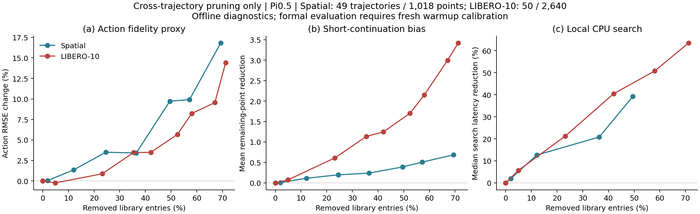

# Spatial / LIBERO-10：跨轨迹短剩余优先剪枝

日期：2026-09-11。**比较对象必须来自同一 task、不同 trajectory**。报告、图表、脚本与结果表仅保留这一规则；原库未改。

正式流程固定为 **prune → 重跑 warmup 标定 → eval**。本次是原库上的先期分析，不以旧 RIT 阈值直接套新库的结果判断可行性。

## 结论

两套库都有冗余可剪。LIBERO-10 在相近的动作偏差增幅下，剪点比例及向短剩余轨迹偏移的幅度更大，值得优先进入重标定后的闭环验证。当前证据涉及候选压缩、CPU 检索与动作保真代理，尚未证明 SR 或真实任务完成时间改善。

## 正式检索口径

直接调用 `WeightedScoreSumKnnStrategy → CacheStorage → InMemoryBackend`。两路视觉 cosine、robot_state L2，沿用各 suite 原 zscore–tanh 标定及融合权重；prompt/vision_2 禁用，task_scoped=True、depth=1、step_filter=all。只在枚举候选时扩大 top_k，正式计时用 top_k=1。

| Suite | 成功轨迹数 / 点数 | vision_0 / vision_1 / state 权重 | 自查询分数 | 跨轨迹最近邻分数中位 |
|---|---:|---|---:|---:|
| Spatial | 49 / 1,018 | 0.0625 / 0.5 / 0.4375 | 0.988947 | 0.983468 |
| LIBERO-10 | 50 / 2,640 | 0.5625 / 0.25 / 0.1875 | 0.998872 | 0.997893 |

**阈值是各自正式融合分数，不是 cosine，也不是跨 suite 通用距离。** L10 的权重与标定使分数更靠近 1，不能直接套 Spatial 的 0.98。

## Spatial

| 融合分数阈值 | 保留点 | 删点比例 | 剩余长度减少¹ | 动作 RMSE 变化² | 检索中位 ms³ |
|---|---:|---:|---:|---:|---:|
| 原库 | 1,018 | 0% | 0 | 0% | 1.053 |
| 0.987 | 998 | 2.0% | 0.007 | +0.06% | 1.033 |
| 0.985 | 895 | 12.1% | 0.113 | +1.35% | 0.920 |
| 0.9825 | 768 | 24.6% | 0.197 | +3.50% | 未测 |
| 0.98 | 647 | 36.4% | 0.239 | +3.42% | 0.834 |
| 0.975 | 514 | 49.5% | 0.389 | +9.72% | 0.640 |

## LIBERO-10

| 融合分数阈值 | 保留点 | 删点比例 | 剩余长度减少¹ | 动作 RMSE 变化² | 检索中位 ms³ |
|---|---:|---:|---:|---:|---:|
| 原库 | 2,640 | 0% | 0 | 0% | 2.234 |
| 0.9985 | 2,510 | 4.9% | 0.075 | -0.24% | 2.108 |
| 0.998 | 2,028 | 23.2% | 0.611 | +0.88% | 1.760 |
| 0.9975 | 1,705 | 35.4% | 1.135 | +3.47% | 未测 |
| 0.997 | 1,529 | 42.1% | 1.247 | +3.49% | 1.330 |
| 0.996 | 1,255 | 52.5% | 1.704 | +5.67% | 未测 |
| 0.995 | 1,108 | 58.0% | 2.153 | +8.23% | 1.100 |
| 0.99 | 759 | 71.2% | 3.422 | +14.42% | 0.815 |
| 0.98 | 612 | 76.8% | 3.784 | +20.79% | 0.693 |

¹ 整条轨迹留出：先排除查询所在整条轨迹，再对剩余库剪枝。剩余长度是选中点在原始轨迹上的后继点数，不是剪后点数，也不是实测 rollout 时长。每个决策一般执行 5 个控制步，末个决策可能提前结束，故不直接换算完成时长。

² 相对留出轨迹原 teacher 动作的 RMSE；取 chunk 前 5 步、前 7 个有效维度，归一化空间。**偏差增加不等于成功率下降**，不同动作也可能更高效。查询来自既有成功轨迹，而不是新的独立闭环 rollout。

³ 同机 CPU、4 线程、100 个查询 × 7 轮、warm cache、每轮随机方案顺序；中位耗时仅含正式 SearchStrategy，不含 key 构造、GPU、网络与仿真。细小计时差异不应过度解读；删点比例不等于 pkl 字节压缩率或端到端提速。

## 代表点的不确定性与控制

- **Spatial / 0.98**：原平均剩余 10.193 点；减少 0.239 点（95% 区间 0.159–0.319），约 2.3%；RMSE 变化 +3.42%（+1.42%–+5.67%）。各留出折同数量随机删除、20 个种子的平均 RMSE 变化为 +7.13%。
- **LIBERO-10 / 0.998**：原平均剩余 27.220 点；减少 0.611 点（95% 区间 0.354–0.939），约 2.2%；RMSE 变化 +0.88%（-0.38%–+2.31%）。各留出折同数量随机删除、20 个种子的平均 RMSE 变化为 +2.85%。
- **LIBERO-10 / 0.997**：原平均剩余 27.220 点；减少 1.247 点（95% 区间 0.669–1.991），约 4.6%；RMSE 变化 +3.49%（+1.01%–+6.35%）。各留出折同数量随机删除、20 个种子的平均 RMSE 变化为 +6.68%。

区间按整条查询轨迹 bootstrap 4,000 次，是探索性描述；未校正多阈值选择，不是正式显著性结论。

## 剪枝定义

1. 只在同任务、不同轨迹的点之间比较，取正式融合分数 ≥ 阈值为近邻。
2. 剩余长度 = 原完整轨迹中该点之后的点数，终点为 0。
3. 从短剩余到长剩余处理；只有已保留的、直接相近且严格更短的跨轨迹点能使当前点删除。长度相等不删，不把已删点当覆盖证据。
4. 单点独立删除，不递归删除其后续轨迹；剪枝过程不重算原始剩余长度。所有原终点保留。
5. 留出诊断每折先排除整个查询 trajectory，再执行上述剪枝，避免查询自己决定保留集。

## 标定与闭环验证

剪后每份库重新 warmup 标定并 eval，使用同一评测初始状态池。比较 SR、各档比例、端到端时延、成功 episode 控制步数；完成长度同时报告共同成功初始状态的配对差，防止失败掉的长轨迹造成幸存者偏差。应按相同实测计算预算或相同 SR 损失比较，不能以旧阈值直接套新库。

当前相似度使用剪枝前正式标定，这定义了“哪些点足够近”。重标定后的命中率和全程速度本次未测。原 RIT per_step 日志的 winner 覆盖仅记录哪些既有决策会受影响，不当作反事实 SR。

`.pkl` 中的 `prev_ids/next_ids` 和快照要保持可解释：可先屏蔽检索候选，同时保留链与原长度；不能递归删除后续、也不能把删点后的链直接拼成新示范。当前只生成保留 ID 清单，没有生成上线 pkl。

## 数据身份与校验

### Spatial

- 本地库 `exp/common/data/cache_artifacts/libero_spatial/cp1_spatial_pool_16.pkl`，SHA256 `09cacb814017a40c3b612da45830db07e52b291b3ae37f8b017732a9f475d2e1`。
- 正式配置 `exp/rit_pareto/data/k3_rith/libero_spatial/k3/rith/k3_sp_rith_ir60.yaml`。
- RIT export 指向服务器同名库，SHA256 `36cd0f3b043fd7215aaee9dd053693325f4813127485580fa23aeb5663a88ffe`；本地/服务器内容一致性来自数据台账，本轮未连接服务器重新取证。
- 原轨迹长度：最短 14、中位 21、最长 27 点。
- 本地源 HDF5 50 个；库内对应 49 个，success=True 为 49 个；未入库 1 个。
  - `episode_0040_20260410_013533_614218.h5`：success=False，44 个决策点。
- 所有删除配对跨轨迹、同任务、原长度严格缩短、直接代表点仍保留；原链完整性通过。
- 60 次剪后真实 SearchStrategy 调用，winner 一致率 100%，最大分数误差 0。
- 原 pkl 前后 SHA 一致。结果明细见 [libero_spatial/summary.json](libero_spatial/summary.json)。

### LIBERO-10

- 本地库 `exp/common/data/cache_artifacts/libero_10/cp1_spatial_pool_16.pkl`，SHA256 `de51731df08e93af2f34adb85c919b45ed53b244e92b3f15e1332b8655410593`。
- 正式配置 `exp/rit_pareto/data/k3_rith/libero_10/k3/rith/k3_l10_rith_ir60.yaml`。
- RIT export 指向服务器同名库，SHA256 `f13517ad907817a0739d5702b2d3244f85be8659e5a7f3eebfbc4424eb848ce8`；本地/服务器内容一致性来自数据台账，本轮未连接服务器重新取证。
- 原轨迹长度：最短 31、中位 50、最长 101 点。
- 本地源 HDF5 50 个；库内对应 50 个，success=True 为 50 个；未入库 0 个。
- 所有删除配对跨轨迹、同任务、原长度严格缩短、直接代表点仍保留；原链完整性通过。
- 120 次剪后真实 SearchStrategy 调用，winner 一致率 100%，最大分数误差 9.4e-06。
- 原 pkl 前后 SHA 一致。结果明细见 [libero_10/summary.json](libero_10/summary.json)。

## 复现与产物

```bash
OMP_NUM_THREADS=4 OPENBLAS_NUM_THREADS=4 .venv/bin/python -m exp.rit_pareto.analysis.prune_feasibility --suite libero_spatial
OMP_NUM_THREADS=4 OPENBLAS_NUM_THREADS=4 .venv/bin/python -m exp.rit_pareto.analysis.prune_feasibility --suite libero_10
MPLCONFIGDIR=/tmp/openpi-prune-mpl .venv/bin/python -m exp.rit_pareto.analysis.render_prune_feasibility
```

每个 suite 子目录含配置/哈希、配对分数、跨轨迹删除证据、保留 ID、逐查询留出预测、每任务保留量、原正式 winner 暴露、逐次计时与策略一致性校验。根目录 `comparison.json` 汇总两套库，旧的同轨迹比较结果已删除。


