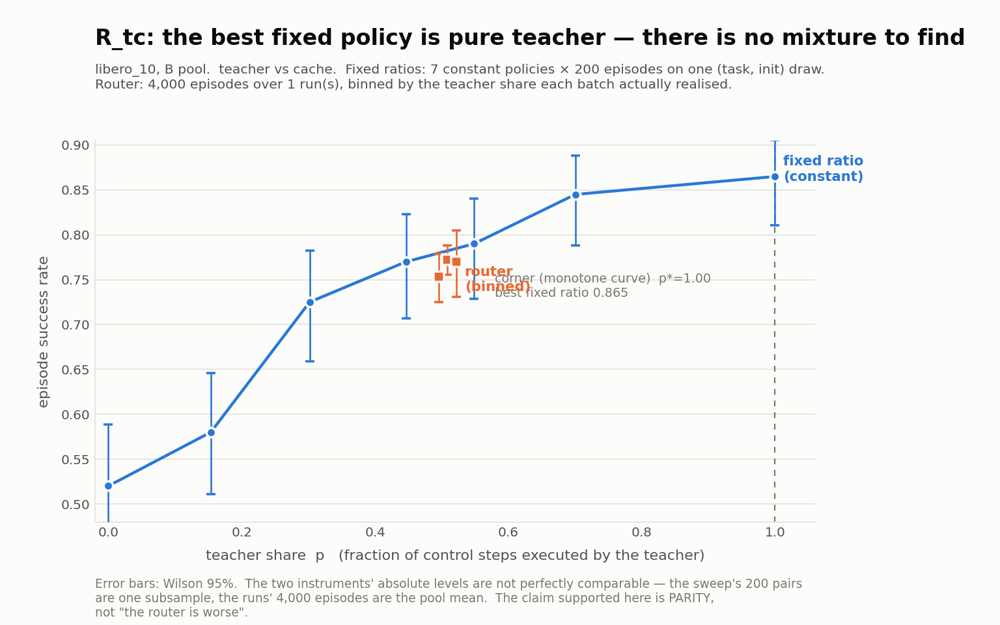

# X14 在线 RL Router — teacher/cache 臂集（R_tc）结果

**一句话结论**：在冻结的 λ=0.5 下，这个臂集的**最优解是一个角点——「永远用 teacher」**。也就是说，问题在构造上就没有给 router 留任何位置：最优策略是一个常数。而在线 RL **走的方向是对的**（cache 份额 0.507→0.476，朝 teacher = 朝最优，z=−6.17），只是 40 个梯度步只走完了所需距离的 **6%**。

这与 R_ts 的负结果**同结论、不同原因**：ts 是**没有梯度可学**（SR 在工作区间是平的）；tc 是**梯度又大又真（全域 0.345）但指向角点**。

> ⚠ 本篇最可操作的发现：要把 R_tc 变成一个对 router 公平的问题，**该改的是 λ（≈3），不是步数**。

---

## 1. 设置

| 项 | 值 |
|---|---|
| 套件 / 池 | libero_10，**B 池**（A 池留给 M7） |
| 臂集 | `tc` = teacher（Pi0.5）/ cache（FULL_HIT 直接回放 clean action） |
| 成本（M5a 冻结） | teacher **1.0** / cache **7.2165e-05**（≈ 免费） |
| λ | **0.5**（λ₁，由 M5c pilot 在 **ts** 臂集上标定） |
| 超参 | lr 3e-4、β 0.01、clip 1.0、batch 100 ep、40 批 = 4000 ep |
| warm-start | **均匀常数**（`graft` 对无 student 臂的臂集给零输出层，§3.8 预注册）⇒ 起点恰为 50/50 |
| 拓扑 | 只需 pi05 server（**无 ACT sidecar**：`r_tc_train.yaml` 无 `hit_to`） |

---

## 2. 主跑结果

40 批跑满，`verify_m6.py … 40` 判 **ADMISSIBLE**。中途 2026-08-17 22:2x 为腾显卡停机、08-18 03:03 从 b0015 续跑，批级 resume 零 episode 损失。

| 量 | 值 | R_ts 对照 |
|---|---|---|
| success 均值（4000 ep） | **0.7670** [0.67, 0.89] | ~0.90 |
| cache 份额 起→止 | 0.507 → 0.476（净 **−0.030**） | student 净 −0.045 ~ −0.134 |
| 成本 | **50.7%** of all-teacher | 30–36% |
| reward Q1→Q4 | 0.7260 → 0.7398（Δ +0.0137，**z=+0.76**） | 同样不显著 |
| success Q1→Q4 | 0.7570 → 0.7710（Δ +0.0140，**z=+0.79**） | 同样不显著 |
| **cache 份额 Q1→Q4** | 0.5010 → 0.4881（**z=−3.25**；逐批斜率 z=**−6.17**） | — |

**策略动得非常显著，目标函数不动。** 每批 success 实测 sd 0.0394 对上二项预期 0.0423 ⇒ 纯二项噪声。

---

## 3. 固定比例基线：单调升到 p=1.0

`sweep_mixture.py --cheap-arm cache`，7 点各 200 ep，**每点用同一组 200 对 (task, init)**（跨 p 配对）。

| p_realized | SR | 95% CI (Wilson) |
|---|---|---|
| 0.000（纯 cache） | 0.5200 | [0.451, 0.588] |
| 0.154 | 0.5800 | [0.511, 0.646] |
| 0.302 | 0.7250 | [0.659, 0.782] |
| 0.447 | 0.7700 | [0.707, 0.823] |
| 0.549 | 0.7900 | [0.728, 0.841] |
| 0.700 | 0.8450 | [0.788, 0.889] |
| **1.000（纯 teacher）** | **0.8650** | [0.811, 0.906] |



**曲线全域涨 0.345 且单调**——与 ts 在 p≳0.10 之后各点 CI 全重叠的「平」形成鲜明对比。

> **副产品**：`ts_line_results.md` §6 点名留白的**同池纯 teacher 锚点**由此补上 = **0.8650**，与既有的跨池锚点 **0.868** 几乎一致。两个独立测量互证，"跨池比较不可用"这一顾虑在此处被实测消解。

---

## 4. ⭐ 关键判读：λ=0.5 使最优落在角点

目标 = `SR(p) − λ·N_steps·(p·c_teacher + (1−p)·c_cache)/T_max`：

| p | SR | 成本项 | **目标** |
|---|---|---|---|
| 0.302 | 0.7250 | 0.0157 | 0.7093 |
| 0.549 | 0.7900 | 0.0285 | 0.7615 |
| 0.700 | 0.8450 | 0.0363 | 0.8087 |
| **1.000** | 0.8650 | 0.0519 | **0.8131** ← argmax |

cache 几乎免费（7.2e-05），所以成本项在 p=1 也只有 0.0519，**远小于 0.345 的 SR 收益** ⇒ **最优策略是「永远用 teacher」**。

**RL 的行为因此是正确的而非病态的**：它把 cache 份额从 0.507 推到 0.476，方向朝角点。所需位移 0.493，实测每步 0.00068 ⇒ **约 700 步**；预算 40 步。

### λ 该是多少

| λ | argmax p | 目标跨度 |
|---|---|---|
| **0.5**（冻结） | **1.000（角点）** | 0.293 |
| 1.0 | 0.700 | 0.252 |
| **3.0 – 6.0** | **0.302** | 0.11 – 0.29 |
| ≥ 8 | 0.000（另一角点） | — |

M5c pilot 是在 **ts** 上跑的，选出的 λ₁=0.5 对 ts 合理（其 argmax 落在内部 p=0.305），但**对 tc 退化成角点**。要让 tc 的最优落在内部且条件良好，**λ 需在 3 左右**。

⚠ **界限**：SR(p) 的内部最优仍然是**某个常数策略**达到的。λ≈3 只让问题不再平凡，**不等于 router 能赢**——router 要赢必须「把 teacher 分配给哪些状态」本身有价值，而**这件事至今未测**。

---

## 5. 匹配占比的对照：打平

| 箱（teacher 占比） | n_ep | SR_router | 95% CI | SR_fixed（插值） | 差 |
|---|---|---|---|---|---|
| [0.48, 0.50) | 1000 | 0.7530 | [0.725, 0.779] | 0.7797 | −0.0267 |
| [0.50, 0.52) | 2500 | 0.7720 | [0.755, 0.788] | 0.7821 | −0.0101 |
| [0.52, 0.56) | 500 | 0.7700 | [0.731, 0.805] | 0.7849 | −0.0149 |
| **整程均值** | 4000 | **0.7670** | [0.754, 0.780] | **0.7818** | **−0.0148** |

三箱全负，量级 −0.01 ~ −0.03 ⇒ 与 ts 同为 **打平**。

⚠ `router_vs_fixed.py` 第三块报的 **−0.0850 ± 0.0275（z = −3.09）** 是「router 的最好 1000ep 窗口（p=0.506，0.7800）」对「全局最好的常数（纯 teacher，0.8650）」。这**不是匹配占比的比较**——它说的是 *router 选错了工作点*，对论文有用，但**绝不能当成「router 在同占比下显著更差」**。

---

## 6. 机制：学到的是全局偏置，不是路由

固定特征集（ws_l10 采集特征，M6 未训练过）上逐版本评估：

| version | teacher | cache | **p_cache 跨状态 sd** | argmax=cache |
|---|---|---|---|---|
| v0 | 0.5000 | 0.5000 | **0.0000** | 0.000 |
| v10 | 0.5019 | 0.4981 | 0.0004 | 0.000 |
| v20 | 0.5135 | 0.4865 | 0.0040 | 0.000 |
| v40 | 0.5273 | **0.4727** | **0.0079** | 0.000 |

- v0 的跨状态 sd 恰为 **0**（零输出层），所以任何增长都是 RL 真学出来的——**头确实离开了零点**。这与 ts 不同：ts 那 0.119 的 sd 是监督头 graft 带来的，RL 全程只把它从 0.1191 动到 0.1172。
- 但量级悬殊：**均值移动 0.0273，跨状态 sd 只到 0.0079** ⇒ 学到的约 **3/4 是全局偏置**。v40 对几乎所有状态都输出 `p_cache ≈ 0.47 ± 0.008`，**仍然基本是一个常数策略**。

### ⚠ 对 M7 的直接影响

`argmax=cache` **全程为 0.000**：冻结策略在 **argmax 模式**下对每一个状态都选 teacher。**M7 的 A 池评测若用 argmax，R_tc 的结果将与「永远用 teacher」完全不可区分。** 跑 M7 之前必须先定死评测模式，否则那次评测什么也测不出来。

---

## 7. 边界（**别把结论说得比数据强**）

- **40 批 = 40 个梯度步**，对在线 policy gradient 远远不够。「目标函数没上升」是实测，但**不足以支持「router 收敛成了固定比例」或「在线 RL 在这个问题上做不出来」**。本篇量到的是「**在可负担的交互预算内策略没走到能赢的地方**」。
- 公平的收敛口径 ≈ **500 批 = 50,000 ep**；按实测吞吐 437 ep/h ⇒ **≈114 h ≈ 4.8 天/变体**。
- **能站住的强陈述是「打平」，不是「更差」**：扫点的绝对水平只来自一组 200 对 (task, init)，run 的 4000 ep 铺在 40 组不同子样本上。
- 单条 run、单种子。ts 线有两个种子可比，tc 没有。
- 结论限于 **λ=0.5**。§4 已表明这个 λ 使问题退化，所以**「router 在 R_tc 上无用」这句话在别的 λ 下未经检验**。
- **⚠ 信息不对称（owner 裁定的硬约束，plan §核心约束①/需求(4)）**：MLP 对**相似度分数全屏蔽**——`MlpRouterJudge.__call__` 直接 `del retrieval_signals`，`results` 只在选完臂之后用于取 winner id 与判空库，并由「打乱 scores 断言决策不变」的测试锁死。⇒ **本线 router 与 TIER 的阈值 judge 解的不是同一个问题**：阈值 judge 是**检索之后**看着分数决定「这次命中够不够近」，router 是**进库之前**从观测**预测**「这一步库里会不会有好货」，决策时点掌握的信息严格更少。
  - 因此可站住的对照只有「router vs **固定比例**」（本报告全部结论所限）；**「学出来的 router 打不过 TIER 的阈值规则」这句话未经检验**——那需要另做对照（给 MLP 喂 similarity，或把 TIER 的分数蒙上），本线没做。
  - 这也是判别度增长缓慢的机制性解释：某一步 cache 好不好主要由库在该状态的覆盖决定，而覆盖正是被屏蔽的量，`query_keys` 只是它的弱代理。

---

## 8. 对论文的意义

R_tc 给出的不是又一个负结果，而是一个**结构性论断**：

> 当廉价臂（cache）比昂贵臂（teacher）弱得多、而成本比又极端（1 : 7.2e-05）时，**任何以成功率为主项的目标，其最优解都会被推到「全用昂贵臂」的角点**。此时 router 不是"学不好"，而是"无事可做"。

这对 TIER 的叙事是**正面**的：它说明**单靠一个逐步 router 去权衡 teacher/cache 是个退化问题**，真正的杠杆在**提升 cache 的命中质量**（把 0.52 那个点抬起来），也就是 TIER 在做的事——索引与检索，而不是路由。

---

## 9. 复现

```bash
# teacher/cache 固定比例扫点（7 点 × 200 ep）
python exp/rl_router/sweep_mixture.py \
  --arm-yaml <r_tc_train.yaml> --cheap-arm cache \
  --split <split.yaml> --init-states-dir <B pool> --servers 127.0.0.1:8000 \
  --reference-weights art/warmstart_l10_tc.pt \
  --out-dir <dir> --episodes 200 \
  --p 0.0 --p 0.15 --p 0.30 --p 0.45 --p 0.55 --p 0.70 --p 1.0

# 判读（⚠ 必须按 tc 的工作区间重设分箱）
python exp/rl_router/analysis/router_vs_fixed.py --cheap-arm cache \
  --art-root <art_m6> --sweep <tc sweep.json> --run l10_tc_lam1_s0 \
  --bin-edges 0.44,0.48,0.50,0.52,0.56

# 图
python exp/rl_router/analysis/plot_sr_vs_share.py <tc sweep.json> <metrics_dir> out.png \
  --cheap-arm cache --run l10_tc_lam1_s0 --bin-edges 0.44,0.48,0.50,0.52,0.56 \
  --title "R_tc: the best fixed policy is pure teacher — there is no mixture to find"

# 判别能力（跨状态 sd）
python3 /tmp/policy_drift2.py l10_tc_lam1_s0 v0 v5 v10 v20 v30 v40   # 需 .venv/bin/python
```

---

## 10. 未决

1. **λ≈3 的 R_tc 重跑**——唯一能把「router 在 tc 上有没有用」从「未检验」变成「有结论」的实验。⚠ 这是**预注册之外**的追加臂，动机必须披露。
2. **M7 的评测模式**必须先定死（见 §6 的 argmax 陷阱）。
3. **R_tsc**（三臂）尚未跑；其 warm-start 已备好并过门禁。
4. 500 批的收敛口径实验（≈4.8 天/变体）——owner 待裁。

> 逐轮实录见 [`logs/rl_router_operations.log.md`](../../../logs/rl_router_operations.log.md) §2.5g / §2.5h / §3.18–§3.23。ts 线见 [`ts_line_results.md`](ts_line_results.md)。
