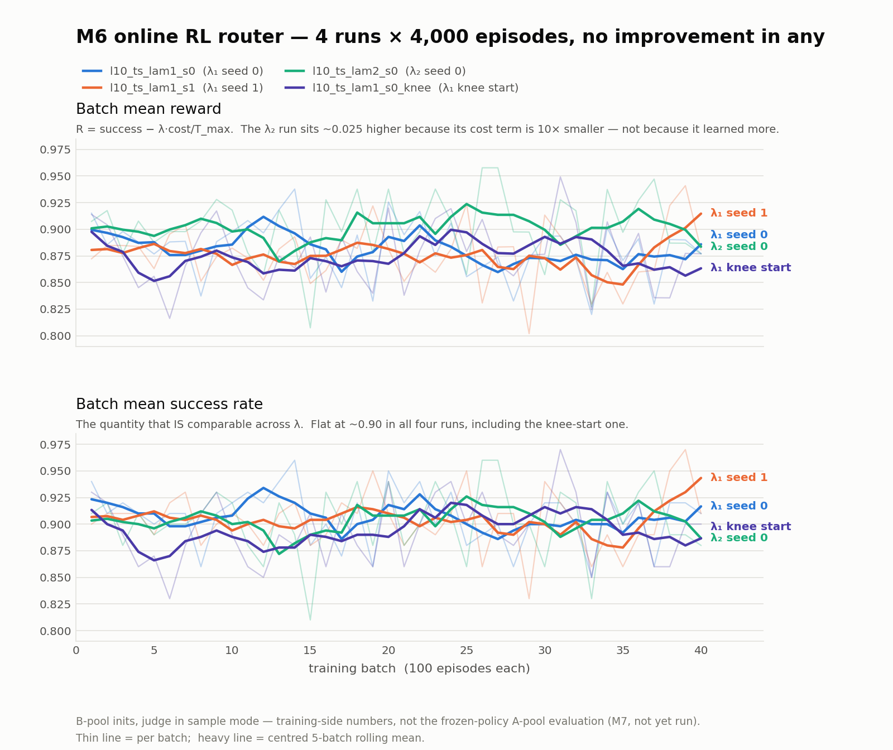
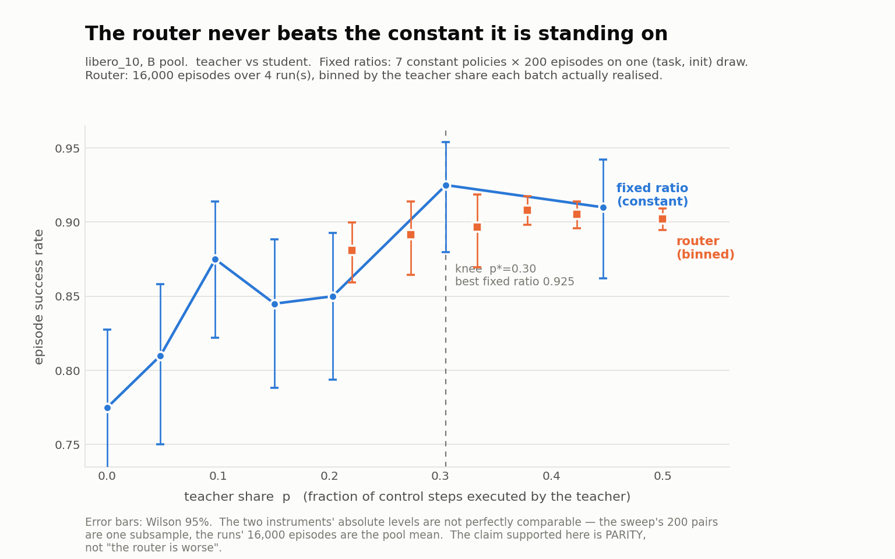

# X14 在线 RL Router — teacher/student 臂集（R_ts）结果

**一句话结论**：在 libero_10 上，在线 RL 训练出来的 router **打不过同等 teacher 占比的固定比例**。四条 run、共 16,000 个训练 episode，被优化的目标从头到尾没有可判读的上升；在每一个匹配的 teacher 占比上，router 的成功率都 ≤ 同占比常数策略，最宽容的口径下差 **−0.008 ± 0.021（z = −0.39）**。

这是 X14 要的答案，**不是失败**：X14 存在的意义就是回答「为什么不训一个 router」，而「训得出来，但它不比一个固定比例更好」是对该问题的直接、可量化的回答。

---

## 1. 设置

| 项 | 值 |
|---|---|
| 套件 / 池 | libero_10，**B 池**（差集池，训练专用；A 池留给 M7 冻结权重评测） |
| 臂集 | `ts` = teacher（Pi0.5）/ student（蒸馏 ACT，:7002 sidecar） |
| 算法 | batch on-policy REINFORCE，批均值 baseline，每批**恰一次** Adam step |
| 目标 | `R_ep = success − λ·(Σ_t cost)/T_max`，cost 取 M5a 冻结表（teacher 1.0 / student 0.055656），`T_max=520` |
| 超参 | lr 3e-4、β 0.01、grad clip 1.0、batch 100 ep、40 批 = 4000 ep/run |
| judge | `mlp_router`，`mode: sample`，只看 `build()` 后的 `query_keys`，**对库侧信息全屏蔽** |

---

## 2. 跑了什么

四条 run 全部 40 批跑满，`verify_m6.py <rid> 40` 全判 **ADMISSIBLE**（权重链 v0→v40 连续、逐批 `model_sha` 互异、`encoder_version` 一致、零拒收、三源五键 join 完整）。

| run | λ | warm-start 起点 | reward Q1→Q4 | success Q1→Q4 | student% 起→止 |
|---|---|---|---|---|---|
| `l10_ts_lam1_s0` | 0.5 | teacher 0.46 | 0.8863 → 0.8736 | 0.9090 → 0.9030 | 0.542 → 0.433 |
| `l10_ts_lam1_s1` | 0.5 | teacher 0.46（同权重，换 seed） | 0.8796 → 0.8750 | 0.9060 → 0.9040 | 0.526 → 0.482 |
| `l10_ts_lam2_s0` | 0.05 | teacher 0.46 | 0.9047 → 0.9032 | 0.9070 → 0.9060 | 0.534 → 0.452 |
| `l10_ts_lam1_s0_knee` | 0.5 | **teacher 0.30（实测拐点）** | 0.8765 → 0.8774 | 0.8910 → 0.9010 | 0.731 → 0.616 |



**读法**：每批噪声 sd ≈ 0.027，每分位 10 批 ⇒ SE ≈ 0.012。四条里 reward 最大的 Q1→Q4 变化是 knee run 的 **+0.0009**，success 是 **+0.010**——**全部不到 1σ**。λ₂ 那条的 reward 整体高约 0.025 是**构造性的**（成本项小 10×），不是学得更好，所以第二个 panel 画的是跨 λ 唯一可比的 success。

---

## 3. 固定比例基线

`sweep_mixture.py` 用**零 trunk + b2** 构造精确的状态无关混合比（`relu(0·x+0)=0` ⇒ logits 恒为 `b2`），7 个点各 200 episode，**每个点用同一组 200 对 (task, init)**，所以跨 p 的差是配对的。

| p_realized | n | SR | 95% CI (Wilson) |
|---|---|---|---|
| 0.000 | 200 | 0.7750 | [0.712, 0.827] |
| 0.048 | 200 | 0.8100 | [0.750, 0.858] |
| 0.097 | 200 | 0.8750 | [0.822, 0.914] |
| 0.151 | 200 | 0.8450 | [0.788, 0.889] |
| 0.203 | 200 | 0.8500 | [0.794, 0.893] |
| **0.305** | 200 | **0.9250** | [0.880, 0.954] |
| 0.446 | 200 | 0.9100 | [0.862, 0.942] |

**拐点 p\* = 0.30**（第一个落在最优点 1 SE 内的 p）。曲线形状是「从 p=0 陡升，p≳0.10 之后整体走平」：0.845–0.925 这五个点两两都落在彼此的 CI 内。

---

## 4. 判读：三种口径，同一结论

工具 `router_vs_fixed.py`。三种口径的混杂项不同，故分开报。



### (1) 按实测 teacher 占比分箱，对上扫点曲线（四条 run 合池）

| 箱 | n_ep | SR_router | 95% CI | SR_fixed（插值） | 差 |
|---|---|---|---|---|---|
| [0.15,0.25) | 1000 | 0.8810 | [0.859, 0.900] | 0.8629 | **+0.0181** |
| [0.25,0.30) | 600 | 0.8917 | [0.864, 0.914] | 0.9017 | −0.0100 |
| [0.30,0.35) | 600 | 0.8967 | [0.870, 0.919] | 0.9220 | −0.0253 |
| [0.35,0.40) | 3400 | 0.9082 | [0.898, 0.917] | 0.9172 | −0.0090 |
| [0.40,0.45) | 4100 | 0.9054 | [0.896, 0.914] | 0.9125 | −0.0071 |
| [0.45,0.60) | 6300 | 0.9022 | [0.895, 0.909] | 0.9100 | −0.0078 |

六箱五负；唯一为正的那箱落在曲线最陡处（插值误差最大）。

### (2) 整程均值 vs 同均值 share 的固定比例

| run | 均值 p | SR_router | SR_fixed | 差 |
|---|---|---|---|---|
| `l10_ts_lam1_s0` | 0.4482 | 0.9073 | 0.9100 | −0.0028 |
| `l10_ts_lam1_s1` | 0.4945 | 0.9038 | 0.9100 | −0.0062 |
| `l10_ts_lam2_s0` | 0.4220 | 0.9038 | 0.9126 | −0.0088 |
| `l10_ts_lam1_s0_knee` | 0.3239 | 0.8948 | 0.9230 | −0.0282 |

四条全负。

### (3) 对 router 最宽容的口径

任一 run 的**最好** 1000-episode 窗口 vs **最好**的固定比例：

```
router best window : l10_ts_lam2_s0  b0017-b0026  p=0.403  SR=0.9170  [0.898, 0.933]
best fixed ratio   : p=0.305                              SR=0.9250  [0.880, 0.954]
difference         : -0.0080 +/- 0.0206   (z = -0.39)
```

**只有这一项显著为正，才能说状态相关性买到了常数买不到的东西。它不是。**

---

## 5. 为什么会这样（机制，全部同池实测）

1. **平坦段上没有状态相关的成功率信号。** 12,000 个 B 池 episode，(task,init) 固定效应控难度、只用前 20 步（决策先于结局）的 teacher 占比：`dSR/d(teacher 占比) = +0.0044 ± 0.0108`，95% CI [−0.017, +0.026]。（整 episode 口径给 −0.70，那是反向因果——失败的 rollout 更长、漂到分布外——**不能用**。）
2. **策略在动，但不学区分。** 在一组固定特征上评 `l10_ts_lam1_s0`：student 均值 0.5345 → 0.6073 → 0.4398 一路游走，而**跨状态 sd 全程 0.1191 → 0.1172 纹丝不动**。router 从头到尾只是在整体挪一个偏置。
3. **噪声底是硬的。** 每 episode 成功率方差 0.0841 = p(1−p) 逐位吻合（**纯二项、无结构可榨**）；按 (task,init) 条件化 baseline 只去掉 33.8% 方差 = 等效 1.5 倍样本量。n=100 时 3σ 只能分辨 δ=0.087，而整个策略空间可达的 success 跨度约 0.081 ⇒ **单批无法区分任意两个策略**。
4. **trainer 本身没问题。** 用 sidecar 精确 logits 算 `dJ/dd` 与实际权重位移对照，两个主导臂方向全一致（b0000：teacher −36.87/−0.00050，student +34.18/+0.00075）。

---

## 6. 口径与边界（**别把结论说得比数据强**）

- **能站住的是「打平」，不是「更差」。** 扫点的绝对水平只来自一组 200 对 (task,init)，而 run 的 16,000 episode 铺在 160 组不同子样本上；两者的水平差含一份子样本构成偏移，且每一项本身都不显著。
- **同池纯 teacher 锚点已补上 = 0.8650**（2026-08-18，来自 teacher/cache 扫点的 p=1.00 点；纯 teacher 常数策略与另一臂是谁无关，且两个扫点用的是**同一组 200 对 (task,init)**——`task_uid` 逐位一致，均为 `arm:eval:*`）。它与既有的跨池锚点 **0.868** 几乎一致，**"跨池比较不可用"这个顾虑在此处被实测消解**。
- **但「混合优于纯 teacher」仍然只是线索，不是结论。** 配对 McNemar：p=0.305 的混合 **0.9250 vs 0.8650，+0.060，exact 双侧 p=0.0428**（both=164 / 只混合成功=21 / 只纯teacher成功=9）。看似显著——**但 p=0.305 是从 ts 扫点里挑出来的 argmax**，即"六个噪声点取最大再去检验"。对 6 个混合点做同一检验并 Holm 校正后：
  | ts 点 | diff | nominal p | Holm adj |
  |---|---|---|---|
  | p=0.305 | **+0.060** | 0.0428 | **0.257 → 否** |
  | p=0.446 | +0.045 | 0.1628 | 0.804 → 否 |
  | p=0.097 | +0.010 | 0.8776 | 1.000 → 否 |
  | p=0.203 | −0.015 | 0.7608 | 1.000 → 否 |
  | p=0.151 | −0.020 | 0.6718 | 1.000 → 否 |
  | p=0.048 | −0.055 | 0.1608 | 0.804 → 否 |
  **无一存活。** 三正三负的散布正是"噪声 + 可能有个小效应"的形状。要把它变成结论，必须**预注册 p≈0.30 这一个点**并加大样本（按 §6 的样本价签，分辨 0.02 需约 1,700 ep）。工具：`/tmp/all_mix_vs_teacher.py`。
- **这是训练侧（B 池、`mode: sample`）的数字**，不是 M7 的冻结权重 A 池评测。M7 尚未跑。
- 两条 λ₁ run 共用逐位相同的 warm-start，是**同起点的两条采样轨迹**，不是两次独立初始化——不能当作两次独立重复。
- 结论限于 **teacher/student 臂集**。`tc`（teacher/cache）是不同的问题：cache 的命中质量本身依赖与库的相似度，状态相关性在那里才有先验理由。**判 tc 不能用本文的 0.925**，须另跑 teacher/cache 的常数策略扫点。

---


- **⚠ 信息不对称（owner 裁定的硬约束，plan §核心约束①/需求(4)）**：MLP 对**相似度分数全屏蔽**——`MlpRouterJudge.__call__` 直接 `del retrieval_signals`，`results` 只在选完臂之后用于取 winner id 与判空库，并由「打乱 scores 断言决策不变」的测试锁死。⇒ **本线 router 与 TIER 的阈值 judge 解的不是同一个问题**：阈值 judge 是**检索之后**看着分数决定「这次命中够不够近」，router 是**进库之前**从观测**预测**「这一步库里会不会有好货」，决策时点掌握的信息严格更少。
  - 因此可站住的对照只有「router vs **固定比例**」（本报告全部结论所限）；**「学出来的 router 打不过 TIER 的阈值规则」这句话未经检验**——那需要另做对照（给 MLP 喂 similarity，或把 TIER 的分数蒙上），本线没做。
  - 这也是判别度增长缓慢的机制性解释：某一步 cache 好不好主要由库在该状态的覆盖决定，而覆盖正是被屏蔽的量，`query_keys` 只是它的弱代理。

## 7. 对论文的意义

X14 的叙事从「我们论证了训 router 不行」升级为「**我们真训了，并量化了它的上限**」：

- **交互成本**：每个变体 router 专属累计交互 = warm-start 450 + pilot 1800 + 训练 4000 = **6250 episode ≈ 10.7 GPU·h**；
- **换来的收益**：在匹配 teacher 占比下 **−0.008 ± 0.021**（最宽容口径，与零不可区分）；
- **对照物是零成本的**：一个固定比例不需要任何交互、不需要特征、不需要训练。

即：这条线给「为什么不训一个 router」提供的不是论证，而是**价签**。

---

## 8. 复现

```bash
# 固定比例扫点（7 点 × 200 ep）
python exp/rl_router/sweep_mixture.py \
  --arm-yaml <r_ts_train.yaml> --split <split.yaml> \
  --init-states-dir <B pool> --servers 127.0.0.1:8000 \
  --reference-weights art/warmstart_l10.pt \
  --out-dir <dir> --episodes 200 \
  --p 0.0 --p 0.05 --p 0.1 --p 0.15 --p 0.2 --p 0.3 --p 0.45

# 拐点与 lambda 可用性
python exp/rl_router/analysis/knee_and_lambda.py <sweep.json>

# 三种口径的判读
python exp/rl_router/analysis/router_vs_fixed.py \
  --art-root <art_m6> --sweep <sweep.json> \
  --run l10_ts_lam1_s0 --run l10_ts_lam1_s1 \
  --run l10_ts_lam2_s0 --run l10_ts_lam1_s0_knee

# 两张图
python exp/rl_router/analysis/plot_reward_curves.py <metrics_dir> m6_reward_curves.png
python exp/rl_router/analysis/plot_sr_vs_share.py <sweep.json> <metrics_dir> m6_sr_vs_share.png
```

`<metrics_dir>` 里放每条 run 的 `metrics.jsonl`，命名为 `<run_id>.jsonl`。

---

## 9. 未决

- **M7**：冻结权重在 A 池上与 TIER 正面对决（需先 `materialize_apool.py`；检查点集合的预注册歧义见 ops log §3.14）。
- **M8**：libero_spatial 的确认 run。
- **R_tc / R_tsc**：`l10_tc_lam1_s0` 进行中；判读前须先跑 teacher/cache 扫点。

> 逐轮运行实录、全部实测缺陷与判据演化见 [`logs/rl_router_operations.log.md`](../../../logs/rl_router_operations.log.md) §2.5–§2.5f、§3。
