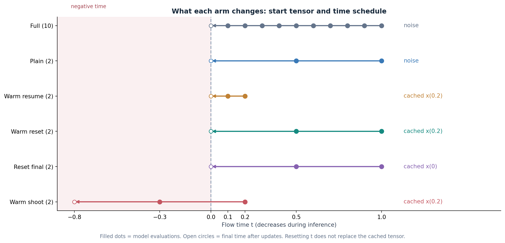
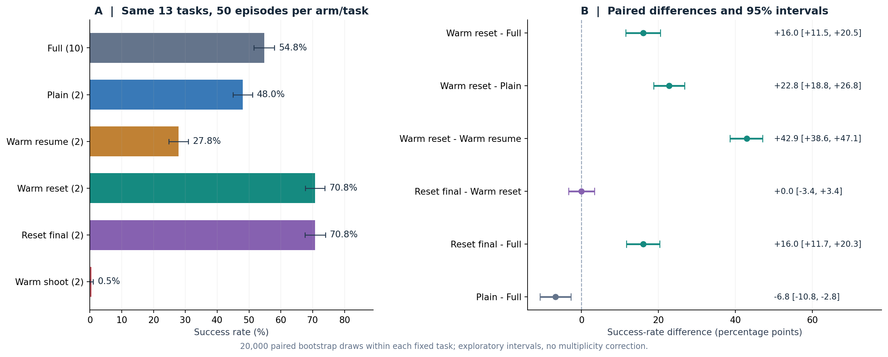
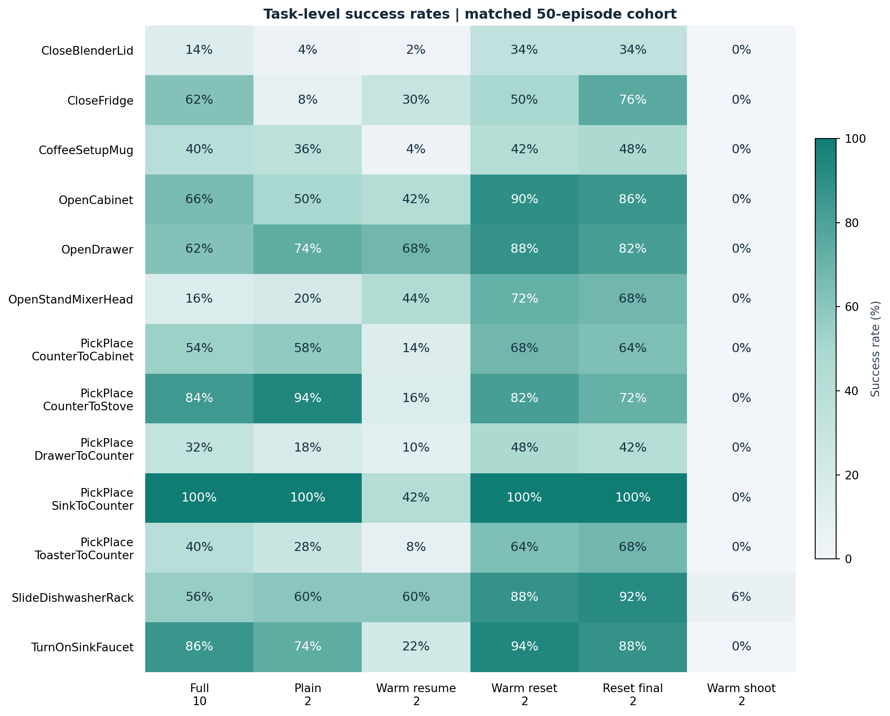
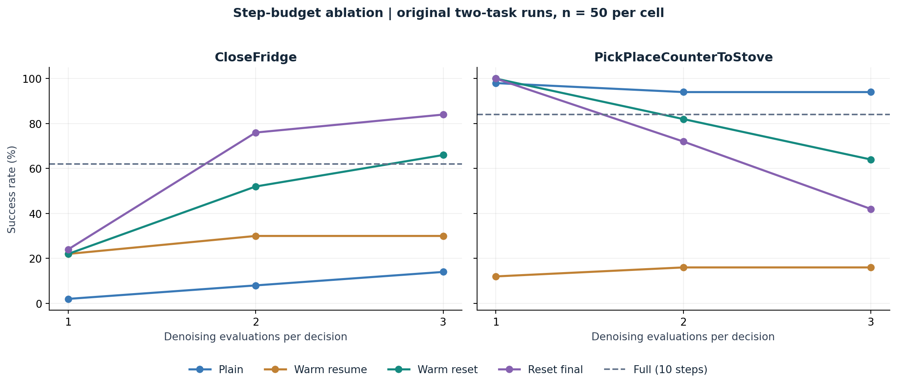
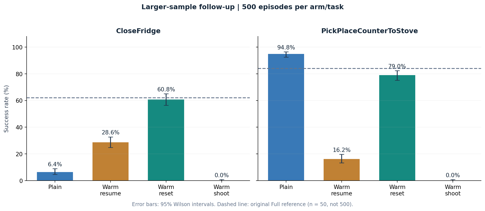

# π0.5 / RoboCasa Inference Ablation Report

**English edition · 2026-09-22 · Independent analysis of the current working tree**

This report explains the full-inference, reduced-step, and cache-initialized variants in `exp/step_diag/`. Its scope is a fixed set of 13 RoboCasa tasks, π0.5, and the checkpoint and cache used in these runs. It is not an evaluation of all RoboCasa365 tasks. The Chinese edition uses exactly the same statistics and figures.

**Main finding.** With a consistent cohort of 50 environment identities per task and arm, 10-step full inference achieves **54.77% (356/650)**. Two-step warmreset and two-step resetfinal each achieve **70.77% (460/650)**. The paired warmreset-minus-full difference is **+16.00 percentage points, with an exploratory 95% interval of [+11.54, +20.46]**. The gap remains when the earlier repeated evaluations are excluded. The two reset variants have equal aggregate success counts, but their task-level and episode-level outcomes differ.

## 1. Questions and interventions

The ablations separate three factors: **compute budget, the initial action tensor, and the denoising time schedule**. Every method conditions action generation on the current observation. The warm variants additionally retrieve an initialization from a fixed library of previously collected trajectories, rather than obtaining future actions from the current evaluation episode.

Here, a “step” means one denoising-network evaluation, or NFE, not one environment action. The model's flow time `t` normally progresses from 1 toward 0. An Euler update is `x ← x + Δt · vθ(x, t, current observation)`. Changing `t` while retaining the same tensor can change both the network prediction and the eventual action.

| Arm | Initial action tensor | NFE | Times seen by the network | Δt per update | Main purpose |
| --- | --- | --- | --- | --- | --- |
| `full` | Random noise | 10 | 1.0, 0.9, …, 0.1 | −0.1 | Full-inference reference |
| `plain_k2` | Random noise | 2 | 1.0, 0.5 | −0.5 | Reduce inference compute |
| `warm_t0.2` | Cached intermediate x₀.₂ | 2 | 0.2, 0.1 | −0.1 | Resume on the original time grid |
| `warmreset_t0.2` | Cached intermediate x₀.₂ | 2 | 1.0, 0.5 | −0.5 | Restart a short run from the cache |
| `resetfinal_t0.2` | Cached final action x₀ | 2 | 1.0, 0.5 | −0.5 | Remove the need for an intermediate snapshot |
| `warmshoot_t0.2` | Cached intermediate x₀.₂ | 2 | 0.2, −0.3 | −0.5 | Enlarge the step while retaining the initial time |

**Warmreset and resetfinal differ directly in the initialization tensor.** For a given retrieved record, one takes the intermediate snapshot and the other takes the final action. Both then perform two updates at `t=1,0.5`, conditioned on the current observation. Resetting the time neither erases the cached tensor nor adds fresh noise. Once their closed-loop trajectories diverge, the methods may retrieve different records; the controlled change is the algorithmic rule, not an assurance of identical retrieval winners at every later decision.



*Figure 1. Filled dots are network evaluations; open circles mark the time after the final update. Warmshoot evaluates the network at a negative time on its second call. Times are shown as ideal decimals; the implementation replays float32 grid accumulation. Implementation evidence: [S1], [S2].*

## 2. Cohort, common settings, and statistical method

The main comparison contains **13 tasks × 50 episodes × 6 arms = 3,900 accepted terminal records**. Environment seeds are `2,000,000 + init_idx`, with `init_idx=0…49`. Pairing uses task, initialization index, environment seed, lane, pin, layout, and style. Each arm has exactly 650 identities, with no missing or repeated identity in the selected cohort.

The arms share the π0.5 configuration/checkpoint identity, layout/style 1, and a replanning interval of five environment steps. Warm variants share the W13 library, top-1 retrieval, and forced warm-start rule, with library writes disabled. Successful and unsuccessful episodes both enter the denominator. Matching environment seeds does not imply matching model-noise samples. The arms were not all run simultaneously in a single serving process.

| Methods | Source selection for this report | Episodes per task |
| --- | --- | --- |
| full / plain_k2 / warm_t0.2 | Original 7 tasks from `rc`; remaining 6 from `rc_macro13` | idx 0…49 only; additional idx 50…99 in some plain/warm cells enter the all-data sensitivity comparison |
| warmreset_t0.2 / warmshoot_t0.2 | Complete 13-task batch from `rc_macro13` only | 50; the earlier two-task pilot in `rc` is excluded |
| resetfinal_t0.2 | CloseFridge and PickPlaceCounterToStove from `rc`; remaining 11 tasks from `rc_macro13` | 50; the two task sets are disjoint |

Thus, **all 13 × 50 resetfinal episodes are complete**. The entire matrix was not run twice. The expansion reused existing task evaluations and repeated only some method/task combinations.

Aggregate success is the equally weighted mean of task success rates. Because all primary cells contain 50 episodes, this also equals total successes divided by 650. This report independently recomputes intervals with **20,000 paired bootstrap draws**, resampling the 50 environment identities within each of the 13 fixed tasks. The same sampled indices are used across arms in each draw; the random seed is `20260922`. These are exploratory percentile 95% intervals, without multiplicity correction, conditional on the fixed task roster. They are not intervals for an arbitrary population of unseen tasks. The follow-up variants were designed after the initial results were observed.

## 3. Main results on 13 tasks

| Arm | Denoising calls / decision | Successes / episodes | Success rate | 95% interval |
| --- | --- | --- | --- | --- |
| `full` | 10 | 356 / 650 | 54.77% | [51.54, 58.00]% |
| `plain_k2` | 2 | 312 / 650 | 48.00% | [44.92, 51.08]% |
| `warm_t0.2` | 2 | 181 / 650 | 27.85% | [24.77, 30.92]% |
| `warmreset_t0.2` | 2 | 460 / 650 | 70.77% | [67.69, 73.85]% |
| `resetfinal_t0.2` | 2 | 460 / 650 | 70.77% | [67.54, 74.00]% |
| `warmshoot_t0.2` | 2 | 3 / 650 | 0.46% | [0.00, 1.08]% |

| Paired contrast A − B | Difference (pp) | 95% interval (pp) |
| --- | --- | --- |
| `warmreset_t0.2` − `full` | +16.00 | [+11.54, +20.46] |
| `warmreset_t0.2` − `plain_k2` | +22.77 | [+18.77, +26.77] |
| `warmreset_t0.2` − `warm_t0.2` | +42.92 | [+38.62, +47.08] |
| `resetfinal_t0.2` − `warmreset_t0.2` | +0.00 | [-3.38, +3.38] |
| `resetfinal_t0.2` − `full` | +16.00 | [+11.69, +20.31] |
| `plain_k2` − `full` | -6.77 | [-10.77, -2.77] |



*Figure 2. Left: success on the same 13 tasks and 50 environment identities per task. Right: paired differences with exploratory 95% intervals. Parenthetical 10/2 denotes denoising calls per decision. Differences are percentage points.*

**Budget ablation: full → plain.** Reducing the budget from 10 to 2 evaluations lowers success from 54.77% to 48.00%, a difference of −6.77 percentage points. This estimates the cost of step reduction with random-noise initialization; it does not imply that every task deteriorates.

**Initialization ablation: plain → warmreset.** Both use the same two-update loop at `t=1,0.5`; the main intervention replaces random noise with a retrieved tensor. Warmreset improves success by 22.77 percentage points. This supports the value of cache initialization. Full inference does not receive that cache prior, so the result cannot be reduced to a claim that two steps intrinsically outperform ten steps of the same procedure.

**Continuation ablation: warm resume → warmreset.** With the same cache type and compute budget, restarting the short loop improves success by 42.92 percentage points. Both the time sequence and Δt change, so the experiment supports their combination rather than identifying the effect of either parameter alone. “Exact resume” refers to retaining the original time grid; the cached tensor was generated in another scene and is not the final two steps of the current observation's full trajectory.

**Snapshot ablation: warmreset → resetfinal.** Both succeed in 460/650 episodes, but final succeeds where reset fails in 66 paired environments, and reset succeeds where final fails in another 66: **132 paired outcomes disagree**. The difference interval is [−3.38, +3.38] percentage points. The evidence supports final actions as a viable alternative initialization in this setting. It does not establish equivalence or prove that intermediate snapshots are universally unnecessary.

**Step/time consistency control: warmshoot.** Two-step warmshoot succeeds in only 3/650 episodes. Its second network call uses a negative time, which is consistent with the observed failure. This experiment alone does not identify negative time as the unique cause, because the update trajectory also changes.

## 4. Task-level heterogeneity



*Figure 3. Each cell is a point estimate from 50 episodes. Colors are not a task-wise significance test. Source selection is identical to Figure 2.*

| Task | Full | Plain | Resume | Reset | Final | Shoot |
| --- | --- | --- | --- | --- | --- | --- |
| CloseBlenderLid | 14% | 4% | 2% | 34% | 34% | 0% |
| CloseFridge | 62% | 8% | 30% | 50% | 76% | 0% |
| CoffeeSetupMug | 40% | 36% | 4% | 42% | 48% | 0% |
| OpenCabinet | 66% | 50% | 42% | 90% | 86% | 0% |
| OpenDrawer | 62% | 74% | 68% | 88% | 82% | 0% |
| OpenStandMixerHead | 16% | 20% | 44% | 72% | 68% | 0% |
| PickPlaceCounterToCabinet | 54% | 58% | 14% | 68% | 64% | 0% |
| PickPlaceCounterToStove | 84% | 94% | 16% | 82% | 72% | 0% |
| PickPlaceDrawerToCounter | 32% | 18% | 10% | 48% | 42% | 0% |
| PickPlaceSinkToCounter | 100% | 100% | 42% | 100% | 100% | 0% |
| PickPlaceToasterToCounter | 40% | 28% | 8% | 64% | 68% | 0% |
| SlideDishwasherRack | 56% | 60% | 60% | 88% | 92% | 6% |
| TurnOnSinkFaucet | 86% | 74% | 22% | 94% | 88% | 0% |

Warmreset has a higher point estimate than plain on 11 tasks, ties on one, and is lower on one. Against full, it is higher on 10, ties on one, and is lower on two. The improvement is not universal.

For CloseFridge, the macro-batch warmreset rate is 50%, versus 76% for resetfinal. For PickPlaceCounterToStove, the corresponding rates are 82% and 72%. Opposite task-specific changes can cancel in the aggregate. The primary table uses the macro-batch CloseFridge warmreset result, 25/50. The original step ladder uses the earlier pilot result, 26/50; these are different runs and should not be treated as the same measurement.

## 5. The one-, two-, and three-step ladder

The original diagnostic ladder evaluated four method families at 1/2/3 steps on CloseFridge and PickPlaceCounterToStove, with 50 episodes per cell. They represent a task strongly affected by step reduction and a task relatively insensitive to it in these data. The two tasks were selected diagnostically, not sampled randomly from a task population.



*Figure 4. Original ladder runs from `rc`. Points are observed success rates; connecting lines do not imply that intermediate budgets were tested. Dashed lines are the 10-step full reference, also based on 50 episodes.*

| Task | Steps | Plain | Resume | Reset | Final |
| --- | --- | --- | --- | --- | --- |
| CloseFridge | 1 | 2% | 22% | 22% | 24% |
| CloseFridge | 2 | 8% | 30% | 52% | 76% |
| CloseFridge | 3 | 14% | 30% | 66% | 84% |
| PickPlaceCounterToStove | 1 | 98% | 12% | 100% | 100% |
| PickPlaceCounterToStove | 2 | 94% | 16% | 82% | 72% |
| PickPlaceCounterToStove | 3 | 94% | 16% | 64% | 42% |

On CloseFridge, resetfinal rises from 24% → 76% → 84% at 1/2/3 steps. On the pick-and-place task it falls from 100% → 72% → 42%. Additional updates can help one task and harm another; the results do not support a universal “more steps is better” rule.

For warm resume and warmreset, changing the step budget also changes the cached snapshot time, 0.1/0.2/0.3. Resetfinal always initializes from the final action, so its ladder more directly tests the budget and associated grid. It still changes the step size with the number of updates, rather than adding iterations at a fixed Δt.

One- and three-step resetfinal were later expanded to eight tasks. To avoid comparing an eight-task mean with a thirteen-task mean, this report aligns all budgets on **the same eight tasks**:

| Method | Success on the same eight tasks | Episodes |
| --- | --- | --- |
| Full, 10 steps | 56.50% | 400 |
| Resetfinal, 1 step | 43.50% | 400 |
| Resetfinal, 2 steps | 67.75% | 400 |
| Resetfinal, 3 steps | 59.50% | 400 |

The eight tasks are CloseBlenderLid, CloseFridge, OpenCabinet, PickPlaceCounterToCabinet, PickPlaceCounterToStove, PickPlaceDrawerToCounter, PickPlaceSinkToCounter, and PickPlaceToasterToCounter. Two steps have the highest point estimate among these tested budgets. This is not an optimum established on an independent validation set.

## 6. Larger-sample and alternate-seed follow-ups

The two diagnostic tasks received an additional four-arm evaluation with 500 episodes per task: plain, warm resume, warmreset, and warmshoot. **Neither full nor resetfinal was included in that batch.** The same four arms were also evaluated for 50 episodes per task using the alternate environment-seed block `1,000,000+idx`.



*Figure 5. Each bar uses n=500; error bars are 95% Wilson intervals for individual task/arm cells. Dashed lines retain the original n=50 full reference and are not new n=500 full evaluations.*

| Task | Arm | 2M: original 50 | 1M: 50 | 2M: 500 |
| --- | --- | --- | --- | --- |
| CloseFridge | `plain_k2` | 8.0% | 4.0% | 6.4% |
| CloseFridge | `warm_t0.2` | 30.0% | 32.0% | 28.6% |
| CloseFridge | `warmreset_t0.2` | 52.0% | 66.0% | 60.8% |
| CloseFridge | `warmshoot_t0.2` | 0.0% | 0.0% | 0.0% |
| PickPlaceCounterToStove | `plain_k2` | 94.0% | 92.0% | 94.8% |
| PickPlaceCounterToStove | `warm_t0.2` | 16.0% | 14.0% | 16.2% |
| PickPlaceCounterToStove | `warmreset_t0.2` | 82.0% | 80.0% | 79.0% |
| PickPlaceCounterToStove | `warmshoot_t0.2` | 0.0% | 0.0% | 0.0% |

In the 500-episode batch, warmreset improves over warm resume by 32.2 and 62.8 percentage points on the two tasks. Against plain, it improves CloseFridge by 54.4 points but lowers success on the pick-and-place task by 15.8 points. The alternate seed block retains these principal directions. These follow-ups strengthen reproducibility evidence for the two selected tasks; they do not replicate all 13 tasks on a second seed block.

Indices 0…49 in the larger batch overlap with the original variant pilot, and some original plain/warm cells also contain indices 50…99. The original report gives a 450-episode sensitivity analysis excluding the first 50. This report additionally checks the stricter **idx 100…499 subset, n=400**: warmreset/plain/warm resume score 65.5% / 6.5% / 30.5% on CloseFridge and 78.0% / 94.5% / 16.25% on the pick-and-place task. The main directions remain unchanged. Removing previously used environments does not remove post-hoc task, method, or budget selection.

## 7. Code review context and limits of interpretation

The earlier working-tree review found no evidence that weakened full-inference step counts, an arm-specific success rule, or access to the current episode's future explains the main gap. Full explicitly uses ten steps; warm methods use stage-2 conditioning from the current observation and obtain only their initialization tensor from the cache. The arms share the evaluation loop's success criterion. A fixed library of historical successful trajectories is an explicit additional information source and should be disclosed as part of the method. [S1–S4]

Report generation rechecks launch/journal identities and terminal completeness, pairing of the 3,900 selected records, and the saved model/environment-identity and NFE admission results. It does not run new robot evaluations or repeat every server-array validation. Batches may differ in serving-source digests or machines. The recorded model-identity digest is not an independent bytewise rehash of all large weight files; comparability should therefore not be described as every execution condition being bit-identical.

The previously identified replicate-overwrite behavior has been changed in the currently read `warm_variants.py`: repeated outcomes are retained and averaged per environment identity. The file also contains cross-arm identity checks and handling for degenerate intervals. This report does not modify that aggregator or treat this reading as a complete revalidation of its revisions. The primary figures use a fixed 50-episode cohort for clarity; the repository's current all-data, identity-balanced estimates were also independently reconstructed:

| Arm | This report: matched 50 | Repository: all data, identity-balanced |
| --- | --- | --- |
| `full` | 54.769% | 54.769% |
| `plain_k2` | 48.000% | 48.077% |
| `warm_t0.2` | 27.846% | 27.692% |
| `warmreset_t0.2` | 70.769% | 70.846% |
| `resetfinal_t0.2` | 70.769% | 70.769% |
| `warmshoot_t0.2` | 0.462% | 0.462% |

Both estimands preserve the principal ordering and the approximately 16-point gap. Small numerical differences reflect which identities are included and whether repeated evaluations are averaged. Success rates and paired contrasts from different estimands should not be mixed.

The evidence supports the combination of cache initialization and a restarted short loop; it does not show an aggregate advantage for intermediate snapshots over final actions in this configuration; and budget effects vary substantially by task. It does not establish a fixed mathematical mixture of cached and observation-derived actions, prove that retrieved actions are necessarily closer to the correct action, or justify deleting intermediate snapshots in every setting.

Further mechanism isolation would require controls absent from the current main matrix: zero-update execution of the retrieved action, random or shuffled retrieval, a ten-step reset from a cached initialization, and designs that separately vary initial time and integration step size while holding the start tensor fixed. Reducing denoising calls from ten to two does not establish a fivefold end-to-end speedup; encoding, retrieval, and the number of decisions per episode need their own timing measurements.

## 8. Data and reproduction

Figures are plotted directly from recomputed log statistics, not produced with a generative image model. Both editions share English method labels and axes, with captions in the edition's language. Every figure is supplied as PNG and SVG.

| File | Contents |
| --- | --- |
| `report.zh.md` / `report.en.md` | Complete Chinese and English reports |
| `report.zh.html` / `report.en.html` | Standalone HTML with embedded images; opens offline and supports browser printing |
| `statistics.json` | Main estimates, paired intervals, step ladders, and follow-up statistics |
| `primary_episodes.csv` | All 3,900 selected records, environment identities, source journal paths and line numbers |
| `task_success_rates.csv` | Success rates for 13 tasks and six arms |
| `source_manifest.json` | SHA-256 hashes of 137 working-tree input files defining this read snapshot |
| `reproduce.py` / `write_reports.py` | Recalculation/plotting and bilingual rendering scripts |

From the repository root, run:

```bash
.venv/bin/python -B exp/step_diag/analysis/ablation_report_20260922/reproduce.py
.venv/bin/python -B exp/step_diag/analysis/ablation_report_20260922/write_reports.py
```

The scripts write only to this report directory. Recalculation requires the local raw data and existing Python environment. The download bundle does not copy the model or raw server arrays. Reruns read the working tree as it exists at that time; compare the input manifest to establish whether it matches this edition.

**Implementation and source-report index**

- [S1] `exp/step_diag/pi05.py:71–115, 134–147, 180–190`: variant update loop, full/plain step binding, and final-action substitution.
- [S2] `src/openpi/models_pytorch/pi0_pytorch.py:644–769`: random-noise initialization, standard stage 3, and cached continuation.
- [S3] `exp/step_diag/config/arms/pi05_rc/warm_t0.2.yaml:24–35, 72–75`: forced top-1 warm start, fixed library, and disabled writes.
- [S4] `exp/robocasa365/episode_runner.py:530–625`: environment reset, action execution, and success detection; `exp/step_diag/analysis/aggregate_arms.py:56–112, 207–337`: terminal records and admission.
- [S5] `exp/step_diag/analysis/step_vs_warmstart.md:142–295`: original account of the variants, budget ladder, larger sample, alternate seeds, and thirteen-task expansion. The independent calculations and interpretation limits here take precedence over stronger mechanism claims in that account.
- [S6] `exp/step_diag/analysis/warm_variants.py:38–83, 174–199`: current replicate aggregation, paired intervals, and cross-arm checks; `exp/step_diag/data/analysis/warm_variants_pi05_macro13.json`: saved admission and all-data estimates.
