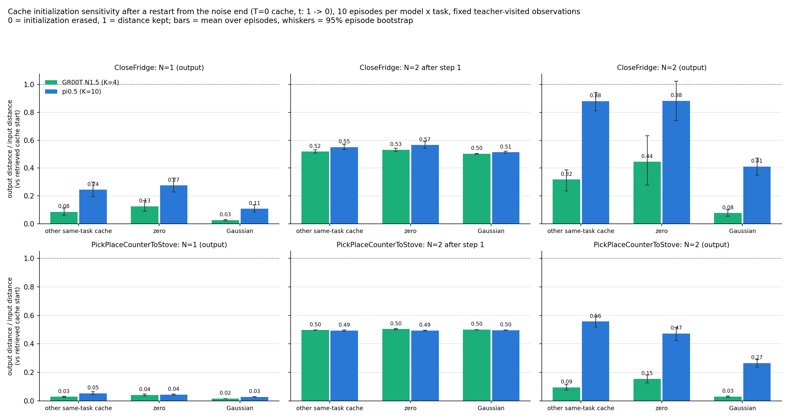

# Cache initialization sensitivity: complete results (40/40 episodes)

Experiment `init_probe_pilot_20260922`. The plan was 2 tasks × 10 episodes per model, 40 episodes in total; every one now has a unique terminal. Codex started the run and stopped it at 20:59 CDT on 2026-09-22 to release devices (12/40). Claude resumed the remaining 28 episodes between 21:36 and 22:40 CDT and merged the two segments. The interrupted report stays as history in `partial_results.en.md`.

## What was measured

The full policy always controls the environment: 4 steps for GR00T, 10 for π0.5. At every decision among 0, 5, 15, 30 and 60 that an episode actually reached, the same stage-2 condition is reused to run four extra initializations:

- the retrieved cache's final action (the reference)
- the final action of another same-task trajectory, drawn uniformly over entries after excluding the winning trajectory
- all zeros
- Gaussian noise from a private generator

The cache noise level is T=0. Every initialization walks from the noise end t=1 to t=0 in N=1 or N=2 steps. GR00T's native time runs the other way; this report always uses the noise level. These extra actions never control the environment.

Metric: `output action RMSE / input action RMSE` against the retrieved-cache start, over the first 5 actions × first 12 active normalized dimensions. Observations are averaged within an episode first, then across episodes; intervals are 95% bootstrap over episodes. A ratio of 0 means the initialization difference was erased, 1 means it was kept. It measures the size of a difference, not action quality and not success rate.

## Results

Lower means the model cares less about where it started. 10 episodes per cell.

| Task | Budget | Control | GR00T | π0.5 |
|---|---|---|---|---|
| CloseFridge | N=1 output | other same-task cache | 0.085 [0.060, 0.113] | 0.244 [0.196, 0.300] |
| | | zero | 0.125 [0.089, 0.167] | 0.275 [0.229, 0.327] |
| | | Gaussian | 0.026 [0.021, 0.031] | 0.108 [0.085, 0.137] |
| | N=2 after step 1 | other same-task cache | 0.519 [0.507, 0.530] | 0.550 [0.534, 0.571] |
| | | zero | 0.531 [0.519, 0.542] | 0.565 [0.542, 0.592] |
| | | Gaussian | 0.502 [0.501, 0.504] | 0.514 [0.506, 0.521] |
| | N=2 output | other same-task cache | 0.317 [0.236, 0.386] | 0.881 [0.812, 0.944] |
| | | zero | 0.445 [0.279, 0.632] | 0.883 [0.741, 1.024] |
| | | Gaussian | 0.077 [0.054, 0.102] | 0.411 [0.348, 0.471] |
| PickPlaceCounterToStove | N=1 output | other same-task cache | 0.029 [0.026, 0.033] | 0.054 [0.044, 0.065] |
| | | zero | 0.041 [0.035, 0.048] | 0.045 [0.040, 0.049] |
| | | Gaussian | 0.016 [0.015, 0.017] | 0.028 [0.027, 0.030] |
| | N=2 after step 1 | other same-task cache | 0.497 [0.496, 0.497] | 0.493 [0.488, 0.498] |
| | | zero | 0.504 [0.500, 0.508] | 0.493 [0.492, 0.495] |
| | | Gaussian | 0.500 [0.499, 0.500] | 0.496 [0.495, 0.497] |
| | N=2 output | other same-task cache | 0.094 [0.075, 0.115] | 0.557 [0.517, 0.594] |
| | | zero | 0.154 [0.127, 0.182] | 0.472 [0.424, 0.516] |
| | | Gaussian | 0.030 [0.025, 0.035] | 0.266 [0.238, 0.290] |

Full-policy success on these 40 episodes (context only; not what this experiment tests): GR00T CloseFridge 3/10, PickPlaceCounterToStove 6/10; π0.5 3/10 and 9/10.

## Reading

1. **The N=2 output is where the models differ most.** In all 6 comparisons (2 tasks × 3 controls) π0.5 keeps a larger share of the initialization difference than GR00T, and none of the 6 pairs of 95% intervals overlap. Against another same-task cache, π0.5 keeps 0.88 on CloseFridge and GR00T 0.32; on PickPlaceCounterToStove the figures are 0.56 and 0.09. GR00T's CloseFridge zero-control interval is wide, [0.28, 0.63].
2. **After the first step both models sit near 0.5.** That is what a step of dt = 0.5 gives when the predicted velocity barely depends on the start: x₁ = x₀ + 0.5·v halves the difference. The models diverge at the second step: GR00T keeps shrinking (to about 0.3 or 0.1), while π0.5 re-amplifies on CloseFridge (0.55 to 0.88) and roughly holds on PickPlaceCounterToStove (0.49 to 0.56).
3. **With N=1 both models compress the start difference strongly**, but π0.5 is still clearly higher on CloseFridge (0.24 vs 0.08). On PickPlaceCounterToStove both are between 0.03 and 0.05, and nearly equal under the zero control.
4. The data support the working explanation that **on these observations GR00T's output depends less on the cache initialization than π0.5's, especially with a two-step budget.** This points the same way as the earlier success-rate results: on GR00T, reset-style warm start was indistinguishable from plain step reduction, while on π0.5 two-step reset-style warm start clearly beat it.

## What this does not show

- It measures cache-initialization sensitivity only. Closeness to the full action and real task success are separate questions this experiment does not answer.
- The two models visit different later observations and use different cache libraries. Comparisons are paired on fixed observations within a model, not across models, so this cannot establish the cause of the success-rate gap.
- Different controls have different denominators (input distances), so the columns are not the same absolute action error.
- 10 episodes per cell, bootstrapped over episodes; observations within an episode are not treated as independent.

## Data and checks

- **Merge rule**: the pilot segment contributes only the 12 episodes accepted in the stop-time snapshot `client_stopped/` (GR00T 11, π0.5 1); the resume segment only the 28 episodes first accepted after it (GR00T 9, π0.5 19). Each model had 4 observation rows from interrupted episodes, excluded by rule. For those, the resumed rows reused the same `(task_uid, attempt, decision_idx)` and array file name; the merged view stores the segments under separate prefixes with bytes unchanged. Provenance: `exp/step_diag/data/init_probe_20260922/merged/<policy>/merge_provenance.json`.
- **Identity**: the resumed servers carry the pilot config_sha (GR00T `c55ae085…`, π0.5 `694b9fb7…`), the same probe contract and wrapper source hash `bf446a53…`; only the evidence directory and launch-id changed. Workers reused the original out root and journals, and the conductor skipped completed episodes; before resuming, the remote journals and launch files matched the stop-time snapshot file by file (SHA256).
- **Complete-mode analysis (no `--allow-incomplete`)**: 20 episodes per model, equal to the planned set; server and worker terminals reconciled episode by episode; every executed decision ran the full step count with one stage-3 call; every reachable planned observation is present (GR00T 95, π0.5 100); array SHA256, finite values, same-input repeat (difference 0), unchanged global RNG and cache payload, identical initialization for N=1 and N=2, and the first-step Euler identity (max error GR00T 1.2e-7, π0.5 4.8e-7) all pass.
- **Code**: resume/merge tool `exp/step_diag/ops/resume_init_probe.py`, tests `tests/exp/step_diag/test_resume_init_probe.py`; 35 related tests pass (`test_init_probe`, `test_groot_warm_variants`, `test_warm_variants`, `test_resume_init_probe`). During the resume the local tree's `pi05.py` already contained that day's new `mid_final` branch; the `reset_final` branch this experiment uses for π0.5 is unchanged, and its time and step sequences are pinned by tests.
- **Artifacts**: `exp/step_diag/data/init_probe_20260922/{resume_r1,merged}/`; figures `groot_complete.png`, `pi05_complete.png`, `complete_initialization_sensitivity.png` (model comparison).
