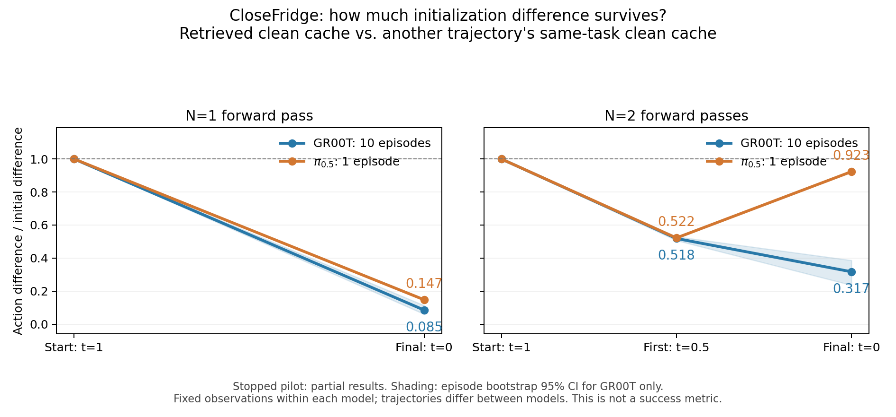

# 缓存初始化敏感性：中止后的部分结果

本轮计划为每模型 2 个任务、每任务 10 集。为释放设备而中止，完成 12/40 集。没有重新启动实验。

| 模型 | CloseFridge | PickPlaceCounterToStove | 纳入观测 |
|---|---:|---:|---:|
| GR00T | 10 集 | 1 集 | 55 |
| π0.5 | 1 集 | 0 集 | 5 |

两个模型各有 4 个未完成集的观测被排除。Smoke 数据不与本轮正式先行实验合并。

## 测的是什么

完整策略控制环境。在每个选中的观测上固定模型条件，分别用检索到的缓存最终动作、同任务另一条轨迹的随机缓存最终动作、零和高斯噪声初始化。缓存噪声水平 T=0；重新从噪声端 t=1 开始，以 N=1 或 N=2 前向到 t=0。GR00T 原生时间方向相反，图文统一用噪声水平表示。

指标是不同初始化的输出动作 RMSE / 输入动作 RMSE，以检索缓存为参照，只计算前 5 个动作的 12 个有效归一化维度。每集先对观测取平均，再对集取平均。它衡量差异幅度，不是信息比例，也不是成功率。对照输入使用完整动作张量，因此被排除的填充维度仍可能通过模型影响有效维度；本实验未单独消融它们。

## CloseFridge 结果

检索缓存与同任务另一条轨迹缓存的比较：

| 位置 | GR00T（10 集） | π0.5（1 集） |
|---|---:|---:|
| N=1，最终 | 0.0848 | 0.1474 |
| N=2，第一步 | 0.5185 | 0.5218 |
| N=2，最终 | 0.3169 | 0.9232 |

两步的第一步都将差异缩至约一半；第二步中，GR00T 继续收缩，π 的这一集重新放大。这支持一个待验证的解释：在这些观测上，GR00T 的最终输出对缓存选择较不敏感。它不能证明缓存完全被抹去，更不能证明该机制导致原有成功率差距。

全部初始化对照的最终比值：

| 模型与预算 | 另一条轨迹的同任务缓存 | 零 | 高斯 |
|---|---:|---:|---:|
| GR00T，N=1 | 0.0848 | 0.1252 | 0.0258 |
| GR00T，N=2 | 0.3169 | 0.4447 | 0.0767 |
| π0.5，N=1 | 0.1474 | 0.1570 | 0.0564 |
| π0.5，N=2 | 0.9232 | 0.4763 | 0.2242 |

差距不是对所有对照都同样明显：两步零初始化对照的数值接近。各类对照的分母不同，不能将不同列当成同一绝对动作误差比较。

GR00T 的两步同任务缓存比值，按集 bootstrap 95% 区间为 [0.2360, 0.3864]；一步为 [0.0602, 0.1130]。π 只有 1 集，无法估计可靠的集间不确定性，图中不画其置信区间。只比较双方共同的 seed=2,000,000，GR00T 一步/两步为 0.0408/0.1755，π 为 0.1474/0.9232；仍只是单集描述，不解决样本不足问题。

GR00T 的 PickPlaceCounterToStove 仅 1 集：同任务缓存对照一步/两步为 0.0256/0.1471；没有对应 π 数据，不能用于模型间比较。

## 依据与限制

- 接收记录、启动清单与服务端终态逐集对账；中止导致的缺集明确保留，未冒充完整实验。
- 已完成集的全部计划观测均存在；原始数组 SHA256、有限数值、逐步轨迹和存储指标均核对通过。
- 服务端核对环境始终执行完整策略：GR00T 4 步、π 10 步；成功和失败集均纳入。
- 同输入重复前向的最大差值为 0；记录的全局随机状态和缓存载荷保持不变。两种步长共享首个速度预测的 Euler 恒等式最大误差分别为 1.19e-7、2.38e-7。
- 每模型内部的反事实比较固定同一观测；模型之间由各自完整策略访问的后续观测不同，缓存库也不同。不能视为跨模型完全同条件比较。
- 这些反事实动作没有控制环境，所以没有测得它们的成功率。动作差异大小也不代表动作质量。
- 本次 CPU 分析测试：3 passed。未启动 GPU 推理或评测 worker。

原始汇总：[GR00T](../../data/init_probe_20260922/pilot/groot/partial_summary.json)、[π0.5](../../data/init_probe_20260922/pilot/pi05/partial_summary.json)。JSON 中单集 bootstrap 的退化区间不应解释为确定性。
