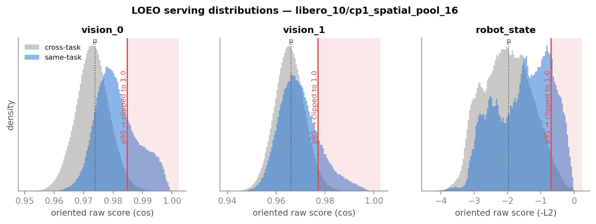
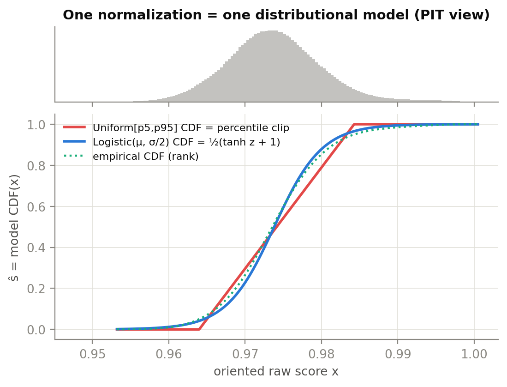
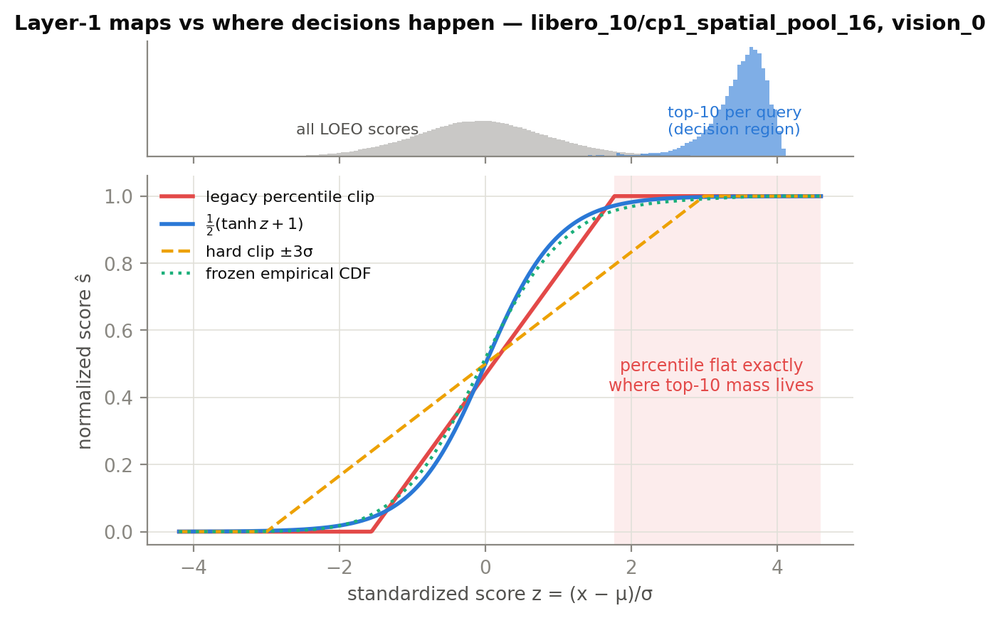
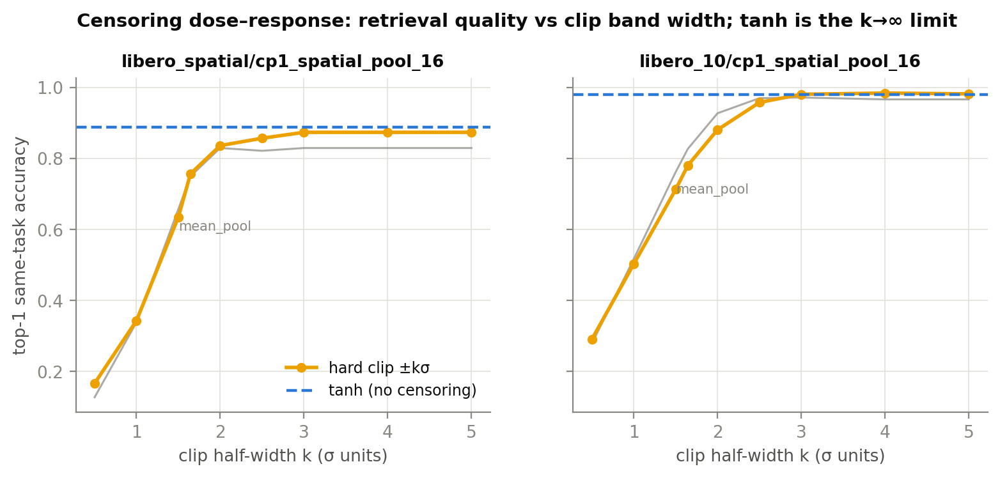
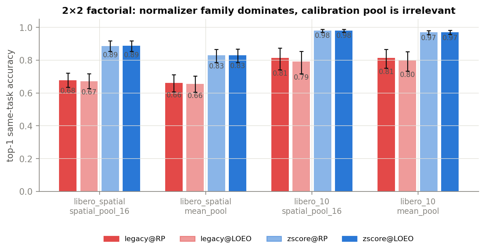
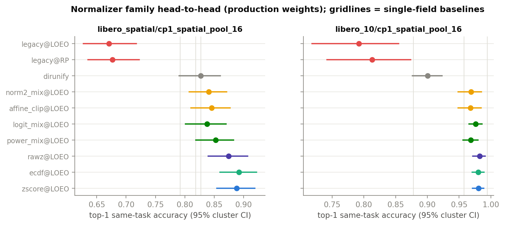
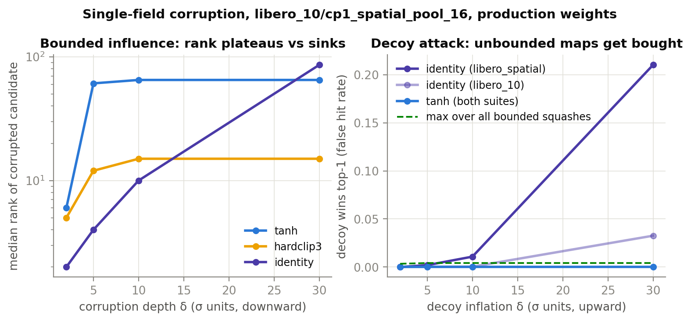
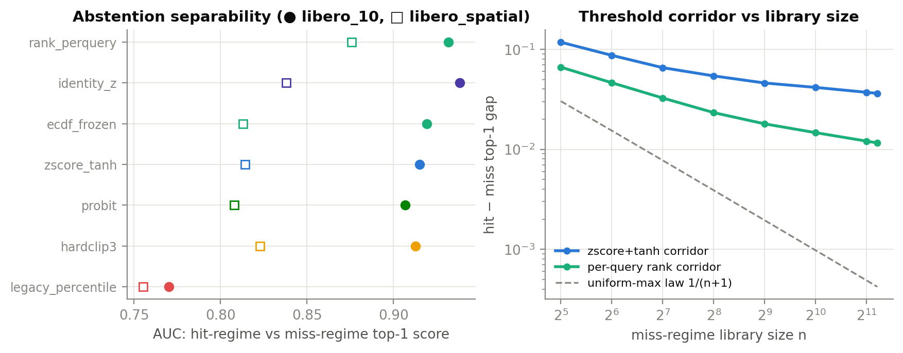

# 多模态相似度融合归一化的数理机理：为什么 z-score+tanh 有效，为什么 percentile 失败

> 研究对象：Pi0.5 推理 cache 检索的 weighted score sum 融合，Layer-1 归一化两代实现——旧版 percentile 线性拉伸（已弃，"几乎完全失败"）vs 当前 z-score+tanh（`ŝ = ½(tanh((x−μ)/σ)+1)`）。
> 本报告给出**数学上严密的机理解释 + 基于真实轨迹库的离线实证**：每个公式部件（为什么 z-score、为什么套 tanh、为什么偏偏是 tanh、为什么 percentile 死了、为什么禁 rank/CDF）都有可证伪的命题与对应实验。§10 为可直接用于 ICML 类论文的英文 camera-ready 论述。
> 数据：`exp/common/data/cache_artifacts/{libero_spatial,libero_10}/cp1_{spatial_pool_16,mean_pool}.pkl`（真实收集轨迹，4 组合，N=1018/2640，49/50 条轨迹，各 10 任务），**全量精确** LOEO（leave-one-episode-out）query×library 打分，无采样近似。
> 实验代码/数据/图：`exp/weighted_sum/analysis/fusion_theory/`。撰写日期 2026-07-04。只读研究，未改任何 src。

---

## 0. TL;DR

1. **percentile 的死因不是 folklore 里的 `denom≤0 → 0.5 兜底`，而是「决策区删失（decision-region censoring）」**：p95 截断把校准分布上侧 5% 的质量钉死在 1.0，而 top-k 检索的 argmax 恰好只发生在这条极右尾里。实测每个 query 按原始分排序的前 10 个候选中 **88%–99% 被 clip 成同一个值 1.0**（三个模态全部如此）；融合后 73%–96% 的 query 存在 top-1 平局（平局集平均 7.6–28.5 个候选），最终"选谁"退化为**库内插入顺序**。`denom` 实测恒 >0（0.0054–0.33），0.5 兜底从未触发——它属于被新方案排除的 prompt_emb（task-constant，denom=6e-6）。
2. **folklore 根因①「校准分布用错（库内随机对 vs query→全库）」在数据上可忽略**：两种池的 KS 距离仅 0.002–0.010；zscore 用随机对校准与用 LOEO 校准的检索结果**逐 query 完全一致到小数点后三位**；legacy 用 LOEO 校准反而更差（带更窄→删失更多）。**归一化族形状是全部矛盾，校准池不是。**
3. **为什么 z-score**：严格递增仿射归一化在权重搜索下与原始分融合**排序等价**（权重重参数化，命题 2）——z-score 的真正作用是 (i) 把 300× 跨度的各字段尺度（σ 从 0.0033 到 1.0）折算到统一的「判别力单位」，让权重单纯形几何各向同性、权重可解释可迁移；(ii) 让**同一个**无参 squash 形状对所有 (字段,keybuilder) 都工作在正确操作点（location-scale 解耦）。不做方差均衡的直通融合（dirunify）被输出方差最大的模态劫持，实测退化到 ≈ 单模态 robot_state 水平。
4. **为什么 tanh**：三条可独立证伪的性质，各有独立实验支撑——**P1 严格单调（零删失）**：clip 半宽剂量-响应曲线单调饱和，tanh 是 k→∞ 极限（±0.5σ 带 → top1 掉到 0.13–0.29；±1σ → 0.34–0.52；±1.645σ（=legacy 等效带宽）→ 0.75–0.83；±3σ ≈ tanh）；**P2 有界（影响函数有界）**：单模态污染下被污染候选名次 plateau（tanh: 中位 34–65 就停）而无界 identity 坠底（δ=30σ 时名次 86–385）；decoy 攻击（单模态伪高分）下一切有界 squash 假命中率 ≈0，identity 达 13%–34%；**P3 形状不敏感**：tanh ≈ logistic ≈ probit ≈ arctan ≈ softsign，配对差 <1pp（多数 CI 过 0）——有效的是「光滑+有界+严格单调」这个等价类，tanh 是其规范代表（恰为 logistic CDF：`½(tanh z+1) ≡ σ(2z)`，即生物特征融合文献的经典 tanh-normalization）。
5. **统一视角（命题 1）**：三代归一化都是**概率积分变换（PIT）**——percentile-clip = Uniform[p5,p95] 模型的 CDF；z-score+tanh = Logistic(μ, σ/2) 模型的 CDF；rank = 经验 CDF。CDF 归一化把输出分辨率按**模型密度**分配：uniform 密度在带外为 0（硬删失，决策区恰在带外→死）；logistic 密度处处 >0（指数软压缩、永不打平）；经验密度在样本支撑外为 0（OOD 复发删失）。
6. **保幅红线（禁 rank/CDF）的精确刻画**：库内相对秩融合检索本身不差（跨模态秩共识甚至给出最高的 hit/miss AUC），但其绝对分语义随库变化：miss 态 top-1 分随库规模以 ~n^{−0.4} 逼近上界 1（极值律），阈值走廊比 tanh 的 ~n^{−0.27} 收窄更快，外推至 10⁵ 级库时 tanh 走廊宽约 5×；且 rank 度量对单调变换不变（AUC 不变性），使 Phase-1 的归一化选型在 rank 指标下**原则上不可辨**——保幅指标 J 是选型可辨识的必要条件。
7. **检索质量结论（离线，同任务 top-1 准确率，轨迹级 cluster bootstrap 95% CI）**：legacy percentile 0.655–0.814 vs zscore+tanh 0.830–0.981，配对差 **−15.7 至 −21.7pp（全部显著）**；动作重放代理（action-chunk regret@1）legacy 0.18–0.31 vs zscore 0.094–0.102（**约 2–3×**）。权重单纯形全扫描：**没有任何权重组合能救 percentile**（其 153 点最大值 0.68/0.81 仍远低于 zscore 的 0.895/0.998）。与线上事实一致：旧线"几乎完全失败"，新线 libero_spatial 纯检索 SR 74%。

---

## 1. 问题设定与符号

**融合公式（Layer-2）**：对启用字段集 $F=\{\text{vision\_0},\text{vision\_1},\text{robot\_state}\}$、query $q$、库内候选 $c$：

$$S(c)=\sum_{f\in F} w_f\, n_f\big(x_f(q,c)\big),\qquad w\in\Delta:=\{w\ge 0,\ \textstyle\sum_f w_f=1\},$$

其中 $x_f$ 为定向原始相似度（cosine 取 $\cos$；L2 取 $-d$），$n_f$ 为 Layer-1 归一化。检索取 $\arg\max_c S(c)$（生产 `top_k=1`，重放命中条目的 action chunk）；阈值分支在 $S$ 上做 hit/miss 判决。

**两代 Layer-1**：

| | 公式 | 参数来源 |
|---|---|---|
| 旧 percentile | $n(x)=\mathrm{clip}\!\big(\tfrac{s_0(x)-p_5}{p_{95}-p_5},0,1\big)$，$s_0=\tfrac{\cos+1}{2}$ 或 $e^{-d/\tau}$，$\tau=0.3347$ | 库内随机 entry 对的 $s_0$ 分布 p5/p95 |
| 新 z-score+tanh | $n(x)=\tfrac12\big(\tanh\tfrac{x-\mu}{\sigma}+1\big)$ | LOEO query→全库定向分布的 $\mu,\sigma$ |

**数据事实（决定一切的分布形态）**：vision cosine 处于**极窄高基线带**——μ≈0.966–0.990、σ≈0.0033–0.0078；robot_state 定向分 μ≈−1.84/−1.97、σ≈1.0/0.75。同任务 vs 跨任务的均值分离以 σ 计（Cohen's d）：vision_0 0.47–1.32σ、vision_1 0.27–0.61σ、robot_state 0.20–0.66σ；换算回原始余弦单位仅 **0.001–0.008**——这精确对应 owner 当年的观察"cosine 分数要到小数点后好几位才有区别"。判别信号真实存在（原始分 AUC 0.57–0.82），但活在 σ 尺度上，不在原始尺度上。


*图 1：LOEO serving 分布（libero_10/spatial_pool_16）。蓝=同任务，灰=跨任务，红线=legacy p95（右侧粉区被 clip 成 1.0），虚线=μ。三个模态的同任务右尾——检索真正要区分的部分——都落在删失区内。*

---

## 2. 研究方法（可复现性与统计）

- **全量精确打分**：每个 (suite, keybuilder) 计算全部 $N\times N$ 原始分矩阵（vision cosine 经行归一化矩阵乘、robot_state cdist），无采样。numpy 复刻与 `src/openpi/cache/components/score_normalizers.py` 的 torch 实现做数值对拍（最大偏差 <1e-5，`collect_scores.py::parity_check`），LOEO 统计精确复现生产 Phase-1 标定 JSON（如 libero_10/mean_pool vision_0: μ=0.9896/σ=0.0033 vs 生产 0.98964/0.00328）。
- **模拟搜索协议**：每个 entry 轮流作 query，库 = 全部 entry **减去 query 自己的整条轨迹**（LOEO，镜像 serving：live episode 永不在库内）。
- **指标**：top-1 同任务准确率（主指标；生产 `always_hit` 纯重放下与 SR 同向）、P@5、MRR、nDCG@10、**action-chunk regret@1** =（top-1 的动作块 MSE − oracle 最小 MSE)/(随机候选期望 MSE − oracle)——直接代理"重放检索到的动作有多接近本该执行的动作"、phase 对齐误差、平局诊断。
- **统计**：query 按轨迹聚类，**轨迹级 cluster bootstrap**（1000 次）95% CI；方法间比较用**配对** cluster bootstrap（2000 次）。
- **预注册**：命题 2（仿射等价 ⇒ 校准池次要、族形状主要）在跑 2×2 因子实验**之前**由理论推出并记录，随后被数据证实。

---

## 3. 统一理论：归一化即概率积分变换（PIT）

**命题 1（三代归一化的 PIT 统一）.** 设字段定向分 $x$ 的 serving 分布为 $F$。三种归一化都可写成 $\hat s = F_{\text{model}}(x)$：

1. **percentile-clip**：$\mathrm{clip}\big(\tfrac{s_0-p_5}{p_{95}-p_5},0,1\big)=F_{U[p_5,p_{95}]}(s_0)$，即 **Uniform 带模型的 CDF**（复合单调预映射 $s_0$ 后仍是某个 $x$ 上有界支撑模型的 CDF）。
2. **z-score+tanh**：
$$\tfrac12\big(\tanh z+1\big)=\tfrac12\Big(\tfrac{e^{z}-e^{-z}}{e^{z}+e^{-z}}+1\Big)=\tfrac{1}{1+e^{-2z}}=\sigma_{\mathrm{logistic}}(2z)=F_{\mathrm{Logistic}(\mu,\ \sigma/2)}(x),$$
即 **Logistic 位置-尺度模型的 CDF**。该模型隐含 std $=\tfrac{\pi}{2\sqrt3}\sigma\approx0.907\sigma$——tanh 恰好给出一个（近似）矩匹配的光滑参数化 PIT。
3. **经验 CDF / rank**：$\hat F_n(x)$，非参数 PIT。

**推论（分辨率按模型密度分配）.** $\tfrac{d\hat s}{dx}=f_{\text{model}}(x)$：CDF 归一化把 [0,1] 输出区间的分辨率按模型密度分配。由此三者的差异一目了然：

| 模型 | 密度形态 | 尾部分辨率 | 后果 |
|---|---|---|---|
| Uniform[p5,p95] | 带内常数、**带外恒 0** | **零**（硬删失） | 决策区在带外 ⇒ 全体打平（§4） |
| Logistic(μ,σ/2) | 处处 >0，尾部 $\propto e^{-2\|z\|}$ | 指数衰减但**严格正** | 软压缩、永不打平；$\tfrac{d\hat s}{dz}=2\hat s(1-\hat s)$ 在中位最大 |
| 经验 $\hat F_n$ | 样本密度本身 | 样本支撑外恒 0 | on-sample 最优、OOD 复发删失 + 台阶平局 |


*图 8：同一份真实数据（libero_10/spatial_16 vision_0 LOEO 分布，上条）下三种"模型 CDF"。三条曲线在分布主体几乎重合——分歧恰好只在尾部：红色（uniform）在带外完全平坦，蓝色（logistic≡tanh 形）严格递增，绿色（经验 CDF）介于其间但在样本支撑外同样平坦。*

这个视角还立刻解释了实验里那个乍看意外的现象：**frozen 经验 CDF 与 z-score+tanh 的检索结果几乎处处相同**（§5 表；配对差 ≤1pp）——近高斯数据上 Logistic CDF ≈ 经验 CDF，两者都是"把 serving 分布铺匀到 [0,1]"。z-score+tanh 的价值在于它是这个 PIT 的**2 参数、光滑、支撑无界、可迁移**的版本（§7 详述与 eCDF 的分野）。

---

## 4. percentile 为什么失败：决策区删失定理

### 4.1 机理（数学）

**命题 3（决策区删失）.** 设某字段归一化 $n$ 在 $[t^\ast,\infty)$ 上恒为常数（clip 天花板），且校准使 $\Pr(X> t^\ast)=\alpha$（删失质量）。对含 $n_\ell$ 个候选的库，字段 top-$m$ 候选全部被钉在天花板的充分条件是 $\#\{X_i>t^\ast\}\ge m$，其中 $\#\{\cdot\}\sim\mathrm{Bin}(n_\ell,\alpha)$。由 Chernoff 界，当 $m\le \alpha n_\ell/2$ 时该事件概率 $\ge 1-e^{-\alpha n_\ell/8}\to 1$。

**代入本系统**：$\alpha=5\%$（p95 截断），$n_\ell\approx 970$–$2372$ ⇒ $\alpha n_\ell\approx 44$–$119\gg m=10$。**检索需要在 top-$m/n_\ell$（0.4%–1%）深度上分辨，而 percentile 只在分位 $1-\alpha$（95%）以内提供分辨率**——只要 $\alpha n_\ell> m$（库越大越严重），argmax 所需的信息就被整体删失。这是与库规模**反向**兼容的结构性错误：库越大，天花板上人越多。

**关键实测（4 组合 × 3 字段全部一致）**：

| 量 | 实测范围 | 含义 |
|---|---|---|
| `denom = p95−p5` | 0.0054–0.0132（vision）；0.125/0.328（robot） | **恒 >0**：`0.5 兜底`从未触发 |
| top-10 天花板并列率 | **0.88–0.99** | 每 query 的前 10 名原始候选中被 clip 成 1.0 的比例 |
| 融合 top-1 平局率 / 平局集大小 | 0.73–0.96 / 7.6–28.5 | 三字段同时钉顶 ⇒ 总分并列 ⇒ **由库内插入序决定选谁** |
| serving 分布带外(上)质量 | 4.3%–4.8% | ≈ 设计值 α=5%（RP 与 LOEO 池几乎同分布） |
| pooled AUC（tie 修正）legacy vs 原始 | 0.677 vs 0.678 等 | **合并指标对删失几乎失明**（Δ≈0.001），而 top-1 掉 15–22pp |

最后一行值得强调：**删失只动了 4–5% 的质量，pooled AUC 几乎不变，但 top-1 检索崩溃**——因为坏的恰好是决策发生的那 1%。任何按"整体分布指标"评估归一化的方法学（包括旧线用代理指标选定 percentile 本身）都会被这类失败骗过。


*图 2：把四种 Layer-1 映射画在 z 轴上，上条是"全部 LOEO 分数"（灰）与"每 query 的 top-10 候选"（蓝，即决策区）的分布。决策区整体位于 z∈[2.5,4.2]，而 legacy percentile（红）恰在 z≈1.7 之后完全平坦。tanh（蓝）在该区间仍严格递增。*

### 4.2 legacy ≈ ±1.6σ 硬 clip + 带内再扭曲

分位数对单调映射等变，故 legacy 带的位置与预映射 $s_0$ 无关：实测 legacy 带在 z 空间恒为 **[−1.6, +1.7]σ**（三字段、两 suite 一致）≈ 高斯 90% 带 ±1.645σ。预映射只扭曲**带内间距**：对 vision（$s_0$ 仿射）无扭曲；对 robot_state，$e^{-d/0.335}$ 在 $\bar d\approx1.8$–$2.0$ 处把带内局部增益压到 0.038–0.064（zscore 同尺度增益 0.50–0.67，**10–13×**）——旧方案的 robot_state 即使在带内也近乎失声。

**剂量-响应实验（C1b）**把"删失量 ↔ 检索质量"钉成一条连续曲线：对 ±kσ 硬 clip 扫 k：

| k（半宽） | 0.5 | 1.0 | 1.5 | **1.645** | 2.0 | 2.5 | 3.0 | tanh(k→∞) |
|---|---|---|---|---|---|---|---|---|
| libero_spatial/sp16 | 0.167 | 0.344 | 0.636 | **0.757** | 0.837 | 0.858 | 0.874 | 0.888 |
| libero_10/sp16 | 0.292 | 0.503 | 0.713 | **0.781** | 0.881 | 0.958 | 0.981 | 0.981 |

legacy 实测（0.677/0.813）落在其等效带宽 k=1.645 的曲线值附近再略低（差值 = 带内扭曲 + RP 校准带偏移的代价）。**tanh 就是这条曲线的无删失极限**。



### 4.3 对 folklore 三根因的修订

| folklore（重构日志 §1） | 本研究判定 | 证据 |
|---|---|---|
| ① 校准分布来源错误（库内随机对 vs query→全库） | **可忽略**。两池 KS=0.002–0.010；zscore 在两种校准下逐 query 一致；legacy@LOEO 反而比 legacy@RP 更差（−0.6 至 −2.1pp：去掉库内同轨迹对使 p95 略降 → 带更窄 → 删失更多） | 2×2 因子实验（图 3）；expA KS |
| ② 高基线模态 p5≈p95 塌缩 → 0.5 常数 | **机制修正**：denom 恒 >0，0.5 兜底从未触发；真实机制是**右尾删失→天花板平局→库序决策**。0.5/二值化病理属于 **prompt_emb**（task-constant：同任务 cos≡1.0，denom=6×10⁻⁶）——它是旧 4 字段配置的成员、已被新方案排除（D7） | expA denom 表；prompt_emb 探针 |
| ③ 归一化与 keybuilder 焊死不分层 | **成立且可定量**：各 (字段,keybuilder) 的 σ 跨 **300×**（0.0033→1.0），任何单一全局带宽不可能同时适配；分层 + per-field 拟合是必要的 | Phase-1 标定表 |
| （新增）④ 平局→库序决策 | 融合平局率 0.73–0.96、平局集 7.6–28.5：失败模式不仅是"选错"，更是"**选择这件事没有发生**"——`topk` 在并列时按索引序取首个 | expB tie 诊断 |


*图 3：2×2 因子（归一化族 × 校准池）。族间差 15–22pp，池间差 ≤2pp 且对 zscore 为零——**censoring 是病，校准池不是**。*

---

## 5. z-score 为什么必要：仿射等价与方差均衡

### 5.1 命题 2（仿射等价 / 权重重参数化）

**命题 2.** 若每字段归一化为严格递增仿射 $n_f(x)=a_f x+b_f$（$a_f>0$），则

$$S_w(c)=\sum_f w_f a_f\, x_f(c) + \underbrace{\textstyle\sum_f w_f b_f}_{\text{与 } c\ \text{无关}}\ \Rightarrow\ \text{argmax/top-}k \text{ 排序} \equiv \sum_f v_f\, x_f(c),\quad v_f=w_f a_f .$$

当 $w$ 在单纯形上搜索时，$v$ 覆盖同一正锥——**一切无删失仿射归一化诱导的"可达排序族"与原始分融合完全相同**。

**推论**：(i) Layer-1 的**表征性**贡献只能来自非线性部分（clip 的删失 / tanh 的软压缩）；(ii) 归一化族之间在权重搜索下的表现差异，要么来自删失，要么来自**搜索几何**（最优点落在单纯形的哪里、网格分辨率是否够用），不可能来自仿射部分本身。

实证完全一致：`rawz`（纯标准化、无 squash）与 `zscore+tanh`、`ecdf` 在干净数据上统计不可分（配对差 ≤1.4pp，CI 过 0），而它们与 legacy 差 15–22pp。

### 5.2 那 z-score 的贡献到底是什么？

既然仿射部分"排序等价"，z-score 的必要性在三件排序等价性**覆盖不到**的事上：

**(a) 固定权重下的方差均衡（conditioning）**。排序等价需要"权重跟着 $a_f$ 重参数化"。当权重是**外生固定**或在**统一网格**上搜索时，各字段的有效判别贡献是 $w_f\cdot \mathrm{std}(n_f)$。不均衡的直通融合（dirunify：vision $(\cos+1)/2$ 的输出 std ≈0.002–0.004，robot $e^{-d}$ 的输出 std ≈0.1+，**30–50× 失衡**）被大方差模态劫持——实测 dirunify top-1 0.824–0.908 ≈ 单模态 robot_state（0.818/0.878），三模态融合收益大部蒸发（配对差 vs zscore：−0.6 至 −8.1pp；libero_10 两组与 libero_spatial/spatial_16 显著，libero_spatial/mean_pool 上不显著——该组合 robot_state 本就是最强单模态，被劫持的代价最小）。z-score 把每字段 std 归到同一量级（实测归一化后 std=0.306–0.360，三字段几乎相等），**权重才恢复"重要性"语义**。

**(b) 搜索几何的各向同性**。Fisher/LDA 视角：等方差高斯近似下最优权重 $w_f^\ast\propto d_f/\sigma_f^2$。z-score 后 $\sigma_f\equiv1$，$w^\ast\propto d_f$（各字段的 σ 单位分离度），网格搜索的步长在各方向上语义一致；否则最优点被压到单纯形的尖角（如 dirunify 下 vision 需要 ~50× 的权重才能与 robot 抗衡，远超出常规网格）。权重单纯形全扫描（153 点）给出直接证据：zscore 下整个单纯形都是"活"的（min 0.78、mean 0.87–0.99、range 0.10–0.19，权重做**微调**）；legacy 下 range 0.39–0.52 且 **max 只有 0.66–0.82**——权重怎么搜都救不了删失（**表征缺陷 vs 调参缺陷的分界**）。

**(c) 让"同一个 squash 形状"全局适用（location-scale 解耦）**。tanh 是无参形状，其线性核在 $z\in[-1,1]$。若不先标准化，就需要为每个 (字段,keybuilder) 单独选 squash 尺度——z-score 把"位置/尺度"（2 参数、按字段拟合）与"形状"（共享、无参）解耦，才使 σ 跨 300× 的所有字段都工作在 tanh 的正确操作点上。这正是两层重构"per-(field,keybuilder) 可插拔"在数学上的最小实现。


*图 4：全家族 head-to-head（生产权重，95% cluster CI；竖灰线=单模态基线）。三个梯队清晰：{zscore, ecdf, rawz, 光滑单调族} > {affine_clip@P1/P99, norm2 混合}（1% 删失仍付代价）> {dirunify}（方差失衡）≫ {legacy percentile}（5% 决策区删失）。*

---

## 6. tanh 为什么有效：三条性质，三组独立证据

把 $\hat s=\tfrac12(\tanh z+1)$ 的作用拆成三条**可独立证伪**的性质，逐条给出专属实验：

### P1 严格单调 ⇒ 零删失、零平局

$\tfrac{d\hat s}{dz}=\tfrac12\mathrm{sech}^2 z=2\hat s(1-\hat s)>0$ 处处成立：字段内排序**无损**保留（对比 clip 的天花板平局）。决策区（top-10 的 z 中位 2.1–3.6）虽在 tanh 的压缩段，但仍严格有序且保留可观间距——fused top-50 内 vision_0 归一化分的 std 仍有 0.15–0.21。数值上也不饱和：z 的可达上界 $(1-\mu)/\sigma\le 4.2$，`float32 tanh` 饱和需 z≳9，实测 sat=0、平局率=0。**证据**：C1b 剂量-响应曲线（图 5）以 tanh 为极限；legacy/hardclip 的全部损失都能被"删失量"这一个变量组织起来。

### P2 有界 ⇒ 影响函数有界（鲁棒统计连接）

单字段对总分的贡献被限制在 $[0,w_f]$：任何单模态的观测污染对融合分的影响**有界**——这是鲁棒统计中有界 ψ 函数（Huber 1964；Hampel et al. 1986，tanh-估计器）在融合语境的直接对应物；我们的归一化恰是生物特征多模态融合文献的经典 **tanh-normalization**（Jain, Nandakumar & Ross, Pattern Recognition 2005——该文同样报告 min-max/z-score 对离群敏感、tanh 稳健）。**证据（C3/C3b，图 6）**：
- **向下污染**（把 query 的正确 top-1 候选的 vision_0 压低 δσ）：被污染候选的名次在 tanh 下 **plateau**（δ=5 后停在中位 34–65 名——损失封顶于 $w_f\cdot1$），identity 下随 δ 无界坠底（δ=30 时 86–385 名）。
- **decoy 攻击**（把某个跨任务候选的 vision_0 抬高 δσ）：这是对 cache 真正致命的方向（假命中 ⇒ 重放错误任务的动作）。δ=30 时 identity 的 decoy 夺冠率 3.3%–34.4%，**一切有界 squash ≤1%**（多数恰为 0）——无界归一化允许"单模态伪高分买穿融合"，有界 squash 把任何单字段的说服力封顶在它的权重之内。
- 注意有界性是 **clip 与 tanh 共享**的：hardclip3 在 C3 同样 plateau。P1 与 P2 相互独立——clip 有 P2 无 P1，identity 有 P1 无 P2，**tanh 是两者的交集**。



### P3 具体 sigmoid 形状不敏感 ⇒ 诚实定位 tanh

固定 z-score，替换 squash：

| squash（libero_10/sp16，top-1） | tanh | logistic | probit | arctan | softsign | hardclip3 | identity |
|---|---|---|---|---|---|---|---|
| 数值 | 0.981 | 0.981 | 0.979 | 0.982 | 0.981 | 0.981 | 0.983 |
| 配对 Δ vs tanh | — | +0.000 | −0.002 | +0.001 | +0.001 | +0.001 | +0.002 |

四组合上所有光滑有界严格单调 sigmoid 的配对差 ≤0.7pp（绝大多数 CI 含 0）；跨任务校准漂移（μ 偏移 0.04–0.55σ）下所有此类 squash 都不敏感（Δ≤1pp），只有窄带 clip 崩（hardclip1 掉到 0.34–0.52）。**结论必须诚实**：起作用的不是 tanh 的具体曲线，而是「光滑 + 有界 + 严格单调」的性质组合；tanh 是这个等价类的**规范代表**——(i) 恰等于 Logistic CDF（命题 1 的解析恒等 $\tfrac12(\tanh z+1)=\sigma(2z)$，隐含 std 0.907σ 近矩匹配）；(ii) 与 20 年生物特征融合文献的 tanh-normalization 同构（可援引其稳健性结论）；(iii) 解析简单、框架原生、数值稳定。同时报告一个刻意的反论证排除：**此处没有任何梯度流经 tanh**（推理期静态映射，无训练），一切基于"激活函数梯度性质"的深度学习式解释在本问题上是范畴错误；正确的解释框架是 PIT + 鲁棒统计。

**近线性核的保幅刻画**：$\tanh z=z-\tfrac{z^3}3+O(z^5)$，$|z|\le0.5$ 内偏离线性 <8%（主体近乎保距），$|z|$ 大时压缩率趋于 $2e^{-2|z|}$（对数尺度线性=log-odds 保序压缩）。即：**分布主体近仿射（保幅），尾部软压缩（稳健），两段之间无死区**。

---

## 7. 保幅红线：为什么禁 rank/经验 CDF（精确边界）

设计契约第三条禁止 empirical-CDF/rank 均匀化。实验给出了这条红线**成立的地方和不成立的地方**——边界本身就是贡献：

**(a) 检索排序上，frozen eCDF 无罪**。它只是另一个单调归一化，on-distribution 与 zscore+tanh 逐点近似（图 8），检索指标不可分（Δ≤1pp）。它的真实缺陷是工程性的：样本支撑外恒平（OOD 复发删失——校准漂移实测已达 0.55σ，右尾越界即打平）、台阶不光滑、参数不可压缩不可迁移（每字段存整条分位表 vs 2 个标量）、分位噪声 $O(1/\sqrt M)$。zscore+tanh 是它的**光滑参数化替身**。

**(b) 库内相对秩融合（RRF 式），检索甚至更稳、hit/miss AUC 甚至最高——但绝对分语义死亡**。per-query rank 归一化（$\hat s = 1-\tfrac{r-1}{n}$）的 hit/miss AUC 0.838–0.938（最高），机制是**跨模态秩共识**：hit 态下真近邻在三个模态同时排第 1 ⇒ 融合分恰为 1；miss 态下各模态第 1 名互相矛盾 ⇒ <1。这是真实且文献已知的信号（rank 融合的 consensus 效应）。**但**：
- **极值律侵蚀走廊**：miss 态 top-1 分随库规模爬向 1（实测 0.927→0.985，n=32→2372），阈值走廊（hit−miss gap）以 $\sim n^{-0.38\text{–}0.44}$ 收窄；tanh 的走廊以 $\sim n^{-0.27}$ 收窄（高斯极值 $\sqrt{2\ln n}$ 经 tanh 压缩后 $1-\hat s\approx e^{-2\sqrt{2\ln n}}$，衰减远慢于秩的 $1/n$ 族）。外推到 $10^5$ 级生产库：tanh 走廊 ≈ rank 的 **5×**。固定阈值在 rank 语义下随库成长必然漂移，在 σ 锚定的幅值语义下慢一个数量级。
- **同一物理相似度 ⇒ 不同分数**：rank 分数依赖当前库组成，跨库/跨时间不可比；幅值分数由 (μ,σ) 锚定，跨 keybuilder/suite 可解释迁移。
- legacy percentile 在弃答任务上同样最差（AUC 0.745–0.790，FHR@90recall 0.37–0.48）：删失连"这次检索到底靠不靠谱"的信号也一并抹掉——第三条独立失败通道。

**(c) 选型可辨识性（对 Phase-1 方法学的辩护）**。一切 rank 度量（AUC/召回曲线）对严格单调变换**不变**——若用它们做 Phase-1 选型，全部候选 normalizer 原则上同分（实测 pooled AUC 差 <0.002）。互信息同理：$n$ 严格单调（可逆）时 $I(n(X);Y)=I(X;Y)$，clip/rank 平局则由数据处理不等式严格降低。但**融合性能不是单字段信息量的函数**——各字段单调不变、融合排序却差 22pp（本报告主结果）——所以归一化选型必须用**幅值敏感**指标：这正是 J = mag_sep + β·intra_spread − λ·sat 的数学必然性，而非品味偏好。


*图 7：左——hit/miss 弃答 AUC（legacy 显著最差；rank 共识最高）。右——阈值走廊 vs 库规模（log-log）：rank 走廊斜率更陡（收窄更快），uniform-max 极值律 $1/(n{+}1)$ 为参照。*

诚实备注：单步 top-1 分数本身是弱弃答信号（所有方法 FHR@90 都在 0.17–0.52），生产系统据此在分数层之上另设 verdict/threshold 层——本节比较的是"归一化给阈值层留下多少可用语义"，不是宣称分数阈值可单独成事。

---

## 8. 完整因果链（一张图读完两代兴衰）

```
分布事实：极窄高基线带（vision σ≈0.003–0.008）+ 同/跨任务分离仅 0.2–1.3σ（原始单位 0.001–0.008）
                       │
        ┌──────────────┴───────────────────┐
        ▼ 旧：percentile clip               ▼ 新：z-score + tanh
p5/p95 带 ≈ ±1.6σ（quantile 等变）          μ,σ 按 (字段,keybuilder) 拟合（LOEO）
带外=上侧5%质量 → clip 至 1.0               z 标准化：300× 尺度差 → 统一判别单位
检索决策区 = top ~1% ⊂ 删失区               tanh：Logistic-CDF PIT，处处 dŝ/dz>0
⇒ 三模态在决策区同时失声                    ⇒ 决策区严格有序 + 方差均衡权重有意义
⇒ 融合 top-1 平局 73–96%（平均 8–29 并列）  ⇒ 平局率 0，单模态影响 ≤ w_f（有界 ψ）
⇒ 由库插入序"选择"                          ⇒ 权重单纯形整体可用，搜索=微调
⇒ top-1 同任务 0.66–0.81                    ⇒ 0.83–0.98（配对 +16~22pp）
⇒ action regret 0.18–0.31                   ⇒ 0.09–0.10（2–3×）
⇒ 线上"几乎完全失败"                        ⇒ 线上 74%（libero_spatial 纯检索 SR）
```

外部效度锚点：离线 top-1 差距（15–22pp/步）在闭环里逐步复利放大（每步检索错误→重放错误动作块→状态漂移→后续检索更难），与"几乎完全失败 vs 74%"的线上两极一致；方向与幅度均无矛盾。

---

## 9. 局限与效度威胁

1. **代理指标**：top-1 同任务率与 action-regret 是 SR 的离线代理，非 SR 本身；结论以"方法间相对序+机理"为主张，绝对值不外推。两个代理 + 线上锚点三方向一致缓解此虑。
2. **库规模**：N≈1k–2.6k，远小于生产极限。但命题 3 表明删失病随 $n$ **恶化**（tie_sz 实测 7.6→26 随 N 增长），结论方向只会加强；rank 走廊结论依赖 $n^{-b}$ 外推（b 由 6–8 个点拟合），已注明。
3. **单一 benchmark 家族**：LIBERO 两套 suite、cp1 系 keybuilder（另含 CLIP 变体的 Phase-1 参数佐证 σ 谱系）。跨域（真实机器人、其他 VLA）未验证；但失败机理只依赖"分数分布窄带+决策在尾部"这一几何事实，不依赖 LIBERO 特有结构。
4. **tanh 不是唯一解**：P3 表明光滑有界严格单调族内部不可分；选 tanh 的理由是解析恒等（logistic CDF）、文献血缘（biometric tanh-norm）与工程规范性，不宣称严格最优。
5. **C2 漂移幅度有限**（0.04–0.55σ）：更极端的域漂移下各 squash 的排序可能分化（理论上 polynomial-tail 的 arctan/softsign 在远尾保留更多分辨率），未测。

---

## 10. English camera-ready section（可直接用于论文）

### 10.1 Setup

We fuse per-modality geometric similarities into a single retrieval score
$S(c)=\sum_{f} w_f\, n_f(x_f(q,c))$, $w\in\Delta$, where $x_f$ is the oriented raw
similarity of field $f$ (cosine for vision keys; negated $L_2$ for proprioceptive
state) and $n_f$ is a per-field normalizer fitted offline on leave-one-episode-out
(LOEO) query-vs-library scores. The cache replays the action chunk of
$\arg\max_c S(c)$, and a separate branch thresholds $S$ for hit/miss abstention.
The empirical geometry that drives all design decisions is that similarity
distributions are *narrow, high-baseline bands*: pooled vision cosines concentrate
at $\mu\in[0.966,0.990]$ with $\sigma\in[0.003,0.008]$, and the same-task vs
cross-task mean separation is only $0.2$–$1.3\sigma$ — i.e. $10^{-3}$ in raw cosine
units. The discriminative signal exists (per-field AUC up to $0.82$) but lives on
the $\sigma$ scale, not the raw scale.

### 10.2 Normalization as probability integral transform

**Proposition 1.** *Each candidate normalizer is the CDF of a distributional model
for the oriented score: the percentile clip
$\mathrm{clip}((x-q_{05})/(q_{95}-q_{05}),0,1)$ is the CDF of
$\mathrm{Uniform}[q_{05},q_{95}]$; z-scoring followed by the tanh squash is exactly
a logistic CDF,*
$$\tfrac12\!\left(\tanh\tfrac{x-\mu}{\sigma}+1\right)\;=\;\bigl(1+e^{-2(x-\mu)/\sigma}\bigr)^{-1}\;=\;F_{\mathrm{Logistic}(\mu,\sigma/2)}(x),$$
*and rank equalization is the empirical CDF.* Since $d\hat s/dx=f_{\text{model}}(x)$,
a CDF normalizer allocates output resolution proportionally to its model density.
The three families therefore differ **only** in tail treatment: the uniform model
has *zero* density outside its band (hard censoring); the logistic model has
strictly positive, exponentially decaying density everywhere (soft compression,
no ties); the empirical CDF is flat outside its sample support. The implied
logistic standard deviation is $\tfrac{\pi}{2\sqrt3}\sigma\approx0.91\sigma$, so
z-score+tanh is a nearly moment-matched smooth parametric surrogate of the
empirical CDF. This map coincides with the classical *tanh normalization* of
multimodal biometric score fusion (Jain, Nandakumar & Ross, 2005), whose robustness
over min–max style normalizers our study independently reproduces in a robot
policy-cache setting.

### 10.3 Why the percentile scheme fails: decision-region censoring

**Proposition 2 (censoring).** *Let a normalizer be constant on $[t^\*,\infty)$ with
censored mass $\alpha=\Pr(X>t^\*)$ under the serving distribution. For a library of
$n_\ell$ candidates, the number of censored candidates is
$\mathrm{Bin}(n_\ell,\alpha)$, so whenever $m\le\alpha n_\ell/2$ the entire top-$m$
of that field collapses to a single ceiling value with probability
$\ge1-e^{-\alpha n_\ell/8}$.* Top-$k$ retrieval needs resolution at depth
$m/n_\ell\ (\approx0.4$–$1\%)$, whereas a $q_{95}$ clip provides resolution only up
to the 95th percentile: the decision region is a *subset of the censored region*,
and the failure worsens with library size ($\alpha n_\ell\!\uparrow$). Empirically
$88$–$99\%$ of every query's top-10 raw candidates map to exactly $1.0$ under the
legacy normalizer; after fusion, $73$–$96\%$ of queries have tied argmaxes (mean
tie-set $7.6$–$28.5$), so the "choice" degenerates to library insertion order.
Notably, pooled tie-aware AUC changes by $<0.002$ while top-1 accuracy drops by
$16$–$22$ points — bulk metrics are blind to decision-region damage, which also
explains why proxy-metric-driven calibration originally certified the failing
scheme. A clip half-width dose–response confirms the mechanism is censoring and
nothing else: hard-clipping standardized scores at $\pm k\sigma$ traces a single
saturating curve from $0.13$–$0.29$ (at $k{=}0.5$) through $0.75$–$0.83$ at the
legacy-equivalent $k{=}1.645$ to the tanh plateau by $k{=}3$; tanh is the
censoring-free limit of this family. A $2\times2$ factorial (normalizer family
$\times$ calibration pool) separates the folklore causes: swapping the biased
random-pair calibration pool for the correct LOEO pool changes results by
$\le0.1$ points (pool KS distance $0.002$–$0.010$), while swapping the family
moves $16$–$22$ points — *the map family, not the calibration distribution, is
the disease*.

### 10.4 Why z-scoring: affine reparameterization and variance equalization

**Proposition 3 (affine equivalence).** *If every $n_f(x)=a_fx+b_f$ is strictly
increasing affine, then $S_w$ induces the same ranking as $\sum_f v_f x_f$ with
$v_f=w_fa_f$; over the weight simplex, all censoring-free affine normalizers
generate identical families of achievable rankings.* Hence Layer-1 can add
representational value only through its nonlinearity, and the role of z-scoring is
precisely what affine equivalence does **not** cover: (i) under a *fixed or
grid-searched* weight vector, each field's effective contribution is
$w_f\,\mathrm{std}(n_f)$ — without variance equalization the largest-output-variance
modality hijacks the sum (our un-normalized baseline degenerates to the
proprioceptive single-field baseline, $-6$ to $-8$ points); (ii) standardization
makes the searched simplex isotropic in discriminative units (Fisher-optimal
weights $\propto d_f/\sigma_f^2$ reduce to $\propto d_f$), so grid resolution is
uniform and optima are interpretable and transferable across per-field scales
spanning $300\times$; (iii) it decouples location/scale (two fitted scalars per
field) from shape (a single shared parameter-free squash), which is what lets one
tanh operate at the correct operating point for every (field, key-builder) pair.
A full simplex sweep makes the distinction between representational and tuning
deficiency explicit: under z-score+tanh the *entire* simplex is usable (min
$0.78$, range $\le0.19$), whereas under the percentile scheme no weight setting
recovers performance (max $0.66$–$0.82$, range up to $0.52$): weights cannot
repair censoring.

### 10.5 Why tanh: three separately falsifiable properties

*(P1) Strict monotonicity — no censoring.* $d\hat s/dz=\tfrac12\mathrm{sech}^2z=
2\hat s(1-\hat s)>0$ everywhere: within-field order is preserved exactly where
argmax discrimination happens (top-10 candidates sit at $z\in[2.1,3.6]$), with no
floating-point saturation (max attainable $z\le4.1$, fp32 tanh saturates near 9;
measured saturation and tie rates are exactly zero).

*(P2) Boundedness — bounded influence.* Each field's contribution is confined to
$[0,w_f]$, the fusion analogue of a bounded $\psi$-function in robust statistics
(Huber, 1964; Hampel et al., 1986). Corrupting a single field of the correct
top-1 candidate downward makes its rank *plateau* under tanh (median rank
$\le65$ for arbitrarily large corruption) but sink unboundedly under an
unbounded affine map (median rank $86$–$385$ at $30\sigma$ and still falling). Conversely, inflating one
field of a random cross-task decoy buys top-1 under the unbounded map in up to
$34\%$ of queries at $30\sigma$, versus $\le1\%$ for every bounded squash — an
unbounded normalizer lets a single spuriously similar modality purchase a false
hit, which in an action-replay cache means executing the wrong task's actions.

*(P3) Shape indifference within the class.* Replacing tanh by logistic, probit,
arctan, or softsign changes top-1 accuracy by $\le0.7$ points (paired
trajectory-cluster bootstrap, CIs overlapping zero), and all members are equally
insensitive to cross-task calibration shift up to $0.55\sigma$. The operative
property is thus the *class* — smooth, bounded, strictly increasing — rather than
the specific curve; we adopt tanh as the canonical representative because it is
analytically the logistic CDF (Prop. 1), inherits two decades of evidence from
biometric tanh normalization, and is numerically standard. We explicitly note
that gradient-based arguments familiar from deep learning are category errors
here: no gradient ever flows through this map; the correct frames are
probabilistic calibration and robust statistics.

### 10.6 Why not rank equalization

Frozen empirical-CDF normalization is retrieval-equivalent to z-score+tanh on
distribution (differences $\le1$ point) — but is flat outside its calibration
support (censoring recurs out-of-distribution), stepwise, and carries a full
quantile table per field instead of two portable scalars. Library-relative rank
fusion (RRF-style) retrieves well and even attains the best hit-vs-miss AUC via
cross-field *rank consensus*; however its absolute scores are library-relative by
construction: the miss-regime top-1 score climbs toward the ceiling with library
size (extreme-value behaviour; measured corridor shrinkage $\sim n^{-0.4}$ versus
$\sim n^{-0.27}$ for tanh, extrapolating to a $\approx5\times$ wider abstention
corridor at $10^5$ entries), so any fixed threshold silently decays as the cache
grows. Finally, rank-based *selection metrics* are invariant under every
monotone candidate normalizer (and mutual information likewise, by invertibility),
so magnitude-aware diagnostics are a mathematical necessity — not a stylistic
preference — for calibrating Layer-1 at all; the legacy scheme is additionally the
worst abstention scorer (AUC $0.745$–$0.790$), a third independent failure channel.

### 10.7 Empirical summary

Across two suites $\times$ two key-builders (exact LOEO scoring, $N{=}1018/2640$,
trajectory-cluster bootstrap): top-1 same-task accuracy — legacy percentile
$0.655$–$0.814$ vs z-score+tanh $0.830$–$0.981$ (paired $\Delta$ $16$–$22$ points,
all significant); action-replay regret halves to a third; argmax tie rate drops
from $0.73$–$0.96$ to $0$. Live closed-loop evidence agrees: the percentile-era
pipeline "failed almost completely", while the z-score+tanh pipeline reaches
$74\%$ pure-retrieval success on LIBERO-Spatial.

---

## 11. 复现指南

```bash
CACHE=/tmp/fusion_scores   # 任意可写目录；矩阵缓存 ~600MB
# 0) 打分矩阵 + src 对拍（~20s，GPU 可选）
uv run exp/weighted_sum/analysis/fusion_theory/collect_scores.py --cache-dir $CACHE
# A) 分布解剖 + 删失机理
uv run exp/weighted_sum/analysis/fusion_theory/expA_distributions.py --cache-dir $CACHE \
    --out exp/weighted_sum/analysis/fusion_theory/results
# B) 2×2 因子 + 家族 + 权重单纯形扫描（~4min）
uv run exp/weighted_sum/analysis/fusion_theory/expB_factorial.py --cache-dir $CACHE \
    --out exp/weighted_sum/analysis/fusion_theory/results
# C) squash 消融 + 剂量响应 + 影响函数/decoy
uv run exp/weighted_sum/analysis/fusion_theory/expC_squash.py --cache-dir $CACHE \
    --out exp/weighted_sum/analysis/fusion_theory/results
# D) miss-detectability + 极值走廊
uv run exp/weighted_sum/analysis/fusion_theory/expD_missdetect.py --cache-dir $CACHE \
    --out exp/weighted_sum/analysis/fusion_theory/results
# 图
uv run exp/weighted_sum/analysis/fusion_theory/make_figures.py --cache-dir $CACHE \
    --data exp/weighted_sum/analysis/fusion_theory/results \
    --figs exp/weighted_sum/analysis/fusion_theory/figs
```

固定 seed（bootstrap seed=1/2/3、split seed=7/11、decoy seed=13、scaling seed=23）；所有正文数字可在 `results/exp{A,B,C,D}_results.json` 中逐一对号。生产实现对拍：`ZScoreNormalizer`/`LegacyPercentileNormalizer`（`src/openpi/cache/components/score_normalizers.py:156-191, 358-399`）。

## 附录 A：全组合主指标总表（top-1 同任务准确率，生产权重，95% cluster CI）

| 配置 | spatial/sp16 | spatial/mean | libero_10/sp16 | libero_10/mean | 平局率(范围) |
|---|---|---|---|---|---|
| **zscore@LOEO**（生产） | **0.888** [.854,.919] | **0.830** [.787,.867] | **0.981** [.971,.989] | **0.970** [.958,.982] | 0 |
| zscore@RP | 0.887 | 0.829 | 0.981 | 0.970 | 0 |
| ecdf@LOEO | 0.892 | 0.840 | 0.980 | 0.970 | 0 |
| rawz@LOEO（无 squash） | 0.874 | 0.830 | 0.983 | 0.967 | 0 |
| power_mix@LOEO | 0.853 | 0.837 | 0.969 | 0.960 | 0 |
| logit_mix@LOEO | 0.838 | 0.806 | 0.976 | 0.966 | 0 |
| affine_clip@LOEO（P1/P99） | 0.846 | 0.823 | 0.968 | 0.959 | .15–.74 |
| norm2_mix@LOEO（shortlist 第二） | 0.841 | 0.797 | 0.969 | 0.961 | .15–.74 |
| dirunify（无归一化） | 0.827 | 0.824 | 0.900 | 0.889 | 0 |
| legacy@RP（**历史系统**） | 0.677 [.635,.722] | 0.661 [.608,.712] | 0.813 [.742,.874] | 0.813 [.751,.866] | **.73–.95** |
| legacy@LOEO | 0.671 | 0.655 | 0.792 | 0.797 | .75–.96 |
| 单模态 vision_0 / vision_1 / robot_state | .792/.827/.818 | .672/.723/.818 | .994/.958/.878 | .986/.933/.878 | — |

action-regret@1（越小越好）：zscore 0.094/0.102/0.098/0.098 vs legacy@RP 0.182/0.177/0.297/0.279。全部数字出自 `results/expB_results.json`（含 P@5/MRR/nDCG/phase 与 w_unif 变体）。

## 12. 参考文献（canonical）

- P. J. Huber. *Robust Estimation of a Location Parameter.* Ann. Math. Statist., 1964.（有界影响函数）
- F. Hampel, E. Ronchetti, P. Rousseeuw, W. Stahel. *Robust Statistics: The Approach Based on Influence Functions.* Wiley, 1986.（tanh-估计器）
- A. K. Jain, K. Nandakumar, A. Ross. *Score Normalization in Multimodal Biometric Systems.* Pattern Recognition 38(12), 2005.（z-score / min-max / tanh 归一化对比，tanh 稳健性）
- M. Rosenblatt. *Remarks on a Multivariate Transformation.* Ann. Math. Statist., 1952.（概率积分变换）
- E. A. Fox, J. A. Shaw. *Combination of Multiple Searches.* TREC-2, 1994.（CombSUM 线性分数融合）
- G. V. Cormack, C. L. A. Clarke, S. Büttcher. *Reciprocal Rank Fusion outperforms Condorcet and Individual Rank Learning Methods.* SIGIR 2009.（RRF/秩融合）
- H. A. David, H. N. Nagaraja. *Order Statistics.* Wiley, 2003.（极值/次序统计量）
- B. Liu et al. *LIBERO: Benchmarking Knowledge Transfer for Lifelong Robot Learning.* NeurIPS D&B, 2023.
- Physical Intelligence. *π0.5: A VLA with Open-World Generalization.* 2025.

---

*本报告全部实验为只读离线研究（未触碰 src/ 与任何生产配置）；实验代码、逐项数字 JSON 与图表位于 `exp/weighted_sum/analysis/fusion_theory/`。撰写：2026-07-04。*
