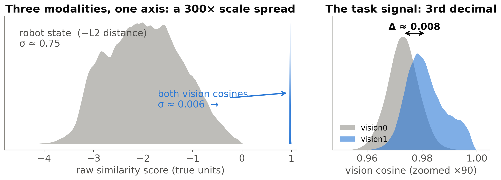
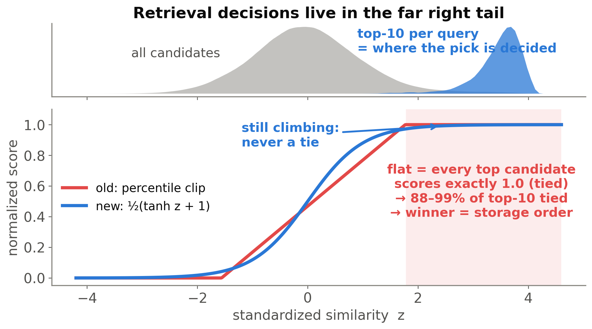
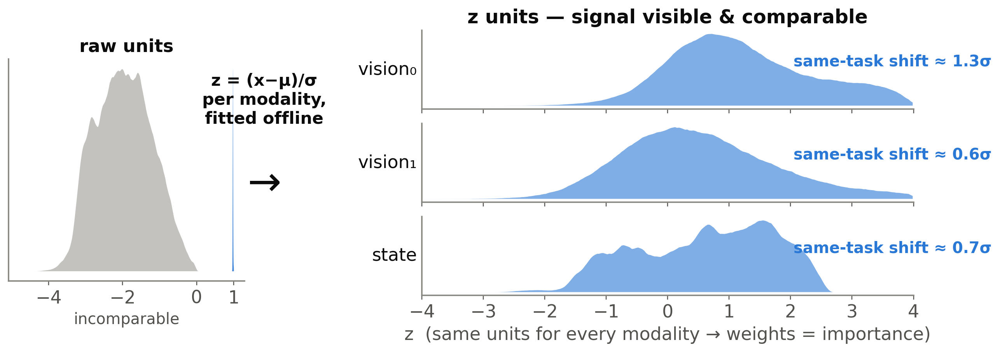
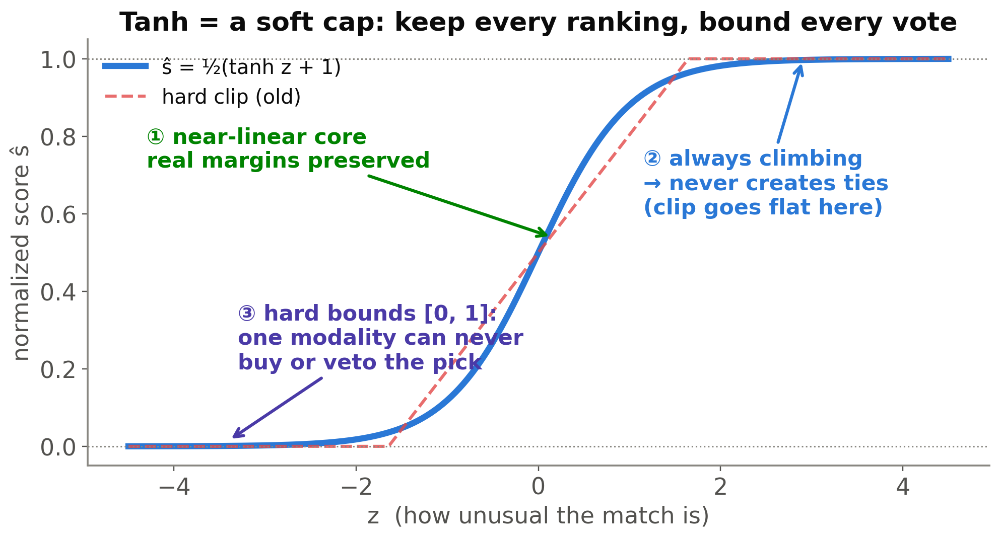
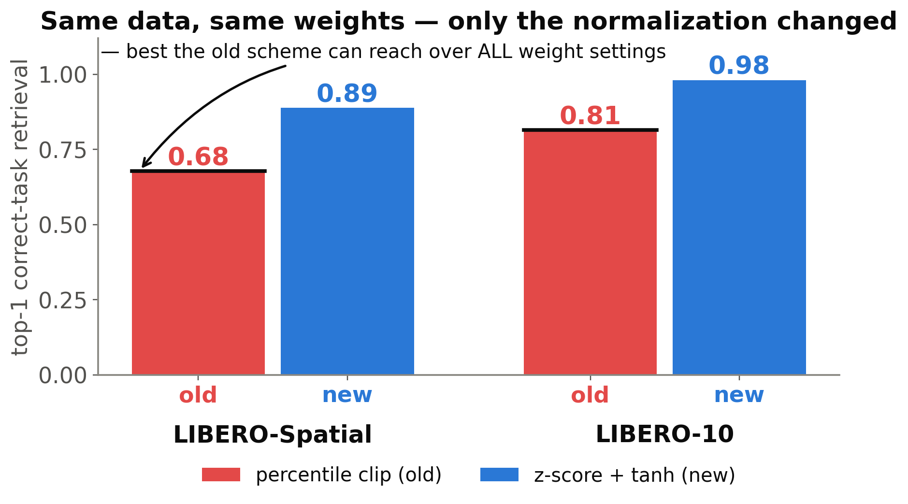
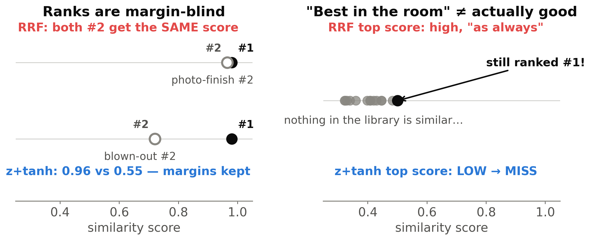
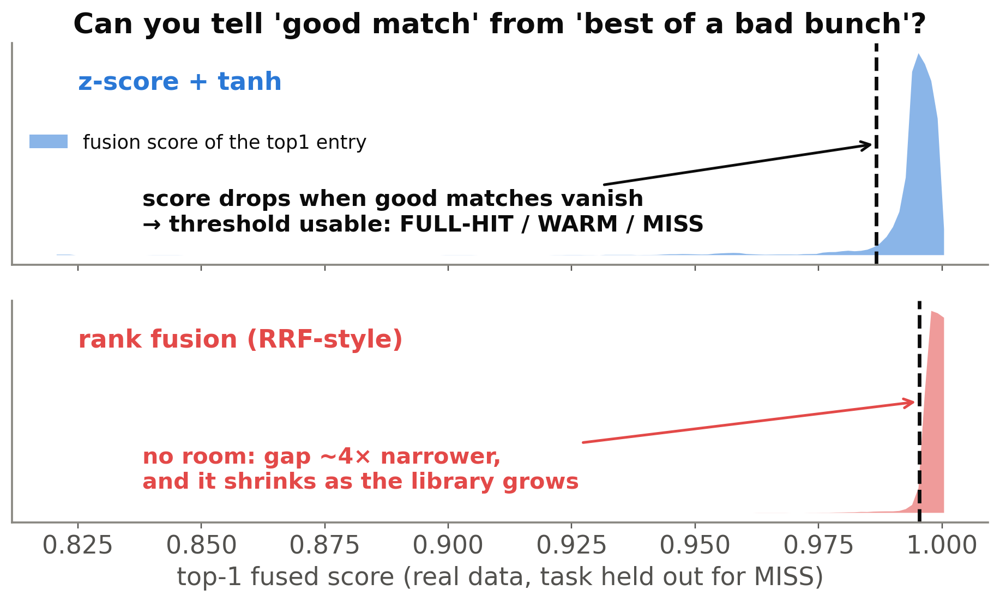

# Deck: Why Z-score + Tanh? (5 core slides + 2 RRF-comparison slides, English)

> 用途：向合作者解释 weighted-sum 检索为什么用 z-score+tanh 归一化（fusion_normalization_theory.md 的浓缩版）。Slides 1–5 为核心叙事；Slides 6–7 是 vs-RRF 对比加页（时间紧可只讲 7 或合并 6+7）。
> 每页 = 一句话标题（即该页论点）+ ≤4 短条 + 一张图。图在本目录：`ppt_fig1..7_*.png`（220dpi，宽幅，适合占半页~2/3 页）。
> Speaker notes 是讲稿要点，不上片。所有数字来自 fusion_theory 报告（真实 LIBERO 轨迹库，精确全量离线检索模拟）。
> 复现图：`uv run exp/weighted_sum/analysis/fusion_theory/ppt/make_ppt_figures.py --cache-dir <cache> --results ../results --out .`

---

## Slide 1 — Why z-score + tanh? Start from the data

**On-slide text:**
- Cache pick = weighted sum of 3 similarity scores: `w₁·vision₀ + w₂·vision₁ + w₃·state`
- Raw scales differ **300×** — the "loudest" modality would drown the rest
- The task signal is real but tiny: **the 3rd decimal** of a cosine

**Figure:**（全宽放中下部）

**Speaker notes:** Every cache step retrieves the most similar past experience by fusing three per-modality similarities. Left: on their true scales, both vision cosines are a needle at ~0.97 while state distance sprawls over four units — you cannot add these numbers meaningfully. Right: zooming ×90 into vision, same-task and different-task candidates DO separate — but by ~0.008 cosine. The whole normalization question is how to surface that third-decimal signal without letting scale artifacts decide the fusion.

---

## Slide 2 — Why the old percentile clip failed

**On-slide text:**
- Calibrated on the bulk: everything above the 95th percentile → clipped to **1.0**
- But retrieval compares the **top ~1%** — exactly the clipped zone
- Measured: **88–99%** of each query's top-10 tied at 1.0 → winner = **storage order**

**Figure:**（全宽）

**Speaker notes:** The old scheme rescaled scores by their 5th–95th percentile band and clipped the rest. Sounds harmless — it only touches 5% of the mass. But look where retrieval actually happens: the top-10 candidates per query (blue) all sit beyond the clip point. So all three modalities output exactly 1.0 for every serious candidate; the fused scores tie, and the "argmax" silently falls back to whatever was stored first. No weight tuning can repair this — the information was deleted before the weights ever saw it. Interestingly, aggregate metrics (like AUC over all pairs) barely move — the damage is invisible unless you look at the decision region.

---

## Slide 3 — Fix, part 1 — Z-score: one common language

**On-slide text:**
- `z = (x − μ)/σ` per modality, fitted offline = *"how unusual is this match?"*
- Signal becomes visible **and comparable**: same-task shift ≈ **0.6–1.3 σ**
- Weights now mean **importance** — no modality hijacks the sum by scale

**Figure:**（全宽）

**Speaker notes:** Z-scoring converts every raw similarity into "how many standard deviations above this modality's normal level". μ and σ are fitted offline from query-vs-library score distributions (leave-one-episode-out, mirroring serving). After the transform all three modalities live on the same axis and the same-task shift — 0.6 to 1.3 sigma — is directly visible. Two consequences: a shared weight grid finally means "importance" (we verified: without variance equalization, fusion degenerates to whichever modality has the widest output scale), and one fixed squash shape can now serve every modality and key-builder, since everything arrives at the same operating point.

---

## Slide 4 — Fix, part 2 — Tanh: a soft cap

**On-slide text:**
- ① Near-linear core → real margins preserved
- ② Always climbing → **never creates ties** (the clip goes flat)
- ③ Hard bounds [0,1] → one modality can never **buy or veto** the pick
- `ŝ = ½(tanh z + 1)` — the classic *tanh normalization* (biometric fusion, 2005)

**Figure:**（全宽）

**Speaker notes:** After z-scoring we squash with tanh. Three properties, each separately verified. One: in the core it is nearly linear, so genuine score margins survive. Two: unlike any hard clip it keeps strictly increasing, so no ties, ever — the failure mode of slide 2 is structurally impossible. Three: output is bounded, so a single modality's contribution is capped by its weight — in a spoofing test where we inflate one modality of a wrong-task candidate, an unbounded scheme hands it the pick in up to 34% of queries; tanh: 0%. And this exact map equals a logistic CDF — it is the well-established "tanh normalization" from multimodal biometrics, not an exotic choice. We also tested sigmoid, probit, arctan: all within 1 point — what matters is smooth + bounded + strictly increasing; tanh is the canonical member.

---

## Slide 5 — Result: normalization alone closes the gap

**On-slide text:**
- Same data, same weights: **0.68 → 0.89** (Spatial), **0.81 → 0.98** (LIBERO-10)
- No weight setting rescues the clip (black line = its best over ALL weights)
- Bonus: scores carry **absolute meaning** → thresholds work; *"nothing similar → just run the model"*
- Live: **74%** pure-replay success on LIBERO-Spatial

**Figure:**（左 2/3；右侧可留白放结论句）

**Speaker notes:** Head-to-head on identical data and weights, swapping only the normalizer: top-1 correct-task retrieval jumps ~20 points on both suites. The black line is the punchline against "just tune it better": we swept the entire weight simplex for the old scheme — its ceiling stays far below. Last, unlike rank-based fusions (RRF), these scores keep an absolute meaning: 0.98 means "extremely similar" regardless of what else is in the library. That's what makes hit/miss thresholds possible — the cache can say "nothing similar enough, fall back to inference", and thresholds stay valid as the library grows. Retrieval accuracy is only half the win; scores that mean something is the other half.

---

## Slide 6 — What about RRF? Ranks pick winners — but say nothing

**On-slide text:**
- RRF fuses **ranks**: `score = Σ w · 1/(60 + rank)` — our previous search strategy
- Picking top-1: nearly as good (ranks preserve order; fully tuned, within ~1 pt offline)
- But ranks are **margin-blind**: a photo-finish #2 ≡ a blown-out #2
- And *"best in the room"* ≠ actually good

**Figure:**（全宽）

**Speaker notes:** Fair question: our old search used weighted RRF, and rank fusion is a strong baseline. In theory ranks preserve each modality's ordering, so for pure "pick the winner" it should be close — and it is: with each method's weights fully searched, offline replay puts them within about a point, and on our live suites the tuned z-score+tanh came out on top. The structural difference is information. Left: two races with identical ranks — one #2 lost by a hair, the other by a mile; RRF scores them identically, z+tanh keeps the margin, which is exactly the evidence you need when modalities disagree. Right: in an empty room somebody still ranks #1 — a rank can never say "nobody here is any good". One more subtlety: RRF's 1/(k+60) shape squeezes most resolution into the very top ranks — slightly vote-like for libraries of a few thousand entries.

---

## Slide 7 — The decider: thresholds need meaning, not ranks

**On-slide text:**
- Our verdict layer **thresholds** the fused score: FULL-HIT / WARM / MISS
- z+tanh: score **drops** when good matches vanish from the library → a threshold fits, and stays valid
- RRF-style: top-1 ≈ ceiling either way — gap **~4× narrower**, shrinking as the library grows
- Both fully weight-tuned on our data: z+tanh matched-or-better **and** thresholdable → clear choice

**Figure:**（全宽）

**Speaker notes:** This is the deciding argument, on real data. The gray distribution is a controlled intervention: we remove the query's whole task from the library and record the best remaining match's score. Task identity is a relevance *proxy*, so we audited it without labels: after removal, the best match's action-chunk distance is 4–8× that of a genuine match, and only ~5–6% remain as action-reusable as a typical genuine one (those few score high — which is the score behaving correctly, not a false alarm). Top: z-score+tanh responds to this impoverishment — the score drops, a threshold in the gap yields FULL-HIT / WARM / MISS, and since the score means "σ above normal", the threshold stays meaningful as the library grows. Bottom: rank-fused scores hug the ceiling in both regimes — someone always ranks #1 — with a ~4× narrower corridor that provably shrinks with library size (~5× z+tanh advantage extrapolated at 100k entries). Equal at picking, unusable for judging — that's why we standardized on z-score + tanh.

---

### 附：页面布局速记

| Slide | 标题一句话论点 | 图 | 词数(含标题) |
|---|---|---|---|
| 1 | 三模态尺度差 300×，信号在小数点后三位 | fig1 | ~40 |
| 2 | percentile clip 恰好删掉决策区 | fig2 | ~40 |
| 3 | z-score = 统一语言，权重恢复语义 | fig3 | ~35 |
| 4 | tanh = 软帽：保序、保幅、封顶 | fig4 | ~42 |
| 5 | 只换归一化 +20pp；分数有绝对含义 | fig5 | ~45 |
| 6 | 秩挑第一名可以，但 margin 盲 + 说不出"没人合格" | fig6 | ~45 |
| 7 | threshold verdict 需要绝对含义——rank 给不了 | fig7 | ~50 |
