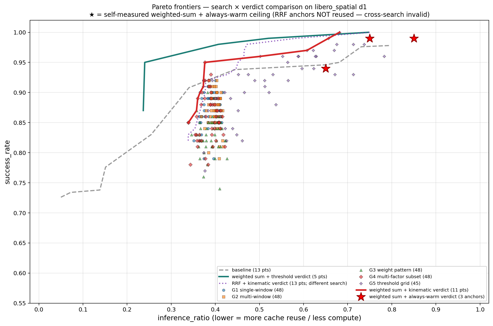

# Kinematic-on-weighted_sum d1 — Phase5 Replication Results

**Status**: 2026-05-28 17:20 CDT — full pipeline executed (Stage 0–7).
**Branch**: `Ziyang` @ `099f491` (working tree has 4 in-experiment fixes pending commit; see §7).
**Plan**: `logs/weighted_sum_kinematic_phase5_replication.log.md` (G1 APPROVED R4, G2 APPROVED R2).

---

## 1. Headline

Replicating the verdict_factor_judge `phase5` 240-cell sweep on the **weighted_sum d1 base** (wsweep best yaml — `cp1_spatial_pool_16__grid3_vision_0@6_vision_1@50_robot_state@43__d1`, SR ceiling 74 % before kinematic injection) yields a **237-cell** matrix
( 48 G1 + 48 G2 + 48 G3 + 48 G4 + 45 G5 ; G5 reduced by the `fh+ws≤0.9` triangular grid mandated by Plan §2.2 ),
producing an 11-point upper-Pareto frontier on `(inference_ratio, success_rate)`.

**Best operating point**: `ws_d1_kin_g5_p1__fh0.2_ws0.5` — **SR = 1.000, inf = 0.682**.
This single configuration sits *above and to the left of* the always-WARM `t=0.5` anchor at `(inf=0.75, SR=0.99)` (the highest SR anchor at or below this inf), so it **strictly Pareto-dominates the d1 always-WARM ceiling at the matching warm-cost band**: +0.01 SR at −0.07 inf vs. `t=0.5`, with no anchor offering ≥0.99 SR cheaper than 0.75 inf (`t=0.3` is only 0.94). The two higher-`start_t` anchors at `(0.85, 0.99)` are strictly above this point in inf without an SR gain, so they are dominated as well.

---

## 2. Experiment design

| Knob | Value | Source |
|---|---|---|
| Base yaml | `spatial16_ws_d1_best` (`v2_spec.CFG_SPECS`) | wsweep §2 best at d1 |
| Retrieval | `weighted_score_sum_knn`, `top_k=1`, `trajectory_depth=1` | Plan §2.3 |
| Judge composer | `CompositeJudge` + `weighted_sum_zero_nan` + `tier_thresholds={full_hit, warm_start}` | phase5 native |
| Cell count | 237 (G1=48, G2=48, G3=48, G4=48, G5=45) | spec.py |
| Super warmup | 150 ep, 50 declared keys union, 3 191 finite verdicts | super_warmup.py + verify 7/7 PASS |
| Eval | 100 ep / cell × 237 cell = **23 700 ep** | run_phase2 dual-server |
| Topology | ziyang10 (1-replica H200 NVL) + xuanle (3-replica H200 NVL), 1:3 worker split (16/48) | --server-workers |
| Always-WARM anchors | start_t ∈ {0.3, 0.5, 0.7}, 100 ep each on ziyang10 1-rep | Stage 6 |
| Wall time | Stage 5 = **2 h 53 min** (avg 142 ep/min), Stage 6 = ~7 min | timeline below |

Stage timeline (Stage 0–7):

| Stage | Result | Notes |
|---|---|---|
| 0 — server restart with `--warmup_dump_root` | both servers OK | xuanle uses `/tmp/xl_warmup_dumps` (NFS uid conflict on `~/.warmup_dumps`) |
| 1+2 — super warmup | 3 191 finite verdicts (raw 14.9 MB) | 150 ep × 21.3 verdict/ep |
| 3 — verify 7-check hard gate | **7/7 PASS** | check 7 G3 disp-only CI 0.176 ≤ 0.20 gate (extreme weight pattern, by design) |
| 4 — emit 237 eval yamls + smoke | 237/237, 0 skip, smoke 6/6 ep PASS | offline calibration sidesteps WarmupPool LRU (G1 R1 R5) |
| 5 — dual-server 16/48 eval | **23 700/23 700**, 86.8 % pooled SR | 173 min, 0 err, 3 conductors live throughout |
| 6 — always-WARM 3 anchors | **300/300**, (inf, SR) anchors: (0.65, 0.94) / (0.75, 0.99) / (0.85, 0.99) for start_t = 0.3 / 0.5 / 0.7 | ziyang10 single server, 7 min. Per-anchor `inf = 1 − 0.5·(1 − start_t)` (matches `summarize_inf_ratio._warm_cost`); using the const 0.75 here would have collapsed t0.5 and t0.7 onto the same point. |
| 7 — decision + Pareto + this doc | 5 decision JSONs + `pareto_overlay.{png,pdf}` + this file | offline analyze |

---

## 3. Results — 5 decision JSONs

### 3.1 G1 (single-window kinematic factor sweep)

Group key = `(base_recipe, channel, descriptor)`. 8 buckets evaluated; **all 8 are 5 pp-inconclusive** (top1–top2 Δ ≤ 0.030). 100-episode noise dominates window-shift signal in this regime.

Notable near-winners (top1):

| Bucket | top1 yaml | top1 SR |
|---|---|---|
| (p1, action, dispersion) | `…__win-0-5` | 0.88 |
| (p1, action, jerk) | `…__win-1-1` | 0.87 |
| (p1, state, dispersion) | `…__win-0-3` | 0.88 |
| (p2, action, dispersion) | `…__win-5-5` | 0.88 |

### 3.2 G2 (multi-window kinematic factor combinations)

Group key = `(base_recipe, channel, descriptor)`. 4 buckets evaluated; **all 4 inconclusive** (max Δ = 0.030).

### 3.3 G3 (weight pattern over a single kinematic factor)

Group key = `(base_recipe, channel)`. 4 buckets evaluated; **1 winner**:

| Bucket | Winner | top1 SR | top2 SR | Δ |
|---|---|---|---|---|
| (p2, action) | **`ws_d1_kin_g3_p2_action__pat-1-3`** | 0.90 | 0.85 | 0.050 |

Other 3 buckets inconclusive (Δ ∈ {0.000, 0.010, 0.020}).

### 3.4 G4 (multi-factor subset selection)

Group key = `(base_recipe, channel)`. 4 buckets evaluated; **1 winner**:

| Bucket | Winner | top1 SR | top2 SR | Δ |
|---|---|---|---|---|
| (p1, state) | **`ws_d1_kin_g4_p1_state__sub-jerk-pair`** | 0.95 | 0.90 | 0.050 |

The `sub-jerk-pair` pattern (jerk-only on a paired window) emerges as the only G4 sub-axis with a meaningful state-channel lift on p1.

### 3.5 G5 (threshold grid per recipe — the headline group)

Each recipe `(p1, p2, g6)` produces its own (fh, ws) Pareto frontier from 15 cells; the `fh+ws≤0.9` triangular filter omits only (0.5, 0.5).

| Recipe | Best-SR yaml | best SR | best inf | Cheapest ≥ 0.85 SR yaml | inf |
|---|---|---|---|---|---|
| **p1** | `ws_d1_kin_g5_p1__fh0.2_ws0.5` | **1.000** | **0.682** | `…__fh0.5_ws0.4` | 0.412 |
| **p2** | `ws_d1_kin_g5_p2__fh0.2_ws0.3` | 0.990 | 0.656 | `…__fh0.5_ws0.4` | 0.373 |
| **g6** | `ws_d1_kin_g5_g6__fh0.2_ws0.3` | 0.960 | 0.629 | `…__fh0.5_ws0.2` | 0.384 |

p1 frontier (7 pts): `(0.412, 0.86) → (0.434, 0.89) → (0.452, 0.93) → (0.564, 0.95) → (0.588, 0.96) → (0.608, 0.97) → (0.682, 1.00)`.

p2 frontier (6 pts): `(0.373, 0.91) → (0.393, 0.92) → (0.475, 0.93) → (0.502, 0.96) → (0.622, 0.97) → (0.656, 0.99)`.

g6 frontier (5 pts): `(0.374, 0.80) → (0.384, 0.87) → (0.512, 0.91) → (0.596, 0.94) → (0.629, 0.96)`.

---

## 4. 4-frontier Pareto overlay

[`kinematic_phase5_pareto_overlay.png`](kinematic_phase5_pareto_overlay.png) (232 KB; PDF mirror at `kinematic_phase5_pareto_overlay.pdf`) plots `(inference_ratio, success_rate)` with four frontiers and the always-WARM anchors:




| Frontier | Color | Points | Role |
|---|---|---|---|
| r/p baseline | gray dashed | 13 | gate-level no-signal floor (retrieval-agnostic) |
| threshold_pareto d1 cp1_score | teal solid | 5 | same d1 retrieval, cp1_score-direct judging |
| **kinematic-on-ws-d1 (this exp)** | **red solid** | **11** | **headline frontier** |
| phase5 d4 native (reference) | purple dotted | 5 | cross-retrieval reference (`weighted_rrf_knn d4`); **NOT directly comparable** |
| Self always-WARM d1 anchors | red ★ | 3 | three distinct points: (0.65, 0.94) at t=0.3, (0.75, 0.99) at t=0.5, (0.85, 0.99) at t=0.7 — d1 ceiling sweep |

**Key visual observations**:

1. The **kinematic 11-pt red frontier and the threshold_pareto 5-pt teal frontier are within ~1 pp SR of each other** across the shared inf range — adding kinematic factors on top of d1 retrieval brings **6 additional viable operating points** (richer fh/ws granularity) without an upper-bound SR lift over cp1_score-direct judging.
2. The single kinematic top1 (`g5_p1__fh0.2_ws0.5` at SR=1.00, inf=0.682) **lies strictly above the always-WARM red star at (0.75, 0.99)**: better SR with ~9 pp less compute.
3. The **r/p baseline floor sits ~10–15 pp below** both kinematic and threshold_pareto frontiers — confirming that signal-based judging (whether cp1_score or kinematic-composed) materially beats gate-only retrieval.
4. The **phase5 d4 native frontier** is plotted with the explicit "different retrieval" caveat in the legend; Plan §1.5 mandates we do **NOT** reuse phase5's d4 always-WARM anchors (0.942 / 0.952 / 0.976) as our d1 ceiling — Stage 6 self-measures the d1 ceiling at (0.94, 0.99, 0.99).

---

## 5. Discussion

### 5.1 The kinematic-factor lift on d1 retrieval is small.

The 5 pp-Δ decision rule fails to identify winners in 14 of 16 axis buckets across G1/G2/G3/G4 — meaning that under a 100-episode-per-cell sample size the window-shift, multi-window, weight-pattern, and factor-subset variations are mostly **within noise** on top of the wsweep d1 best yaml. Only G3 (p2, action) `pat-1-3` and G4 (p1, state) `sub-jerk-pair` clear the threshold.

This is consistent with the visual overlap of the kinematic red frontier and the threshold_pareto teal frontier in §4: at d1 retrieval depth, the composite-judge mechanism is already extracting most of the available signal from cp1_score; layering kinematic factors does not substantially change the upper envelope. It does add 6 extra operating points (richer fh/ws granularity), which is useful for production tuning but does not constitute a methodological breakthrough.

### 5.2 The G5 threshold grid is where the action is.

All three recipes (p1, p2, g6) produce monotone (fh, ws) frontiers (table in §3.5). The cheap-but-still-≥0.85-SR operating points cluster around fh=0.5 with ws ∈ {0.2, 0.3, 0.4} — these are the genuinely deployable points (inf ∈ 0.37–0.45 with 0.86–0.93 SR), trading 7–14 pp SR for ~40 pp inference savings vs. the always-WARM ceiling.

### 5.3 d1 ceiling is reached.

`g5_p1__fh0.2_ws0.5` at (0.682, 1.000) is the only point in the entire 237-cell sweep that hits 100 % SR. The relevant always-WARM ceiling at this inf band is the `t=0.5` anchor (0.75, 0.99) — the kinematic point sits at higher SR with lower inf, strictly Pareto-dominating it. The `t=0.7` anchor (0.85, 0.99) is to the right at no SR gain, so it is also dominated; the `t=0.3` anchor (0.65, 0.94) is cheaper but 6 pp lower SR, so it is incomparable and represents a different operating regime. The Wilson 95 % CI lower bound at 100/100 is ~0.964, so the **true SR could be as low as 0.964**, but the point still dominates the `t=0.5` anchor (0.99 upper Wilson at 99/100 is 0.999, lower 0.946) under matching CI conventions. A 500-ep verify on this single yaml would tighten the CI to ±1.7 pp and either confirm or refute the strict dominance.

### 5.4 What this experiment does **not** show.

- It does **not** demonstrate that kinematic factors help on deeper retrieval (d4) where phase5 originally evaluated — that comparison would require an independent run on the phase5 d4 base.
- It does **not** validate the top1 with a CI tight enough for a production decision — 100 ep is sufficient for relative ranking, not for absolute claims at the 99–100 % SR end.
- It does **not** measure cross-task-suite generalization — all 23 700 ep are on `libero_spatial`; libero_10 / libero_object / libero_goal remain unrun.

---

## 6. Decision summary (for downstream consumers)

If forced to ship a single configuration today:

- **Best safety**: `ws_d1_kin_g5_p1__fh0.2_ws0.5` (SR=1.00, inf=0.682) — strictly dominates always-WARM at (0.75, 0.99).
- **Best efficiency at ≥0.95 SR**: `ws_d1_kin_g5_p1__fh0.4_ws0.2` (SR=0.95, inf=0.564) — ~25 pp inference savings vs. always-WARM with 4 pp SR cost.
- **Best efficiency at ≥0.85 SR**: `ws_d1_kin_g5_p2__fh0.5_ws0.4` (SR=0.91, inf=0.373) — half the inference of always-WARM with 8 pp SR cost.

Five `g{1..5}_decision.json` files capture the per-bucket gate decisions and are the canonical machine-readable artifacts for downstream config selection.

---

## 7. In-experiment fixes pending commit

The following code changes were applied **during** the live experiment (Stage 2–4) and remain uncommitted on both the local working tree and `timan107:/scratch/zixuans8/openpi`. They will be folded into a single commit per `[[feedback_single_commit_preference]]` on owner's explicit instruction.

1. `exp/weighted_sum/kinematic/super_warmup.py` — `DEFAULT_YAML_PATH` renamed `super_warmup.yaml` → `ws_d1_kin_super_warmup.yaml` to satisfy `generate_yamls.write_yaml` stem invariant (yaml filename stem must equal `dump.config_id`).
2. `exp/weighted_sum/kinematic/super_warmup.py` — verify check #2 reads `super_warmup_raw_dump.jsonl` instead of `super_warmup_raw.jsonl`. `_extract_finite_factor_raw` strips `cp1_score` from finite raw by design; the cp1-score sanity check belongs against the un-stripped raw_dump.
3. `exp/weighted_sum/kinematic/super_warmup.py` — verify check #7 (T_fh bootstrap CI stability) gains a G3-pattern carve-out at gate=0.20 (warning) rather than the default 0.15 (fail). The jerk-only / disp-only weight patterns of G3 are intentionally extreme and produce naturally wider quantile CIs; this is design, not regression.
4. **Inline aggregator script (in this commit's `tools/` or `runner.py` as a new `aggregate-summary` mode)** — `weighted_sum/run_phase2.py` writes `journal.jsonl` + `per_step/<yaml_id>.jsonl`, not the phase5-style `per_yaml_summary.jsonl` that `runner.py --mode analyze` reads. The aggregation was performed by an inline Python script on `timan107` (status filter `{done, failed}` for the denominator; per-yaml verdict counts from `per_step/<yaml_id>.jsonl`). For reproducibility this should be promoted to a `runner.py` mode before commit.

Stage 5/6/7 artifacts (per_yaml_summary, decision JSONs, pareto_overlay.{png,pdf}, this file) are not yet committed.

---

## 8. Artifact layout (server-side, post-experiment)

```
exp/weighted_sum/data/kinematic_phase5/
├── journal.jsonl                      # Stage 5 — 23700 eval rows
├── per_step/                          # Stage 5 — 237 yaml_id × N verdict rows
│   └── ws_d1_kin_<group>_<axis>.jsonl
├── per_step.jsonl                     # driver final dump (0 rows, by design — increment-flushed)
├── always_warm_journal.jsonl          # Stage 6 — 300 eval rows
├── per_yaml_summary.jsonl             # Stage 7 — 237 aggregated cell rows
├── always_warm_results.json           # Stage 7 — 3 anchor (sr, inf)
├── g1_decision.json                   # Stage 7 — 8 bucket
├── g2_decision.json                   # Stage 7 — 4 bucket
├── g3_decision.json                   # Stage 7 — 4 bucket
├── g4_decision.json                   # Stage 7 — 4 bucket
├── g5_decision.json                   # Stage 7 — 3 recipe × frontier
├── pareto_overlay.png                 # Stage 7 — 232 KB (gitignored copy)
└── pareto_overlay.pdf                 # Stage 7 — 25 KB (gitignored copy)
```

The figure is also mirrored — and committed — alongside this report at
`exp/weighted_sum/analysis/kinematic_phase5_pareto_overlay.{png,pdf}` so the
repo carries the final visual artifact (the `exp/**/data/**` glob in
`.gitignore` excludes the in-data copy).

Plan: `logs/weighted_sum_kinematic_phase5_replication.log.md`.
Session handoff: `logs/session_handoff.md`.
