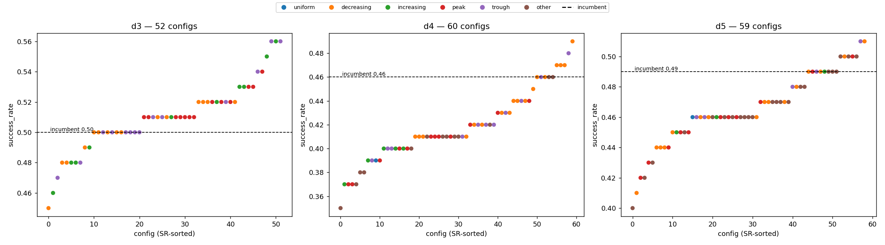

# Trajectory step-weight screening — results (libero_10)

> **Headline**: An unbiased screening search over 171 `trajectory_weights` shapes
> (d3/d4/d5) on **libero_10** finds a **numerical** signal that *non-decreasing* shapes
> (trough / increasing — i.e. de-emphasizing the current step) score highest, with the
> best **d3** config reaching SR **0.56** — above both the fixed-decreasing incumbent
> (0.50, ΔSR +0.06) and the d1 (no-trajectory) prior (0.52). **But the signal is not
> statistically significant**: only 1 of 171 configs has a bootstrap ΔCI excluding 0 (and
> its McNemar p = 0.070 > 0.05), no config survives multiple-comparison correction, and at
> **d4/d5 the best config still falls below the d1 prior**. So on libero_10 the
> collaborator's hypothesis (fixed-decreasing per-step weights are unreasonable and cause
> d1 > d3/d4/d5) gets **weak, directional, d3-only support** — materially different from
> libero_spatial, where nothing beat the incumbent and nothing reached d1 — but this remains
> a **screening candidate, not a verdict**.
>
> Status: `Implemented` (run + analysis done). Branch `Ziyang`. Plan:
> [`logs/weighted_sum_trajectory_weight_alloc_libero10.log.md`](../../../../logs/weighted_sum_trajectory_weight_alloc_libero10.log.md).
> Sibling libero_spatial study:
> [`analysis/libero_spatial/trajectory_weight_alloc/results.md`](../../libero_spatial/trajectory_weight_alloc/results.md).
> Machine-readable full per-config paired stats: `data/.../decision.json`.

---

## 1. Design

- **Question**: does re-searching the per-step `trajectory_weights` (never re-tuned since
  the old trajectory experiment) recover the d1 > d3/d4/d5 gap on libero_10 — and does the
  libero_spatial "decreasing is already near-optimal" conclusion generalize to this harder,
  long-horizon suite?
- **Method**: per depth reuse that depth's own libero_10 base (modality weights from the
  tracked non-lossy `LIBERO10_BASE_MANIFEST` + zscore normalizer + `cp1_spatial_pool_16`
  keybuilder + `always_hit` judge + `write_policy=never`), sweep **only** `trajectory_weights`.
  `always_hit` replays the top-1 ranked entry, so only the ranking (weight *shape*) affects SR.
- **Per-depth base modality weights** (tracked manifest, deep-diff=0 vs real base YAMLs):
  d3 `grid_vision_0@62_vision_1@37` = 0.62/0.37/0.00; d4 `grid3_..._25_43_31` = 0.25/0.4375/0.3125;
  d5 `grid_vision_0@50_vision_1@50` = 0.50/0.50/0.00.
- **Search matrix** (union, canonical-dedup — identical shape set to libero_spatial, dataset-independent):
  **171 configs** — d3=52 / d4=60 / d5=59. S1 current-dominant × geometric tail gradient
  (c∈{0.20..0.90}, q∈{0.5,1.0,2.0}), S2 simplex shape lattice (increasing / peak / U / uniform),
  S3 incumbent anchors. Excludes current_only (=d1) and trailing-zero (=depth collapse).
  Incumbent `trajectory_weights` are the same task-independent hardcoded scheme as libero_spatial
  (d3 [0.5,0.3,0.2], d4 [0.4,0.3,0.2,0.1], d5 [0.35,0.25,0.2,0.12,0.08]).
- **Scale / topology**: 171 × 100 ep = **17,100 ep**. Client timan107 (48 workers / 8 GPU)
  → server jupyter-ziyang10 (pi05_libero, 3 replicas, `cp1_spatial_pool_16`, **2640 entries**),
  runtime cache-config injection (server bootstrapped spatial, swapped to the libero_10 pool
  on first request). Held-out inits (`libero_10_init_map.json`), task_ids 0-9 × 10 trials.
  Wall time **~20.7 h** (~0.23 ep/s — ~10× slower than libero_spatial's 2.2 ep/s because
  libero_10 episodes are long-horizon). Aggregate SR **0.462** (7903/17100); 0 errors, 0 ALERTs,
  conductor exited cleanly.
- **Stats**: paired by `task_uid` (same (task_id, episode_idx) = same init across configs)
  → per-config McNemar exact p + fixed-seed paired-bootstrap ΔSR CI (2000 resamples) vs that
  depth's incumbent. d1 prior read from `data/libero_10/phase2/all_results.csv`.

## 2. Findings

**(a) Only d3 reaches the d1 prior.** d1 prior SR = **0.52** (non-decisive prior-run
reference). Per-depth best SR: **d3 = 0.56 (> d1 by +0.04), d4 = 0.49 (< d1 by −0.03),
d5 = 0.51 (< d1 by −0.01)**. This is the key contrast with libero_spatial, where *all three*
depths' best fell below d1.

**(b) The best shapes are non-decreasing, but the win is not significant.** The three
top d3 configs (SR 0.56, ΔSR +0.06 vs incumbent) are **trough** and **increasing** shapes
that put weight on *later* cached trajectory steps, not the current step. Only **one** config
across all 171 has a bootstrap ΔCI that excludes 0 — d3 trough `s2_5-2-3` (w=[0.5,0.2,0.3]),
CI [+0.01, +0.12] — and even it has **McNemar p = 0.070 (> 0.05)**. Every other candidate's
CI straddles 0 with McNemar p ≥ 0.3. No config survives multiple-comparison correction
(52 d3 configs, Bonferroni α ≈ 0.001).

**(c) Shape signal (best SR per shape, across depths):**

| shape | best SR |
|---|---|
| trough | **0.56** |
| increasing | **0.56** |
| peak | 0.54 |
| decreasing | 0.52 |
| other | 0.50 |
| uniform | **0.46** |

On libero_10 the ordering is **inverted relative to libero_spatial**: here shapes that
*de-emphasize the current step* (trough / increasing) rank highest and the fixed-decreasing
family sits mid-pack, whereas on libero_spatial current-dominant (peak / decreasing) ranked
top. Uniform remains the worst on both suites. Read cautiously — the top-to-decreasing gap
(0.56 vs 0.52) is +0.04, inside the ±5-7pp single-cell noise band.

### Top-k candidates per depth (paired vs incumbent)

## d3 — 52 configs (incumbent SR 0.50)

| rank | id tail | shape | curr_dom | SR | ΔSR vs inc | boot CI | McNemar p |
|---|---|---|---|---|---|---|---|
| 1 | `3__s2_2-1-7` | trough |  | 0.56 | +0.060 | [−0.030, +0.160] | 0.307 |
| 2 | `3__s2_2-3-5` | increasing |  | 0.56 | +0.060 | [−0.030, +0.150] | 0.307 |
| 3 | `3__s2_5-2-3` | trough |  | 0.56 | +0.060 | **[+0.010, +0.120]** | 0.070 |
| 4 | `3__s1_c20_q10` | increasing |  | 0.55 | +0.050 | [−0.030, +0.130] | 0.302 |
| 5 | `3__s1_c50_q20` | trough |  | 0.54 | +0.040 | [−0.020, +0.110] | 0.388 |

## d4 — 60 configs (incumbent SR 0.46)

| rank | id tail | shape | curr_dom | SR | ΔSR vs inc | boot CI | McNemar p |
|---|---|---|---|---|---|---|---|
| 1 | `4__s1_c60_q10` | decreasing | Y | 0.49 | +0.030 | [−0.020, +0.080] | 0.453 |
| 2 | `4__s1_c60_q20` | trough | Y | 0.48 | +0.020 | [−0.040, +0.080] | 0.754 |
| 3 | `4__s1_c50_q10` | decreasing |  | 0.47 | +0.010 | [−0.050, +0.070] | 1.000 |
| 4 | `4__s2_4-2-1-1` | decreasing |  | 0.47 | +0.010 | [−0.020, +0.050] | 1.000 |
| 5 | `4__s2_5-1-1-1` | decreasing | Y | 0.47 | +0.010 | [−0.050, +0.070] | 1.000 |

## d5 — 59 configs (incumbent SR 0.49)

| rank | id tail | shape | curr_dom | SR | ΔSR vs inc | boot CI | McNemar p |
|---|---|---|---|---|---|---|---|
| 1 | `5__s1_c60_q20` | trough | Y | 0.51 | +0.020 | [−0.060, +0.100] | 0.804 |
| 2 | `5__s1_c80_q10` | decreasing | Y | 0.51 | +0.020 | [−0.040, +0.080] | 0.754 |
| 3 | `5__s1_c80_q20` | other | Y | 0.50 | +0.010 | [−0.060, +0.080] | 1.000 |
| 4 | `5__s1_c90_q05` | decreasing | Y | 0.50 | +0.010 | [−0.060, +0.080] | 1.000 |
| 5 | `5__s1_c90_q20` | other | Y | 0.50 | +0.010 | [−0.060, +0.080] | 1.000 |

## 3. Discussion — what this does NOT prove

- **Not a verdict.** 100 ep/config gives a single-cell CI of ≈ ±5-7pp. Of 171 configs,
  exactly **one** (d3 trough `s2_5-2-3`) has a bootstrap ΔCI excluding 0, and its McNemar
  exact p = 0.070 still fails the uncorrected 0.05 bar. The other +0.06 d3 configs have CIs
  spanning [−0.03, +0.16]. These are **screening candidates**, not adjudicated winners.
- **No multiple-comparison correction.** 52 d3 configs were ranked; finding one with a
  bootstrap CI barely off zero (lo = +0.01) is roughly what winner's-curse predicts from
  ranking many near-equal cells. Under Bonferroni (α ≈ 0.05/52 ≈ 0.001) nothing is significant.
  "Trough beats decreasing" must not be read off this screen.
- **d1 is a non-same-batch prior** (SR 0.52; ziyang10+xuanlel2 homogeneous H200, a *different*
  Stage-1-partial run, not re-measured in this batch). "d3 exceeds d1" is therefore directional,
  not a strict same-batch dominance claim; the d4/d5 "below d1" statements carry the same caveat.
- **Absolute SR is low (~0.46-0.56)** because libero_10 is a hard long-horizon suite; that is
  expected and does not affect the within-suite paired comparison (all 171 configs + incumbent
  share the same server, pkl, and held-out inits).
- **Scope**: libero_10, d3/d4/d5, `cp1_spatial_pool_16` + `always_hit` only. Says nothing about
  other keybuilders, datasets, or non-always_hit judges.
- **What it does suggest (as a candidate, not a claim)**: unlike libero_spatial, on libero_10
  **d3** the fixed-decreasing weighting may be *mildly* suboptimal — non-decreasing shapes that
  weight later cached steps numerically lift d3 above both the incumbent and the d1 prior. This
  is the first place in either suite where re-weighting *closes and slightly overshoots* the gap
  to d1, so the "fixed-decreasing is the cause of d1 > d3" hypothesis is **not refuted on
  libero_10 d3** the way it was on libero_spatial. It is neither confirmed (no significance) nor
  extended to d4/d5 (best still < d1).
- **Recommended follow-up**: confirmatory rerun of the top-k d3 candidates (trough `s2_5-2-3`
  w=[0.5,0.2,0.3], increasing `s2_2-3-5` w=[0.2,0.3,0.5], trough `s2_2-1-7` w=[0.2,0.1,0.7])
  plus the incumbent, at a much larger sample (500-1000 ep) with a **same-batch d1 anchor** and
  multiple-comparison correction, to turn the d3 screening signal into a decision.

## 4. Decision recommendation

- **No production weight change** on the strength of this screen alone — the single CI-excluding-0
  candidate does not clear McNemar 0.05 or multiple-comparison correction.
- **Best screening candidate to confirm**: d3 non-decreasing shapes, headlined by trough
  `s2_5-2-3` (w=[0.5,0.2,0.3], SR 0.56, ΔSR +0.06, CI [+0.01,+0.12], McNemar p=0.070).
- **Directional takeaway**: on libero_10, later-step-weighted (trough/increasing) trajectory
  shapes are the region worth a confirmatory study; on libero_spatial the incumbent decreasing
  was already near-optimal. The suites disagree on shape ordering — a real cross-dataset finding
  to fold into the follow-up design.

## 5. In-experiment items pending commit

- None. No code changed during the run; the emitter/analyze code for this study already landed
  in commit `fb4f554`. This report + plot are the only new committable artifacts.

## 6. Artifact layout

- **Server-side** (jupyter-ziyang10, gitignored): eval yamls re-emittable from tracked
  calibration + manifest; pkl `cp1_spatial_pool_16` for libero_10 (2640 entries; loaded via
  runtime `load_cache_config` injection, backend_pool fingerprint verified in server log).
- **Raw** `data/libero_10/trajectory_weight_alloc/` (gitignored): `journal.jsonl`
  (17,100 rows, sha256 `77ceea9c…`, byte-identical local↔timan107), `results.json`
  (171 per-yaml summaries), `decision.json` (all-171 paired stats + d1 prior).
- **Committable** `analysis/libero_10/trajectory_weight_alloc/`: this `results.md` +
  `stepweight_sr_by_depth.png`.
- **Reproducibility**: configs regenerable from tracked calibration + `LIBERO10_BASE_MANIFEST`
  (non-lossy per-depth float weights) + winner cid; 171 eval yamls emitted locally, pushed to
  timan107 with rollup sha256 `f4da7b8d…` byte-identical.
