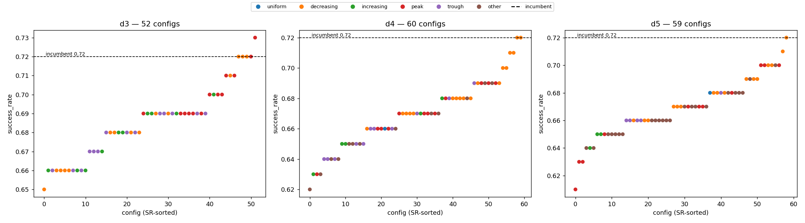

# Trajectory step-weight screening — results (libero_spatial)

> **Headline**: An unbiased screening search over 171 `trajectory_weights` shapes
> (d3/d4/d5) finds **no shape that significantly beats the incumbent
> fixed-decreasing scheme**, and **no trajectory config reaches the d1 (no-trajectory)
> prior**. The collaborator's hypothesis — that unreasonable fixed-decreasing per-step
> weights cause the observed d1 > d3/d4/d5 regression — is **not supported** by this
> screening. Screening only: ranked candidates + paired uncertainty, NOT a verdict.
>
> Status: `Implemented` (run + analysis done). Branch `Ziyang`. Plan:
> [`logs/weighted_sum_trajectory_weight_alloc.log.md`](../../../../logs/weighted_sum_trajectory_weight_alloc.log.md).
> Machine-readable full per-config paired stats: `data/.../decision.json`.

---

## 1. Design

- **Question**: does re-searching the per-step `trajectory_weights` (never re-tuned
  since the old trajectory experiment) recover the d1 > d3/d4/d5 gap?
- **Method**: per depth reuse that depth's own base (modality weights + zscore
  normalizer + `cp1_spatial_pool_16` keybuilder + `always_hit` judge + `write_policy=never`),
  sweep **only** `trajectory_weights`. `always_hit` replays the top-1 ranked entry, so
  only the ranking (weight *shape*) affects SR.
- **Search matrix** (union, canonical-dedup): **171 configs** — d3=52 / d4=60 / d5=59.
  S1 current-dominant × geometric tail gradient (c∈{0.20..0.90}, q∈{0.5,1.0,2.0},
  covers near-d1 boundary), S2 simplex shape lattice (increasing / peak / U / uniform),
  S3 incumbent anchors. Excludes current_only (=d1) and trailing-zero (=depth collapse).
- **Scale / topology**: 171 × 100 ep = **17,100 ep**. Client timan107 (48 workers / 8 GPU)
  → server jupyter-ziyang10 (pi05_libero, 3 replicas, `cp1_spatial_pool_16`, 1018 entries).
  Held-out inits (`libero_spatial_init_map.json`), task_ids 0-9 × 10 trials. Wall time ~2h13m
  (~2.2 ep/s). Aggregate SR 0.674; 0 errors, 0 ALERTs.
- **Stats**: paired by `task_uid` (same (task_id, episode_idx) = same init across configs)
  → per-config McNemar exact p + fixed-seed paired-bootstrap ΔSR CI vs that depth's incumbent.

## 2. Findings

**(a) No trajectory config reaches d1.** d1 prior SR = **0.74** (non-decisive prior-run
reference). Per-depth best SR: **d3=0.73, d4=0.72, d5=0.72** — all below d1.

**(b) No shape significantly beats the incumbent.** Across all 171 configs, the set of
configs with ΔSR>0 **and** McNemar p<0.05 is **empty**. For d4/d5 the incumbent
(fixed-decreasing) *is* the top config; for d3 one peak shape (`s2_2-6-2`) edges it by
+0.010 but McNemar p=1.000 and the bootstrap CI straddles 0 → within noise.

**(c) Shape signal (best SR per shape, across depths):**

| shape | best SR |
|---|---|
| peak | 0.73 |
| decreasing | 0.72 |
| increasing | 0.70 |
| other | 0.70 |
| trough | 0.69 |
| uniform | **0.68** |

Current-step-dominant shapes (decreasing / near-current peak) rank highest; spreading
weight to older steps (uniform / increasing / trough) ranks lowest — uniform is the worst.
This is the opposite of a "uniform is fairer / decreasing is unreasonable" expectation.

### Top-k candidates per depth (paired vs incumbent)

## d3 — 52 configs (incumbent SR 0.72)

| rank | id tail | shape | curr_dom | SR | ΔSR vs inc | boot CI | McNemar p |
|---|---|---|---|---|---|---|---|
| 1 | `3__s2_2-6-2` | peak |  | 0.73 | +0.010 | [-0.040, +0.070] | 1.000 |
| 2 | `3__incumbent` | decreasing |  | 0.72 | +0.000 | [+0.000, +0.000] | 1.000 |
| 3 | `3__s1_c40_q05` | decreasing |  | 0.72 | +0.000 | [-0.040, +0.040] | 1.000 |
| 4 | `3__s1_c50_q05` | decreasing |  | 0.72 | +0.000 | [+0.000, +0.000] | 1.000 |
| 5 | `3__s2_1-7-2` | peak |  | 0.72 | +0.000 | [-0.050, +0.050] | 1.000 |

## d4 — 60 configs (incumbent SR 0.72)

| rank | id tail | shape | curr_dom | SR | ΔSR vs inc | boot CI | McNemar p |
|---|---|---|---|---|---|---|---|
| 1 | `4__incumbent` | decreasing |  | 0.72 | +0.000 | [+0.000, +0.000] | 1.000 |
| 2 | `4__s2_3-3-1-1` | decreasing |  | 0.72 | +0.000 | [+0.000, +0.000] | 1.000 |
| 3 | `4__s1_c90_q05` | decreasing | Y | 0.71 | -0.010 | [-0.070, +0.050] | 1.000 |
| 4 | `4__s2_3-2-2-1` | decreasing |  | 0.71 | -0.010 | [-0.040, +0.020] | 1.000 |
| 5 | `4__s1_c40_q05` | decreasing |  | 0.70 | -0.020 | [-0.050, +0.000] | 0.500 |

## d5 — 59 configs (incumbent SR 0.72)

| rank | id tail | shape | curr_dom | SR | ΔSR vs inc | boot CI | McNemar p |
|---|---|---|---|---|---|---|---|
| 1 | `5__incumbent` | decreasing |  | 0.72 | +0.000 | [+0.000, +0.000] | 1.000 |
| 2 | `5__s1_c60_q05` | decreasing | Y | 0.71 | -0.010 | [-0.070, +0.050] | 1.000 |
| 3 | `5__s1_c20_q05` | peak |  | 0.70 | -0.020 | [-0.060, +0.020] | 0.625 |
| 4 | `5__s1_c30_q05` | peak |  | 0.70 | -0.020 | [-0.060, +0.020] | 0.625 |
| 5 | `5__s1_c40_q05` | decreasing |  | 0.70 | -0.020 | [-0.060, +0.020] | 0.625 |

## 3. Discussion — what this does NOT prove

- **Not a verdict.** 100 ep/config gives a single-cell CI of ≈ ±5-7pp; every reported ΔSR
  vs incumbent sits inside its bootstrap CI (CI straddles 0) with McNemar p ≥ 0.5. These are
  **screening candidates**, not adjudicated winners.
- **No multiple-comparison correction.** 171 configs were ranked; the best d3 peak (+0.010)
  is exactly the kind of within-noise fluctuation expected from ranking many near-equal cells
  (winner's curse). It must not be read as "peak beats decreasing".
- **d1 is a non-same-batch prior** (SR 0.74, same ziyang10 H200 series but a *different run*,
  not re-measured in this batch). The "trajectory can't reach d1" statement is therefore
  directional, not a strict same-batch dominance claim.
- **Scope**: libero_spatial only; d3/d4/d5 only; `cp1_spatial_pool_16` + `always_hit` only.
  Says nothing about other keybuilders, datasets, or non-always_hit judges.
- **What it does support (as a candidate)**: the fixed-decreasing per-step weighting is
  **not the cause** of the d1 > d3/d4/d5 regression — decreasing is already near the top of
  the shape ranking, and no re-weighting closes the gap to d1. This redirects the likely
  cause toward *having trajectory depth > 1 at all* (extra history steps add mismatched
  neighbors that the ranking cannot fully discount), to be tested separately.
- **Recommended follow-up**: confirmatory rerun of the top-k candidates (incumbent + d3 peak
  `s2_2-6-2`) at a much larger sample (e.g. 500-1000 ep) with a same-batch d1 anchor, to turn
  these screening candidates into a decision.

## 4. Artifact layout

- **Server-side** (jupyter-ziyang10, gitignored): eval yamls re-emitted from tracked
  calibration; pkl `cp1_spatial_pool_16` (1018 entries, content-identical to local).
- **Raw** `data/libero_spatial/trajectory_weight_alloc/` (gitignored): `journal.jsonl`
  (17,100 rows, sha256 `97536af1…`), `results.json` (171 per-yaml summaries),
  `decision.json` (all-171 paired stats + d1 prior).
- **Committable** `analysis/libero_spatial/trajectory_weight_alloc/`: this `results.md` +
  `stepweight_sr_by_depth.png`.
- **Reproducibility**: emitter is deterministic across machines (3-machine emit rollup
  sha256 `50e84868…` identical); configs regenerable from tracked calibration + winner cid.
