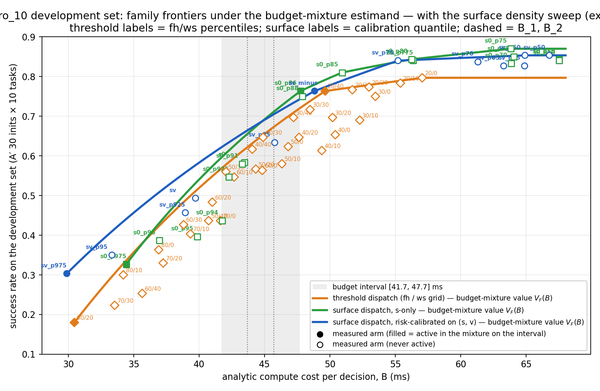
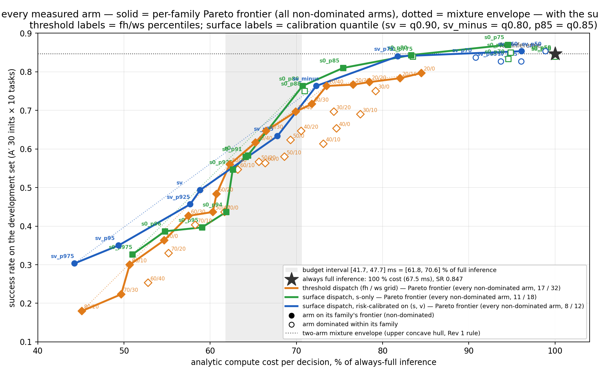
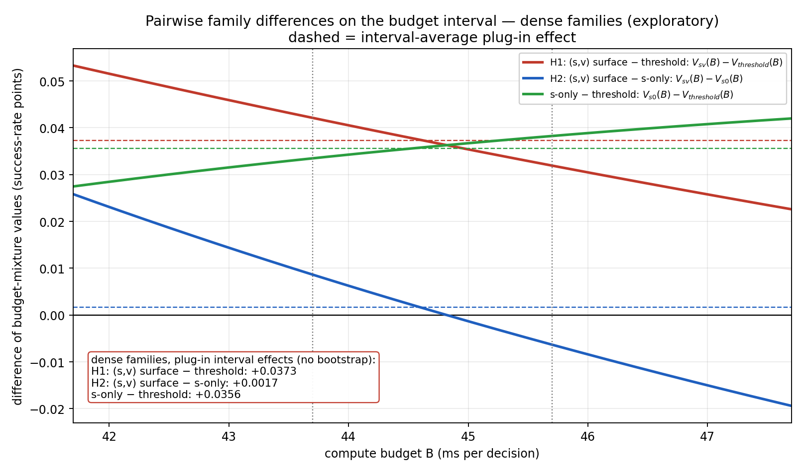
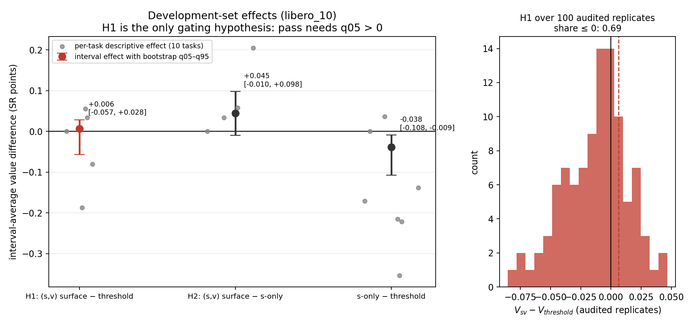
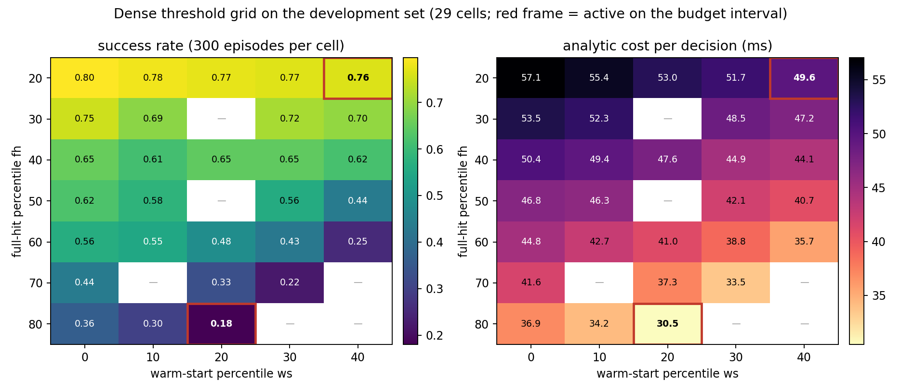
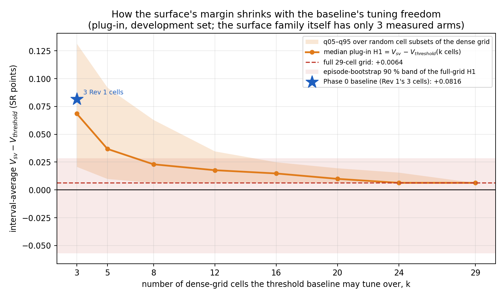
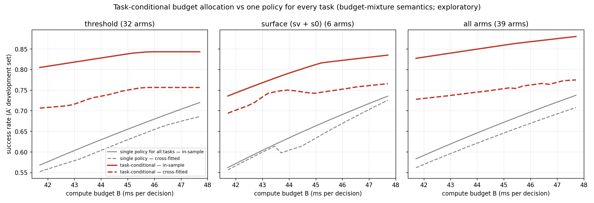
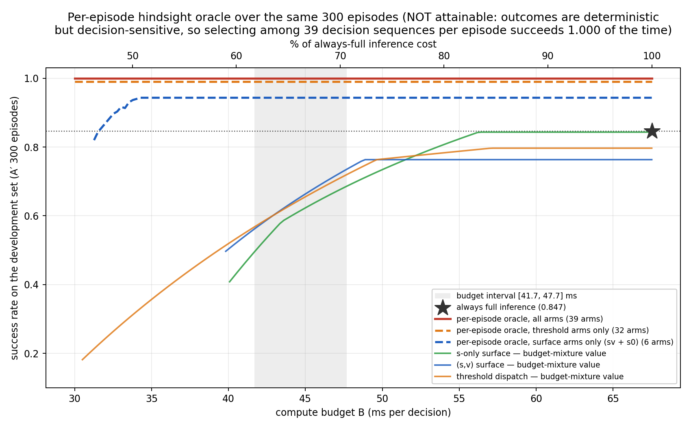

# Dispatch Surface Rev 2 第二计划：结果、分析与走向（供 Review Authority 审阅）

> 作者：Execution Authority（2026-08-30）。owner 交审的两个议题：
> **议题 1** —— 本文 §3–§5 对实验结果的分析是否正确（数字、口径、推断）。
> **议题 2** —— §6 提出的"可能超过 threshold"的方法是否成立，用于决定后续走向；涉及模型训练的选项已列出但**标注为尽量不用**。
> 所有 §5–§6 的诊断都是 post-hoc 探索性分析，**不改变** §4 记录的冻结裁决 `stop_before_C`。可复现命令与 digest 见 §9。

---

## 0. 审阅清单（请逐条给出 accept / reject / 修改意见）

**议题 1：结果分析的正确性**
- R1-a §4 的裁决数字与解释（H1 效应 +0.006、q05 −0.057；dense grid 抬高 threshold 前沿）是否正确。
- R1-b §5.1 "基线调参自由度"诊断（随机子集 k 与 H1 的关系）的逻辑是否成立；它是否足以支持"差距缩小主要是基线密度效应"的判断。
- R1-c §5.2 关于 SV 家族只有 3 臂、中间臂 p85 落在弦下、q0.80 以上无测点的解读；§5.3 高预算段 S0 反超的解读。
- R1-d §5.5 对 development 止损规则含义的界定（训练集内 held-out、赢家诅咒不对称、没有 out-of-sample 确认）。
- R1-e §2 数据集术语核对（本线全部在 pruned 补集=训练集内）是否与 reviewer 的理解一致。

**议题 2：是否有方法能超过 threshold**
- R2-a §6.1 的数学框架（约束 MDP 的拉格朗日最优；threshold 最优的三个充分条件）是否正确。
- R2-b §6.2 四条经验事实（确定性、救援效应、损伤非可加、task 间难度差）的推导是否可靠，特别是回归不连续式的逐 band 边际损伤。
- R2-c §6.3 方法 A（task 条件化分配）的交叉拟合估计 +10.6 … +11.8 pt 是否可信；评测半成本超预算 4–5% 应如何折算。
- R2-d 方法 B / C / D 的可行性排序与"尽量不用模型训练"的标注是否合理。
- R2-e §6.4 的融合方案（把上下文与记忆都并入校准后的 dispatch judge，用拉格朗日分档代替风险上限约束；gate 暂时保留）在数学上是否成立、相对 threshold + hysteresis gate 是否构成实质创新、以及 §8 的走向是否应进入新的 G1。

---

## 1. Headline

- 第二计划的冻结止损触发：**`stop_before_C`**。29 格 dense threshold 网格（8700 ep）并入 budget-mixture estimand 后，SV surface 相对阈值家族在预算区间 [41.7, 47.7] ms 上的 development H1 从 Phase 0 的 +0.082（3 个 Rev 1 格点）缩到 **+0.006**，bootstrap q05 = **−0.057**（q95 +0.028）。§7-5 power MC、seal、C rollout 按规则未执行。
- 结果分析（§5）：差距缩小是**基线密度 / 调参自由度**效应（SV 家族只有 3 条臂、中间臂被支配、q0.80 以上无测点），不是 SV 变差；SV 的 plug-in 效应对阈值家族的任何子集都为正。
- 走向分析（§6）：threshold 是强基线，因为局部相似度 s 已是"缓存是否适用"的好统计量；剩余信息在**上下文**（task 间难度差 0.15 … 0.86）与**记忆**（损伤随累计廉价步数增长）两个维度。最便宜、最稳的路径是 **task 条件化的预算分配**：交叉拟合下比单一策略高 **+11 pt**（threshold 0.621 → 0.739；surface 0.636 → 0.742），且不需要新的 rollout 或训练。
- 密度补齐（sgrid：SV / S0 各 9 个新分位，5400 ep）正在跑（§7），完成后补 §5 的密集版图。

---

## 2. 数据基础与术语（owner 定义：官方 pruned 500 = 测试集；LIBERO 1000 − pruned 500 = 训练集）

在 weilandserver 用 LIBERO 自带 `init_files/libero_10/<task>.init`（100）与 `<task>.pruned_init`（50）逐 task 比对本线官方池 `exp/common/data/db_init/libero/libero_10/<task>.init`（50）：**10/10 个 task 满足 本线官方池 = full − pruned**（ours∩full 500/500，ours∩pruned 0/500）。因此本线的全部数据都在**训练集** 500 内：

| 角色 | 每 task | 总计 | 用途 |
|---|---|---|---|
| fit 5 + cal 10 | 15 | 150 ep | query cohort → dispatch table（D0，9205 行）→ surface 拟合、δ 分位；**threshold 的 fh/ws 百分位也取自这同一张表** |
| dlib 5 | 5 | 50 ep | 检索库 `lib.pkl` |
| test 30 = **A′** | 30 | 300 ep | 所有 rollout 的度量集（Rev 1 / Phase 0 / tgrid / sgrid）；第二计划称为 development set，因为 roster、混合权重、止损规则都在它上面决定 |
| fresh P / C | 10 / 60 | 100 / 600 | BDDL 重采样的全新初态，与 full 1000 零重叠；只跑了 P pilot |

官方 pruned 测试集 500 个 init 从未被读取、拟合或评测。策略 pi05_libero 在 LIBERO 演示数据上训练，与上述初态无关。

---

## 3. 执行记录摘要（细节与 digest 在 `dispatch_surface_rev2_confirmation_plan.log.md` §10）

| 步骤 | 结果 | 关键 digest |
|---|---|---|
| §7-2 emit tgrid（weilandserver） | 29 臂，绑定 Rev 1 包 / 表 / lib | 表 `5e5256…`，Rev 1 MANIFEST `48eccb9f…`，lib `7315f4b1…` |
| §7-3 tgrid rollout（timan107 48 worker → weilandserver 4 replica） | 8700/8700，全部 attempt 1，0 错误，7.5 h；`run_id 7bc35a56cdda` | 包 MANIFEST `2747430b…`；记录 `dispatch_surface__libero_10__tgrid_dev.json` |
| §7-4 cost map（l10，`--trials 30`） | A3 通过；区间 [41.7, 43.7, 45.7, 47.7] ms | `7645f0f7…` |
| §7-4 outcome design（10000 replicates，seed 20260829） | **verdict `stop_before_C`**；c_roster 11 臂，overflow 0 | `9a8fe787…` / `fe55d629…` |
| §7-6 v 离线指标、AC record | descriptive；AC `inclusion=no`（执行方代签，待 owner 复核） | v `538e3e18…`；AC record `7a4ae42d…` |
| §7-7 fresh pools P/C | 两机独立生成逐字节相同；validate 通过（三重零重叠） | validation `8e684871…`；记录 `…__fresh_pools.json` |
| P pilot | 100/100，SR 0.90 vs 参考 0.847（+5.3 pt ≤ 10）passed | `33d6f246…` |
| §7-5 / seal / §7-8 | 按 `stop_before_C` 关闭，未执行 | — |

运维偏离（不影响冻结项）：timan107 `/shared` NFS 挂死，`precheck_t107.sh` 固定本地 PATH，`conda run -p` 用 `/scratch/zixuans8/dsp_bin/conda` shim 直接 exec `libero_sim/bin/python`（解释器、包、env 与 Phase 0 相同）。

---

## 4. 冻结裁决的数字（development set = A′，budget-mixture estimand）

- H1（V_sv − V_threshold，区间平均）：effect **+0.0064**，bootstrap mean −0.0149，q05 **−0.0569**，q95 +0.0284，sd 0.049，joint_miss 0.0018，left_support ok，reason `q05_not_positive`；A1 pass = False。
- H2（V_sv − V_s0）：+0.0448，q05 −0.0097。S0 − T：−0.0384，q05 −0.1079（s-only 显著劣于 tuned threshold）。
- 家族值 V(B) @ 41.7 / 43.7 / 45.7 / 47.7 ms：SV 0.562 / 0.626 / 0.683 / 0.736；threshold 0.568 / 0.622 / 0.673 / 0.720；S0 0.496 / 0.590 / 0.640 / 0.686。
- 区间上被激活的臂：SV {sv, sv_minus}（p85 从未激活）；threshold {fh80_ws20, fh20_ws40}。

图：`family_frontiers`（图 1）、`pareto_hull_percent`（图 1b，横轴为 always-full 的百分比，极限用 Rev 1 上凹包络画法）、`delta_curves`（图 2）、`effect_summary`（图 3）、`tgrid_heatmap`（图 4）。


<!-- 原冻结基版本已按 owner 指示删除（2026-08-30），链接指向最新 dense 版；冻结裁决数字以正文为准 -->





---

## 5. 结果分析（议题 1）

### 5.1 差距缩小是基线调参自由度效应（图 5 `baseline_density`）

同一个 SV 家族（3 臂）对阈值家族随机 k 格子集的 plug-in H1（区间平均；`plot_budget_amendment.fig_baseline_density`，seed 20260830）：

| k（可调格点数） | 3（全部 C(29,3)） | 5 | 8 | 12 | 16 | 20 | 24 | 29 |
|---|---|---|---|---|---|---|---|---|
| H1 中位数 | +0.069 | +0.037 | +0.023 | +0.018 | +0.015 | +0.010 | +0.006 | +0.006 |
| q05 … q95 | +0.021 … +0.131 | +0.010 … +0.092 | +0.006 … +0.063 | +0.006 … +0.035 | +0.006 … +0.025 | +0.006 … +0.020 | +0.006 … +0.016 | — |
| P(H1 > 0) | 1.00 | 1.00 | 1.00 | 1.00 | 1.00 | 1.00 | 1.00 | 1.00 |

Rev 1 的 3 个格点给 +0.082（Phase 0 的 budget-mixture 口径）。**所有子集上 H1 > 0**；随着基线可在同一 dev 集上挑选的格点变多，差距单调压向 +0.006，而 episode bootstrap 的 90% 带是 ±5 pt。判断：SV 没有"输给"threshold，是 29 vs 3 的自由度不对称把差距压进噪声。



### 5.2 SV 家族的形状：3 条臂、中间臂被支配、q0.80 以上无测点

SV 臂对同成本的阈值前沿：sv（q0.90，39.7 ms）−1.8 pt；sv_p85（q0.85，45.8 ms）**−4.1 pt，从未激活**；sv_minus（q0.80，48.8 ms）+1.8 pt。家族值只是 sv 与 sv_minus 之间的一根弦。图 1b 中蓝线在 0.763 变平，是因为 SV 在 72% 成本以上没有任何测点（q0.80 是 roster 里最保守的 SV 设置），不是方法上限：同为 q0.80 的 `s0_p80` 在 83% 成本处达 0.843 ≈ always-full（0.847）。一条假想的 56 ms / 0.843 SV 臂会把 V(52) 从 0.763 抬到 0.799、V(56) 抬到 0.841，但**不改变**冻结区间上的值（0.6530 不变）——区间内的值由区间附近的臂决定，缺的是 44–46 ms 的一条好臂。

### 5.3 高预算段 surface 反超

区间之外：B = 50 / 52 / 55 / 57 ms 时 S0 − threshold = −0.031 / −0.002 / **+0.036 / +0.047**；SV 因无 48.8 ms 以上的臂封顶 0.763。冻结区间 [41.7, 47.7]（= always-full 成本的 61.8–70.6%）恰是 dense threshold 最有竞争力的一段。

### 5.4 逐 task 异质性与 v 的贡献

H1 在 10 个 task 中只有 5 个可定义（其余在该 task 单独的成本下家族在 B_L 不可行）：task 0 +0.034、1 0.000、6 +0.055、7 −0.080、8 **−0.187**；留一法 H1 ∈ [−0.031, +0.023]。H2 = +4.5 pt（q05 −1.0）说明 v 有信息；S0 − T = −3.8 pt（q05 −10.8）说明 surface 的收益几乎全部来自 v，而校准后的分档本身没有比"两刀阈值"多榨出东西。

### 5.5 止损规则说了什么、没说什么

- 说了：在训练集内 held-out 的 A′ 上、以 29 格 dev-tuned threshold 为基线、按冻结 estimand 与 q05 > 0 规则，当前 3 臂 SV 家族**没有**可通过规则的证据。
- 没说：SV 劣于 threshold（点估计从未为负）；surface 这一类方法的上限（§5.2、§5.3）；out-of-sample 表现（C 池 / pruned 测试集都没跑）。
- 方法学注记：两家族的混合都在 bootstrap 内重选，所以选择乐观性对两家族都存在，但与可选臂数成正比——这就是 §5.1 的不对称。

---

## 6. 是否有方法能超过 threshold（议题 2）

### 6.1 数学框架

每步 t 有信息 x_t 与历史 h_t，动作 a ∈ {FULL_HIT, WARM_START, MISS}，成本 c_F < c_W < c_M（10.26 / 27.69 / 67.52 ms），损伤 D_a(x_t, h_t) = 用 a 代替 MISS 对成功概率的期望损失（D_M ≡ 0）。预算约束下的调度是约束 MDP：max P(成功) s.t. E[每决策成本] ≤ B。拉格朗日对偶给出最优策略：**a_t = argmin_a [D_a(x_t, h_t) + λ c_a]**，扫 λ 得到可达前沿的凹包，没有策略能超过它。threshold-on-s 是它的特例，最优的充分条件：(i) s 是损伤的充分统计量；(ii) 损伤逐步可加、无记忆；(iii) 损伤 ≥ 0。同样地，当前 SV surface 是对同一局部相似度信号的静态 2-D 重校准，它最多重排每一步的决策，因此至多追平调好的 threshold（加上 v 带来的信息量）——与 §4 的数据一致。

### 6.2 经验事实（39 臂 × 同一 300 个 A′ episode；脚本 §9）

1. **结果对决策序列是确定性的**：tgrid 中 931 对"同一 episode 上 verdict 序列完全相同"的臂对，结果 0 次不一致。成功是 (init, 决策序列) 的确定函数，但对序列敏感：逐 episode 跨 39 臂的成功率连续分布（≤0.1 的 12 个、≥0.9 的 36 个、恒败 0、恒胜 8）。
2. **条件 (iii) 不成立**：always-full 失败的 46 个 episode 中，其他臂平均 38% 成功；always-full 成功的 254 个中其他臂 60% 成功。缓存动作可以救回全推理的失败，**always-full 不是天花板**（逐 episode 事后 oracle 可达 1.0，见 `oracle_headroom`；那是对确定性混沌的事后选择，不可达，只用来说明"天花板"并不在 0.847）。
3. **条件 (ii) 不成立**（相邻格点的回归不连续，ΔSR ± 配对 SE，300 episode）：在固定 fh 下把 WARM 扩展到更低的一个分数 band，fh20 时 −0.013 / −0.010 / −0.007 / −0.003（≈ 0），fh60 时 −0.017 / −0.063 / −0.057 / **−0.173**，fh80 时 −0.063 / −0.120；在固定 ws 下把 FULL 扩展到更低 band，ws0 时 −0.047 … −0.127，ws30 时 −0.050 … **−0.203**，ws40 时 fh40→50 −0.180。同一个分数 band 的损伤随"已经用了多少廉价步"增长 5–10 倍——损伤有记忆，静态阈值原则上不最优。每个 band 内都同时有 +/− 的 episode（如 +28/−41），s 也不是充分统计量。
4. **task 间难度差远大于 episode 级可预判量**：跨 29 tgrid 臂的 task 难度 0.15（task 8）… 0.86（task 1），task 内 sd 0.07 … 0.40；前 20 步的分数剖面与 episode 难度相关 **−0.01**（episode 长度相关 −0.64，但那是结果而非预判）。

### 6.3 候选方法（按可行性排序；"训练"标注见括号）

**A. 上下文（task）条件化的拉格朗日分配 —— 不需要训练，不需要新 rollout 即可立论。** 每个 task 用各自的臂 / 混合，成本仍是全体 ratio-of-sums，同一 budget-mixture 语义（`task_conditional_headroom.py`）：

| roster | 单一策略 in-sample | task 条件化 in-sample | 单一策略 **交叉拟合** | task 条件化 **交叉拟合** | 诚实增益 | 评测半成本 / B |
|---|---|---|---|---|---|---|
| threshold（32 臂） | 0.647 | 0.831 | 0.621 | **0.739** | **+11.8 pt** | 1.045 |
| surface（sv+s0，6 臂） | 0.653 | 0.797 | 0.636 | **0.742** | +10.6 pt | 1.039 |
| 全部 38 臂 | 0.663 | 0.855 | 0.638 | 0.751 | +11.4 pt | 1.053 |

交叉拟合：每个 task 的 30 个 init 按奇偶分半，一半选混合、另一半评（两折平均）；评测半的实际成本比预算高 4–5%（选择半的成本估计带进来的偏差），按前沿斜率折算约 −1 … −2 pt，增益量级不变。机制是经典的等边际收益分配：easy task 用最便宜的格点，hard task 用最贵的。**在 task 条件化下 6 条 surface 臂 ≈ 32 条 threshold 臂**。实现上只需 per-task 校准 / per-task yaml；out-of-sample 确认可直接用未动过的 pruned 测试集。



**B. 有记忆的调度（drift-aware）—— 不需要训练，需要一个新的 judge 类型（小改动）。** 由事实 3，廉价步的边际损伤随累计廉价步数增长。两参数规则：阈值 + 信任预算（距上次 MISS 的连续廉价步 / 累计 (1−s) 超过 k 即强制一次 MISS 重锚定），或 s_t + β·drift_t 上的阈值。这是 memoryless threshold 无法模拟的策略类；可以用 sgrid 同样的流水线在 A′ 上扫 (k, β)。

**C. 面向后果的打分（学习损伤模型 D̂）——（模型训练，尽量不用）。** 39 臂在同一 init 上的决策序列是已知分配机制的自然实验（回归不连续），可估计 D̂(s, v, 阶段, task, 累计漂移)，再做拉格朗日调度；事实 3 说明同一分数 band 的危险程度差 5 倍以上，重排 band 就是收益来源。代价：需要拟合与验证一个模型，并处理串行依赖的混杂；建议只在 A、B 榨干后考虑。

**D. 救援效应的利用 —— 不需要训练，但需要一个新信号。** 事实 2 给出存在性（38% 救援率）；需要"全推理即将出错"的可观测量（多次采样的分歧、或把 v 反向使用）。目前没有可用的预测量，先不列入计划。

**不会奏效**：按 episode 预判难度再分配（事实 4，相关 ≈ 0）；把逐 episode oracle 当目标。



### 6.4 融合方案：把上下文与记忆并入校准后的 dispatch judge（owner 提议，执行方展开）

**为什么不是"把 gate 搬到 threshold 上"**：方法 B 与现有 `ScoreHysteresisGate`（`theta_low/high`、`j`、`probe_interval`、连续缓存执行上限 `L`）同构——都是在分数 s 上加记忆。threshold + hysteresis gate 是两个 1-D 启发式、4–5 个旋钮、按预算和 task 各调一遍；只把它搬过来没有创新，而且和 threshold 一样需要精调。

**surface 的真实优势在哪**（数据）：它用**一个**校准旋钮（δ = D_dev.y10 的分位）就把工作点放到前沿附近——SV 三点对 29 格调出来的 threshold 包络分别是 −1.8 / −4.1 / +1.8 pt，S0 的 q0.80 点在 83% 成本处达到 always-full 水平；而 threshold 的 32 个格点里只有 5 个在自己的包络上（surface 6 个点里 5 个在包络上）。task 条件化下 6 条 surface 臂 ≈ 32 条 threshold 臂（§6.3 A）。也就是说，surface 解决的是"少旋钮、可校准"，还没解决的是"上下文"和"记忆"。

**方案：统一的校准 dispatch judge（gate 暂时保留，见本节末）**。保留 surface 的核心——校准的逐步风险 q̂(s, v)（y10 动作偏差的分位回归）——在它之上做三件事，全部在 judge 内完成：

1. **上下文条件化**：δ 按 task 校准（或 q̂ 按 task 校准），每 task 一个旋钮，由预算乘子 λ 统一分配（§6.3 A 的机制），不再人工挑格点。
2. **记忆（累计风险状态）**：judge 维护 R_t = γ·R_{t−1} + q̂(s_t, v_t)·[第 t 步用了缓存]，MISS 时归零；分档时用 q̂_t + κ·R_t 代替 q̂_t。这把"损伤随累计廉价步数增长"（§6.2 事实 3）写进风险的单位（动作偏差）里；它与 hysteresis gate 的 L / theta 在概念上重叠（gate 暂时保留，分工待 G1 设计），但不是把 gate 搬运到 threshold 上。
3. **预算感知的分档（拉格朗日代替风险上限）**：现在的规则是"最便宜且风险 ≤ δ 的档"（机会约束）；改为 a_t = argmin_a [q̂_a(s_t, v_t) + κ R_t + λ c_a]，其中 q̂_F、q̂_W 分别是 FULL_HIT / WARM 的校准偏差，q̂_M = 0；一个 λ 扫出整条前沿，不再对每个预算重扫 δ。这就是 §6.1 的最优形式，surface 是它的可校准实例。

**它相对 threshold 的主张**：threshold 要在 (fh, ws) × task × 预算上精调才能到包络；融合 judge 用一个校准模型加 (λ, κ) 两个全局旋钮，per-task 校准由数据给出。**可检验预言**：(a) 同密度（sgrid）下 surface 前沿 ≥ threshold 前沿；(b) task 条件化后 surface 以远少的臂追平或超过 threshold（已有交叉拟合证据）；(c) 加入 R_t 后，在 fh60–80 那种"多廉价步"区域的损伤下降（§6.2 事实 3 的 band 表可以直接复算）。

**代价与流程**：1 不需要新机制（校准工具 + per-task yaml）；2、3 需要改 `surface_judge` 的决策规则（有状态、按 λ 分档）与校准工具——这是方法变更，必须走 Plan → G1 → Code → G2；dev 评估可以复用 sgrid 流水线，out-of-sample 确认用 pruned 测试集。不涉及模型训练（q̂ 仍是现有的分位回归校准）。

**gate 的处理（owner 决定：暂时保留，不在本轮定去留）**：本线所有臂始终是 `always_search`，gate 未参与任何实验数字；冻结成本模型只计 GPU 推理阶段（FULL_HIT 10.26 / WARM 46.82 / MISS 67.52 ms），检索与判别不计价。融合 judge 的记忆项 R_t 与现有 `ScoreHysteresisGate` 在概念上重叠（都是有状态的粘滞），二者的分工（或合并）留待融合方案进入 G1 时一并设计；本文不对论文中 gate 的去留作建议。
---

## 7. 进行中：surface 密度补齐（sgrid，owner 授权的探索性 rollout）

SV / S0 各导出 9 个新分位（SV q∈{0.50 … 0.75, 0.925, 0.95, 0.975}；S0 q∈{0.50 … 0.75, 0.85, 0.925, 0.975}；δ 4.29 … 7.63，绑定 Rev 1 包），`sgrid_sweep.py` 复用现有纪律部件（工件链校验、A′ 校验、启动契约、`PrecheckSweepStrategy`、`_launch_fresh_pool_run`）在同一 A′ 上跑 18 臂 × 300 = 5400 ep（`run_id a3782e630b76`，2026-08-30 11:13 启动，≈ 4.7 h）。完成后：`summarize` → `family_frontiers_dense / delta_curves_dense / pareto_hull_percent_dense`，并补本文 §5 的"密集 vs 密集"plug-in 效应。它不进冻结裁决链。

---

## 8. 建议的走向（供 owner / reviewer 决定）

1. **接受 `stop_before_C` 作为对"静态 (s,v) 重校准 vs dense-tuned threshold"这一问题的负结果**，论文里作为 tuned-threshold 基线的实证陈述（§4、§5）。
2. **以 §6.4 的融合 judge 立新的 G1**（方法 A 作为它的上下文分量，先用现有数据立论）：新方法 = 校准风险 q̂(s, v) + per-task 校准 + 累计风险状态 R_t + 拉格朗日分档；dev 评估复用 sgrid 流水线，确认用 pruned 测试集；对照 = 同密度、同 task 条件化的 threshold（+ hysteresis gate）。
3. 若只做方法 A（不改 judge）："上下文条件化的预算分配"——用现有 tgrid + sgrid 数据在训练集内选 per-task 混合（估计量与止损规则改为交叉拟合），在**官方 pruned 测试集**（500，未动过）上做一次 out-of-sample 确认；surface 与 threshold 两家族都做 task 条件化，主张改为"参数效率 / 同密度下的对比"。成本：确认 rollout 约 (roster 臂数) × 500 ep。
4. 方法 C（学习损伤模型）仅在 2 之后考虑（训练，尽量不用）；方法 B 不再单列（已并入 §6.4 第 2 项）。

---

## 9. 复现与 artifact

- 冻结链产物：`exp/dispatch_surface/data/confirmation/libero_10/{budget_cost_map,budget_outcome_design,c_roster}.json`（`7645f0f7…` / `9a8fe787…` / `fe55d629…`），tgrid 包 `exp/dispatch_surface/data/tgrid_dev/libero_10/package/MANIFEST.json`（`2747430b…`），登记 `exp/data_authority/records/dispatch_surface__libero_10__{tgrid_dev,fresh_pools,budget_amendment}.json`。
- 探索性诊断：`exp/dispatch_surface/data/confirmation/libero_10/{oracle_headroom,task_conditional_headroom}.json`（`929caa1e…` / `caf69951…`）；图在 `exp/dispatch_surface/analysis/figures/libero_10/`。
- 脚本：`exp/dispatch_surface/analysis/plot_budget_amendment.py`（图 1–5、1b、dense 变体）、`analysis/oracle_headroom.py`、`analysis/task_conditional_headroom.py`、`analysis/decision_sequence_diagnostics.py`（§6.2 事实 1–4：确定性检查、难度分布与救援率、逐 band 边际效应、早期分数相关；输出 `<C>/decision_sequence_diagnostics.json`）、`exp/dispatch_surface/sgrid_sweep.py`。
- 命令（repo 根目录，`PYTHONPATH=src:.`）：
  ```
  python -m exp.dispatch_surface.analysis.plot_budget_amendment --outcome-design <C>/budget_outcome_design.json --budget-cost-map <C>/budget_cost_map.json --phase0-summary <A>/libero_10_exploratory/phase0_summary.json --out-dir exp/dispatch_surface/analysis/figures/libero_10
  python -m exp.dispatch_surface.analysis.task_conditional_headroom --source tgrid:<tgrid MANIFEST dir>/arm_matrix_exploratory_tgrid.json:<tgrid raw>/journal.jsonl:<tgrid raw>/per_step.jsonl --source phase0:<A>/phase0_config/precheck_libero_10_exploratory/arm_matrix_exploratory.json:<A>/libero_10_exploratory/journal.jsonl:<A>/libero_10_exploratory/per_step.jsonl --source rev1:<A>/discipline/libero_10_primary/arm_matrix_primary.json:<A>/discipline/libero_10_primary/journal.jsonl:<A>/discipline/libero_10_primary/per_step.jsonl --split-manifest exp/dispatch_surface/data/libero_10/init_pools/split_manifest.json --outcome-design <C>/budget_outcome_design.json --out-json <C>/task_conditional_headroom.json --out-fig exp/dispatch_surface/analysis/figures/libero_10/task_conditional_headroom.png
  ```
  其中 `<A>=exp/dispatch_surface/data/aprime_rev1`，`<C>=exp/dispatch_surface/data/confirmation/libero_10`；`oracle_headroom` 同样的 `--source`，另加 `--phase0-summary`。

---

## 10. 本文不主张什么（反 narrative）

- 不主张 SV surface 优于或劣于 tuned threshold：区间上的差异（+0.6 pt）远小于噪声（±5 pt）。
- §6 的增益全部在训练集内、按 A′ 的奇偶 init 交叉拟合得到，尚无 out-of-sample 确认；task 条件化的评测半成本超预算 4–5%。
- 逐 episode oracle（1.0）与"缓存救回全推理"的 38% 都是事后统计，不是可部署策略的性能。
- 逐 band 边际损伤把"换一个决策"与"随后轨迹改变"的效应合在一起（那是策略变化的真实因果效应，但不是单步局部效应）。
- sgrid 密集版结果尚未产出（§7）。

---

## 11. Review Authority 独立复核与建议（Codex，2026-08-30）

### 11.0 总裁决

冻结的 `stop_before_C` **正确且必须保留**。它否定的是“当前三点、静态 `(s,v)` surface 已经以统计证据支配 dense-tuned threshold”这一主张，不是否定 cache dispatch，也不证明 surface 类方法的上限已经到达。§4 的 artifact 数字经独立读取一致：H1 plugin `+0.0064`、bootstrap q05 `−0.0569`、joint miss `0.0018`，因此按冻结规则只能停止。

但本文 §5–§6 有三处会影响后续方向的过度推断：

1. baseline-density 曲线不能证明差距“主要是调参自由度造成的假象”；它同时包含真实 policy-class 扩张与同一 development set 上的包络选择。
2. 相邻 threshold policies 的 outcome 差不能识别“同一 score band 的局部损伤随历史增长”；轨迹在第一次动作差异后已经分叉，因此它只能说明**策略存在强交互 / 状态依赖**，尚不能单独证明累计记忆是因果机制。
3. §6.4 的记忆公式按字面无效：若 `κR_t` 对 FH / WS / MISS 三档同加，它在 `argmin` 中完全抵消；而且当前 `q̂` 是动作偏差 surrogate，不是成功概率损伤 `D_a`，不能直接借 CMDP 最优性为该公式背书。

因此不建议现在直接按 §6.4 原式立 G1。应先等 sgrid 完成，并把真正可部署、数学不自相抵消的 stateful 方法冻结清楚。

### 11.1 议题 1 逐条裁决

**R1-a — Accept。** §4 的数值、`q05_not_positive` 原因及 `stop_before_C` 均与冻结 artifact 一致。表述应写“没有通过优效性门”，不能写“threshold 显著胜出”；plugin 仍为 SV `+0.64 pt`。

**R1-b — Reject 当前因果解释，保留描述性现象。** 随 k 增加，threshold 可选集合嵌套扩大，`V_threshold(k)` 的最优值按定义不降；当 full 29-cell H1 本来就是正的 `+0.006` 时，任何子集的 H1 不小于 full-set 值，因此“所有子集 H1 > 0”在很大程度上是集合单调性的直接结果，不是独立证据。该图能支持：Rev 1 的 3 个 threshold 点严重低估了 dense threshold policy class；不能支持：新增 26 点的收益主要是 winner's curse，或者 SV 没有真实输掉 policy-class coverage。建议把“基线调参自由度效应”统一改成 **baseline policy-class coverage / density effect**，是否有选择过拟合只能由新的 outcome-independent 选择或 untouched evaluation 判断。

**R1-c — 部分 Accept。** `sv_p85` 的确从未进入 mixture active basis，但它不是 standalone Pareto dominated（artifact 的 `standalone_dominated=false`）；准确术语是“落在另两点的可达弦下 / convexly inactive”。q0.80 以上没有 SV 测点、不能把 0.763 当上限，这一判断正确。必须等 sgrid 后再判断 dense-vs-dense；在此之前“surface 用更少点接近前沿”只能算观察。

**R1-c（高预算 S0）— 只作探索性观察。** 高预算段超出冻结共同区间，而且 threshold family 没有同密度的 90/100% FH 点，anchor 也不在 threshold family 中；不能将 `B=55/57` 的 S0 正差写成公平的主比较。它可用于说明 surface 仍有可达工作点，不可用于翻转冻结结论。

**R1-d — Accept，并需更严格。** A′ 与 fit/cal/dlib 在 init 上不相交，所以它是 calibration-held-out；但 roster、区间、policy-family 解释及本轮方法走向都已反复读取 A′ outcome，因此从现在起只能称 development set。任何新方法在 A′ 上胜出都需要全新 untouched set 确认。

**R1-e — Accept（以已记录的逐 state 内容比对为条件）。** 按 owner 的术语，本线 500 个 init 属于 `full − pruned`，所以官方 pruned 500 仍 untouched。这是一项非常有价值的资产，不能在方法尚未冻结时用来筛方案。

### 11.2 议题 2 逐条裁决

**R2-a — Reject 当前数学陈述，修改后成立。** 对约束 MDP，拉格朗日最优策略比较的是 action value / advantage：

`a_t = argmin_a [Q^damage_a(x_t,h_t;λ) + λ c_a]`，

其中 `Q^damage` 必须包含动作改变未来状态后的 continuation loss。若把 `D_a` 明确定义成这个完整 action-value difference，扫 λ 可得到支持的 occupancy frontier，并在相邻策略间随机化满足预算；若 `D_a` 只是当前动作偏差或即时损伤，原结论不成立。threshold-on-s 成为最优不仅需要“s 充分、无记忆、损伤非负”，还需要各动作 advantage 对 s 具有 **monotone single-crossing / ordered differences**；非负性本身推不出阈值边界。

**R2-b — Mixed。**

- 931/931 相同 verdict sequence 得到相同 outcome：可写“在观察到的 931 对中未检测到额外随机性”，不能上升为全系统确定性定理。
- always-full 失败中其他臂有成功：可靠地证明 fixed-rollout 下 always-full 不是逐 episode oracle；不能证明存在可预测的“负损伤”信号。
- band 对比：数值是真实的 **total policy contrast**，但不是 regression discontinuity。阈值改变后，后续 observation、score、episode length 与干预次数都改变；`fh60` 比 `fh20` 损伤更大可能来自累计误差、访问状态不同、band 频率不同或非线性交互。它足以提出 memory hypothesis，不足以确认 `R_t` 机制。
- task 难度差可靠；单一 early-score mean 相关接近 0 只排除这一个弱特征，不能排除其他 episode-level predictor。

**R2-c — task conditioning 信号强，但原 `+10.6…+11.8 pt` 不是严格同预算结果。** 原脚本在 selection half 约束预算，却直接在 evaluation half 报 SR；evaluation cost/B 为 1.039–1.045，故表中数值不能作为预算 B 下的 value。Review Authority 用 held-out **cost only**（不读 held-out outcome 选 fallback）把每折策略混回该 roster 的最低成本 task assignment，逐 budget 精确恢复 `C≤B`，得到一个保守敏感性复算：

| roster | single cross-fit（同预算） | task-cond cross-fit（同预算） | 增益 |
|---|---:|---:|---:|
| threshold | 0.601 | 0.699 | **+9.7 pt** |
| surface | 0.585 | 0.688 | **+10.3 pt** |

所以“可观测 task context 有很大分配价值”仍然成立；但同预算下 surface 约低于 threshold 1.1 pt，现有证据不支持 task conditioning 让 surface 超过 threshold。上述复算本身仍是 post-hoc sensitivity，不是新 frozen estimand。正式版本应预注册一种 cost-safe cross-fitting：训练折选策略，评测折只允许用 cost telemetry / 预冻结 fallback 调整混合权重，并对 task-cluster 做 paired bootstrap。

**R2-d — 排序需调整。** A 是强而便宜的**共享系统组件**，但 threshold 同样获益，不能单独成为 surface 的核心创新。B 是最值得验证的机制假说，但现有 band 表尚未识别其因果机制。C 若要声称 CMDP / utility optimal，最终可能无法完全避免，因为动作偏差不是成功损伤；可以晚做。D 目前只有 oracle headroom，没有可部署信号，保持远期。

**R2-e — Reject 原融合公式，接受“重写后进入新共识讨论”。** 两个具体错误：

1. `q̂_a + κR_t + λc_a` 中相同的 `κR_t` 对所有 a 抵消，不会改变 verdict。
2. MISS 会把漂移状态归零，缓存会把漂移带到未来；这是 action-dependent transition。贪心即时式忽略“现在 MISS 的未来重锚定价值”，不是 CMDP 的精确最优策略。

另外，现有 `y7/y10` 是 cached/warm action 与 fresh action 的偏差，可作为 divergence surrogate，但尚未证明等于任务失败概率损伤。论文可以声称“calibrated discrepancy control”，不能直接称“optimal damage minimization”。

### 11.3 推荐的新方法：Cumulative-Risk Re-anchoring（暂名 CRD）

保留已有 surface 最可信的部分：用 `(s,v)` 校准两个缓存档的动作偏差增量 `ê_FH(s,v)`、`ê_WS(s,v)`，MISS 增量为 0。把 state 定义为：

```text
R'FH   = γ R_t + ê_FH(s_t,v_t)
R'WS   = γ R_t + ê_WS(s_t,v_t)
R'MISS = 0
```

最简、无需 outcome model 的规则不是错误的共同加项，而是 **risk-budget re-anchoring**：在 `R'_a ≤ β_task` 的档中选择最便宜者；若两个缓存档都超预算则 MISS 并把 R 归零。扫 `β` 得 compute–success frontier。它有四个优点：

1. `R_t` 通过 action-specific next state 真正改变当前选择，不会抵消；
2. MISS 的重锚定语义与系统执行一致；
3. 只复用现有 discrepancy calibration，不需要训练新的 success predictor；
4. memoryless threshold 无法模拟“相同 `(s,v)`、不同累计风险得到不同 verdict”，与 Action Cache 的 cache/retrieval 机制也有清晰差异。

task context 建议先做成 outcome-free normalization，而不是从 A′ outcome 为每 task 挑 arm：例如用 fit/cal table 给每 task 估计 discrepancy scale，令 `β_task = β·scale_task`，全局 β 或在线 dual controller 保证总预算。这样 task 分量来自校准数据，避免 10 个 task outcome-tuned knobs。若未来确实估计 action-value，则可升级成一阶 lookahead：

`score_a = ê_a + λc_a + V(R'_a)`，

其中 `V` 必须作用于 action-specific `R'_a`；线性 `V(r)=κr` 只能称近似，不称 CMDP 精确最优。

### 11.4 建议的实验顺序

1. **先等 sgrid 完成。** 它回答 dense-vs-dense 静态 surface 是否仍有生命力；结果出来前不写新 G1。
2. **修正探索性分析，不消耗新 outcome。** 把 task conditioning 改为严格同预算 cross-fit；把 band 表改名 total policy contrast，并按“time since MISS / cumulative predicted discrepancy”分层，仅作为 hypothesis screen，不写 causal claim。
3. **在 A′ 上做小而正交的 CRD development sweep。** 建议 `γ∈{0,0.8,1}` × 预冻结少量 β；`γ=0` 是静态 surface 内置对照。再加 matched `threshold+hysteresis/re-anchor interval`，从而判断收益来自 `(s,v)` 校准还是任意 memory controller。
4. **冻结后才触碰 untouched evaluation。** 主方法、β/γ、task normalization、baseline tuning budget 和统计规则全部冻结后，一次性在 pruned 500 上做 primary confirmation；fresh C 可作分布外/生成器 robustness，但不能边看边改。若计划保留 pruned 给最终论文，当前不要先拿它确认方法 A。
5. **主对照必须匹配自由度。** dense threshold、threshold+memory、static dense surface、CRD-S0、CRD-SV；同时报告每族 development candidates 数和被读取的 outcome 次数。只有 CRD-SV 超过 CRD-S0 才能把增益归给 v；只有超过 threshold+memory 才能把增益归给 calibrated surface，而非“有记忆都有效”。

### 11.5 论文叙述建议

最诚实、也更有研究价值的故事不是隐藏这次负结果，而是：

> Dense tuning exposes a limitation of static cache dispatch: local compatibility is not enough because approximation risk compounds between re-anchoring computations. We therefore turn calibrated per-step discrepancy into a stateful cumulative-risk controller that decides when to reuse, warm-start, or re-anchor under a compute budget.

静态 SV vs dense threshold 的 `+0.6 pt / q05<0` 成为 motivating negative result；task heterogeneity 是共享系统事实；真正的方法贡献是 **calibrated multi-tier discrepancy + cumulative state + re-anchoring**。在 sgrid 与 CRD matched-memory 对照出来之前，不使用“更少旋钮”“同密度支配 threshold”“CMDP optimal”三种表述。

**当前决策建议：**接受 `stop_before_C`；继续完成已启动的 sgrid；暂不启动 pruned/C confirmation；暂不按原 §6.4 编写 G1。sgrid 数字闭合后，若 dense static SV 已明显恢复优势，可选择较小修订；若仍与 threshold 持平，则以本节 CRD 为唯一值得进入共识与新 G1 的方向。

---

## 12. CRD 吸收 hysteresis 后的一步到位设计（Codex follow-up，2026-08-30）

### 12.0 裁决：合并状态机，不在 CRD 外层叠现有 gate

CRD 仍有明确的优化空间，而且应在进入新 G1 前一次改对。最终候选暂称 **H-CRD（Hysteretic Cumulative-Risk Re-anchoring）**。它不是 `ScoreHysteresisGate + CumulativeRiskJudge` 的串联，而是一个统一 judge：

- 外层 gate 固定为 `always_search`，保证每个决策点都能得到候选风险并让 judge 更新状态；
- CRD 保留“从上次 fresh inference 后积累的动作近似债务”；
- 从 hysteresis 吸收“连续异常才进入恢复区”“回入边界不宽于正常边界”“连续 FH 最长运行保险丝”；
- 只有一个状态机拥有最终执行档位，避免 gate skip 绕过 judge 后 CRD 风险状态既看不到实际 MISS、也无法正确清零。

当前 `src/openpi/cache/components/crd_judge.py` 只能视为探索性原型，不能直接作为新 G1 的冻结实现。它至少有两个设计缺口：

1. 同一个保守分位上界 `q_hat` 同时承担单步准入和逐步累加；“逐步都保守”不推出“这些条件分位数之和是序列风险上界”，且会重复施加保守性。
2. `__call__` 返回 WS 时已经把内部状态提交为 `R'_WS`，但 orchestrator 仍可能因 payload 不完整把 WS 降级成实际 MISS。这样内部账本认为执行了 WS，机器人却已 fresh inference；所有状态更新必须以**最终执行档位**为准。

### 12.1 风险量分工：局部准入与累计债务不能再共用一个数

对每个缓存档位 `a ∈ {FH, WS}`，校准器输出两个非负量：

```text
u_a(x_t) : 局部保守风险，用于判断当前这一步是否允许执行 a
d_a(x_t) : 债务增量，用于累计使用 cache 后的 approximation drift
```

- `u_a` 可继续使用高分位 / conformalized discrepancy；它服务于 fail-closed 的单步上限。
- `d_a` 使用同一标定表拟合的中心风险或非负 excess estimate，并按 task 的 calibration-only scale 归一化；不读取 rollout success，不训练 outcome model。
- 若第一版不愿新增中心估计，允许临时令 `d_a=u_a/scale_task`，但必须把它标为保守 surrogate，并把“双量版本”列为首选实现，不能宣称序列 coverage。

累计债务的候选转移为：

```text
D'_FH   = gamma * D_t + d_FH(x_t)
D'_WS   = gamma * D_t + d_WS(x_t)
D'_MISS = 0
```

其中 `D_t` 只表示 cache approximation debt，不表示任务失败概率；fresh inference 的作用是重新锚定，因此实际 MISS 后严格归零。局部准入与累计预算分别为：

```text
local_ok(a)  := u_a(x_t) <= delta_a
budget_ok(a) := D'_a <= beta_task
```

正常状态下选择同时满足两者的最便宜档位；没有缓存档满足时执行 MISS。`beta` 是扫 compute--success 曲线的主旋钮，`delta_a`、task scale 和风险模型只由 fit/cal 数据确定。

### 12.2 从 hysteresis 吸收的不是固定 gate，而是三条互补保护

H-CRD 维护 `(D_t, mode_t, bad_run_t, fh_run_t)`。`mode_t ∈ {ACTIVE, RECOVERY}`。

#### A. 连续异常才进入 RECOVERY（吸收 `j`）

单个时刻两个缓存档都不满足 `local_ok` 时，本步照常 MISS，但只令 `bad_run += 1`；下一步仍重新判断。只有连续 `J_bad` 次局部不可用，才进入 `RECOVERY`。一次偶然估计波动不会把系统锁进长段 full inference，而持续异常会被识别成 cache 覆盖区之外的轨迹段。

必须区分两类 MISS：

- **debt MISS**：至少一个缓存档局部可用，只是累计债务超过 `beta_task`。这是一次性 re-anchor；MISS 后 `D=0`，不进入 RECOVERY，下一步可以重新使用 cache。
- **region MISS**：两个缓存档局部都不可用。它累计 `bad_run`，达到 `J_bad` 后进入 RECOVERY。

这个区分避免了把“风险预算刚用完”和“处在持续 OOD/低兼容区域”错误地当成同一种危险。

#### B. 恢复使用不更宽松的回入边界（吸收双阈值 hysteresis）

RECOVERY 中每步都执行 MISS，但由于外层是 `always_search`，judge 仍能观测候选风险，不需要现有 gate 的盲 `probe_interval`。当至少一个缓存档满足更严格的：

```text
reopen_ok(a) := u_a(x_t) <= delta_reopen,a
delta_reopen,a <= delta_a
```

才退出 RECOVERY，并选择满足条件的最便宜档位。第一版 primary 固定 `delta_reopen=delta`，与当前 production gate 的 `theta_low=theta_high` 对齐，不凭空增加一个可调旋钮；时序迟滞仍来自 `J_bad` 和 RECOVERY 状态。只有在不读取 rollout outcome 的 fit/cal bootstrap 能预先给出稳定 uncertainty margin 时，才允许冻结 `delta_reopen<delta` 作为一次性全局 Schmitt margin，并把等阈值版本保留为消融。

回入可先采用一次安全观测即恢复，避免新加一个 outcome-tuned `J_good`。只有 development trace 明确显示单步回入抖动，才允许在新 G1 中预注册一个全局 `J_good`，不得按 task 或预算分别调节。

#### C. 连续 FH 的硬保险丝（吸收 `L`，但不替代风险预算）

保留 `fh_run` 作为模型失配 backstop：连续执行 `L_max` 次实际 FULL_HIT 后，强制一次 debt MISS 并把 `D` 清零，但不进入 RECOVERY。WS 和实际 MISS 默认重置 `fh_run`，与当前 production N4 语义一致。

`L_max` 的定位必须写清：它不是 CRD 的主要风险模型，而是在 `d_a` 低估未观测闭环漂移时提供最坏连续运行上限。首轮 matched 实验固定使用 production baseline 的 `L=6`，不能为 H-CRD 单独 outcome-tune；另做 `L_max=None` 消融，检验连续风险预算本身是否已经吸收该保险丝。

### 12.3 完整逐步规则

```text
episode start:
    D = 0; mode = ACTIVE; bad_run = 0; fh_run = 0

each decision:
    compute (u_FH, d_FH), (u_WS, d_WS)

    if any signal/artifact/payload contract is invalid:
        execute MISS; D = 0; enter RECOVERY fail-closed

    if mode == RECOVERY:
        if some tier satisfies reopen_ok:
            choose cheapest reopen-safe tier; commit its D'; leave RECOVERY
        else:
            execute MISS; D = 0

    else if fh_run >= L_max:
        execute one debt MISS; D = 0; remain ACTIVE

    else:
        feasible = tiers satisfying local_ok and budget_ok
        if feasible is non-empty:
            choose cheapest feasible tier; commit its D'; bad_run = 0
        else:
            execute MISS; D = 0
            if no tier satisfies local_ok:
                bad_run += 1
                if bad_run >= J_bad: enter RECOVERY
            else:
                bad_run = 0          # cumulative debt exhaustion only
```

所有计数都必须依据**实际执行结果**更新：只有实际 FULL_HIT 增加 `fh_run`；WS 被降级为 MISS 时必须走 MISS 的清零路径。

### 12.4 实现必须改成 propose / commit 两阶段

新 judge 的决策函数只产生 proposal，不得立即永久修改状态：

```text
propose(results) -> (verdict, pending_transition, diagnostics)
commit(final_executed_verdict, proposal_token)
```

orchestrator 完成 WS payload 校验和所有降级后，再把最终档位回喂 judge。要求：

- token 单调且一次性消费，重复 commit / 跨 step commit fail loud；
- proposal 后异常或 episode reset 不得留下半提交状态；
- CRD artifact 加载期强制 `gate.type == always_search`，禁止和 `score_hysteresis` 静默串联；
- per-step ledger 至少写 `D_before`、两档 `u/d/D'`、`mode_before/after`、`bad_run`、`fh_run`、proposal verdict、final verdict、MISS 原因（local/debt/L/contract）；
- episode start、空检索、非有限信号、WS downgrade、重试和连接复用都要有状态机 golden test。

### 12.5 参数纪律：不能用更复杂的控制器换来不公平的搜索自由度

正式方法只把 `beta` 作为前沿主轴。其余参数按以下纪律处理：

- `delta_a`、`scale_task`：只由 fit/cal discrepancy 数据确定，不读 success；第一版 `delta_reopen,a=delta_a`，若改成严格 margin 必须在 rollout 前由 fit/cal uncertainty 规则唯一确定；
- `gamma`：development 上只允许小型预注册集合，最终全局冻结，不按 task/预算调；
- `J_bad=3`、`L_max=6`：第一版继承已部署 hysteresis baseline，双方相同；不得给 H-CRD 更大的调参预算；
- `J_good` 默认不引入；若引入必须全局冻结并增加 matched baseline 同一自由度；
- 报告每个方法族尝试的候选数量与读取 outcome 的次数。

需要保留以下精确退化关系，便于把收益拆开：

1. `gamma=0, beta=inf, J_bad=inf, L_max=None`：静态 calibrated dispatch。
2. `J_bad=inf, L_max=None`：纯 cumulative-risk CRD。
3. `beta=inf` 加固定 `J_bad/L_max`：只有 hysteresis/backstop 的 calibrated-memory 对照。
4. `gamma=1` 且固定每步 `d_a`：CRD 退化成按缓存步数触发的 fixed interval，可与 `L` 直接对齐。

### 12.6 最小但充分的 development 对照

不应一开始把所有组合都送入 untouched evaluation。A′ 只用于冻结以下少量机制对照：

1. dense threshold + production hysteresis/N4（必须打赢的强 baseline）；
2. static calibrated dispatch；
3. pure CRD（只加 `D/beta`）；
4. H-CRD（`D/beta + RECOVERY + matched L`）；
5. H-CRD 去掉 `L`，判断提升来自风险债务还是固定保险丝。

若 H-CRD 不超过 1，结论只能是 production hysteresis 已吸收时序收益；若 4 超过 1、但不超过 3，则 hysteresis 融合没有增益，应删掉 RECOVERY 保持方法简单；只有 4 同时超过 1 和 3，才保留完整 H-CRD。冻结后再用 untouched pruned set 做一次 primary confirmation。

### 12.7 允许与禁止的论文主张

若验证成功，核心区别可以写成：

> Fixed hysteresis treats all cache executions and low-confidence events through discrete counters. H-CRD separates persistent local incompatibility from action-induced approximation debt, re-anchoring either when a calibrated cumulative budget is exhausted or when a hysteretic recovery state detects a sustained out-of-coverage segment.

允许称 `calibrated discrepancy debt`、`risk surrogate`、`adaptive re-anchoring`。在没有 sequential coverage 定理和任务损伤模型前，仍禁止称 failure probability、formal safety guarantee 或 CMDP-optimal policy。

**进入下一 G1 的最终建议：**用本节 H-CRD 取代 §11.3 的朴素 CRD 作为候选方法；先修 propose/commit 正确性与双风险量，再做 A′ 上的小型正交 development。不要把当前 CRD 原型直接与现有 `score_hysteresis` 串联，也不要在方法未冻结时触碰 untouched pruned set。

---

## 13. H-CRD 原型 G2 Round 1 审查（Codex，2026-08-30）

### 13.0 裁决

**G2 CHANGES REQUIRED，不放行 rollout。** 主体方向正确，但存在六项 blocking，其中四项已有可执行反例。修复完成并补齐真实 orchestrator / export--emit 链测试前，不得重启服务器加载本原型，也不得启动 CRD development rollout；无需因此运行全仓测试。

### 13.1 B1 — 当前“hysteresis”除 `L` 外实际上是惰性的

执行方在 plan 记录中的判断正确：当 `delta_reopen == delta`、一次安全观测立即退出 RECOVERY、RECOVERY 每步仍检查风险且 MISS 已把 `D` 清零时，ACTIVE 与 RECOVERY 对下一步给出相同 verdict。`J_bad=3` 不改变动作序列。

因此当前五个开发点中实际是：

```text
所谓 H-CRD = pure CRD + L=6
```

区域 hysteresis 并没有真正实现。H-CRD 与 pure CRD 的性能差只能归因于固定 FH fuse，不能声称吸收了 hysteresis gate。

建议加入一个不增加 outcome 调参自由度的真实迟滞：

```text
min_recovery_misses = production probe_interval - 1 = 2
```

即继承 production gate 的 `probe_interval=3`：进入 RECOVERY 后至少执行两次实际 MISS，之后满足 `reopen_ok` 才恢复。这样可继续固定 `delta_reopen=delta`，无需额外 outcome-tune margin。必须新增对抗测试，证明相同局部风险序列下 pure CRD 与 H-CRD 的 verdict sequence 确实不同。

### 13.2 B2 — 没有强制 CRD 与 `always_search` 绑定

设计要求加载期拒绝其他 gate，但 `config.py` 的 dispatch-surface validator 只按普通 surface 校验，没有识别 CRD variant。Review Authority 将真实 H-CRD YAML 的 gate 改成：

```yaml
gate:
  type: always_skip
```

`load_cache_config()` 仍然接受：

```text
ACCEPTED gate=always_skip judge=dispatch_surface
```

这会让 judge 永远不运行，CRD 被完整绕过。必须在 config validation 和最终 assembly 两端检查：

```text
CRD artifact => CP1 gate.type == always_search
```

并增加 `always_skip`、`score_hysteresis`、`client_controlled` 三个必拒测试。

### 13.3 B3 — Artifact fail-fast 不完整，负债可以是负数或 NaN

`CumulativeRiskJudge.__init__` 只检查数组形状，没有验证：

- `q_hat`、`q_hat_central` 有限且非负；
- `s_edges` 有限、严格递增；
- `task_scale` 有限且严格为正；
- median debt 是否不超过 upper risk；
- `central_grid_sha256` 是否与真实数组一致；
- task ID 是否完整、唯一。

Review Authority 将真实 artifact 的一个 debt cell 分别改为 `-100` 和 `NaN`，两者都成功构造 judge：

```text
ACCEPTED negative debt -100.0
ACCEPTED nan debt nan
```

负 debt 会让使用 cache 降低累计风险，是原则性错误。此外 `on_episode_start` 在缺失或未知 `task_id` 时静默使用 `scale=1.0`；正式 LIBERO-10 artifact 已冻结 0--9 的 task scale，缺失身份应 fail loud，不能悄悄换成 pooled 策略。上述检查须在 artifact 加载期完成，并配逐项 mutation test。

### 13.4 B4 — propose/commit 没有验证合法状态转移

`commit_verdict()` 对所有“不完全相等”的 proposal/executed 组合都按 MISS 记账。Review Authority 复现：

```text
proposed = MISS
executed = WARM_START
```

实现没有报错，反而记录为 debt MISS、`D=0`。实际已经执行 WS，内部却认为 fresh inference 完成了重锚定。

合法组合应精确限定为：

```text
proposed == executed
或
proposed == WARM_START 且 executed == MISS
```

如果未来允许其他 cache-to-MISS downgrade，也必须显式列举；其余组合全部 fail loud，且不能在验证前清空 pending token。

目前所谓“WS downgrade 测试”只是手工调用 judge，没有经过 orchestrator。必须新增真实集成测试：

```text
judge proposes WS
-> payload 缺 intermediate
-> orchestrator downgrades MISS
-> commit receives MISS
-> D=0, mode=RECOVERY
```

### 13.5 B5 — RECOVERY 回入路径绕过 `beta`

RECOVERY 分支只检查：

```text
u_a <= delta_reopen
```

没有检查：

```text
D'_a <= beta
```

Review Authority 的构造反例为：

```text
beta = 0.1
进入 RECOVERY
下一步 d_full = 0.5
```

实现仍执行 FULL_HIT，并提交：

```text
D_after = 0.5 > beta = 0.1
```

虽然当前导出的 m2/m4 artifact 不容易触发，但这违反类本身的核心不变量。RECOVERY 回入必须同时满足 local/reopen 条件与 budget 条件；另一种可接受做法是在加载期机械证明所有可能的 `d_a / task_scale <= beta`，但前者更直接稳健。

### 13.6 B6 — 风险状态没有进入 per-step ledger，export 链也无专项测试

orchestrator 调用了 `commit_verdict()`，但直接丢弃返回值；当前生成的 CRD YAML 也没有启用 `export_factor_outputs`。因此 rollout 最终只能看到 `hit_type/score/winner`，看不到：

```text
D_before / D_after
u_FH / u_WS
d_FH / d_WS
mode_before / mode_after
bad_run / fh_run
proposal verdict / final verdict
MISS reason
```

这样无法证明 controller 按设计运行，也无法判断增益来自 debt、RECOVERY 还是 `L=6`。commit diagnostics 必须合并进 `CheckResult.factor_outputs` 并由 per-step writer 持久化。

同时 `export_crd_artifacts.py` 没有专项测试覆盖以下链路：

- 真实/合成 Rev 1 package 到 CRD export；
- central-grid 与 task-scale 内容；
- artifact mutation 必拒；
- CRD export record 到 sgrid emit 再到 config load；
- 五臂矩阵参数与退化关系。

### 13.7 已认可、可保留的部分

- upper grid 负责局部准入、median grid 负责 debt，解决了同一保守上界被重复使用的问题；
- `beta = budget_mult * delta` 作为 development 参数化可以接受；
- task scale 只来自 calibration table，没有读取 rollout outcome；
- debt MISS 与 region MISS 的区分正确；
- `L=6` 与 production baseline matched，比较公平；
- propose/commit 架构方向正确，只是契约尚未闭合；
- `_cell()` 与静态 boundary 的 12,006 点 parity 核验有价值。

### 13.8 本轮验证证据与复审条件

- CRD/surface/orchestrator 定向测试：`36 passed`；
- 另一组 config/orchestrator 定向测试：`12 passed`；
- 相关文件 Ruff：通过；
- `git diff --check`：通过；
- 四个对抗复现：全部暴露上述问题（非 always-search gate 被接受、RECOVERY 超 beta、非法 proposal/executed 组合静默记 MISS、负数/NaN debt artifact 被接受）。

**Round 2 进入条件：**修完 B1--B6，给每项补一个旧实现必败的回归测试，并运行 CRD judge、surface binding、orchestrator、config、export/emit 链的定向套件。此前生成的 CRD artifact/YAML 在 schema 或参数变化后必须全部重新生成并重核 SHA；禁止沿用旧件启动 rollout。

## 14. H-CRD G2 Round 1 执行方响应（Execution Authority，2026-08-30 下午）

四个对抗复现（B2 `always_skip` 被接受、B3 负数 / NaN debt 被接受、B4 `MISS→WARM_START` 静默记为 debt MISS、B5 RECOVERY 回入绕过 β）已由执行方**独立复现**后逐项修复；每项附一个旧实现必败的回归测试。定向套件：`tests/cache/test_crd_judge.py` + `test_crd_orchestrator.py` + `test_crd_config.py` + `tests/dispatch_surface/test_crd_export.py` **43 passed**；邻近套件 `test_surface_binding / test_orchestrator / test_config / test_orchestrator_history` **267 passed**，`test_rev2_phase0 -k "export or emit or exploratory_matrix or roster"` **8 passed**；触及文件 Ruff 通过（`in_memory_backend.py` 的两条既有告警与本轮无关）；`git diff --check` 通过。

| 项 | 修复 | 回归测试（旧实现必败） |
|---|---|---|
| **B1** RECOVERY 惰性 | `meta.crd.min_recovery_misses`（默认 2 = production `probe_interval − 1`）：进入 RECOVERY 后至少执行该数量的实际 MISS 才允许回入；`delta_reopen = delta` 保持不变，不新增 outcome 调参旋钮。 | `test_recovery_hysteresis_changes_verdict_sequence`（相同局部风险序列下 pure CRD 与 H-CRD 的 verdict 序列不同）；`test_recovery_with_zero_min_misses_is_inert`（v1 配置确实惰性，作为对照） |
| **B2** CRD ⇒ `always_search` | 双端强制：`config.py` yaml 级校验（`is_crd_artifact(path)` 且 `cp1.gate.type != always_search` ⇒ `ConfigValidationError`）+ `CacheOrchestrator.__init__` 装配期（有 `commit_verdict` 的 judge 对应的 gate 不是 `AlwaysSearchGate` ⇒ `ValueError`）。 | `test_crd_config.py`：`always_skip` / `score_hysteresis` / `client_controlled` 三个必拒、`always_search` 通过；`test_crd_orchestrator.py::test_assembly_refuses_non_always_search_gate` |
| **B3** 工件 fail-fast | 加载期校验：两网格有限且非负、`s_edges` 有限严格递增、中位网格 ≤ 上分位网格、`upper_grid_sha256` / `central_grid_sha256` 与数组一致、`task_scale` 键为唯一非负整数、值有限且 > 0；`on_episode_start` 缺失或未知 `task_id` **fail loud**（不再静默用 1.0）；导出器同样拒绝中位 > 上分位。 | `test_artifact_fail_fast`（12 个 mutation：负债/NaN/上分位 NaN/中位超上分位/边界非单调/scale ≤ 0、NaN、负 id/两个 digest 错/β=0/γ 越界）；`test_unknown_task_id_fails_loud`；`test_crd_export.py::test_mutated_artifact_is_refused` |
| **B4** 合法转移 | 合法对精确限定为 `proposed == executed` 或 `(WARM_START, MISS)`（orchestrator 的 payload 降级，代码中唯一的降级路径）；其余全部 `RuntimeError`，且**验证之前不清空 pending**；非 CP1 检查点不再产生悬空提案。 | `test_illegal_transitions_fail_loud_and_keep_the_proposal`（4 种非法组合，含 `MISS→WARM_START`；被拒后合法 commit 仍可完成）；`test_non_cp1_checkpoint_leaves_no_proposal`；**真实 orchestrator 集成** `test_warm_downgrade_is_committed_as_miss_and_logged`（judge 提案 WS → payload 无 intermediates → orchestrator 降级 → commit MISS → D=0、RECOVERY，且 `factor_outputs["crd"]` 记录 proposed/executed/reason） |
| **B5** RECOVERY 回入受 β 约束 | 回入条件改为 `u_a ≤ delta_reopen` **且** `γD + d_a ≤ β`。 | `test_recovery_reopen_respects_beta`（β=0.1，RECOVERY 中局部可用但 d_full 0.5 > β ⇒ 必须 MISS，`D_after = 0`） |
| **B6** 风险状态入 ledger + export 链测试 | `commit_verdict` 返回诊断（token、proposed/executed、src、reason、D_before/after、u/d/D' 两档、mode_before/after、bad_run、fh_run、recovery_misses）；orchestrator 在每条 searched 返回路径把它合并进 `CheckResult.factor_outputs["crd"]`；interceptor 已有 `meta["factor_outputs"]` 通道；客户端 `episode_runner` per-step 行新增 `factor_outputs` 字段持久化；sgrid emit 对 CRD 工件写 `judge.export_factor_outputs: true`。`test_crd_export.py`：合成 Rev 1 world → CRD export（8 臂参数叉积）→ 网格一致性 / task_scale 完整 / digest 一致 / 逐工件加载 → mutation 必拒 → 退化参数与静态 `surface_verdict` 逐 (s, v-bin) 一致 → `sgrid_sweep.emit` → `load_cache_config` → 工厂路由到 `CumulativeRiskJudge`（普通工件仍为 `SurfaceJudge`）。 | `test_commit_returns_ledger_diagnostics`；`test_full_hit_commits_and_logs_debt`（orchestrator 路径的 `factor_outputs["crd"]`）；`test_crd_export.py` 5 例 |

**旧 artifact / YAML 作废**：5 个 CRD 工件按新 schema（`min_recovery_misses`、`upper_grid_sha256`、`central_grid_sha256`）全部重新导出（export record sv_hcrd `c127fca6…`、sv_pure `79fe1e23…`、sv_fuse `d4a6b4c5…`），三机同路径重核 SHA（8/8）；weilandserver 重新 emit（cfg `8389332a…`，6/6 SHA 三机一致），timan107 dry-validate 重新通过。未重启 server、未启动 rollout，等待 Round 2。

**执行方保留意见**：(a) `min_recovery_misses` 借用 `probe_interval − 1`，是"不新增 outcome 旋钮"意义上的继承，不是对 hysteresis gate 语义的等价还原（gate 的 probe 是盲探，H-CRD 每步都观测）；(b) 首批 5 点中 H-CRD 与 pure CRD 的差异现在来自 `L=6` **与** RECOVERY 两者，§12.6 的归因需要 §12.5 第 3 条退化臂（β=∞、j3/L6，本批已含 `crd_q85_g1_minf_j3_L6`）一起读。

---

## 15. H-CRD G2 Round 2 复审与 Reviewer 直接修订（Codex，2026-08-30）

### 15.0 裁决

**Claude 对 §13 B1--B6 的主体修复成立，但其提交版本仍不能直接 rollout。Reviewer 独立发现并修复两个生产级 blocking、一个 artifact 降级漏洞及若干 schema/state fail-closed 缺口。应用本节 reviewer patch 后，G2 定向放行；在该 patch 被接受、提交并同步到所有 server，且按新 commit 重建 export record / emit ledger 前仍不得启动 rollout。**

Claude 的 43 个专项测试全部复跑通过，但测试直接调用 `orch.on_episode_start(task_id=...)`，没有复刻真实 websocket 的 `on_task_begin() -> episode_start(...)` 顺序；这正是第一个漏网问题。测试数量不能替代生产调用链。

### 15.1 R2-B7 — 真实连接会在收到 task_id 前崩溃（blocking，已直接修复）

生产调用链是确定的：`WebsocketPolicyServer` 在连接打开时调用 `policy.on_task_begin()`；`InferenceInterceptor` 转给 `CacheOrchestrator.on_task_begin()`；后者立即 `_broadcast_episode_start()`，此时 `_current_episode_extra={}`。Claude 的 CRD `on_episode_start()` 把任何缺 task_id 都 fail loud，因此连接建立阶段就抛 `ValueError`，客户端随后发送的正式 `episode_start(extra_metadata.task_id)` 永远到不了。

Reviewer 修法不是恢复 pooled scale，而是区分生命周期的两种语义：

- `on_task_begin` 发 `provisional=True`：清空状态与旧 task scale，但不绑定身份，且此时任何 decision 仍 fail loud；
- 正式 `on_episode_start` 发 `provisional=False`：必须携带冻结 task id，才设置 scale 并允许 proposal；
- `DumpingJudge` 同步透传 `provisional`，避免 CRD 被 wrapper 包住后再次丢失该语义；
- 新 golden test 严格按真实顺序执行 `on_task_begin() -> episode_start(task_id=0)`。

这保留了“缺正式 task identity 必拒”，同时不再把连接初始化误判成一个匿名 episode。

### 15.2 R2-B8 — `min_recovery_misses` 有一位 off-by-one（blocking，已直接修复）

§13 要求“**进入 RECOVERY 后**至少执行 2 次实际 MISS，再允许回入”。Claude 提交版在触发进入 RECOVERY 的那次 region/contract/downgrade MISS 上立刻令 `recovery_misses=1`。因此 `min_recovery_misses=2` 实际只强制了 1 次 entry 后 MISS；其测试也明确把触发 MISS 算作第 1 次，与设计和 §14 声称的语义不一致。

Reviewer 将所有“本次 commit 导致进入 RECOVERY”的路径设为 `recovery_misses=0`；只有 judge 已处于 RECOVERY 时实际执行的后续 MISS 才递增。对抗序列现在为：

```text
j_bad=2, min_recovery_misses=2
region MISS, region MISS(进入), recovery MISS, recovery MISS, reopen
```

同一风险序列下 pure CRD 与 H-CRD 仍机械不同，但迟滞长度现在与预注册定义精确一致。

### 15.3 R2-B9 — 损坏 CRD 可被静默降级成普通 surface（blocking，已直接修复）

Claude 的 `is_crd_artifact()` 先要求 `q_hat/q_hat_central/s_edges` 全部存在，才读取 `judge_variant`。若一个已声明 `judge_variant=cumulative_risk` 的 artifact 丢失任一 CRD 数组，识别函数返回 false，工厂会把它当普通 `SurfaceJudge` 加载——即损坏 controller 会静默退化为无状态 s/v，而不是 fail closed。

Reviewer 改为：只要 metadata 声明 CRD variant，就必须路由严格 CRD loader；缺数组由该 loader 拒绝。`load_cache_config()` 也在 YAML 加载期实际构造一次 CRD validator，不再等 server assembly 才发现坏网格、坏参数或坏 task scale。新增 mutation test 钉死“删掉 `q_hat_central` 后 config 必拒且绝不能路由静态 judge”。

### 15.4 其余 reviewer hardening

- 每次 lifecycle reset 先清 `_scale=None`；若新 episode task id 无效，即使上层捕获异常，也不可能继续沿用上一 episode 的 scale。
- 正式 task id 只接受真实整数；拒绝 `True`、`1.0`、`"1"` 的隐式转换。
- `task_scale` 必须为非空、规范十进制键、完整连续 `0..N-1`，值为非 bool、有限正数；拒绝 `"00"`、缺号和布尔值。
- `gamma/beta/j_bad/l_max/min_recovery_misses/delta_reopen` 改为严格类型与数值域校验，不再允许 `int(1.5)` 一类静默截断。
- exporter 在写 artifact 前拒绝空参数轴、NaN/越界旋钮、非正 recovery 参数、非正/非有限 pooled median 与 task scale；每个写出的 artifact 都立即经生产 `CumulativeRiskJudge` 回读，避免生成“哈希已冻结但运行时不可加载”的工件。

### 15.5 独立验证

- Claude 原四组专项：修订后 `58 passed`（新增 lifecycle、off-by-one、discriminator、严格 schema 对抗项）；
- lifecycle / DumpingJudge / search-session / hit-meta / surface-binding / LIBERO conductor 邻接套件：全部通过；
- orchestrator + config 邻接套件：`229 passed`；
- 相关文件 Ruff：通过；`git diff --check`：通过；
- `/tmp/dsp_shared/libero_10/crd` 当前 5 个真实工件全部经修订后 production loader 回读成功，均含 10 个 task scale；因此数值 artifact 本体无需因本次语义修复改内容，但 export record / matrix 的代码 provenance 必须在 reviewer patch 提交后重新生成并重核。

### 15.6 放行边界

**G2 APPROVED WITH REVIEWER FIXES。** 这里的“放行”只表示代码可进入受控的 development rollout 准备，不表示 H-CRD 已经有效，更不表示可以触碰 untouched confirmation pool。启动前还必须：

1. 接受并提交当前 unstaged reviewer patch；
2. 三机同步同一精确 commit，并在 server 重启后重新走 config load / dry-validate；
3. 按该 commit 重跑 CRD export record 与 sgrid emit，重核 artifact、YAML、matrix/ledger SHA；
4. 先跑极小 smoke，确认 per-step ledger 中 task scale、`mode/recovery_misses`、proposal/final verdict 的真实序列符合本节 golden，再启动 5 臂 development。

论文归因纪律不变：H-CRD 对 production baseline 的差异同时来自 calibrated debt、RECOVERY dwell 与 matched `L`；必须与 pure CRD、`beta=inf+j3/L6` 退化臂及 `L=None` 对照一起读，不能把任何正结果单独归因给“累计风险”。

## 16. H-CRD 分位扫描 batch D 结果（Execution Authority，2026-08-30 15:30；post-hoc 探索，不进裁决链）

### 16.1 设置

- owner 指示暂停 sgrid（53% 处 SIGINT，journal/ledger 无损可续，已于 15:06 续跑）优先运行 H-CRD。
- 14 臂矩阵 `precheck_libero_10_crdq`（新导出 9 分位 × m=2/j3/L6 + 首批 q0.85 五臂），batch D 先跑 4 点：q ∈ {0.60, 0.75, 0.85, 0.925} × (γ=1, β=2δ, J_bad=3, L_max=6, min_recovery_misses=2)。A′ 300 episode/臂，48 worker / 4 replica，与 tgrid/sgrid 同一测量链（`--trials 30`、analytic cost、ratio-of-sums）。
- §15.6 放行边界执行情况：② 同步+重启+验证已做；④ 以 batch D 全量数据做 golden 后验（16.3）；① commit 与 ③ record provenance 重建待 owner commit 后补齐（现有 record 的 `git_commit` 字段经查不代表实际工作树：旧 3 份=本地 HEAD `13316dec`，新 1 份=weilandserver 无关 HEAD `cdb128dd`；npz 本体经 production loader 回读一致）。

### 16.2 结果（A′ 开发集，300 ep/臂）

| 臂 | cost (ms) | % full | SR | vs threshold hull 同成本 | vs 静态 SV hull | vs S0 hull |
|---|---|---|---|---|---|---|
| q0.925 | 41.71 | 61.8% | 0.740 | **+19.1 pt** | +18.8 | +24.8 |
| q0.85 | 50.76 | 75.2% | 0.790 | +2.2 | +2.7 | +5.8 |
| q0.75 | 58.55 | 86.7% | 0.840 | +4.3 | +7.7 | −0.3 |
| q0.60 | 65.35 | 96.8% | **0.863**（> always-full 0.847） | +6.7 | +10.0 | +2.0 |

anchor：always-full 67.52 ms，SR 0.847。图：`analysis/figures/libero_10/pareto_hull_percent_dense_crd.png`（原 `pareto_hull_percent_crd.png` 为非 dense 旧版，已按 owner 指示删除）（H-CRD m=2 扫描族独立 hull；hull 对照为老画法 upper concave hull 插值）。summary sha `71008e0c…`。

### 16.3 golden 后验核验（§15.6-4 实质执行）

75,856 行 `factor_outputs.crd` / 1200 episode，逐行逐序列检查：proposal/executed 转移合法性（identity ∪ WS→MISS）、MISS⇒D=0、FULL/WARM 承诺时 D′≤β、进入 RECOVERY 时 recovery_misses=0（R2-B8 语义）、回入前 dwell≥2 且 u≤δ_reopen、fh_run≤L_max、触界必 fuse、episode 起点全零复位——**0 违例**。行为分布：region-MISS 8,711；RECOVERY 内 MISS 31,024；debt-MISS 7,894；WARM 15,112；FULL 13,114；contract 降级 1；fuse 0。

### 16.4 归因与限制（先行声明）

- **fuse（L_max=6）在 m=2 设置下从未触发**：β=2δ 的债务预算在 FULL 连跑达到 6 之前先行截断。因此 batch D 的增益只能归给 {calibrated debt + RECOVERY dwell} 的组合，L 旋钮在这批数据中惰性；完整归因仍须 §12.6 五臂对照（剩余 10 臂同 journal 可续跑，含 pure CRD、fuse-only、m=4）。
- 密度未匹配：H-CRD 4 点 vs threshold 29 点 / sgrid dense（跑完后 12 点）；§11.5 的禁用表述（更少旋钮 / 同密度支配 / CMDP optimal）继续遵守，本节只陈述测得数字与同成本插值差。
- A′ 为训练集内开发集；未触碰 pruned 测试集与 fresh C 池。batch D 在重启后的新 server 进程上运行（同 checkpoint、同 policy fingerprint；ledger 冻结键校验通过）。

### 16.5 与 gate_threshold_pareto（threshold + production hysteresis）的跨实验对照（owner 提问，2026-08-30 晚）

owner 指出 `exp/gate_threshold_pareto/analysis/pareto_ir_libero_10.png`（2026-08-21，threshold 二值 verdict + N4 hybrid gate：θ=warmup 分数 0.85 分位、j=3、probe_interval=3、L=6）在同一 inference-ratio 轴上看起来不输 batch D。同 IR 插值（GTP 双库合并前沿，右端外推持平）：

| IR | H-CRD (batch D, A′) | GTP thr+gate (pruned 500) | 差 |
|---|---|---|---|
| 0.618 | 0.740 | ≈0.803 | **−6.3 pt** |
| 0.752 | 0.790 | ≈0.836 | **−4.6 pt** |
| 0.867 | 0.840 | ≈0.846（外推，最右测点 IR 0.850） | −0.6 pt |
| 0.968 | 0.863 | ≈0.846（外推） | +1.7 pt |

**口径差异（两边都不能直接宣布胜负）**：(1) 评测池不同且不相交——GTP 用官方 pruned 500（本线术语的测试集），batch D 用 A′ 300（训练集内 dev）；两边接近满推理的端点相近（GTP fh10 = 0.846 @ IR 0.85 vs 本线 always-full 0.847），难度同级但逐 episode 不可对齐。(2) 库不同——GTP ws 2640 条目 / cs 2741 条目（各 50 条轨迹）；本线 d_lib 同为 50 条轨迹（5/task）。规模同级，"库差"不足以构成主要辩护。(3) 动作空间不同——GTP 有 gate（跳过检索、锁缓存）且 warm_start 全关（二值）；本线 always_search + WARM（46.82 ms 档，batch D 中占 20% 决策）。(4) 成本轴同一张 CUDA-Graph 延迟表（s1=10.26/s2=27.69/s3=29.57），归一可比。(5) GTP 在旧故障卡窗口跑（已按臂修复），server 代数不同。

**结论**：owner 的疑虑与 §12.6 的判据一致——五臂对照的第 1 臂"dense threshold + production hysteresis"是**必须打赢的强 baseline**，本线尚未在同链（A′ + d_lib + 同成本口径）上测过它；GTP 的跨链数字表明该 baseline 很强，batch D 的 4 点**不构成对它的胜利证据**。按 §12.6："若 H-CRD 不超过臂 1，结论只能是 production hysteresis 已吸收时序收益。"待办：在本链上补 threshold+gate baseline 臂（θ 取本线 dev 分数 0.85 分位，j=3、probe=3、L=6，二值 verdict，f_FH 取 4 档 ≈ 1200 ep），与剩余 10 臂一起构成完整判据。

### 16.6 batch D 控制器行为分解（owner 问"是不是参数没调好"，2026-08-30 晚）

对 75,856 行 `factor_outputs.crd` 按成本分解（analytic 单价，逐臂）：

| 臂 | RECOVERY-MISS 占该臂总成本 | RECOVERY 停留 p50/p90/max（决策数） | debt-MISS 占成本 | region-MISS 占成本 | 仅因 dwell<2 被挡的可准入决策 |
|---|---|---|---|---|---|
| q0.60 | **80.0%** | 20 / 56 / 101 | 2.2% | 10.3% | 82 |
| q0.75 | 48.8% | 6 / 28 / 89 | 10.2% | 16.4% | 206 |
| q0.85 | 38.2% | 5 / 25 / 88 | 17.6% | 16.9% | 240 |
| q0.925 | 33.0% | 5 / 33 / 76 | 26.0% | 15.0% | 183 |

合计 RECOVERY-MISS 占四臂总成本 **51.6%**。停留长的主因不是 dwell（仅 711/75,856 次是"u/预算可准入、只差 dwell"），而是 **δ_reopen=δ 长期不满足**——状态确实出覆盖后，控制器被锁在全推理里直到 u 回落；q0.60（δ 最严）的中位停留 20 个决策、最长 101 ≈ 整个 episode。即 **q0.60 的实际行为接近"大部分时间全推理 + 少量缓存救回"**，其 0.863 > always-full 0.847 更可能来自缓存动作的救回效应（§2 rescue 38% 诊断），而非精细调度。

诊断结论：(1) 参数确实一组默认值未调（γ=1、m=2、J_bad=3、dwell=2、δ_reopen=δ），且数据指向明确的修正方向——δ_reopen 放宽、J_bad 提高、γ<1；dwell 与 L 是次要旋钮（batch D 中一个近乎无感、一个从未触发）。(2) 但在 A′ 上迭代调参受 §12.6 纪律约束（A′ 只做少量机制对照），正确顺序是：同链 production-hysteresis baseline（§16.5 待办，secondary 层管线现成）→ 五臂归因（剩余 10 臂里的 pure CRD 直接量 RECOVERY 净贡献、fuse-only 量 debt 净贡献）→ 至多一轮有依据的参数修正，不做网格调参。

### 16.7 离线参数预演（`analysis/crd_offline_screen.py`，2026-08-30 晚；补上 batch D 之前就该做的一步）

新工具：把 dev 表（150 episode / 9205 决策的 force-MISS 轨迹）逐 episode 回放过 H-CRD 精确决策规则，任意参数覆写，输出档位构成 / 解析成本 / RECOVERY 停留。**校准**（默认参数 vs batch D 实测）：q60 cost 65.35 vs 65.35、q75 58.73 vs 58.55、q85 50.47 vs 50.76、q925 41.33 vs 41.71；q60 停留 22/67/101 vs 实测 20/56/101——MISS 重的区域近似极好（force-MISS 轨迹正是该区域的真实分布）；cache 重的段有漂移（q925 full% 41 vs 实测更高），只用于排序不用于报数。

**候选扫描结论（q85 与 q60，reopen×{1.0…1.15} × J_bad{3,5,8} × γ{1.0,0.9} × dwell{1,2}）**：全部旋钮的可动余地合计只有 **~1–3% 成本**（q85 最优组 reopen×1.1/γ0.9/dwell1 → 50.47→48.92 ms；q60 最优 reopen×1.15/J3 → 65.35→63.20 ms），效果是把 RECOVERY-MISS 置换成 WARM；J_bad 提高反而拉长单次停留（进得少但陷得深）。**推论**：与 GTP 中段 −4.6 … −6.3 pt 的缺口不可能由这些旋钮弥合——RECOVERY 与 region-MISS 由同一个 u 过程驱动，绑定约束是 u 面在覆盖外段的判定（surface 校准/库），不是滞回参数。调参批预期收益小；episode 应优先花在 §16.5 同链 baseline 与 pure/fuse 消融上。若要验证离线筛选器，一组即可（q85：reopen×1.1、J=3、γ=0.9、dwell=1，预测 −1.5 ms 且 recM 26.8%→23.0%）。

### 16.8 sgrid 全量完成后的同密度区间对照（2026-08-30 17:20，post-hoc）

18 臂全齐后的 hull 对照（cost ms | thr / s0 / sv，差相对 threshold）：41.7 → 0.548/0.540/0.590（sv **+4.2 pt**）；43.7 → 0.610/0.598/0.639（+2.8）；45.7 → 0.667/0.657/0.687（+2.1）；47.7 → 0.716/0.715/0.736（+2.0）；50.9 → 0.769/0.809/0.788（s0 +4.0）；55.2 → 0.788/0.837/0.840（s0 +4.8 / sv +5.2）。threshold hull 终止于 57.05 ms（84.5%）0.797；s0/sv 在 89–95% 成本段分别达 0.870/0.853，越过 always-full 0.847。结论：同密度下 **surface 家族（s-only 与 (s,v)）在全成本域不低于并多段高于 threshold hull**，与 §16.7"绑定约束在信号层"及转向报告（`logs/dispatch_surface_sonly_pivot_report.md`）的"风险索引贴前沿"主张一致；差值仍在 bootstrap 噪声（±4 pt）边缘，表述继续遵守 §11.5（不称支配，称"matched density 下追平/贴合"）。

## 17. goal① l10 s-only + production gate（sysgate）系统合成结果（Execution Authority，2026-08-30 22:56；post-hoc 探索，不进裁决链）

### 17.1 设置

15 个 s0 分位臂（q∈{.50,.55,.60,.65,.70,.75,.775,.85,.86,.88,.91,.925,.94,.96,.975}）× production hysteresis gate（`score_hysteresis`，θ_low=θ_high=0.992800235748291=dev 分数 q0.15、j=3、probe_interval=3、L=6，与 N4 生产配置同构）× 300 ep/臂 = 4500 ep，A′ 开发集，协议 `dispatch_surface_rev2_sysgate_dev`（`emit --gate-layer secondary`，`LAYER_SECONDARY` 校验链）。运行含一次系统 OOM 断点（20:18，dmesg 实锤 nvidia `os_lock_user_pages` order-9 锁页分配失败；同 journal 续跑无损，1525 accepted 保留）。summary sha `56ded271…`。

### 17.2 结果（vs 同分位无 gate s0，成本 % 以 always-full 67.5186 ms 计）

| 段 | 行为 |
|---|---|
| 高成本端 p50–p85（75–100%） | 成本几乎不变（±0.4%），SR 打平（±1.3 pt 噪声内） |
| 低成本端 p88–p975（51–71%） | **gate 同成本大幅抬升**：p925 +7.7、p94 +11.7、p96 +10.7、p975 +12.0 pt |
| 反常点 p75 | 同成本 94.5% 下 gated 0.757 vs plain 0.870（**−11.3 pt，≈5σ**），未解释，待查（gate×judge 交互 / 批间漂移；不影响前沿——该点两版均不在系统前沿段） |

机制解读（探索性）：该 gate 的 skip=打满推理；在激进分位（深切点、大量复用）下，gate 在低分连续段强制回到 full inference，恰好剪掉 s-only 尾部风险——**系统组合把低成本段前沿整体上移**，8/15 gated 臂非支配。与 sonly_note 实验推论 (iv)（"gate + risk ladder matches gate + tuned grid at matched freedom"）的完整对照还缺 threshold+gate 同链 baseline（§16.5 待办不变）。

### 17.3 图

`analysis/figures/libero_10/pareto_hull_percent_dense_sysgate.{png,pdf}`：24 臂 dense 三族图 + 紫色虚线（gated s0 非支配前沿）。`plot_budget_amendment.py` 新增 `--sysgate-summary` 叠加层（结构仿已弃用的 `--crd-summary`）。数据：`data/sysgate/libero_10/{raw/, sysgate_summary.json}`。

